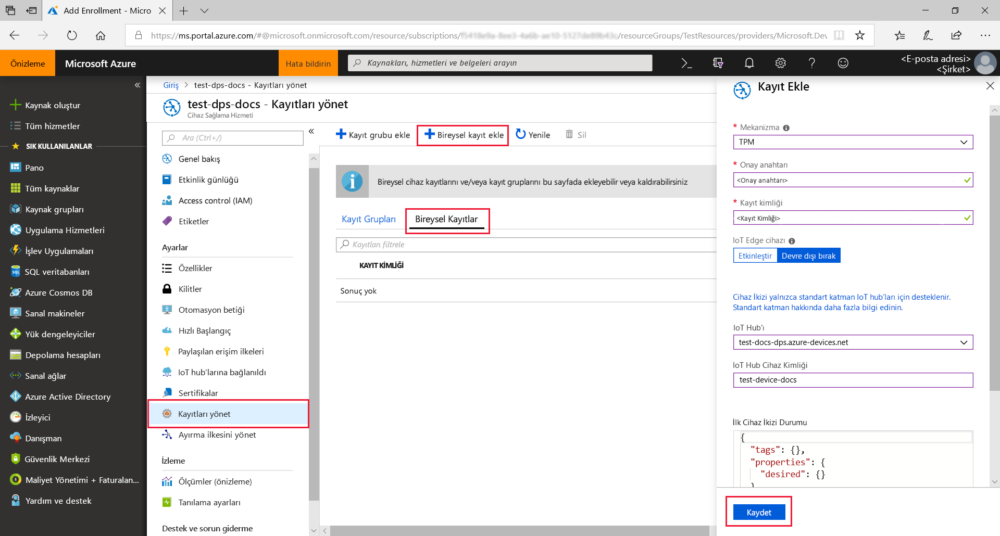
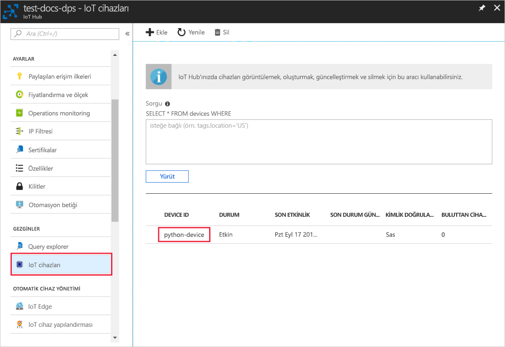

# <a name="create-and-provision-a-simulated-tpm-device-using-python-device-sdk-for-iot-hub-device-provisioning-service"></a>IoT Hub Cihazı Sağlama Hizmeti için Python cihaz SDK'sını kullanarak sanal bir TPM cihazı oluşturma ve sağlama

[!INCLUDE [iot-dps-selector-quick-create-simulated-device-tpm](../../includes/iot-dps-selector-quick-create-simulated-device-tpm.md)]

Bu adımlar, Windows işletim sistemi çalıştıran geliştirme makinenizde sanal makine oluşturmayı, Windows TPM simülatörünü cihazın [Donanım Güvenlik Modülü (HSM)](https://azure.microsoft.com/blog/azure-iot-supports-new-security-hardware-to-strengthen-iot-security/) olarak çalıştırmayı ve örnek Python kodları kullanarak bu sanal cihazı Cihaz Sağlama Hizmeti ve IoT hub'ınızla bağlamayı gösterir. 

Otomatik sağlama işlemini bilmiyorsanız, [Otomatik sağlama kavramlarını](concepts-auto-provisioning.md) gözden geçirdiğinizden emin olun. Ayrıca devam etmeden önce [IoT Hub Cihazı Sağlama Hizmetini Azure portalıyla ayarlama](./quick-setup-auto-provision.md) bölümünde bulunan adımları tamamladığınızdan emin olun. 

Azure IoT Cihaz Sağlama Hizmeti iki tür kaydı destekler:
- [Kayıt grupları](concepts-service.md#enrollment-group): Birden çok ilgili cihazları kaydetmek için kullanılır.
- [Bireysel kayıtlar](concepts-service.md#individual-enrollment): Tek bir cihazı kaydetmek için kullanılır.

Bu makalede bireysel kayıtlar gösterilmektedir.

[!INCLUDE [IoT Device Provisioning Service basic](../../includes/iot-dps-basic.md)]

## <a name="prepare-the-environment"></a>Ortamı hazırlama 

1. Makinenizde [Visual Studio 2015](https://www.visualstudio.com/vs/older-downloads/) veya [Visual Studio 2017](https://www.visualstudio.com/vs/) olduğundan emin olun. Visual Studio yüklemenizde "C++ ile masaüstü geliştirme" iş yükünün etkinleştirilmiş olması gerekir.

1. [CMake derleme sistemini](https://cmake.org/download/) indirin ve yükleyin.

1. `git` uygulamasının makinenizde yüklü olduğundan ve komut penceresinden erişilebilir ortam değişkenlerine eklendiğinden emin olun. Yüklenecek `git` araçlarının son sürümleri için [Software Freedom Conservancy’nin Git istemci araçlarına](https://git-scm.com/download/) bakın. Bunlara yerel Git deponuzla etkileşim kurmak için kullanabileceğiniz bir komut satırı uygulaması olan **Git Bash** dahildir. 

1. Bir komut istemi veya Git Bash’i açın. Cihaz benzetim kod örneği için GitHub deposunu kopyalayın:
    
    ```cmd/sh
    git clone https://github.com/Azure/azure-iot-sdk-python.git --recursive
    ```

1. CMake oluşturma işlemi için bu GitHub deposunun yerel kopyasında bir klasör oluşturun. 

    ```cmd/sh
    cd azure-iot-sdk-python/c
    mkdir cmake
    cd cmake
    ```

1. Kod örneği, bir Windows TPM simülatörü kullanır. SAS belirteci kimlik doğrulamasını etkinleştirmek için aşağıdaki komutu çalıştırın. Sanal cihaz için ayrıca bir Visual Studio çözümü oluşturur.

    ```cmd/sh
    cmake -Duse_prov_client:BOOL=ON -Duse_tpm_simulator:BOOL=ON ..
    ```

1. Ayrı bir komut isteminde, TPM simülatörü klasörüne gidin ve [TPM](https://docs.microsoft.com/windows/device-security/tpm/trusted-platform-module-overview) simülatörünü çalıştırın. **Erişime İzin Ver**'e tıklayın. 2321 ve 2322 bağlantı noktalarında bulunan bir yuva üzerinden dinler. Bu komut penceresini kapatmayın; Hızlı Başlangıç kılavuzu sonuna kadar simülatörü çalışır durumda tutmanız gerekir. 

    ```cmd/sh
    .\azure-iot-sdk-python\c\provisioning_client\deps\utpm\tools\tpm_simulator\Simulator.exe
    ```

    


## <a name="create-a-device-enrollment-entry"></a>Cihaz kaydı girişi oluşturma

1. `azure_iot_sdks.sln` adlı *cmake* klasöründe oluşturulan çözümü açın ve Visual Studio'da derleyin.

2. **tpm_device_provision** projesine sağ tıklayın ve **Başlangıç Projesi Olarak Ayarla**’yı seçin. Çözümü çalıştırın. Çıktı penceresinde cihaz kaydı için gereken **_Onay Anahtarını_** ve **_Kayıt Kimliğini_** görüntülenir. Bu değerleri not alın. 

    

3. Azure portalında oturum açın, sol taraftaki menüden **Tüm kaynaklar** düğmesine tıklayın ve Cihaz Sağlama hizmetinizi açın.

4. Cihaz Sağlama Hizmeti özet dikey penceresinde, **Kayıtları yönet**’i seçin. **Bireysel Kayıtlar** sekmesini seçin ve en üstteki **Bireysel kayıt ekle** düğmesine tıklayın. 

5. **Kayıt Ekle** altına aşağıdaki bilgileri girin:
   - Kimlik onay *Mekanizması* olarak **TPM** seçeneğini belirleyin.
   - TPM cihazınızın *Kayıt kimliği* ve *Onay anahtarı* bilgilerini girin. 
   - Sağlama hizmetinizle bağlanacak IoT hub'ını seçin.
   - Benzersiz bir cihaz kimliği girin. Cihazınızı adlandırırken gizli veriler kullanmaktan kaçının.
   - **Başlangıç cihaz ikizi durumu** alanını cihaz için istenen başlangıç yapılandırmasına göre güncelleştirin.
   - Tamamlandığında **Kaydet** düğmesine tıklayın. 

       

   Kayıt başarıyla tamamlanınca cihazınızın *Kayıt Kimliği* listenin altında *Tek Tek Kayıtlar* sekmesinde görünür. 


## <a name="simulate-the-device"></a>Cihazı benzetme

1. [Python 2.x veya 3.x](https://www.python.org/downloads/) sürümünü indirip yükleyin. Kurulumunuzun gereksinimine uygun olarak 32 bit veya 64 bit yüklemeyi kullanmaya dikkat edin. Yükleme sırasında istendiğinde, platforma özgü ortam değişkeninize Python'u eklediğinizden emin olun.
    - Windows işletim sistemi kullanıyorsanız, Python’dan yerel DLL’lerin kullanımına olanak tanımak için [Visual C++ yeniden dağıtılabilir paketi](https://www.microsoft.com/download/confirmation.aspx?id=48145).

2. Python paketlerini derlemek için [bu yönergeleri](https://github.com/Azure/azure-iot-sdk-python/blob/master/doc/python-devbox-setup.md) uygulayın.

   > [!NOTE]
   > `build_client.cmd` çalıştırıyorsanız `--use-tpm-simulator` bayrağını kullandığınızdan emin olun.
   > 
   > [!NOTE]
   > `pip` kullanıyorsanız `azure-iot-provisioning-device-client` paketini de yüklemeyi unutmayın. Yayımlanan PIP paketlerinin simülatörü değil gerçek TPM uygulamasını kullandığına dikkat edin. Simülatörü kullanmak için `--use-tpm-simulator` işaretini kullanarak kaynaktan derlemeniz gerekir.

3. Örnekler klasörüne gidin.

    ```cmd/sh
    cd azure-iot-sdk-python/provisioning_device_client/samples
    ```

4. Python IDE'nizi kullanarak **provisioning\_device\_client\_sample.py** adlı Python betiğini düzenleyin. *GLOBAL\_PROV\_URI* ve *ID\_SCOPE* değişkenlerini önceden not ettiğiniz değerlerle değiştirin. Ayrıca *GÜVENLİK\_CİHAZ\_TÜRÜNÜN* `ProvisioningSecurityDeviceType.TPM` olarak ayarlandığından emin olun

    ```python
    GLOBAL_PROV_URI = "{globalServiceEndpoint}"
    ID_SCOPE = "{idScope}"
    SECURITY_DEVICE_TYPE = ProvisioningSecurityDeviceType.TPM
    PROTOCOL = ProvisioningTransportProvider.HTTP
    ```

    

5. Örnek uygulamayı çalıştırın. 

    ```cmd/sh
    python provisioning_device_client_sample.py
    ```

6. IoT hub bilgilerinizi almak için cihaz önyüklemesi ve Cihaz Sağlama Hizmetine bağlanma benzetimi gerçekleştiren iletilere dikkat edin. 

    

7. Benzetimli cihazınızın, sağlama hizmetinizle bağlantılı IoT hub ile başarıyla sağlanmasından sonra cihaz kimliği hub’ın **Device Explorer** dikey penceresinde görünür.

     

    Cihazınız için *başlangıç cihaz ikizi durumu* ayarının kayıt girişindeki varsayılan değerini değiştirdiyseniz istenen ikili durumu hub'dan çekerek ona göre hareket edebilir. Daha fazla bilgi için bkz. [IoT Hub'daki cihaz ikizlerini kavrama ve kullanma](../iot-hub/iot-hub-devguide-device-twins.md)


## <a name="clean-up-resources"></a>Kaynakları temizleme

Cihaz istemci örneği üzerinde çalışmaya ve inceleme yapmaya devam etmeyi planlıyorsanız bu Hızlı Başlangıç’ta oluşturulan kaynakları silmeyin. Devam etmeyi planlamıyorsanız, bu hızlı başlangıç ile oluşturulan tüm kaynakları silmek için aşağıdaki adımları kullanın:

1. Makinenizde cihaz istemci örnek çıktı penceresini kapatın.
1. Makinenizde TPM simülatörü penceresini kapatın.
1. Azure portalında sol taraftaki menüden **Tüm kaynaklar**’ı ve ardından Cihaz Sağlama hizmetini seçin. Hizmetinizin **Kayıtları Yönetme** dikey penceresini açıp **Bireysel Kayıtlar** sekmesine tıklayın. Bu Hızlı Başlangıç adımlarını kullanarak kaydettiğiniz cihazın *KAYIT KİMLİĞİ* değerini seçip en üstte bulunan **Sil** düğmesine tıklayın. 
1. Azure portalında sol taraftaki menüden **Tüm kaynaklar**’ı ve ardından IoT hub’ınızı seçin. Hub'ınızın **IoT Cihazları** dikey penceresini açıp bu Hızlı Başlangıç adımlarını kullanarak kaydettiğiniz cihazın *CİHAZ KİMLİĞİ* değerini seçip en üstte bulunan **Sil** düğmesine tıklayın.

## <a name="next-steps"></a>Sonraki adımlar

Bu hızlı başlangıçta makinenizde bir TPM sanal cihazı oluşturdunuz ve IoT Hub Cihaz Sağlama Hizmeti ile IoT hub'ınıza sağladınız. TPM cihazınızı programlı bir şekilde kaydetmeyi öğrenmek için TPM cihazının programlı kaydının yer aldığı Hızlı Başlangıç adımlarına gidin. 

> [!div class="nextstepaction"]
> [Azure Hızlı Başlangıcı - TPM cihazını Azure IoT Hub Cihaz Sağlama Hizmeti'ne kaydetme](quick-enroll-device-tpm-python.md)
