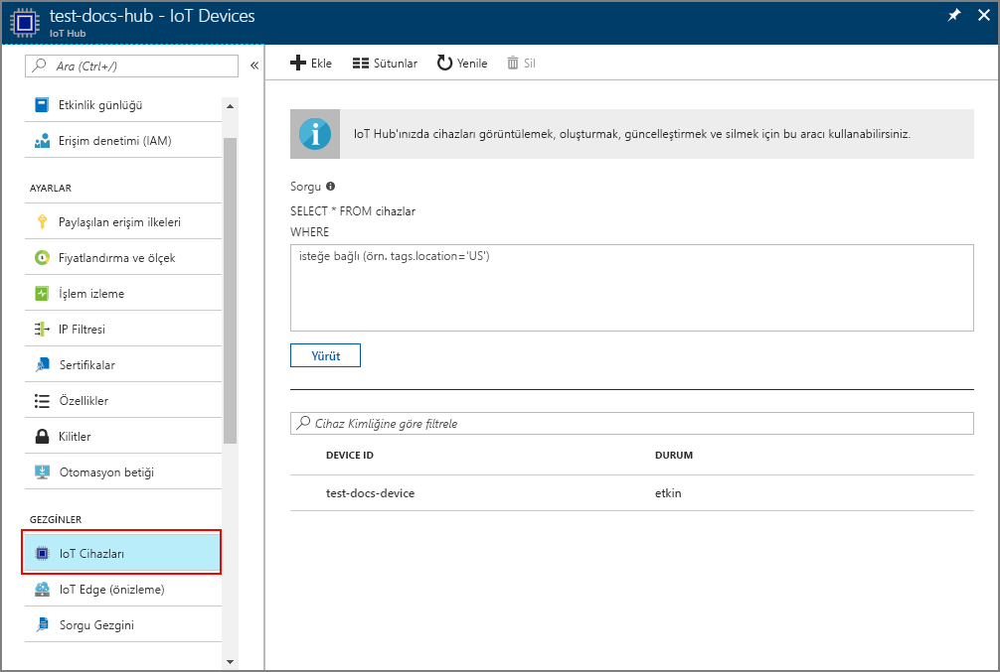

# <a name="create-and-provision-an-x509-simulated-device-using-nodejs-device-sdk-for-iot-hub-device-provisioning-service"></a>IoT Hub Cihazı Sağlama Hizmeti için Node.js cihaz SDK'sını kullanarak bir X.509 sanal cihazı oluşturma ve sağlama
[!INCLUDE [iot-dps-selector-quick-create-simulated-device-x509](../../includes/iot-dps-selector-quick-create-simulated-device-x509.md)]

IoT Hub Cihazı Sağlama Hizmeti, IOT Hub'a sıfır dokunuşla cihaz sağlamaya yönelik yardımcı bir hizmet sağlar. Cihaz Sağlama Hizmeti ile güvenli ve ölçeklenebilir bir şekilde milyonlarca cihaz sağlayabilirsiniz.

Cihaz sağlama iki adımdan oluşur. İlk adım, Cihaz Sağlama Hizmeti’nde çözümün belirli gereksinimlerini temel alan uygun kayıt girişini oluşturmaktır.  İkinci adım, cihaz ile Cihaz Sağlama Hizmeti arasında bir bağlantı kurmak ve cihazı IOT Hub’a kaydetmektir. Her iki adım tamamladıktan sonra, cihazın tamamen sağlandığı kabul edilir. Cihaz Sağlama Hizmeti, bu adımların ikisini de otomatikleştirerek cihaz için sorunsuz bir sağlama deneyimi sağlar. Daha fazla bilgi için bkz. [Cihaz Sağlama Hizmeti kavramları](https://docs.microsoft.com/en-us/azure/iot-dps/concepts-service).

Bu adımlar, [Azure IoT Hub Node.js Cihaz SDK’sını](https://github.com/Azure/azure-iot-sdk-node) kullanarak Cihaz Sağlama Hizmeti’nde bir kayıt girişi oluşturma, geliştirme makinenizde bir X.509 cihazının benzetimini yapma, sanal cihazı Cihaz Sağlama Hizmeti’ne bağlama ve IOT hub'ınızda da cihazı kaydetme işlemlerinin nasıl yapılacağını gösterir.


## <a name="prepare-the-environment"></a>Ortamı hazırlama 

1. Devam etmeden önce [IoT Hub Cihazı Sağlama Hizmetini Azure portalıyla ayarlama](./quick-setup-auto-provision.md) bölümünde bulunan adımları tamamlayın.

1. Makinenizde [Node.js v4.0 veya üzeri](https://nodejs.org) bir sürümün yüklü olduğundan emin olun.

1. Makinenizde [Git](https://git-scm.com/download/)’in yüklü olduğundan ve komut penceresinden erişilebilir ortam değişkenlerine eklendiğinden emin olun. 

1. Makinenizde [OpenSSL](https://www.openssl.org/)’nin yüklü olduğundan ve komut penceresinden erişilebilir ortam değişkenlerine eklendiğinden emin olun. Bu kitaplık kaynaktan derlenip yüklenebilir veya [bunun](https://sourceforge.net/projects/openssl/) gibi bir [üçüncü taraftan](https://wiki.openssl.org/index.php/Binaries) indirilip yüklenebilir. 

    > [!NOTE]
    > _Kök_, _ara_ ve/veya _yaprak_ X.509 sertifikalarınızı zaten oluşturduysanız, bu adımı ve sertifika oluşturma ile ilgili aşağıdaki tüm adımları atlayabilirsiniz.
    >


## <a name="create-an-enrollment-entry"></a>Kayıt girişi oluşturma

Kayıt, yazmacın bir noktada Cihaz Sağlama Hizmeti’nde depoladığı cihazların veya cihaz gruplarının kaydıdır. Kayıt, X.509 sertifikası ve ek kayıt bilgileri dahil olmak üzere cihaz veya cihaz grubuyla ilgili bilgileri içerir. Cihaz Sağlama Hizmeti tarafından desteklenen iki kayıt türü vardır: _Bireysel kayıt_ ve _Kayıt grubu_. Daha fazla bilgi için bkz. [Kayıt kavramları](https://docs.microsoft.com/en-us/azure/iot-dps/concepts-service#enrollment).

Kendi X.509 test sertifikalarınızı oluşturuyorsanız çözümünüz için hangi sertifikaların gerekli olduğunu öğrenmek için [Güvenlik kavramlarına](https://docs.microsoft.com/en-us/azure/iot-dps/concepts-security#x509-certificates), uygulama ayrıntıları için [Node.js’ye yönelik Azure IoT Cihaz Sağlama Cihaz SDK’sı için Araçlar](https://github.com/azure/azure-iot-sdk-node/tree/master/provisioning/tools) konusuna bakın.

1. Bir komut istemi açın. Kod örnekleri için GitHub deposunu kopyalayın:
    
    ```cmd/sh
    git clone https://github.com/Azure/azure-iot-sdk-node.git --recursive
    ```

1. Sertifika oluşturucu betiğine gidin ve projeyi derleyin. 

    ```cmd/sh
    cd azure-iot-sdk-node/provisioning/tools
    npm install
    ```

1. Kurulumunuza göre aşağıdaki yöntemlerin birini kullanarak kayıt bilgilerini oluşturun:

    - **Bireysel kayıt**:

        1. Kendi _sertifikanızın adı_ ile betiği kullanarak _yaprak_ sertifikayı oluşturun. Yaprak sertifikanın ortak adının [Kayıt Kimliği](https://docs.microsoft.com/en-us/azure/iot-dps/concepts-device#registration-id) olduğuna dikkat edin ve yalnızca küçük harf alfasayısal karakterler ve kısa çizgiler kullandığınızdan emin olun.

        ```cmd/sh
        node create_test_cert.js device {certificate-name}
        ```
         
        1. **Azure** portalında **Cihaz Sağlama Hizmeti** özet dikey penceresini açın. **Kayıtları yönet**'i seçip **Bireysel Kayıtlar** sekmesini seçin ve üstteki **Ekle** düğmesine tıklayın. 

        1. **Kayıt listesi girişi ekle** bölümüne aşağıdaki bilgileri girin:
            - Kimlik onay *Mekanizması* olarak **X.509**'u seçin.
            - *Sertifika .pem veya .cer dosyası*'nın altında, önceki adımlarda *Dosya Gezgini* pencere öğesi kullanılarak oluşturulan **_{certificate-name}\_cert.pem_** sertifika dosyasını seçin.
            - İsteğe bağlı olarak, aşağıdaki bilgileri sağlayabilirsiniz:
                - Sağlama hizmetinizle bağlanacak IoT hub'ını seçin.
                - Benzersiz bir cihaz kimliği girin. Cihazınızı adlandırırken gizli veriler kullanmaktan kaçının. 
                - **Başlangıç cihaz ikizi durumu** alanını cihaz için istenen başlangıç yapılandırmasına göre güncelleştirin.
            - Tamamlandığında **Kaydet** düğmesine tıklayın. 

          

    Kayıt başarıyla tamamlandığında, X.509 cihazınız *Bireysel Kayıtlar* sekmesindeki *Kayıt Kimliği* sütununun altında **{certificatename}** olarak gösterilir. Bu değeri daha sonra kullanmak üzere not alın.

    - **Kayıt grupları**: 

        1. Kendi _kök adınız_ ile betiği kullanarak _kök_ sertifikayı oluşturun.

        ```cmd/sh
        node create_test_cert.js root {root-name}
        ```

        1. **Azure** portalında **Cihaz Sağlama Hizmeti** özet dikey penceresini açın. **Sertifikalar**’ı seçip üstteki **Ekle** düğmesine tıklayın.

        1. **Sertifika Ekle** bölümüne aşağıdaki bilgileri girin:
            - Benzersiz bir sertifika adı girin.
            - Önceki adımlarda oluşturduğunuz **_{root-name}\_cert.pem_** dosyasını seçin.
            - Tamamlandığında **Kaydet** düğmesine tıklayın.

        

        1. Yeni oluşturulan sertifikayı seçin:
            - **Doğrulama Kodu Oluştur**'a tıklayın. Oluşturulan kodu kopyalayın.
            - _Doğrulama_ sertifikasını oluşturun. _Doğrulama kodunu_ girin veya sağ tıklayarak aşağıdaki komutla çalışmakta olan Node betiği pencerenize yapıştırın:

                ```cmd/sh
                node create_test_cert.js verification {rootname_cert} {verification code}
                ```

            - *Doğrulama sertifikasının .pem veya .cer dosyasının* altında, önceki adımlarda *Dosya Gezgini* pencere öğesi kullanılarak oluşturulmuş **_verification_cert.pem_** sertifika dosyasını seçin. **Doğrula**’ya tıklayın.

            

        1. **Kayıtları yönetme**'yi seçin. **Kayıt Grupları** sekmesini seçin ve üstteki **Ekle** düğmesine tıklayın.
            - Benzersiz bir grup adı girin.
            - Önceki adımlarda oluşturulan benzersiz sertifika adını seçin
            - İsteğe bağlı olarak, aşağıdaki bilgileri sağlayabilirsiniz:
                - Sağlama hizmetinizle bağlanacak IoT hub'ını seçin.
                - **Başlangıç cihaz ikizi durumu** alanını cihaz için istenen başlangıç yapılandırmasına göre güncelleştirin.

        

        Kayıt başarılı olduğunda X.509 cihaz grubunuz *Kayıt Grupları* sekmesinin *Grup Adı* sütununda görünür. Bu değeri daha sonra kullanmak üzere not alın.

        1. Kendi _certificate-name_ değerinizin sonuna daha önce kullanılan _root-name_ adını ekleyip betiği çalıştırarak _yaprak_ sertifikayı oluşturun. Yaprak sertifikanın ortak adı [Kayıt Kimliği](https://docs.microsoft.com/en-us/azure/iot-dps/concepts-device#registration-id) olduğundan, yalnızca küçük harf alfasayısal karakterler ve kısa çizgiler kullandığınızdan emin olun.

            ```cmd/sh
            node create_test_cert.js device {certificate-name} {root-name}
            ```

        > [!NOTE]
        > Ayrıca, `node create_test_cert.js intermediate {certificate-name} {parent-name}` kullanarak _ara_ sertifikalar oluşturabilirsiniz. Yalnızca, son adımda kök/üst klasör olarak en son _ara_ sertifikayı kullanarak _yaprak_ sertifikayı oluşturduğunuzdan emin olun. Daha fazla bilgi için bkz. [Cihaz erişimini denetleme](https://docs.microsoft.com/en-us/azure/iot-dps/concepts-security#controlling-device-access-to-the-provisioning-service-with-x509-certificates).
        >


## <a name="simulate-the-device"></a>Cihazı benzetme

[Azure IOT Hub Node.js Cihaz SDK'sı](https://github.com/Azure/azure-iot-sdk-node), bir cihazın benzetimini yapmak için kolay bir yol sağlar. Daha fazla bilgi için bkz. [Cihaz kavramları](https://docs.microsoft.com/en-us/azure/iot-dps/concepts-device).

1. Azure portalında Cihaz Sağlama hizmetiniz için **Genel Bakış** dikey penceresini seçin ve **_Genel Cihaz Uç Noktası_** ile  **_Kimlik Kapsamı_** değerlerini not alın.

     

1. _Sertifikanızı_ ve _anahtarınızı_ örnek klasöre kopyalayın.

    ```cmd/sh
    copy .\{certificate-name}_cert.pem ..\device\samples\{certificate-name}_cert.pem
    copy .\{certificate-name}_key.pem ..\device\samples\{certificate-name}_key.pem
    ```

1. Cihaz test betiğine gidin ve projeyi derleyin. 

    ```cmd/sh
    cd ..\device\samples
    npm install
    ```

1. **register\_x509.js** dosyasını düzenleyin. Aşağıdaki değişiklikleri yaptıktan sonra dosyayı kaydedin.
    - `provisioning host` öğesini yukarıdaki **1. Adım**’da belirtilen **_Genel Cihaz Uç Noktası_** ile değiştirin.
    - `id scope` öğesini yukarıdaki **1. Adım**’da belirtilen **_Kimlik Kapsamı_** ile değiştirin. 
    - `reigstration id` öğesini bir önceki bölümde belirtilen **_Kayıt Kimliği_** veya **_Grup Adı_** ile değiştirin.
    - `cert filename` ve `key filename` öğelerini yukarıdaki **2. Adım**’da kopyaladığınız dosyalarla değiştirin. 

1. Betiği yürütün ve cihazın başarıyla sağlandığını doğrulayın.

    ```cmd/sh
    node register_x509.js
    ```   

1. Portalda, sağlama hizmetinize bağlı olan IoT hub'ına gidin ve **IoT Cihazları** dikey penceresini açın. X.509 sanal cihazının hub'a başarıyla sağlanması durumunda, cihaz kimliği **IoT Cihazları** dikey penceresinde *DURUM* değeri **etkinleştirildi** olarak gösterilir. Dikey pencereyi, örnek cihaz uygulamasını çalıştırmadan önce açtıysanız en üstteki **Yenile** düğmesine tıklamanız gerekebilir. 

     

    Cihazınız için *başlangıç cihaz ikizi durumu* ayarının kayıt girişindeki varsayılan değerini değiştirdiyseniz istenen ikili durumu hub'dan çekerek ona göre hareket edebilir. Daha fazla bilgi için bkz. [IoT Hub'ındaki cihaz ikizlerini kavrama ve kullanma](../iot-hub/iot-hub-devguide-device-twins.md).


## <a name="clean-up-resources"></a>Kaynakları temizleme

Cihaz istemci örneği üzerinde çalışmaya ve inceleme yapmaya devam etmeyi planlıyorsanız bu Hızlı Başlangıç’ta oluşturulan kaynakları silmeyin. Devam etmeyi planlamıyorsanız, bu hızlı başlangıç ile oluşturulan tüm kaynakları silmek için aşağıdaki adımları kullanın:

1. Makinenizde cihaz istemci örnek çıktı penceresini kapatın.
1. Azure portalında sol taraftaki menüden **Tüm kaynaklar**’ı ve ardından Cihaz Sağlama hizmetini seçin. Hizmetinizin **Kayıtları Yönetme** dikey penceresini açıp **Bireysel Kayıtlar** veya **Kayıt Grupları** sekmesine tıklayın. Bu Hızlı Başlangıç adımlarını kullanarak kaydettiğiniz cihazın *KAYIT KİMLİĞİ* veya *GRUP ADI* değerini seçip en üstte bulunan **Sil** düğmesine tıklayın. 
1. Azure portalında sol taraftaki menüden **Tüm kaynaklar**’ı ve ardından IoT hub’ınızı seçin. Hub'ınızın **IoT Cihazları** dikey penceresini açıp bu Hızlı Başlangıç adımlarını kullanarak kaydettiğiniz cihazın *CİHAZ KİMLİĞİ* değerini seçip en üstte bulunan **Sil** düğmesine tıklayın.


## <a name="next-steps"></a>Sonraki adımlar

Bu Hızlı Başlangıçta, benzetimi yapılan bir X.509 cihazı oluşturdunuz ve portaldaki Azure IOT Hub Cihaz Sağlama Hizmeti ile IOT hub'ınıza sağladınız. X.509 cihazınızı programlı bir şekilde kaydetmeyi öğrenmek için X.509 cihazlarının programlı kaydının yer aldığı Hızlı Başlangıç adımlarına gidin. 

> [!div class="nextstepaction"]
> [Azure Hızlı Başlangıcı - X.509 cihazlarını Azure IoT Hub Cihaz Sağlama Hizmeti'ne kaydetme](quick-enroll-device-x509-node.md)
