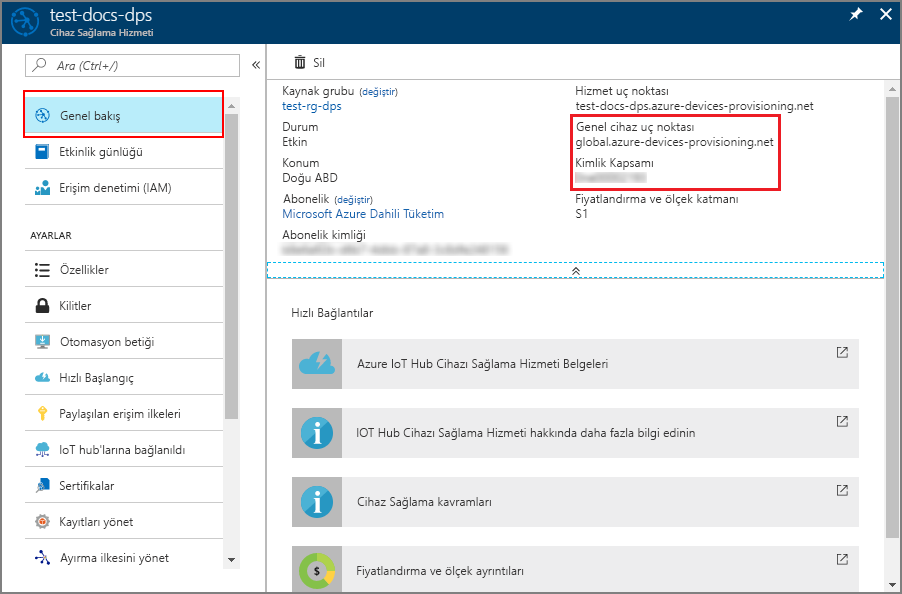
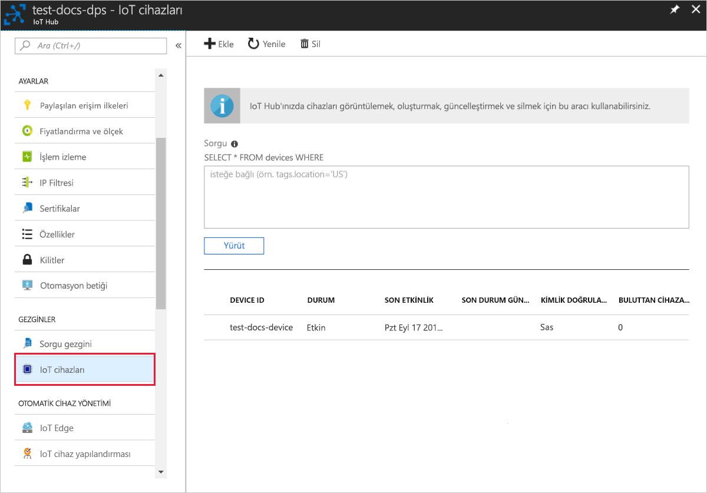

# <a name="create-and-provision-an-x509-simulated-device-using-nodejs-device-sdk-for-iot-hub-device-provisioning-service"></a>IoT Hub Cihazı Sağlama Hizmeti için Node.js cihaz SDK'sını kullanarak bir X.509 sanal cihazı oluşturma ve sağlama
[!INCLUDE [iot-dps-selector-quick-create-simulated-device-x509](../../includes/iot-dps-selector-quick-create-simulated-device-x509.md)]

Bu adımlar, [Azure IoT Hub Node.js Cihaz SDK’sını](https://github.com/Azure/azure-iot-sdk-node) kullanarak Cihaz Sağlama Hizmeti’nde bir kayıt girişi oluşturma, geliştirme makinenizde bir X.509 cihazının benzetimini yapma, sanal cihazı Cihaz Sağlama Hizmeti’ne bağlama ve IOT hub'ınızda da cihazı kaydetme işlemlerinin nasıl yapılacağını gösterir.

Otomatik sağlama işlemini bilmiyorsanız, [Otomatik sağlama kavramlarını](concepts-auto-provisioning.md) gözden geçirdiğinizden emin olun. Ayrıca devam etmeden önce [IoT Hub Cihazı Sağlama Hizmetini Azure portalıyla ayarlama](./quick-setup-auto-provision.md) bölümünde bulunan adımları tamamladığınızdan emin olun. 

Azure IoT Cihaz Sağlama Hizmeti iki tür kaydı destekler:
- [Kayıt grupları](concepts-service.md#enrollment-group): Birden çok ilgili cihazları kaydetmek için kullanılır.
- [Bireysel kayıtlar](concepts-service.md#individual-enrollment): Tek bir cihazı kaydetmek için kullanılır.

Bu makalede bireysel kayıtlar gösterilmektedir.

[!INCLUDE [IoT Device Provisioning Service basic](../../includes/iot-dps-basic.md)]

## <a name="prepare-the-environment"></a>Ortamı hazırlama 

1. Devam etmeden önce [IoT Hub Cihazı Sağlama Hizmetini Azure portalıyla ayarlama](./quick-setup-auto-provision.md) bölümünde bulunan adımları tamamlayın.

2. Makinenizde [Node.js v4.0 veya üzeri](https://nodejs.org) bir sürümün yüklü olduğundan emin olun.

3. Makinenizde [Git](https://git-scm.com/download/)’in yüklü olduğundan ve komut penceresinden erişilebilir ortam değişkenlerine eklendiğinden emin olun. 

4. Makinenizde [OpenSSL](https://www.openssl.org/)’nin yüklü olduğundan ve komut penceresinden erişilebilir ortam değişkenlerine eklendiğinden emin olun. Bu kitaplık kaynaktan derlenip yüklenebilir veya [bunun](https://sourceforge.net/projects/openssl/) gibi bir [üçüncü taraftan](https://wiki.openssl.org/index.php/Binaries) indirilip yüklenebilir. 

    > [!NOTE]
    > _Kök_, _ara_ ve/veya _yaprak_ X.509 sertifikalarınızı zaten oluşturduysanız, bu adımı ve sertifika oluşturma ile ilgili aşağıdaki tüm adımları atlayabilirsiniz.
    >

## <a name="create-a-self-signed-x509-device-certificate-and-individual-enrollment-entry"></a>Otomatik olarak imzalanan X.509 cihazı sertifikası ve bireysel kayıt girişi oluşturma

Bu bölümde, otomatik olarak imzalanan X.509 sertifikası kullanacaksınız. Aşağıdaki konuları göz önünde bulundurmak önemlidir:

* Otomatik olarak imzalanan sertifikalar yalnızca test amaçlıdır ve üretimde kullanılmamalıdır.
* Otomatik olarak imzalanan sertifikanın varsayılan sona erme tarihi bir yıldır.

Simülasyon cihazının tek kayıt girdisiyle kullanılacak sertifikayı oluşturmak için [Node.js için Azure IoT SDK'sından](https://github.com/Azure/azure-iot-sdk-node.git) örnek kodu kullanacaksınız.


1. Bir komut istemi açın. Kod örnekleri için GitHub deposunu kopyalayın:
    
    ```cmd/sh
    git clone https://github.com/Azure/azure-iot-sdk-node.git --recursive
    ```

2. Sertifika oluşturucu betiğine gidin ve projeyi derleyin. 

    ```cmd/sh
    cd azure-iot-sdk-node/provisioning/tools
    npm install
    ```

3. Kendi _sertifikanızın adını_ kullanıp betiği çalıştırarak _yaprak_ X.509 sertifikasını oluşturun. Yaprak sertifikanın ortak adı [Kayıt Kimliği](https://docs.microsoft.com/azure/iot-dps/concepts-device#registration-id) olduğundan, yalnızca küçük harf alfasayısal karakterler ve kısa çizgiler kullandığınızdan emin olun.

    ```cmd/sh
    node create_test_cert.js device {certificate-name}
    ```

4. [Azure portalında](https://portal.azure.com) oturum açın, sol taraftaki menüden **Tüm kaynaklar** düğmesine tıklayın ve Cihaz Sağlama Hizmeti örneğinizi açın.

5. Cihaz Sağlama Hizmeti özet dikey penceresinde, **Kayıtları yönet**’i seçin. **Bireysel Kayıtlar** sekmesini seçin ve en üstteki **Bireysel kayıt ekle** düğmesine tıklayın. 

6. **Kayıt Ekle** panelinin altına aşağıdaki bilgileri girin:
   - Kimlik onay *Mekanizması* olarak **X.509**'u seçin.
   - *Birincil sertifika .pem veya .cer dosyası*'nın altında, önceki adımlarda oluşturulmuş **{certificate-name}_cert.pem** sertifika dosyasını seçmek için *Dosya seçin*’e tıklayın.  
   - İsteğe bağlı olarak, aşağıdaki bilgileri sağlayabilirsiniz:
     - Sağlama hizmetinizle bağlanacak IoT hub'ını seçin.
     - Benzersiz bir cihaz kimliği girin. Cihazınızı adlandırırken gizli veriler kullanmaktan kaçının. 
     - **Başlangıç cihaz ikizi durumu** alanını cihaz için istenen başlangıç yapılandırmasına göre güncelleştirin.
     - Tamamlandığında **Kaydet** düğmesine tıklayın. 

     [](./media/quick-create-simulated-device-x509-node/device-enrollment.png#lightbox)

     Kayıt başarıyla tamamlandığında, X.509 cihazınız *Bireysel Kayıtlar* sekmesindeki *Kayıt Kimliği* sütununun altında **{certificatename}** olarak gösterilir. Bu değeri daha sonra kullanmak üzere not alın.

## <a name="simulate-the-device"></a>Cihazı benzetme

[Azure IOT Hub Node.js Cihaz SDK'sı](https://github.com/Azure/azure-iot-sdk-node), bir cihazın benzetimini yapmak için kolay bir yol sağlar. Daha fazla bilgi için bkz. [Cihaz kavramları](https://docs.microsoft.com/azure/iot-dps/concepts-device).

1. Azure portalında Cihaz Sağlama hizmetiniz için **Genel Bakış** dikey penceresini seçin ve **_Genel Cihaz Uç Noktası_** ile  **_Kimlik Kapsamı_** değerlerini not alın.

     

2. _Sertifikanızı_ ve _anahtarınızı_ örnek klasöre kopyalayın.

    ```cmd/sh
    copy .\{certificate-name}_cert.pem ..\device\samples\{certificate-name}_cert.pem
    copy .\{certificate-name}_key.pem ..\device\samples\{certificate-name}_key.pem
    ```

3. Cihaz test betiğine gidin ve projeyi derleyin. 

    ```cmd/sh
    cd ..\device\samples
    npm install
    ```

4. **register\_x509.js** dosyasını düzenleyin. Aşağıdaki değişiklikleri yaptıktan sonra dosyayı kaydedin.
    - `provisioning host` öğesini yukarıdaki **1. Adım**’da belirtilen **_Genel Cihaz Uç Noktası_** ile değiştirin.
    - `id scope` öğesini yukarıdaki **1. Adım**’da belirtilen **_Kimlik Kapsamı_** ile değiştirin. 
    - `registration id` öğesini bir önceki bölümde belirtilen **_Kayıt Kimliği_** ile değiştirin.
    - `cert filename` ve `key filename` öğelerini yukarıdaki **2. Adım**’da kopyaladığınız dosyalarla değiştirin. 

5. Betiği yürütün ve cihazın başarıyla sağlandığını doğrulayın.

    ```cmd/sh
    node register_x509.js
    ```   

6. Portalda, sağlama hizmetinize bağlı olan IoT hub'ına gidin ve **IoT Cihazları** dikey penceresini açın. X.509 sanal cihazının hub'a başarıyla sağlanması durumunda, cihaz kimliği **IoT Cihazları** dikey penceresinde *DURUM* değeri **etkinleştirildi** olarak gösterilir. Dikey pencereyi, örnek cihaz uygulamasını çalıştırmadan önce açtıysanız en üstteki **Yenile** düğmesine tıklamanız gerekebilir. 

     

    Cihazınız için *başlangıç cihaz ikizi durumu* ayarının kayıt girişindeki varsayılan değerini değiştirdiyseniz istenen ikili durumu hub'dan çekerek ona göre hareket edebilir. Daha fazla bilgi için bkz. [IoT Hub'ındaki cihaz ikizlerini kavrama ve kullanma](../iot-hub/iot-hub-devguide-device-twins.md).


## <a name="clean-up-resources"></a>Kaynakları temizleme

Cihaz istemci örneği üzerinde çalışmaya ve inceleme yapmaya devam etmeyi planlıyorsanız bu Hızlı Başlangıç’ta oluşturulan kaynakları silmeyin. Devam etmeyi planlamıyorsanız, bu hızlı başlangıç ile oluşturulan tüm kaynakları silmek için aşağıdaki adımları kullanın:

1. Makinenizde cihaz istemci örnek çıktı penceresini kapatın.
2. Azure portalında sol taraftaki menüden **Tüm kaynaklar**’ı ve ardından Cihaz Sağlama hizmetini seçin. Hizmetinizin **Kayıtları Yönetme** dikey penceresini açıp **Bireysel Kayıtlar** sekmesine tıklayın. Bu Hızlı Başlangıç adımlarını kullanarak kaydettiğiniz cihazın *KAYIT KİMLİĞİ* değerini seçip en üstte bulunan **Sil** düğmesine tıklayın. 
3. Azure portalında sol taraftaki menüden **Tüm kaynaklar**’ı ve ardından IoT hub’ınızı seçin. Hub'ınızın **IoT Cihazları** dikey penceresini açıp bu Hızlı Başlangıç adımlarını kullanarak kaydettiğiniz cihazın *CİHAZ KİMLİĞİ* değerini seçip en üstte bulunan **Sil** düğmesine tıklayın.


## <a name="next-steps"></a>Sonraki adımlar

Bu Hızlı Başlangıçta, benzetimi yapılan bir X.509 cihazı oluşturdunuz ve portaldaki Azure IOT Hub Cihaz Sağlama Hizmeti ile IOT hub'ınıza sağladınız. X.509 cihazınızı programlı bir şekilde kaydetmeyi öğrenmek için X.509 cihazlarının programlı kaydının yer aldığı Hızlı Başlangıç adımlarına gidin. 

> [!div class="nextstepaction"]
> [Azure Hızlı Başlangıcı - X.509 cihazlarını Azure IoT Hub Cihaz Sağlama Hizmeti'ne kaydetme](quick-enroll-device-x509-node.md)
