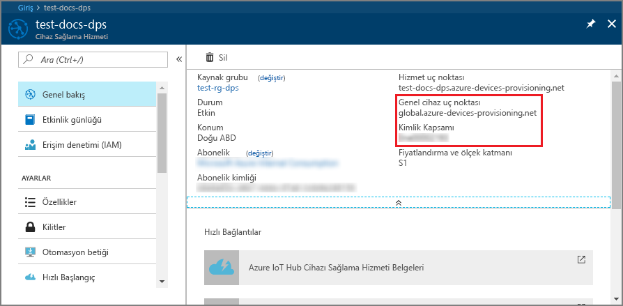
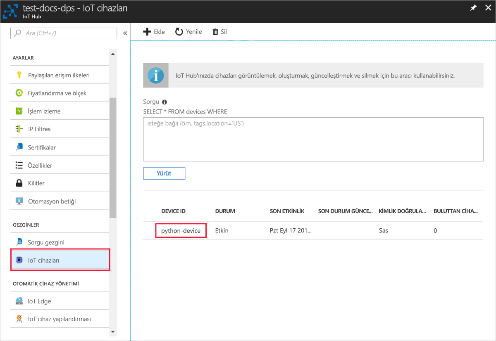

# <a name="create-and-provision-a-simulated-x509-device-using-python-device-sdk-for-iot-hub-device-provisioning-service"></a>IoT Hub Cihazı Sağlama Hizmeti için Python cihaz SDK'sını kullanarak sanal bir X.509 cihazı oluşturma ve sağlama
[!INCLUDE [iot-dps-selector-quick-create-simulated-device-x509](../../includes/iot-dps-selector-quick-create-simulated-device-x509.md)]

Bu adımlar, Windows işletim sistemi çalıştıran geliştirme makinenizde X.509 cihazının simülasyonunu yapmayı ve örnek Python kodu kullanarak bu sanal cihazı Cihaz Sağlama Hizmeti ve IoT hub’ınızla bağlamayı gösterir. 

Otomatik sağlama işlemini bilmiyorsanız, [Otomatik sağlama kavramlarını](concepts-auto-provisioning.md) gözden geçirdiğinizden emin olun. Ayrıca devam etmeden önce [IoT Hub Cihazı Sağlama Hizmetini Azure portalıyla ayarlama](./quick-setup-auto-provision.md) bölümünde bulunan adımları tamamladığınızdan emin olun. 

Azure IoT Cihaz Sağlama Hizmeti iki tür kaydı destekler:
- [Kayıt grupları](concepts-service.md#enrollment-group): Birden çok ilgili cihazları kaydetmek için kullanılır.
- [Bireysel kayıtlar](concepts-service.md#individual-enrollment): Tek bir cihazı kaydetmek için kullanılır.

Bu makalede bireysel kayıtlar gösterilmektedir.

[!INCLUDE [IoT Device Provisioning Service basic](../../includes/iot-dps-basic.md)]

## <a name="prepare-the-environment"></a>Ortamı hazırlama 

1. Ya da yüklediğinizden emin olun [Visual Studio](https://visualstudio.microsoft.com/vs/) 2015 veya üzeri ile ' ile masaüstü geliştirme C++' Visual Studio yüklemenizde etkin iş yükü.

2. [CMake derleme sistemini](https://cmake.org/download/) indirin ve yükleyin.

3. `git` uygulamasının makinenizde yüklü olduğundan ve komut penceresinden erişilebilir ortam değişkenlerine eklendiğinden emin olun. Yüklenecek `git` araçlarının son sürümleri için [Software Freedom Conservancy’nin Git istemci araçlarına](https://git-scm.com/download/) bakın. Bunlara yerel Git deponuzla etkileşim kurmak için kullanabileceğiniz bir komut satırı uygulaması olan **Git Bash** dahildir. 

4. Bir komut istemi veya Git Bash’i açın. Cihaz benzetim kod örneği için GitHub deposunu kopyalayın.
    
    ```cmd/sh
    git clone https://github.com/Azure/azure-iot-sdk-python.git --recursive
    ```

5. CMake oluşturma işlemi için bu GitHub deposunun yerel kopyasında bir klasör oluşturun. 

    ```cmd/sh
    cd azure-iot-sdk-python/c
    mkdir cmake
    cd cmake
    ```

6. Aşağıdaki komutu çalıştırarak sağlama istemcisi için Visual Studio çözümü oluşturun.

    ```cmd/sh
    cmake -Duse_prov_client:BOOL=ON ..
    ```


## <a name="create-a-self-signed-x509-device-certificate-and-individual-enrollment-entry"></a>Otomatik olarak imzalanan X.509 cihazı sertifikası ve bireysel kayıt girişi oluşturma

Bu bölümde otomatik imzalanan bir X.509 sertifikası kullanacaksınız. Aşağıdaki noktaları göz önünde bulundurmanız önemlidir:

* Otomatik olarak imzalanan sertifikalar yalnızca test amaçlıdır ve üretimde kullanılmamalıdır.
* Otomatik olarak imzalanan sertifikanın varsayılan sona erme tarihi bir yıldır.

Benzetim cihazının tek kayıt girdisiyle kullanılacak sertifikayı oluşturmak için Azure IoT C SDK'sından örnek kodu kullanacaksınız.

1. `azure_iot_sdks.sln` adlı *cmake* klasöründe oluşturulan çözümü açın ve Visual Studio'da derleyin.

2. **Sağlama\_Araçlar** klasörünün altında **dice\_device\_enrollment** projesine sağ tıklayın ve **Başlangıç Projesi Olarak Ayarla**'yı seçin. Çözümü çalıştırın. 

3. Çıktı penceresinde, istendiğinde tek kayıt için `i` girin. Çıktı penceresi, sanal cihazınız için yerel olarak oluşturulmuş X.509 sertifikasını görüntüler. 
    
    İlk sertifikayı panoya kopyalayın. Şunun ilk geçtiği yerden başlayın:
    
        -----BEGIN CERTIFICATE----- 
        
    Şunun ilk geçtiği yerde kopyalamayı bitirin:
    
        -----END CERTIFICATE-----
        
    Bu satırların da dahil ettiğinizden emin olun. 

    
 
4. Windows makinenizde **_X509testcertificate.pem_** adlı bir dosya oluşturun, dosyayı dilediğiniz düzenleyicide ve panonun içeriğini bu dosyaya kopyalayın. Dosyayı kaydedin. 

5. Azure portala giriş yapın, sol taraftaki menüden **Tüm kaynaklar**’a tıklayın ve sağlama hizmetinizi açın.

6. Cihaz Sağlama Hizmeti özet dikey penceresinde, **Kayıtları yönet**’i seçin. **Bireysel Kayıtlar** sekmesini seçin ve en üstteki **Bireysel kayıt ekle** düğmesine tıklayın. 

7. **Kayıt Ekle** panelinin altına aşağıdaki bilgileri girin:
   - Kimlik onay *Mekanizması* olarak **X.509**'u seçin.
   - *Birincil sertifika .pem veya .cer dosyası*'nın altında, önceki adımlarda oluşturulmuş **X509testcertificate.pem** sertifika dosyasını seçmek için *Dosya seçin*’e tıklayın.
   - İsteğe bağlı olarak, aşağıdaki bilgileri sağlayabilirsiniz:
     - Sağlama hizmetinizle bağlanacak IoT hub'ını seçin.
     - Benzersiz bir cihaz kimliği girin. Cihazınızı adlandırırken gizli veriler kullanmaktan kaçının. 
     - **Başlangıç cihaz ikizi durumu** alanını cihaz için istenen başlangıç yapılandırmasına göre güncelleştirin.
   - Tamamlandığında **Kaydet** düğmesine tıklayın. 

     [](./media/python-quick-create-simulated-device-x509/device-enrollment.png#lightbox)

   Kayıt başarıyla tamamlandığında, X.509 cihazınız **Bireysel Kayıtlar** sekmesindeki *Kayıt Kimliği* sütununun altında *riot-device-cert* olarak gösterilir. 

## <a name="simulate-the-device"></a>Cihazı benzetme

1. Cihaz Sağlama Hizmeti özet dikey penceresinde, **Genel Bakış**'ı seçin. _Kimlik Kapsamı_ ve _Genel Hizmet Uç Noktası_ değerlerini not edin.

    

2. [Python 2.x veya 3.x](https://www.python.org/downloads/) sürümünü indirip yükleyin. Kurulumunuzun gereksinimine uygun olarak 32 bit veya 64 bit yüklemeyi kullanmaya dikkat edin. Yükleme sırasında istendiğinde, platforma özgü ortam değişkeninize Python'u eklediğinizden emin olun. Python 2.x kullanıyorsanız, [Python paket yönetim sistemi *pip*'yi yüklemeniz veya yükseltmeniz](https://pip.pypa.io/en/stable/installing/) gerekebilir.
    
    > [!NOTE] 
    > Windows kullanıyorsanız, ayrıca [Visual Studio 2015 için Visual C++ Yeniden Dağıtılabilir](https://www.microsoft.com/download/confirmation.aspx?id=48145)‘i yükleyin. pip paketleri, C DLL’lerini yüklemek/yürütmek için yeniden dağıtılabilir gerektirir.

3. Python paketlerini derlemek için [bu yönergeleri](https://github.com/Azure/azure-iot-sdk-python/blob/master/doc/python-devbox-setup.md) uygulayın.

   > [!NOTE]
   > `pip` kullanıyorsanız `azure-iot-provisioning-device-client` paketini de yüklemeyi unutmayın.

4. Örnekler klasörüne gidin.

    ```cmd/sh
    cd azure-iot-sdk-python/provisioning_device_client/samples
    ```

5. Python IDE'nizi kullanarak **provisioning\_device\_client\_sample.py** adlı Python betiğini düzenleyin. _GLOBAL\_PROV\_URI_ ve _ID\_SCOPE_ değişkenlerini önceden not ettiğiniz değerlerle değiştirin.

    ```python
    GLOBAL_PROV_URI = "{globalServiceEndpoint}"
    ID_SCOPE = "{idScope}"
    SECURITY_DEVICE_TYPE = ProvisioningSecurityDeviceType.X509
    PROTOCOL = ProvisioningTransportProvider.HTTP
    ```

6. Örnek uygulamayı çalıştırın. 

    ```cmd/sh
    python provisioning_device_client_sample.py
    ```

7. Uygulama bağlantı kurar, cihazı kaydeder ve başarılı kayıt iletisi görüntüler.

    

8. Portalda, sağlama hizmetinize bağlı olan IoT hub'ına gidin ve **Device Explorer** dikey penceresini açın. X.509 sanal cihazının hub'a başarıyla sağlanması durumunda, cihaz kimliği **Device Explorer** dikey penceresinde *DURUM* değeri **etkinleştirildi** olarak gösterilir. Dikey pencereyi, örnek cihaz uygulamasını çalıştırmadan önce açtıysanız en üstteki **Yenile** düğmesine tıklamanız gerekebilir. 

     

> [!NOTE]
> Cihazınız için *başlangıç cihaz ikizi durumu* ayarının kayıt girişindeki varsayılan değerini değiştirdiyseniz istenen ikili durumu hub'dan çekerek ona göre hareket edebilir. Daha fazla bilgi için bkz. [IoT Hub'ındaki cihaz ikizlerini kavrama ve kullanma](../iot-hub/iot-hub-devguide-device-twins.md).
>

## <a name="clean-up-resources"></a>Kaynakları temizleme

Cihaz istemci örneği üzerinde çalışmaya ve inceleme yapmaya devam etmeyi planlıyorsanız bu Hızlı Başlangıç’ta oluşturulan kaynakları silmeyin. Devam etmeyi planlamıyorsanız, bu hızlı başlangıç ile oluşturulan tüm kaynakları silmek için aşağıdaki adımları kullanın:

1. Makinenizde cihaz istemci örnek çıktı penceresini kapatın.
2. Azure portalında sol taraftaki menüden **Tüm kaynaklar**’ı ve ardından Cihaz Sağlama hizmetini seçin. Hizmetinizin **Kayıtları Yönetme** dikey penceresini açıp **Bireysel Kayıtlar** sekmesine tıklayın. Bu Hızlı Başlangıç adımlarını kullanarak kaydettiğiniz cihazın *KAYIT KİMLİĞİ* değerini seçip en üstte bulunan **Sil** düğmesine tıklayın. 
3. Azure portalında sol taraftaki menüden **Tüm kaynaklar**’ı ve ardından IoT hub’ınızı seçin. Hub'ınızın **IoT Cihazları** dikey penceresini açıp bu Hızlı Başlangıç adımlarını kullanarak kaydettiğiniz cihazın *CİHAZ KİMLİĞİ* değerini seçip en üstte bulunan **Sil** düğmesine tıklayın.

## <a name="next-steps"></a>Sonraki adımlar

Bu Hızlı Başlangıçta, Windows makinenizde bir X.509 sanal cihazı oluşturdunuz ve portaldaki Azure IOT Hub Cihaz Sağlama Hizmeti ile IoT hub'ınıza sağladınız. X.509 cihazınızı programlı bir şekilde kaydetmeyi öğrenmek için X.509 cihazlarının programlı kaydının yer aldığı Hızlı Başlangıç adımlarına gidin. 

> [!div class="nextstepaction"]
> [Azure Hızlı Başlangıcı - X.509 cihazlarını Azure IoT Hub Cihaz Sağlama Hizmeti'ne kaydetme](quick-enroll-device-x509-python.md)
