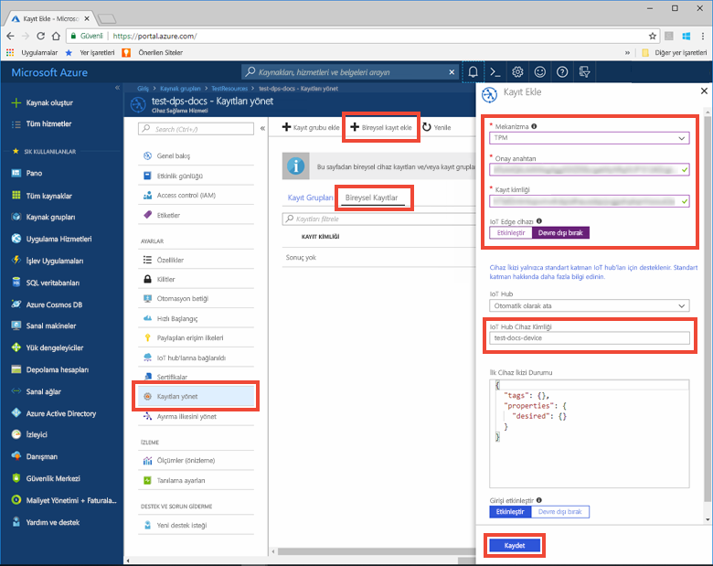
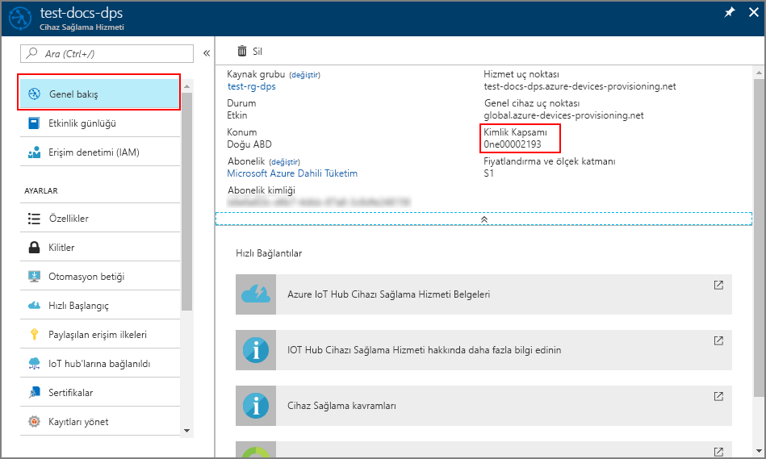
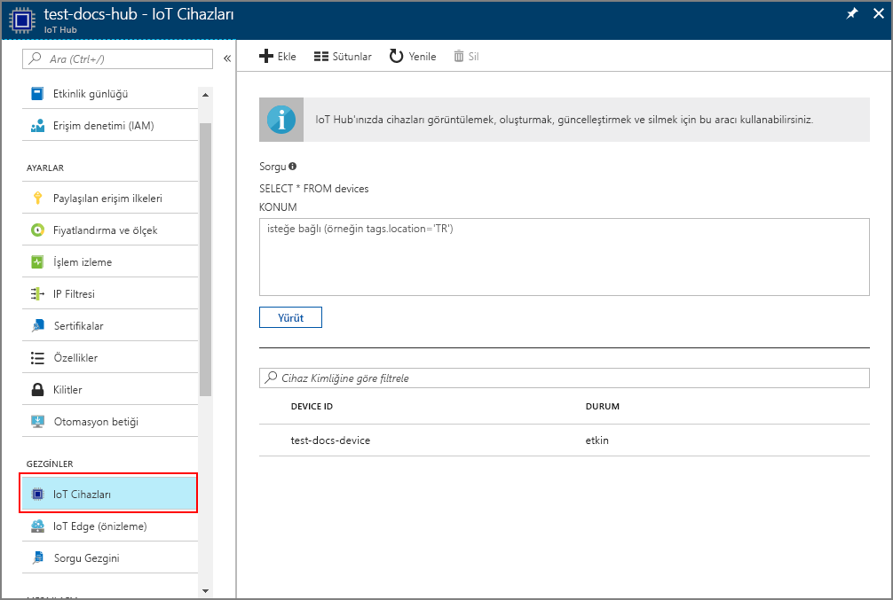

# <a name="quickstart-provision-a-simulated-tpm-device-using-the-azure-iot-c-sdk"></a>Hızlı Başlangıç: Azure IOT C SDK'sını kullanarak sanal bir TPM cihazı sağlama

[!INCLUDE [iot-dps-selector-quick-create-simulated-device-tpm](../../includes/iot-dps-selector-quick-create-simulated-device-tpm.md)]

Bu hızlı başlangıçta, Windows geliştirme makinesi üzerinde Güvenilir Platform Modülü (TPM) cihazı simülatörünü oluşturmayı ve çalıştırmayı öğreneceksiniz. Cihaz Sağlama Hizmeti örneğini kullanarak bu simülasyon cihazını bir IoT hub'ına bağlayacaksınız. Cihazı Cihaz Sağlama Hizmeti örneğine kaydetmek ve cihaz için bir önyükleme sırası simülasyonu yapmak için [Azure IoT C SDK'sındaki](https://github.com/Azure/azure-iot-sdk-c) örnek kodu kullanacaksınız.

Otomatik sağlama işlemini bilmiyorsanız, [Otomatik sağlama kavramlarını](concepts-auto-provisioning.md) gözden geçirin. Ayrıca, bu hızlı başlangıçla devam etmeden önce [IoT Hub Cihazı Sağlama Hizmetini Azure portalla ayarlama](./quick-setup-auto-provision.md) bölümünde bulunan adımları tamamladığınızdan emin olun. 

Azure IoT Cihaz Sağlama Hizmeti iki tür kaydı destekler:
- [Kayıt grupları](concepts-service.md#enrollment-group): Birden çok ilgili cihazları kaydetmek için kullanılır.
- [Bireysel kayıtlar](concepts-service.md#individual-enrollment): Tek bir cihazı kaydetmek için kullanılır.

Bu makalede bireysel kayıtlar gösterilmektedir.

[!INCLUDE [quickstarts-free-trial-note](../../includes/quickstarts-free-trial-note.md)]

## <a name="prerequisites"></a>Önkoşullar

* ["C++ ile masaüstü geliştirme"](https://www.visualstudio.com/vs/support/selecting-workloads-visual-studio-2017/) iş yükünün etkinleştirildiği Visual Studio 2015 veya [Visual Studio 2017](https://www.visualstudio.com/vs/).
* [Git](https://git-scm.com/download/)'in en son sürümünün yüklemesi.


<a id="setupdevbox"></a>

## <a name="prepare-a-development-environment-for-the-azure-iot-c-sdk"></a>Azure IoT C SDK'sı için geliştirme ortamını hazırlama

Bu bölümde, [Azure IoT C SDK'sı](https://github.com/Azure/azure-iot-sdk-c) ile [TPM](https://docs.microsoft.com/windows/device-security/tpm/trusted-platform-module-overview) cihaz simülatör örneğini oluşturmak için kullanılan geliştirme ortamını hazırlayacaksınız.

1. İndirme [CMake derleme sistemini](https://cmake.org/download/).

    `CMake` yüklemesine başlamadan **önce** makinenizde Visual Studio önkoşullarının (Visual Studio ve "C++ ile masaüstü geliştirme" iş yükü) yüklenmiş olması önemlidir. Önkoşullar sağlandıktan ve indirme doğrulandıktan sonra, CMake derleme sistemini yükleyin.

2. Komut istemini veya Git Bash kabuğunu açın. Aşağıdaki komutu yürüterek [Azure IoT C SDK'sı](https://github.com/Azure/azure-iot-sdk-c) GitHub deposunu kopyalayın:
    
    ```cmd/sh
    git clone https://github.com/Azure/azure-iot-sdk-c.git --recursive
    ```
    Bu işlemin tamamlanması için birkaç dakika beklemeniz gerekebilir.


3. Git deposunun kök dizininde bir `cmake` alt dizini oluşturun ve o klasöre gidin. 

    ```cmd/sh
    cd azure-iot-sdk-c
    mkdir cmake
    cd cmake
    ```

## <a name="build-the-sdk-and-run-the-tpm-device-simulator"></a>SDK'yı derleme ve TPM cihaz simülatörünü çalıştırma

Bu bölümde, TPM cihaz simülatörü örnek kodunu içeren Azure IoT C SDK'sını oluşturacaksınız. Bu örnek, Paylaşılan Erişim İmzası (SAS) Belirteci kimlik doğrulaması yoluyla bir TPM [kanıtlama mekanizması](concepts-security.md#attestation-mechanism) sağlar.

1. azure-iot-sdk-c git deposunda oluşturduğunuz `cmake` alt dizininden aşağıdaki komutu çalıştırarak örneği derleyin. Bu derleme komutuyla simülasyon cihazı için bir de Visual Studio çözümü oluşturulur.

    ```cmd/sh
    cmake -Duse_prov_client:BOOL=ON -Duse_tpm_simulator:BOOL=ON ..
    ```

    `cmake`, C++ derleyicinizi bulamazsa yukarıdaki komutu çalıştırırken derleme hatalarıyla karşılaşabilirsiniz. Bu durumda bu komutu [Visual Studio komut isteminde](https://docs.microsoft.com/dotnet/framework/tools/developer-command-prompt-for-vs) çalıştırmayı deneyin. 

    Derleme başarılı olduktan sonra, son birkaç çıkış satırı aşağıdaki çıkışa benzer olacaktır:

    ```cmd/sh
    $ cmake -Duse_prov_client:BOOL=ON -Duse_tpm_simulator:BOOL=ON ..
    -- Building for: Visual Studio 15 2017
    -- Selecting Windows SDK version 10.0.16299.0 to target Windows 10.0.17134.
    -- The C compiler identification is MSVC 19.12.25835.0
    -- The CXX compiler identification is MSVC 19.12.25835.0

    ...

    -- Configuring done
    -- Generating done
    -- Build files have been written to: E:/IoT Testing/azure-iot-sdk-c/cmake
    ```

2. Kopyaladığınız git deposunun kök klasörüne gidin ve aşağıda gösterilen yolu kullanarak [TPM](https://docs.microsoft.com/windows/device-security/tpm/trusted-platform-module-overview) simülatörünü çalıştırın. Bu simülatör 2321 ve 2322 bağlantı noktalarında bulunan bir yuva üzerinden dinler. Bu komut penceresini kapatmayın; bu hızlı başlangıcın sonuna kadar simülatörü çalışır durumda tutmanız gerekir. 

   *cmake* klasöründeyseniz aşağıdaki komutları çalıştırın:

    ```cmd/sh
    cd ..
    .\provisioning_client\deps\utpm\tools\tpm_simulator\Simulator.exe
    ```

    Simülatörden hiçbir çıkış görmeyeceksiniz. TPM cihazının simülasyonunu yaparak çalışmaya devam etmesine izin verin.

<a id="simulatetpm"></a>

## <a name="read-cryptographic-keys-from-the-tpm-device"></a>TPM cihazından şifreleme anahtarlarını okuma

Bu bölümde, çalışır ve 2321 ile 2322 numaralı bağlantı noktaları üzerinden dinler durumda bıraktığınız TPM simülatöründen onay anahtarını ve kayıt kimliğini okuyan bir örnek derleyecek ve bu örneği yürüteceksiniz. Bu değerler, Cihaz Sağlama Hizmeti örneğinize cihaz kaydı için kullanılacak.

1. Visual Studio’yu başlatın ve `azure_iot_sdks.sln` adlı yeni çözüm dosyasını açın. Bu çözüm dosyası daha önce azure-iot-sdk-c git deposunun kökünde oluşturduğunuz `cmake` klasöründe yer alır.

2. Çözümdeki tüm projeleri derlemek için Visual Studio menüsünde **Derle** > **Çözümü Derle**'yi seçin.

3. Visual Studio'nun *Çözüm Gezgini* penceresinde **Sağlama\_Araçları** klasörüne gidin. **tpm_device_provision** projesine sağ tıklayın ve **Başlangıç Projesi Olarak Ayarla**’yı seçin. 

4. Çözümü çalıştırmak için Visual Studio menüsünde **Hata Ayıkla** > **Hata ayıklama olmadan başlat**'ı seçin. Uygulama **_Kayıt Kimliği_** ve **_Onay Anahtarı_** değerlerini okur ve görüntüler. Bu değerleri kopyalayın. Bunlar, bir sonraki bölümde cihaz kaydı için kullanılacaktır. 


<a id="portalenrollment"></a>

## <a name="create-a-device-enrollment-entry-in-the-portal"></a>Portalda bir cihaz kaydı girişi oluşturma

1. Azure portalında oturum açın, sol taraftaki menüden **Tüm kaynaklar** düğmesine tıklayın ve Cihaz Sağlama hizmetinizi açın.

2. **Kayıtları yönet** sekmesini seçin ve ardından üstteki **Tek kayıt ekle** düğmesine tıklayın. 

3. **Kayıt ekle** altında aşağıdaki bilgileri girin ve **Kaydet** düğmesine tıklayın.

    - **Mekanizması:** Kimlik onay *Mekanizması* olarak **TPM** seçeneğini belirleyin.
    - **Onay anahtarı:** Girin *onay anahtarını* çalıştırarak TPM cihazınız için oluşturulan *tpm_device_provision* proje.
    - **Kayıt Kimliği:** Girin *kayıt kimliği* çalıştırarak TPM cihazınız için oluşturulan *tpm_device_provision* proje.
    - **IOT Edge cihazı:** Seçin **devre dışı**.
    - **IOT Hub cihaz kimliği:** Girin **test-docs-device** cihaz kimliği vermek için

        

      Kayıt başarıyla tamamlanınca cihazınızın *Kayıt Kimliği* listenin altında *Tek Tek Kayıtlar* sekmesinde görünür. 


<a id="firstbootsequence"></a>

## <a name="simulate-first-boot-sequence-for-the-device"></a>Cihazın ilk önyükleme sırasını benzetim olarak çalıştırma

Bu bölümde, örnek kodu yapılandırarak cihazın önyükleme sırasını Cihaz Sağlama Hizmeti örneğinize göndermek üzere [Gelişmiş İleti Sıraya Alma Protokolü (AMQP)](https://wikipedia.org/wiki/Advanced_Message_Queuing_Protocol) kullanmasını sağlayacaksınız. Bu önyükleme sırası cihazın tanınmasına ve Cihaz Sağlama Hizmeti örneğine bağlı bir IoT hub'ına atanmasına neden olur.

1. Azure portalda, Cihaz Sağlama hizmetiniz için **Genel Bakış** sekmesini seçin ve **_Kimlik Kapsamı_** değerini kopyalayın.

     

2. Visual Studio'nun *Çözüm Gezgini* penceresinde **Sağlama\_Örnekleri** klasörüne gidin. **prov\_dev\_client\_sample** adlı örnek projeyi genişletin. **Kaynak Dosyalar**'ı genişletin ve **prov\_dev\_client\_sample.c** dosyasını açın.

3. Dosyanın üst kısmında, aşağıda gösterildiği gibi her cihaz protokolü için `#define` deyimlerini bulun. Yalnızca `SAMPLE_AMQP` öğesinin açıklama haline getirilmediğinden emin olun.

    Şu anda, [TPM Bireysel Kaydı için MQTT protokolü desteklenmemektedir](https://github.com/Azure/azure-iot-sdk-c#provisioning-client-sdk).

    ```c
    //
    // The protocol you wish to use should be uncommented
    //
    //#define SAMPLE_MQTT
    //#define SAMPLE_MQTT_OVER_WEBSOCKETS
    #define SAMPLE_AMQP
    //#define SAMPLE_AMQP_OVER_WEBSOCKETS
    //#define SAMPLE_HTTP
    ```

4. `id_scope` sabitini bulun ve değeri daha önce kopyalamış olduğunuz **Kimlik Kapsamı** değerinizle değiştirin. 

    ```c
    static const char* id_scope = "0ne00002193";
    ```

5. Aynı dosyada `main()` işlevinin tanımını bulun. `hsm_type` değişkeninin aşağıda gösterildiği gibi `SECURE_DEVICE_TYPE_X509` yerine `SECURE_DEVICE_TYPE_TPM` değerine ayarlandığından emin olun.

    ```c
    SECURE_DEVICE_TYPE hsm_type;
    hsm_type = SECURE_DEVICE_TYPE_TPM;
    //hsm_type = SECURE_DEVICE_TYPE_X509;
    ```

6. **prov\_dev\_client\_sample** projesine sağ tıklayın ve **Başlangıç Projesi Olarak Ayarla**’yı seçin. 

7. Çözümü çalıştırmak için Visual Studio menüsünde **Hata Ayıkla** > **Hata ayıklama olmadan başlat**'ı seçin. Projeyi yeniden derleme isteminde **Evet**'e tıklayarak, çalıştırmadan önce projeyi yeniden derleyin.

    Aşağıdaki çıkış, başarıyla önyüklemesi yapılan cihaz istemci örneğini sağlama ve IoT hub bilgilerini almak üzere Cihaz Sağlama Hizmeti'ne bağlanıp kaydolma işlemlerinin bir örneğidir:

    ```cmd
    Provisioning API Version: 1.2.7
    Provisioning Status: PROV_DEVICE_REG_STATUS_CONNECTED

    Registering... Press enter key to interrupt.

    Provisioning Status: PROV_DEVICE_REG_STATUS_CONNECTED
    Provisioning Status: PROV_DEVICE_REG_STATUS_ASSIGNING
    Provisioning Status: PROV_DEVICE_REG_STATUS_ASSIGNING

    Registration Information received from service:
    test-docs-hub.azure-devices.net, deviceId: test-docs-device
    ```

8. Simülasyon cihazı sağlama hizmetinizle IoT hub’ına sağlandıktan sonra, cihaz kimliği hub'ın **IoT Cihazları** altında gösterilir. 

     


## <a name="clean-up-resources"></a>Kaynakları temizleme

Cihaz istemci örneği üzerinde çalışmaya ve inceleme yapmaya devam etmeyi planlıyorsanız bu Hızlı Başlangıç’ta oluşturulan kaynakları silmeyin. Devam etmeyi planlamıyorsanız, bu hızlı başlangıç ile oluşturulan tüm kaynakları silmek için aşağıdaki adımları kullanın:

1. Makinenizde cihaz istemci örnek çıktı penceresini kapatın.
2. Makinenizde TPM simülatörü penceresini kapatın.
3. Azure portalında sol taraftaki menüden **Tüm kaynaklar**’ı ve ardından Cihaz Sağlama hizmetini seçin. Hizmetinizle ilgili **Kayıtları Yönetme**’yi açın ve **Bireysel Kayıtlar** sekmesine tıklayın. Bu Hızlı Başlangıç adımlarını kullanarak kaydettiğiniz cihazın *KAYIT KİMLİĞİ* değerini seçip en üstte bulunan **Sil** düğmesine tıklayın. 
4. Azure portalında sol taraftaki menüden **Tüm kaynaklar**’ı ve ardından IoT hub’ınızı seçin. Hub'ınızın **IoT Cihazları** seçeneğini açıp bu Hızlı Başlangıç adımlarını kullanarak kaydettiğiniz cihazın *CİHAZ KİMLİĞİ* değerini seçin ve en üstte bulunan **Sil** düğmesine tıklayın.

## <a name="next-steps"></a>Sonraki adımlar

Bu hızlı başlangıçta makinenizde bir TPM sanal cihazı oluşturdunuz ve IoT Hub Cihaz Sağlama Hizmeti ile IoT hub'ınıza sağladınız. TPM cihazınızı programlı bir şekilde kaydetmeyi öğrenmek için TPM cihazının programlı kaydının yer aldığı Hızlı Başlangıç adımlarına gidin. 

> [!div class="nextstepaction"]
> [Azure hızlı başlangıcı - TPM cihazını Azure IOT Hub cihaz sağlama Hizmeti'ne kaydetme](quick-enroll-device-tpm-java.md)

