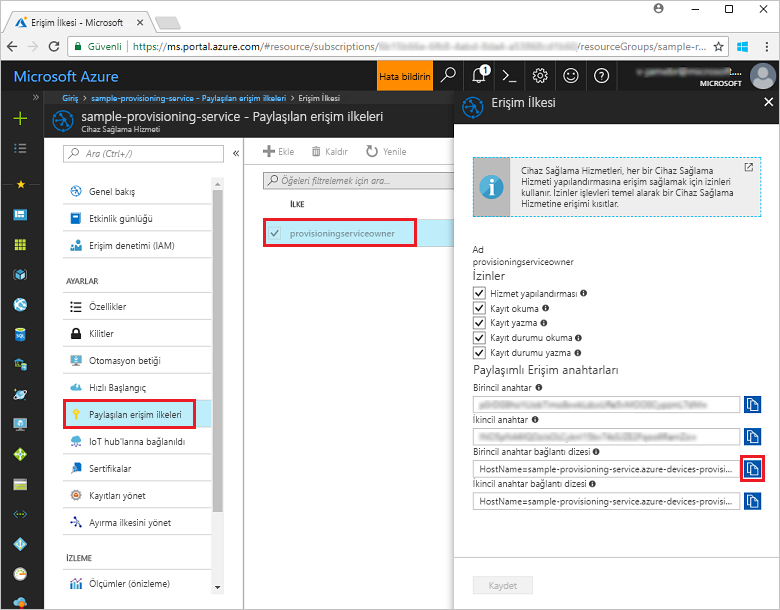
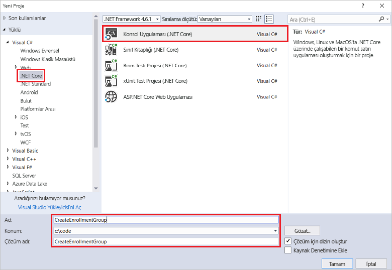
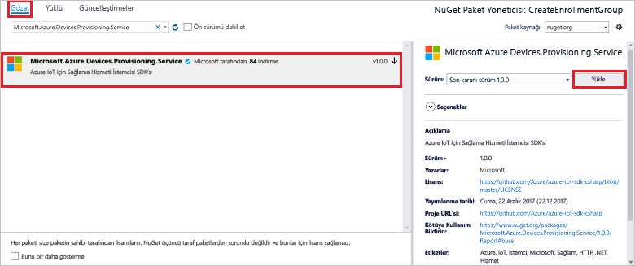
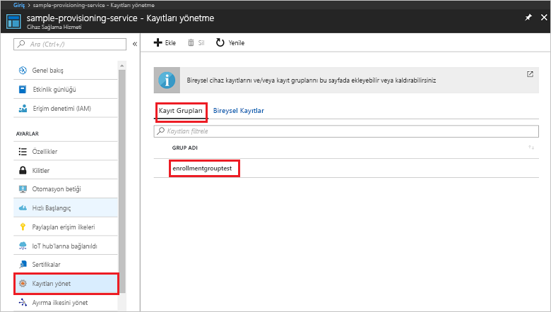

# <a name="quickstart-enroll-x509-devices-to-the-device-provisioning-service-using-c"></a>Hızlı Başlangıç: Cihaz sağlama Hizmeti'ni kullanarak X.509 cihazlarını kaydetmeC#

[!INCLUDE [iot-dps-selector-quick-enroll-device-x509](../../includes/iot-dps-selector-quick-enroll-device-x509.md)]


Bu hızlı başlangıçta C# programlama özelliklerini kullanarak ara veya kök CA X.509 sertifikalarını kullanan bir [Kayıt grubu](concepts-service.md#enrollment-group) oluşturmayı öğreneceksiniz. Kayıt grubu [.NET için Microsoft Azure IoT SDK'sı](https://github.com/Azure/azure-iot-sdk-csharp) ve örnek C# .NET Core uygulaması kullanılarak oluşturulur. Kayıt grubu, sertifika zincirlerinde ortak imzalama sertifikasını paylaşan cihazlar için sağlama hizmetine erişimi denetler. Daha fazla bilgi edinmek için bkz. [X.509 sertifikalarıyla sağlama hizmetine cihaz erişimini denetleme](./concepts-security.md#controlling-device-access-to-the-provisioning-service-with-x509-certificates). Azure IoT Hub ve Cihaz Sağlama Hizmeti ile X.509 sertifikası tabanlı Ortak Anahtar Altyapısı'nı (PKI) kullanma hakkında daha fazla bilgi için bkz. [X.509 CA sertifikası güvenliğine genel bakış](https://docs.microsoft.com/azure/iot-hub/iot-hub-x509ca-overview). 

Bu hızlı başlangıçta önceden bir IoT hub'ı ve Cihaz Sağlama Hizmeti örneği oluşturduğunuz kabul edilir. Bu kaynakları oluşturmadıysanız bu makaleye devam etmeden önce [IoT Hub Cihazı Sağlama Hizmetini Azure portal ile ayarlama](./quick-setup-auto-provision.md) hızlı başlangıcını tamamlayın.

Bu makaledeki adımlar hem Windows hem de Linux makineler için geçerli olsa da bu makale Windows dağıtım makinesi için geliştirilmiştir.

[!INCLUDE [quickstarts-free-trial-note](../../includes/quickstarts-free-trial-note.md)]


## <a name="prerequisites"></a>Önkoşullar

* [Visual Studio 2017](https://www.visualstudio.com/vs/)'yi yükleyin.
* Yükleme [.NET Core SDK'sı](https://www.microsoft.com/net/download/windows).
* [Git](https://git-scm.com/download/)'i yükleyin.


## <a name="prepare-test-certificates"></a>Test sertifikalarını hazırlama

Bu hızlı başlangıç için ara veya kök CA X.509 sertifikasının ortak bölümünü içeren bir .pem veya .cer dosyasına sahip olmanız gerekir. Bu sertifikanın sağlama hizmetinize yüklenmesi ve hizmet tarafından doğrulanması gerekir. 

[Azure IoT C SDK'sı](https://github.com/Azure/azure-iot-sdk-c) X.509 sertifika zinciri oluşturmanıza, bu zincirdeki bir kök veya ara sertifikayı yüklemenize ve sertifikayı doğrulamak için hizmette sahip olma onayı gerçekleştirmenize yardımcı olabilecek test araçları içerir. SDK aracıyla oluşturulan sertifikalar **yalnızca geliştirme testi** amacıyla kullanılacak şekilde tasarlanmıştır. Bu sertifikalar **üretim ortamında kullanılmamalıdır**. Sertifikalarda 30 gün sonra süresi dolacak değiştirilemeyen parolalar ("1234") bulunur. Üretim ortamında kullanıma uygun sertifikalar almayı öğrenmek için, Azure IoT Hub belgelerinde [X.509 CA sertifikası alma](https://docs.microsoft.com/azure/iot-hub/iot-hub-x509ca-overview#how-to-get-an-x509-ca-certificate) konusuna bakın.

Bu test araçlarını kullanarak sertifika üretmek için aşağıdaki adımları izleyin: 
 
1. Komut istemi veya Git Bash kabuğu açın ve makinenizdeki çalışma klasörüne geçin. Aşağıdaki komutu yürüterek [Azure IoT C SDK'sı](https://github.com/Azure/azure-iot-sdk-c) GitHub deposunu kopyalayın:
    
   ```cmd/sh
   git clone https://github.com/Azure/azure-iot-sdk-c.git --recursive
   ```

   Bu işlemin tamamlanması için birkaç dakika beklemeniz gerekebilir.

   Test araçları kopyaladığınız deponun *azure-iot-sdk-c/tools/CACertificates* dizininde bulunur.    

2. [Örnekler ve öğreticiler için test amaçlı CA sertifikalarını yönetme](https://github.com/Azure/azure-iot-sdk-c/blob/master/tools/CACertificates/CACertificateOverview.md) adımlarını izleyin. 

C SDK'sındaki araca ek olarak, *.NET için Microsoft Azure IoT SDK'sı* içindeki [Grup sertifikası doğrulama örneği](https://github.com/Azure-Samples/azure-iot-samples-csharp/tree/master/provisioning/Samples/service/GroupCertificateVerificationSample) de mevcut X.509 ara veya kök CA sertifikasıyla C# içinde sahip olma onayının nasıl gerçekleştirileceğini gösterir. 


## <a name="get-the-connection-string-for-your-provisioning-service"></a>Sağlama hizmetinizin bağlantı dizesini alma

Bu hızlı başlangıçtaki örnek için sağlama hizmetinizin bağlantı dizesine ihtiyacınız vardır.
1. Azure portalında oturum açın, sol taraftaki menüden **Tüm kaynaklar** düğmesine tıklayın ve Cihaz Sağlama Hizmetinizi açın. 
2. **Paylaşılan erişim ilkeleri**'ne ve ardından kullanmak istediğiniz erişim ilkesine tıklayarak özelliklerini görüntüleyin. **Erişim İlkesi** penceresinde birincil anahtar bağlantı dizesini kopyalayın ve not edin. 

    

## <a name="create-the-enrollment-group-sample"></a>Kayıt grubu örneğini oluşturma 

Bu bölümdeki adımlarda, sağlama hizmetinize kayıt grubu ekleyen bir .NET Core konsol uygulamasının nasıl oluşturulduğu gösterilir. Biraz değişiklikle, kayıt grubunu eklemek üzere bir [Windows IoT Core](https://developer.microsoft.com/en-us/windows/iot) konsol uygulaması oluşturmak için de bu adımları izleyebilirsiniz. IoT Core ile geliştirme hakkında daha fazla bilgi edinmek için bkz. [Windows IoT Core geliştirici belgeleri](https://docs.microsoft.com/windows/iot-core/).
1. Visual Studio’da **Konsol Uygulaması (.NET Core)** proje şablonunu kullanarak yeni bir çözüme bir Visual C# .NET Core Konsol Uygulaması projesi ekleyin. .NET Framework sürümünün 4.5.1 veya sonraki bir sürüm olduğundan emin olun. Projeye **CreateEnrollmentGroup** adını verin.

    

2. Çözüm Gezgini'nde **CreateEnrollmentGroup** projesine sağ tıklayın ve ardından **NuGet Paketlerini Yönet**'e tıklayın.
3. **NuGet Paket Yöneticisi** penceresinde **Gözat**'ı seçin, **Microsoft.Azure.Devices.Provisioning.Service**'i aratın, **Microsoft.Azure.Devices.Provisioning.Service** paketini yüklemek için **Yükle**'yi seçin ve kullanım koşullarını kabul edin. Bu yordam ile [Azure IoT Sağlama Hizmeti İstemci SDK'sı](https://www.nuget.org/packages/Microsoft.Azure.Devices.Provisioning.Service/) NuGet paketi ve bağımlılıkları indirilir, yüklenir ve bu pakete bir başvuru eklenir.

    

4. Aşağıdaki `using` deyimlerini **Program.cs** dosyasının en üst kısmındaki `using` deyimlerinin arkasına ekleyin:
   
   ```csharp
   using System.Security.Cryptography.X509Certificates;
   using System.Threading.Tasks;
   using Microsoft.Azure.Devices.Provisioning.Service;
   ```
    
5. **Program** sınıfına aşağıdaki alanları ekleyin.  
   - **ProvisioningConnectionString** yer tutucu değerini, kaydı oluşturmak istediğiniz sağlama hizmetinin bağlantı dizesiyle değiştirin.
   - **X509RootCertPath** yer tutucu değerini, daha önce karşıya yüklenen ve sağlama hizmetinizle doğrulanan ara veya kök CA X.509 sertifikasının ortak bölümünü temsil eden .pem veya .cer dosyasının yoluyla değiştirin.
   - İsteğe bağlı olarak **EnrollmentGroupId** değerini de değiştirebilirsiniz. Dize yalnızca küçük harflerden ve kısa çizgilerden oluşabilir. 

   > [!IMPORTANT]
   > Üretim kodunda, güvenlikle ilgili aşağıdaki noktalara dikkat edin:
   >
   > - Sağlama hizmeti yöneticisi için bağlantı dizesinin sabit kodlanması en iyi güvenlik yöntemlerine uygun değildir. Bunun yerine, bağlantı dizesi güvenli bir şekilde, örneğin güvenli yapılandırma dosyasının içinde veya kayıt defterinin içinde tutulmalıdır.
   > - İmzalama sertifikasının yalnızca ortak bölümünü karşıya yüklediğinizden emin olun. Özel anahtarları içeren .pfx (PKCS12) veya .pem dosyalarını asla sağlama hizmetine yüklemeyin.
        
   ```csharp
   private static string ProvisioningConnectionString = "{Your provisioning service connection string}";
   private static string EnrollmentGroupId = "enrollmentgrouptest";
   private static string X509RootCertPath = @"{Path to a .cer or .pem file for a verified root CA or intermediate CA X.509 certificate}";
   ```
    
6. **Program** sınıfına aşağıdaki yöntemi ekleyin. Bu kod kayıt grubu girdisini oluşturur ve kayıt grubunu sağlama hizmetine eklemek için **ProvisioningServiceClient** üzerinden **CreateOrUpdateEnrollmentGroupAsync** yöntemini çağırır.
   
   ```csharp
   public static async Task RunSample()
   {
       Console.WriteLine("Starting sample...");
 
       using (ProvisioningServiceClient provisioningServiceClient =
               ProvisioningServiceClient.CreateFromConnectionString(ProvisioningConnectionString))
       {
           #region Create a new enrollmentGroup config
           Console.WriteLine("\nCreating a new enrollmentGroup...");
           var certificate = new X509Certificate2(X509RootCertPath);
           Attestation attestation = X509Attestation.CreateFromRootCertificates(certificate);
           EnrollmentGroup enrollmentGroup =
                   new EnrollmentGroup(
                           EnrollmentGroupId,
                           attestation)
                   {
                       ProvisioningStatus = ProvisioningStatus.Enabled
                   };
           Console.WriteLine(enrollmentGroup);
           #endregion
 
           #region Create the enrollmentGroup
           Console.WriteLine("\nAdding new enrollmentGroup...");
           EnrollmentGroup enrollmentGroupResult =
               await provisioningServiceClient.CreateOrUpdateEnrollmentGroupAsync(enrollmentGroup).ConfigureAwait(false);
           Console.WriteLine("\nEnrollmentGroup created with success.");
           Console.WriteLine(enrollmentGroupResult);
           #endregion
 
       }
   }
   ```

7. Son olarak, **Main** yönteminin gövdesini aşağıdaki satırlarla değiştirin:
   
   ```csharp
   RunSample().GetAwaiter().GetResult();
   Console.WriteLine("\nHit <Enter> to exit ...");
   Console.ReadLine();
   ```
        
8. Çözümü derleyin.

## <a name="run-the-enrollment-group-sample"></a>Kayıt grubu örneğini çalıştırma
  
1. Örneği Visual Studio'da çalıştırarak kayıt grubunu oluşturun.
 
2. Oluşturma başarılı olursa komut penceresinde yeni kayıt grubunun özellikleri görüntülenir.

    

3. Kayıt grubunun oluşturulduğunu doğrulamak için, Azure Portal'daki Cihaz Sağlama Hizmeti özet dikey penceresinde **Kayıtları yönet**'i ve ardından **Kayıt Grupları** sekmesini seçin. Örnekte kullandığınız kayıt kimliğine karşılık gelen yeni bir kayıt girdisi görmelisiniz. Sertifika parmak izini ve girdinin diğer özelliklerini doğrulamak için girdiye tıklayın.

    
 
## <a name="clean-up-resources"></a>Kaynakları temizleme
C# hizmeti örneğini keşfetmeye devam etmeyi planlıyorsanız, bu Hızlı Başlangıçta oluşturulan kaynakları temizlemeyin. Devam etmeyi planlamıyorsanız, bu hızlı başlangıç ile oluşturulan tüm kaynakları silmek için aşağıdaki adımları kullanın:

1. Makinenizdeki C# örnek çıkış penceresini kapatın.
2. Azure portalındaki Cihaz Sağlama hizmetine gidin, **Kayıtları yönetme**'ye tıklayıp **Kayıt Grupları** sekmesini seçin. Bu Hızlı Başlangıç adımlarını kullanarak oluşturduğunuz kayıt girişinin *Kayıt Kimliği* değerini seçip dikey pencerenin en üstünde bulunan **Sil** düğmesine tıklayın.  
3. Azure portalında Cihaz Sağlama Hizmeti'nden **Sertifikalar**'a, bu Hızlı Başlangıç için yüklediğiniz sertifikaya ve **Sertifika Ayrıntıları** penceresinin en üstünde bulunan **Sil** düğmesine tıklayın.  
 
## <a name="next-steps"></a>Sonraki adımlar
Bu Hızlı Başlangıçta Azure IoT Hub Cihazı Sağlama Hizmeti'ni kullanarak X.509 ara veya kök CA sertifikası için bir kayıt grubu oluşturdunuz. Cihaz sağlama hakkında ayrıntılı bilgi edinmek için Azure portalında Cihaz Sağlama Hizmeti ayarları öğreticisine geçin. 
 
> [!div class="nextstepaction"]
> [Azure IoT Hub Cihazı Sağlama Hizmeti öğreticileri](./tutorial-set-up-cloud.md)
