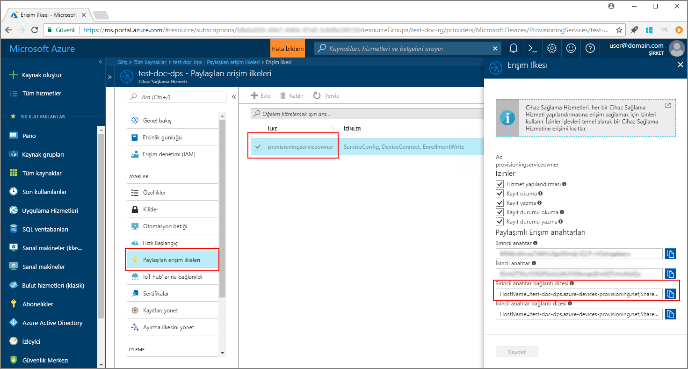
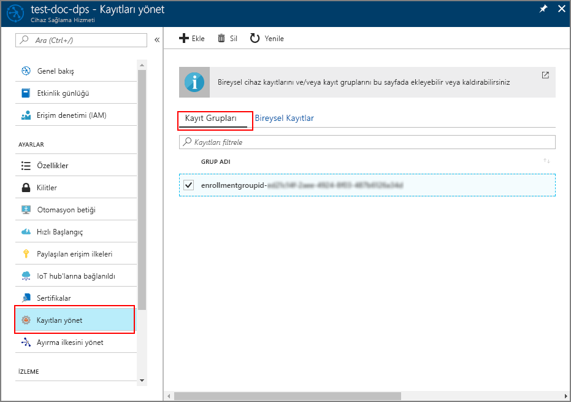

# <a name="quickstart-enroll-x509-devices-to-the-device-provisioning-service-using-java"></a>Hızlı Başlangıç: Cihaz sağlama Hizmeti'ne Java kullanarak X.509 cihazlarını kaydetme

[!INCLUDE [iot-dps-selector-quick-enroll-device-x509](../../includes/iot-dps-selector-quick-enroll-device-x509.md)]

Bu hızlı başlangıçta Java kullanarak X.509 sanal cihaz grubunu Azure IoT Hub Cihazı Sağlama Hizmeti'ne programlı bir şekilde kaydetme adımları gösterilmektedir. Cihazlar sağlama hizmeti örneğine [Kayıt grubu](concepts-service.md#enrollment-group) veya [Bireysel kayıt](concepts-service.md#individual-enrollment) oluşturularak kaydedilir. Bu hızlı başlangıçta iki kayıt türünün de nasıl oluşturulacağı anlatılmaktadır. Kayıtlar örnek Java uygulamasının yardımıyla [Java Hizmeti SDK](https://azure.github.io/azure-iot-sdk-java/service/)'sı kullanılarak oluşturulmaktadır. 

Bu hızlı başlangıçta önceden bir IoT hub'ı ve Cihaz Sağlama Hizmeti örneği oluşturduğunuz kabul edilir. Bu kaynakları oluşturmadıysanız bu makaleye devam etmeden önce [IoT Hub Cihazı Sağlama Hizmetini Azure portal ile ayarlama](./quick-setup-auto-provision.md) hızlı başlangıcını tamamlayın.

Java Hizmeti SDK'sı hem Windows hem de Linux makinelerinde çalışır, ancak bu makalede, kayıt işlemlerinin gösterilmesi için Windows geliştirme makinesi kullanılır.

[!INCLUDE [quickstarts-free-trial-note](../../includes/quickstarts-free-trial-note.md)]

## <a name="prerequisites"></a>Önkoşullar

* [Java SE Development Kit 8](https://aka.ms/azure-jdks)'i yükleyin.
* [Maven 3](https://maven.apache.org/download.cgi)'ü yükleyin. Geçerli Maven sürümünüzü doğrulamak için şu komutu çalıştırabilirsiniz:

    ```cmd/sh
    mvn --version
    ```

* [Git](https://git-scm.com/download/)'i yükleyin.


<a id="javasample"></a>

## <a name="download-and-modify-the-java-sample-code"></a>Örnek Java kodunu indirme ve değiştirme

Bu bölümde, otomatik olarak imzalanan X.509 sertifikası kullanılır. Aşağıdaki noktaları göz önünde bulundurmak önemlidir:

* Otomatik olarak imzalanan sertifikalar yalnızca test amaçlıdır ve üretimde kullanılmamalıdır.
* Otomatik olarak imzalanan sertifikanın varsayılan sona erme tarihi bir yıldır.

Aşağıdaki adımlarda örnek koda X.509 cihazınızın sağlama ayrıntılarını nasıl ekleyeceğiniz gösterilir. 

1. Bir komut istemi açın. Java Hizmeti SDK'sını kullanarak cihaz kayıt kodu örneğinin GitHub deposunu kopyalayın:
    
    ```cmd\sh
    git clone https://github.com/Azure/azure-iot-sdk-java.git --recursive
    ```

2. İndirilen kaynak kodunda örnek klasörüne gidin: **_azure-iot-sdk-java/provisioning/provisioning-samples/service-enrollment-group-sample_**. **_/src/main/java/samples/com/microsoft/azure/sdk/iot/ServiceEnrollmentGroupSample.java_** adlı dosyayı istediğiniz düzenleyicide açıp aşağıdaki ayrıntıları ekleyin:

    1. Portaldan sağlama hizmetinize ait `[Provisioning Connection String]` bilgisini aşağıdaki şekilde ekleyin:
        1. [Azure portalında](https://portal.azure.com) sağlama hizmetinize gidin. 
        2. **Paylaşılan erişim ilkeleri**'ni açıp *EnrollmentWrite* iznine sahip bir ilke seçin.
        3. **Birincil anahtar bağlantı dizesini** kopyalayın. 

              

        4. **_ServiceEnrollmentGroupSample.java_** adlı örnek kod dosyasında `[Provisioning Connection String]` yerine **Birincil anahtar bağlantı dizesini** yazın.

            ```Java
            private static final String PROVISIONING_CONNECTION_STRING = "[Provisioning Connection String]";
            ```

    2. Cihaz grubuna ait kök sertifikayı ekleyin. Örnek kod sertifikaya ihtiyacınız varsa _X.509 certificate generator_ aracını aşağıda gösterilen şekilde kullanabilirsiniz:
        1. Bir komut penceresinde **_azure-iot-sdk-java/provisioning/provisioning-tools/provisioning-x509-cert-generator_** dizinine gidin.
        2. Aşağıdaki komutu çalıştırarak aracı derleyin:

                ```cmd\sh
                mvn clean install
                ```

        4. Aşağıdaki komutları kullanarak aracı çalıştırın:

                ```cmd\sh
                cd target
                java -jar ./provisioning-x509-cert-generator-{version}-with-deps.jar
                ```

        5. İstendiğinde sertifikalarınız için _Common Name_ (Ortak Ad) girebilirsiniz.
        6. Araç yerel olarak bir **Client Cert** (İstemci Sertifikası), **Client Cert Private Key** (İstemci Sertifikası Özel Anahtarı) ve **Root Cert** (Kök Sertifika) oluşturur.
        7. **Root Cert** değerini **_-----BEGIN CERTIFICATE-----_** ve **_-----END CERTIFICATE-----_** satırları dahil olmak üzere kopyalayın. 
        8. **Root Cert** değerini aşağıda gösterilen şekilde **PUBLIC_KEY_CERTIFICATE_STRING** parametresine atayın:

                ```Java
                private static final String PUBLIC_KEY_CERTIFICATE_STRING =
                        "-----BEGIN CERTIFICATE-----\n" +
                        "XXXXXXXXXXXXXXXXXXXXXXXXXXXXXXXXXXXXXXXXXXXXXXXXXXXXXXXXXXXXXXXX\n" +
                        "XXXXXXXXXXXXXXXXXXXXXXXXXXXXXXXXXXXXXXXXXXXXXXXXXXXXXXXXXXXXXXXX\n" +
                        "XXXXXXXXXXXXXXXXXXXXXXXXXXXXXXXXXXXXXXXXXXXXXXXXXXXXXXXXXXXXXXXX\n" +
                        "XXXXXXXXXXXXXXXXXXXXXXXXXXXXXXXXXXXXXXXXXXXXXXXXXXXXXXXXXXXXXXXX\n" +
                        "XXXXXXXXXXXXXXXXXXXXXXXXXXXXXXXXXXXXXXXXXXXXXXXXXXXXXXXXXXXXXXXX\n" +
                        "XXXXXXXXXXXXXXXXXXXXXXXXXXXXXXXXXXXXXXXXXXXXXXXXXXXXXXXXXXXXXXXX\n" +
                        "XXXXXXXXXXXXXXXXXXXXXXXXXXXXXXXXXXXXXXXXXXXXXXXXXXXXXXXXXXXXXXXX\n" +
                        "XXXXXXXXXXXXXXXXXXXXXXXXXXXXXXXXXXXXXXXXXXXXXXXXXXXXXXXXXXXXXXXX\n" +
                        "XXXXXXXXXXXXXXXXXXXXXXXXXXXXXXXXXXXXXXXXXXXXXXXXXXXXXXXXXXXXXXXX\n" +
                        "XXXXXXXXXXXXXXXXXXXXXXXXXXXXXXXXXXXXXXXXXXXXXXXXXXXXXXXXXXXXXXXX\n" +
                        "-----END CERTIFICATE-----\n";
                ```

        9. Komut penceresini kapatın veya *Verification Code* (Doğrulama Kodu) istendiğinde **n** girin. 
 
    3. İsteğe bağlı olarak örnek kod aracılığıyla sağlama hizmetinizi de yapılandırabilirsiniz:
        - Örneğe bu yapılandırmayı eklemek için aşağıdaki adımları izleyin:
            1. [Azure portalında](https://portal.azure.com) sağlama hizmetinizle bağlantılı IoT hub sayfasına gidin. Hub'ın **Özet** sayfasını açıp **Ana bilgisayar adı**'nı kopyalayın. Bu **Ana bilgisayar adı** değerini *IOTHUB_HOST_NAME* parametresine atayın.

                ```Java
                private static final String IOTHUB_HOST_NAME = "[Host name].azure-devices.net";
                ```
            2. *DEVICE_ID* parametresine kolay ad atayıp *PROVISIONING_STATUS* parametresinin varsayılan *ENABLED* değerini tutun. 

        - VEYA, sağlama hizmetinizi yapılandırmak istemezseniz _ServiceEnrollmentGroupSample.java_ dosyasında bulunan aşağıdaki bölümleri açıklama satırı yapmayı veya silmeyi unutmayın:

            ```Java
            enrollmentGroup.setIotHubHostName(IOTHUB_HOST_NAME);                // Optional parameter.
            enrollmentGroup.setProvisioningStatus(ProvisioningStatus.ENABLED);  // Optional parameter.
            ```

    4. Örnek kodu inceleyin. Bu kod, X.509 cihazları için bir grup kaydı oluşturup bu kaydı güncelleştirir, sorgular ve siler. Portal kaydının başarılı olduğundan emin olmak için _ServiceEnrollmentGroupSample.java_ dosyasının en sonunda bulunan aşağıdaki kod satırlarını geçici olarak açıklama satırı yapın:

        ```Java
        // ************************************** Delete info of enrollmentGroup ***************************************
        System.out.println("\nDelete the enrollmentGroup...");
        provisioningServiceClient.deleteEnrollmentGroup(enrollmentGroupId);
        ```

    5. _ServiceEnrollmentGroupSample.java_ dosyasını kaydedin. 
 

<a id="runjavasample"></a>

## <a name="build-and-run-sample-group-enrollment"></a>Örnek grup kaydını derleme ve çalıştırma

1. Bir komut penceresi açıp **_azure-iot-sdk-java/provisioning/provisioning-samples/service-enrollment-group-sample_** klasörüne gidin.

2. Şu komutu kullanarak örnek kodu derleyin:

    ```cmd\sh
    mvn install -DskipTests
    ```

   Bu komut, [`com.microsoft.azure.sdk.iot.provisioning.service`](https://www.mvnrepository.com/artifact/com.microsoft.azure.sdk.iot.provisioning/provisioning-service-client) Maven paketini makinenize indirir. Bu pakette örnek kodun derlenebilmesi için gerekli olan Java hizmeti SDK'sı ikili dosyaları bulunur. Önceki bölümde _X.509 certificate generator_ aracını çalıştırdıysanız bu paket makinenize indirilmiştir. 

3. Komut penceresinde aşağıdaki komutları çalıştırarak örneği çalıştırın:

    ```cmd\sh
    cd target
    java -jar ./service-enrollment-group-sample-{version}-with-deps.jar
    ```

4. Kaydın başarılı olup olmadığını görmek için çıktı penceresini izleyin.

5. Azure portalında sağlama hizmetinize gidin. **Kayıtları yönetme**'ye tıklayın. X.509 cihaz grubunun **Kayıt Grupları** bölümünde, otomatik olarak oluşturulmuş bir *GRUP ADI* altında göründüğüne dikkat edin. 

      

## <a name="modifications-to-enroll-a-single-x509-device"></a>Tek bir X.509 cihazını kaydetmek için yapmanız gereken değişiklikler

Tek bir X.509 cihazını kaydetmek için [Java hizmet SDK'sını kullanarak TPM cihazını IoT Hub Cihaz Sağlama Hizmeti'ne kaydetme](quick-enroll-device-tpm-java.md#javasample) bölümünde kullanılan *bireysel kayıt* örnek kodunu aşağıdaki şekilde değiştirin:

1. X.509 istemci sertifikanızın *Ortak Ad* değerini panoya kopyalayın. [Yukarıdaki örnek kod bölümünde](#javasample) gösterilen _X.509 certificate generator_ aracını kullanmak isterseniz sertifikanız için bir _Ortak Ad_ girin veya varsayılan **microsoftriotcore** değerini kullanın. Bu **Ortak Ad** değerini *REGISTRATION_ID* değişkeni için kullanın. 

    ```Java
    // Use common name of your X.509 client certificate
    private static final String REGISTRATION_ID = "[RegistrationId]";
    ```

2. *TPM_ENDORSEMENT_KEY* değişkeninin adını *PUBLIC_KEY_CERTIFICATE_STRING* olarak değiştirin. İstemci sertifikanızı veya _X.509 certificate generator_ aracının oluşturduğu **Client Cert** değerini kopyalayıp *PUBLIC_KEY_CERTIFICATE_STRING* değişkeninin değeri olarak kullanın. 

    ```Java
    // Rename the variable *TPM_ENDORSEMENT_KEY* as *PUBLIC_KEY_CERTIFICATE_STRING*
    private static final String PUBLIC_KEY_CERTIFICATE_STRING =
            "-----BEGIN CERTIFICATE-----\n" +
            "XXXXXXXXXXXXXXXXXXXXXXXXXXXXXXXXXXXXXXXXXXXXXXXXXXXXXXXXXXXXXXXX\n" +
            "XXXXXXXXXXXXXXXXXXXXXXXXXXXXXXXXXXXXXXXXXXXXXXXXXXXXXXXXXXXXXXXX\n" +
            "XXXXXXXXXXXXXXXXXXXXXXXXXXXXXXXXXXXXXXXXXXXXXXXXXXXXXXXXXXXXXXXX\n" +
            "XXXXXXXXXXXXXXXXXXXXXXXXXXXXXXXXXXXXXXXXXXXXXXXXXXXXXXXXXXXXXXXX\n" +
            "XXXXXXXXXXXXXXXXXXXXXXXXXXXXXXXXXXXXXXXXXXXXXXXXXXXXXXXXXXXXXXXX\n" +
            "XXXXXXXXXXXXXXXXXXXXXXXXXXXXXXXXXXXXXXXXXXXXXXXXXXXXXXXXXXXXXXXX\n" +
            "XXXXXXXXXXXXXXXXXXXXXXXXXXXXXXXXXXXXXXXXXXXXXXXXXXXXXXXXXXXXXXXX\n" +
            "XXXXXXXXXXXXXXXXXXXXXXXXXXXXXXXXXXXXXXXXXXXXXXXXXXXXXXXXXXXXXXXX\n" +
            "XXXXXXXXXXXXXXXXXXXXXXXXXXXXXXXXXXXXXXXXXXXXXXXXXXXXXXXXXXXXXXXX\n" +
            "XXXXXXXXXXXXXXXXXXXXXXXXXXXXXXXXXXXXXXXXXXXXXXXXXXXXXXXXXXXXXXXX\n" +
            "-----END CERTIFICATE-----\n";
    ```
3. X.509 istemci sertifikasını kullanmak için **main** işlevinde `Attestation attestation = new TpmAttestation(TPM_ENDORSEMENT_KEY);` satırını aşağıdaki şekilde değiştirin:
    ```Java
    Attestation attestation = X509Attestation.createFromClientCertificates(PUBLIC_KEY_CERTIFICATE_STRING);
    ```

4. *Bireysel kayıt* örnek dosyasını [Bireysel kayıt için örnek kodu derleme ve çalıştırma](quick-enroll-device-tpm-java.md#runjavasample) bölümündeki adımları izleyerek kaydedin, derleyin ve çalıştırın.


## <a name="clean-up-resources"></a>Kaynakları temizleme
Java hizmeti örneğini keşfetmeye devam etmeyi planlıyorsanız, bu Hızlı Başlangıçta oluşturulan kaynakları temizlemeyin. Devam etmeyi planlamıyorsanız, bu hızlı başlangıç ile oluşturulan tüm kaynakları silmek için aşağıdaki adımları kullanın:

1. Makinenizdeki Java örnek çıktı penceresini kapatın.
1. Makinenizde _X509 Cert Generator_ penceresini kapatın.
1. Azure portalındaki Cihaz Sağlama hizmetine gidin, **Kayıtları yönetme**'ye tıklayıp **Kayıt Grupları** sekmesini seçin. Bu Hızlı Başlangıç adımlarını kullanarak kaydettiğiniz X.509 cihazlarının *GRUP ADI* değerini seçip dikey pencerenin en üstünde bulunan **Sil** düğmesine tıklayın.  

## <a name="next-steps"></a>Sonraki adımlar
Bu Hızlı Başlangıçta sanal X.509 cihazlarından oluşan bir grubu Cihaz Sağlama hizmetinize kaydettiniz. Cihaz sağlama hakkında ayrıntılı bilgi edinmek için Azure portalında Cihaz Sağlama Hizmeti ayarları öğreticisine geçin. 

> [!div class="nextstepaction"]
> [Azure IoT Hub Cihazı Sağlama Hizmeti öğreticileri](./tutorial-set-up-cloud.md)
