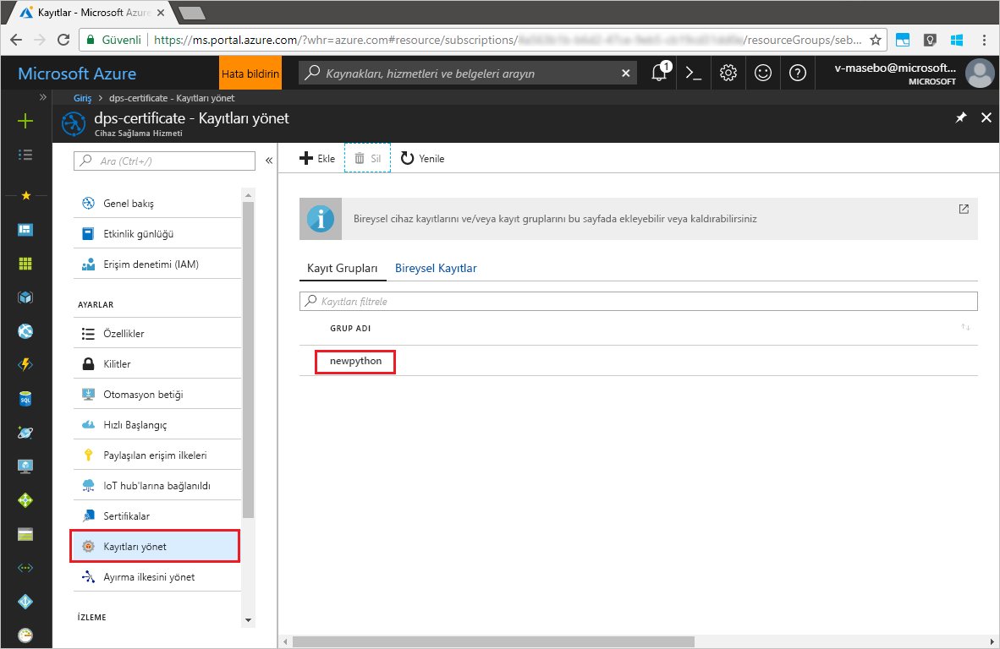

# <a name="quickstart-enroll-x509-devices-to-the-device-provisioning-service-using-python"></a>Hızlı Başlangıç: Cihaz sağlama Hizmeti'ne Python kullanarak X.509 cihazlarını kaydetme

[!INCLUDE [iot-dps-selector-quick-enroll-device-x509](../../includes/iot-dps-selector-quick-enroll-device-x509.md)]

Cihazlar sağlama hizmeti örneğine [Kayıt grubu](concepts-service.md#enrollment-group) veya [Bireysel kayıt](concepts-service.md#individual-enrollment) oluşturularak kaydedilir. Bu hızlı başlangıçta Python programlama özelliklerini kullanarak ara veya kök CA X.509 sertifikalarını kullanan bir [Kayıt grubu](concepts-service.md#enrollment-group) oluşturmayı öğreneceksiniz. Kayıt grubu, sertifika zincirlerinde ortak imzalama sertifikasını paylaşan cihazlar için sağlama hizmetine erişimi denetler. Kayıt grubu [Python Sağlama Hizmeti SDK](https://github.com/Azure/azure-iot-sdk-python/tree/master/provisioning_service_client)'sı ve örnek Python uygulaması kullanılarak oluşturulur. *Python Sağlama Hizmeti SDK*'sı ile Bireysel kayıt oluşturma özelliği yapım aşamasındadır. Daha fazla bilgi edinmek için bkz. [X.509 sertifikalarıyla sağlama hizmetine cihaz erişimini denetleme](./concepts-security.md#controlling-device-access-to-the-provisioning-service-with-x509-certificates). Azure IoT Hub ve Cihaz Sağlama Hizmeti ile X.509 sertifikası tabanlı Ortak Anahtar Altyapısı'nı (PKI) kullanma hakkında daha fazla bilgi için bkz. [X.509 CA sertifikası güvenliğine genel bakış](https://docs.microsoft.com/azure/iot-hub/iot-hub-x509ca-overview).

Bu hızlı başlangıçta önceden bir IoT hub'ı ve Cihaz Sağlama Hizmeti örneği oluşturduğunuz kabul edilir. Bu kaynakları oluşturmadıysanız bu makaleye devam etmeden önce [IoT Hub Cihazı Sağlama Hizmetini Azure portal ile ayarlama](./quick-setup-auto-provision.md) hızlı başlangıcını tamamlayın.

Bu makaledeki adımlar hem Windows hem de Linux makineler için geçerli olsa da bu makale Windows dağıtım makinesi için geliştirilmiştir.

[!INCLUDE [quickstarts-free-trial-note](../../includes/quickstarts-free-trial-note.md)]


## <a name="prerequisites"></a>Önkoşullar

- [Python 2.x veya 3.x](https://www.python.org/downloads/) yükleyin. Kurulumunuzun gereksinimine uygun olarak 32 bit veya 64 bit yüklemeyi kullanmaya dikkat edin. Yükleme sırasında istendiğinde, platforma özgü ortam değişkeninize Python'u eklediğinizden emin olun.
- [Python paket yönetim sistemi *pip* uygulamasını yükleyin](https://pip.pypa.io/en/stable/installing/).
- [Git](https://git-scm.com/download/)'i yükleyin.


## <a name="prepare-test-certificates"></a>Test sertifikalarını hazırlama

Bu hızlı başlangıç için ara veya kök CA X.509 sertifikasının ortak bölümünü içeren bir .pem veya .cer dosyasına sahip olmanız gerekir. Bu sertifikanın sağlama hizmetinize yüklenmesi ve hizmet tarafından doğrulanması gerekir. 

[Azure IoT C SDK'sı](https://github.com/Azure/azure-iot-sdk-c) X.509 sertifika zinciri oluşturmanıza, bu zincirdeki bir kök veya ara sertifikayı yüklemenize ve sertifikayı doğrulamak için hizmette sahip olma onayı gerçekleştirmenize yardımcı olabilecek test araçları içerir. SDK aracıyla oluşturulan sertifikalar **yalnızca geliştirme testi** amacıyla kullanılacak şekilde tasarlanmıştır. Bu sertifikalar **üretim ortamında kullanılmamalıdır**. Sertifikalarda 30 gün sonra süresi dolacak değiştirilemeyen parolalar ("1234") bulunur. Üretim ortamında kullanıma uygun sertifikalar almayı öğrenmek için, Azure IoT Hub belgelerinde [X.509 CA sertifikası alma](https://docs.microsoft.com/azure/iot-hub/iot-hub-x509ca-overview#how-to-get-an-x509-ca-certificate) konusuna bakın.

Bu test araçlarını kullanarak sertifika üretmek için aşağıdaki adımları izleyin: 
 
1. Komut istemi veya Git Bash kabuğu açın ve makinenizdeki çalışma klasörüne geçin. Aşağıdaki komutu yürüterek [Azure IoT C SDK'sı](https://github.com/Azure/azure-iot-sdk-c) GitHub deposunu kopyalayın:
    
   ```cmd/sh
   git clone https://github.com/Azure/azure-iot-sdk-c.git --recursive
   ```

   Bu işlemin tamamlanması için birkaç dakika beklemeniz gerekebilir.

   Test araçları kopyaladığınız deponun *azure-iot-sdk-c/tools/CACertificates* dizininde bulunur.    

2. [Örnekler ve öğreticiler için test amaçlı CA sertifikalarını yönetme](https://github.com/Azure/azure-iot-sdk-c/blob/master/tools/CACertificates/CACertificateOverview.md) adımlarını izleyin. 


## <a name="modify-the-python-sample-code"></a>Python örnek kodunu değiştirme

Bu bölümde örnek koda X.509 cihazınızın sağlama ayrıntılarını nasıl ekleyeceğiniz gösterilir. 

1. Metin düzenleyicisi kullanarak yeni bir **EnrollmentGroup.py** dosyası oluşturun.

1. Aşağıdaki `import` deyimlerini ve değişkenlerini **EnrollmentGroup.py** dosyasının başlangıcına ekleyin. `dpsConnectionString` öğesini, **Azure portal** üzerinde **Cihaz Sağlama Hizmeti**’nizdeki **Paylaşılan erişim ilkeleri** altında bulunan bağlantı dizenizle değiştirin. Sertifika yer tutucusunu, daha önce [Test sertifikalarını hazırlama](quick-enroll-device-x509-python.md#prepare-test-certificates) konusunda oluşturulan sertifika ile değiştirin. Son olarak, benzersiz bir `registrationid` oluşturun ve yalnızca küçük harf alfasayısal karakterler ve kısa çizgiler içerdiğinden emin olun.  
   
    ```python
    from provisioningserviceclient import ProvisioningServiceClient
    from provisioningserviceclient.models import EnrollmentGroup, AttestationMechanism

    CONNECTION_STRING = "{dpsConnectionString}"

    SIGNING_CERT = """-----BEGIN CERTIFICATE-----
    XXXXXXXXXXXXXXXXXXXXXXXXXXXXXXXXXXXXXXXXXXXXXXXXXXXXXXXXXXXXXXXX
    XXXXXXXXXXXXXXXXXXXXXXXXXXXXXXXXXXXXXXXXXXXXXXXXXXXXXXXXXXXXXXXX
    XXXXXXXXXXXXXXXXXXXXXXXXXXXXXXXXXXXXXXXXXXXXXXXXXXXXXXXXXXXXXXXX
    XXXXXXXXXXXXXXXXXXXXXXXXXXXXXXXXXXXXXXXXXXXXXXXXXXXXXXXXXXXXXXXX
    XXXXXXXXXXXXXXXXXXXXXXXXXXXXXXXXXXXXXXXXXXXXXXXXXXXXXXXXXXXXXXXX
    XXXXXXXXXXXXXXXXXXXXXXXXXXXXXXXXXXXXXXXXXXXXXXXXXXXXXXXXXXXXXXXX
    XXXXXXXXXXXXXXXXXXXXXXXXXXXXXXXXXXXXXXXXXXXXXXXXXXXXXXXXXXXXXXXX
    XXXXXXXXXXXXXXXXXXXXXXXXXXXXXXXXXXXXXXXXXXXXXXXXXXXXXXXXXXXXXXXX
    XXXXXXXXXXXXXXXXXXXXXXXXXXXXXXXXXXXXXXXXXXXXXXXXXXXXXXXXXXXXXXXX
    XXXXXXXXXXXXXXXXXXXXXXXXXXXXXXXXXXXXXXXXXXXXXXXXXXXXXXXXXXXXXXXX
    XXXXXXXXXXXXXXXXXXXXXXXXXXXXXXXXXXXXXXXXXXXXXXXXXXXXXXXXXXXXXXXX
    XXXXXXXXXXXXXXXXXXXXXXXXXXXXXXXXXXXXXXXXXXXXXXXXXXXXXXXXXXXXXXXX
    XXXXXXXXXXXXXXXXXXXXXXXXXXXXXXXXXXXXXXXXXXXXXXXXXXXXXXXXXXXXXXXX
    XXXXXXXXXXXXXXXXXXXXXXXXXXXXXXXXXXXXXXXXXXXXXXXXXXXXXXXXXXXXXXXX
    XXXXXXXXXXXXXXXXXXXXXXXXXXXXXXXXXXXXXXXXXXXXXXXXXXXXXXXX
    -----END CERTIFICATE-----"""

    GROUP_ID = "{registrationid}"
    ```

1. Grup kaydı oluşturmasını uygulamak için aşağıdaki işlevi ve işlev çağrısını ekleyin:
   
    ```python
    def main():
        print ( "Initiating enrollment group creation..." )

        psc = ProvisioningServiceClient.create_from_connection_string(CONNECTION_STRING)
        att = AttestationMechanism.create_with_x509_signing_certs(SIGNING_CERT)
        eg = EnrollmentGroup.create(GROUP_ID, att)

        eg = psc.create_or_update(eg)
    
        print ( "Enrollment group created." )

    if __name__ == '__main__':
        main()
    ```

1. **EnrollmentGroup.py** dosyasını kaydedip kapatın.
 

## <a name="run-the-sample-group-enrollment"></a>Örnek grup kaydını çalıştırma

1. Komut istemi açın ve aşağıdaki komutu çalıştırarak [azure-iot-provisioning-device-client](https://pypi.org/project/azure-iot-provisioning-device-client) öğesini yükleyin.

    ```cmd/sh
    pip install azure-iothub-provisioningserviceclient    
    ```

2. Komut isteminde betiği çalıştırın.

    ```cmd/sh
    python EnrollmentGroup.py
    ```

3. Kaydın başarılı olup olmadığını görmek için çıktıyı gözlemleyin.

4. Azure portalında sağlama hizmetinize gidin. **Kayıtları yönetme**'ye tıklayın. X.509 cihaz grubunuzun daha önce oluşturulmuş `registrationid` adıyla **Kayıt Grupları** sekmesi altında göründüğüne dikkat edin. 

      


## <a name="clean-up-resources"></a>Kaynakları temizleme
Java hizmeti örneğini keşfetmeye devam etmeyi planlıyorsanız, bu Hızlı Başlangıçta oluşturulan kaynakları temizlemeyin. Devam etmeyi planlamıyorsanız, bu hızlı başlangıç ile oluşturulan tüm kaynakları silmek için aşağıdaki adımları kullanın:

1. Makinenizdeki Java örnek çıktı penceresini kapatın.
1. Makinenizde _X509 Cert Generator_ penceresini kapatın.
1. Azure portalındaki Cihaz Sağlama hizmetine gidin, **Kayıtları yönetme**'ye tıklayıp **Kayıt Grupları** sekmesini seçin. Bu Hızlı Başlangıç adımlarını kullanarak kaydettiğiniz X.509 cihazlarının *GRUP ADI* değerini seçip dikey pencerenin en üstünde bulunan **Sil** düğmesine tıklayın.  


## <a name="next-steps"></a>Sonraki adımlar
Bu Hızlı Başlangıçta sanal X.509 cihazlarından oluşan bir grubu Cihaz Sağlama hizmetinize kaydettiniz. Cihaz sağlama hakkında ayrıntılı bilgi edinmek için Azure portalında Cihaz Sağlama Hizmeti ayarları öğreticisine geçin. 

> [!div class="nextstepaction"]
> [Azure IoT Hub Cihazı Sağlama Hizmeti öğreticileri](./tutorial-set-up-cloud.md)
