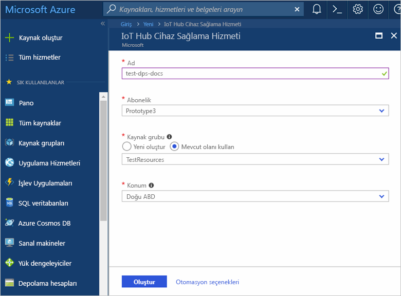
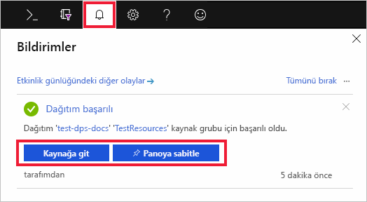
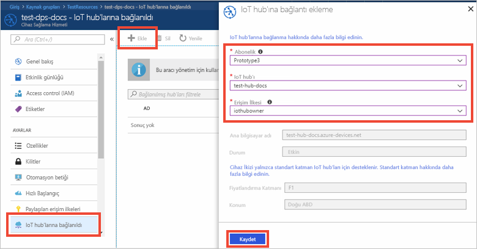

# Azure portalı ile IoT Hub Cihazı Sağlama Hizmetini ayarlama

Bu adımlar, cihazlarınızı sağlamak için Azure bulut kaynaklarını ayarlamayı gösterir. Bu makalede şunlarla ilgili adımlar yer alır: IoT hub'ınızı oluşturma, yeni IoT Hub Cihazı Sağlama Hizmetini oluşturma ve iki hizmeti birbirine bağlama. 

Azure aboneliğiniz yoksa başlamadan önce [ücretsiz bir hesap](https://azure.microsoft.com/free/?WT.mc_id=A261C142F) oluşturun.

## IoT hub oluşturma

[!INCLUDE [iot-hub-include-create-hub](../../includes/iot-hub-include-create-hub.md)]

## IoT Hub’ı cihaz sağlama hizmeti için yeni bir örnek oluşturun

1. Azure portalının sol üst köşesinde bulunan **Kaynak oluştur** düğmesine tıklayın.

2. **Cihaz sağlama hizmeti** için *Mağazada arama yapın*. **IoT Hub Cihazı Sağlama Hizmeti**’ni seçin ve **Oluştur** düğmesine tıklayın. 

3. Yeni Cihaz Sağlama hizmeti örneğiniz için aşağıdaki bilgileri sağlayın ve **Oluştur**'a tıklayın.

    * **Adı:** Yeni cihaz sağlama hizmeti örneği için benzersiz bir ad sağlayın. Girdiğiniz ad kullanılabilir durumdaysa yeşil bir onay işareti görünür.
    * **Abonelik:** Bu cihaz sağlama hizmeti örneği oluşturmak için kullanmak istediğiniz aboneliği seçin.
    * **Kaynak grubu:** Bu alanı, yeni bir kaynak grubu oluşturun veya mevcut bir yeni örneği içeren sağlar. Yukarıda oluşturduğunuz IoT hub'ını içeren kaynak grubunu seçin; örneğin, **TestResources**. İlgili tüm kaynakları aynı gruba birlikte koyarak, bunları birlikte yönetebilirsiniz. Örneğin, kaynak grubunu sildiğinizde o grupta bulunan tüm kaynaklar da silinir. Daha fazla bilgi için [yönetme Azure Resource Manager kaynak grupları](../azure-resource-manager/manage-resource-groups-portal.md).
    * **Konum:** Cihazlarınıza en yakın konumu seçin.

        

4. Kaynak örneğinin oluşturma ilerlemesini izlemek için bildirim düğmesine tıklayın. Hizmet başarıyla dağıtıldıktan sonra **Panoya sabitle**'ye ve **Kaynağa git**'e tıklayın.

    

## IoT hub’ını ve Cihaz Sağlama Hizmetinizi bağlayın

Bu bölümde, Cihaz Sağlama Hizmeti örneğine yapılandırma ekleyeceksiniz. Bu yapılandırma, cihazların sağlanacağı IOT hub'ı ayarlar.

1. Azure portalının sol taraftaki menüsünden **Tüm kaynaklar** düğmesine tıklayın. Önceki bölümde oluşturduğunuz Cihaz Sağlama hizmeti örneğini seçin.  

2. Cihaz Sağlama Hizmeti özet dikey penceresinde, **Bağlantılı IOT hub'ları**’nı seçin. Üstte görünen **+ Ekle** düğmesine tıklayın. 

3. **IoT hub'a bağlantı ekle** sayfasında, yeni Cihaz Sağlama hizmeti örneğinizi IoT hub'a bağlamak için aşağıdaki bilgileri sağlayın. Ardından **Kaydet**'e tıklayın. 

    * **Abonelik:** Yeni cihaz sağlama hizmeti Örneğinize bağlanmak istediğiniz IOT hub'ı içeren aboneliği seçin.
    * **IOT hub:** Yeni cihaz sağlama hizmeti Örneğinize bağlanmak için IOT hub'ı seçin.
    * **Erişim İlkesi:** Seçin **iothubowner** olarak IOT hub ile bağlantı kurmak için kimlik bilgileri.  

        

3. Seçili hub’ı **Bağlantılı IoT hub'ları** dikey penceresinde görürsünüz. **Bağlı IoT hub’larını** görüntülemek için **Yenile**’ye tıklamanız gerekebilir.

## Kaynakları temizleme

Bu koleksiyondaki diğer Hızlı Başlangıçlar, bu Hızlı Başlangıcı temel alır. Sonraki Hızlı Başlangıçlar veya öğreticilerle devam etmeyi planlıyorsanız, bu Hızlı Başlangıçta oluşturulan kaynakları temizlemeyin. Devam etmeyi planlamıyorsanız Azure portalında bu Hızlı Başlangıç ile oluşturulan tüm kaynakları silmek için aşağıdaki adımları kullanın.

1. Azure portalında sol taraftaki menüden **Tüm kaynaklar**’ı ve ardından Cihaz Sağlama hizmetini seçin. **Tüm kaynaklar** dikey pencerenin en üstündeki **Sil** seçeneğine tıklayın.  
2. Azure portalında sol taraftaki menüden **Tüm kaynaklar**’ı ve ardından IoT hub’ınızı seçin. **Tüm kaynaklar** dikey pencerenin en üstündeki **Sil** seçeneğine tıklayın.  

## Sonraki adımlar

Bu hızlı başlangıçta IoT hub'ını ve bir Cihaz Sağlama hizmeti örneği dağıttınız ve iki kaynağı birbirine bağladınız. Bu yöntemi bir sanal cihaz sağlamak üzere kullanmayı öğrenmek için sanal cihaz oluşturma Hızlı Başlangıcına geçin.

> [!div class="nextstepaction"]
> [Sanal cihaz oluşturmak için hızlı başlangıç](./quick-create-simulated-device.md)
