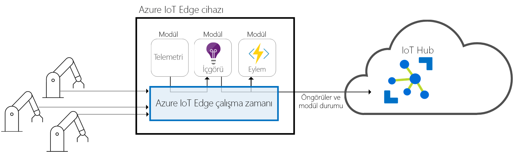
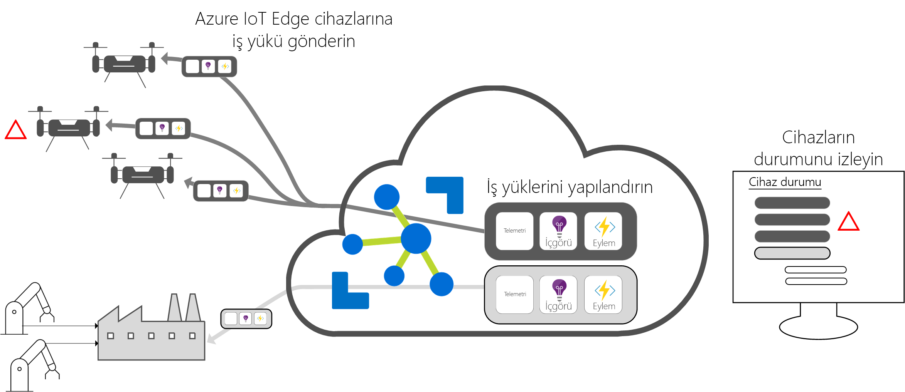

# Azure IoT Edge nedir?

Azure IoT Edge bulut analizini ve özel iş mantığını cihazlara taşıyarak kuruluşunuzun veri yönetimi yerine iş öngörülerine odaklanmasını sağlar. Tüm cihazlarınızda Bu kapsayıcıları dağıtın ve tümünü buluttan izleme iş mantığınızı standart kapsayıcılarına paketleyerek IOT çözümünüzü ölçeklendirin. 

Analizler IoT çözümlerinin iş değerini artırır, aman tüm analizlerin bulutta olması gerekmez. Acil durumlar için mümkün olan en kısa sürede yanıt vermesini istiyorsanız ucuna anomali algılama iş yükleri çalıştırabilirsiniz. Bant genişliği maliyetlerini azaltmak ve terabaytlarca ham veri aktarımını önlemek istiyorsanız, temizleme ve yerel olarak veri toplama ardından yalnızca analiz için buluta öngörüleri gönderin. 

Azure IoT Edge üç bileşenden oluşur:
* **IOT Edge modülleri** Azure Hizmetleri, üçüncü taraf hizmetleri veya kendi kodunuzu çalıştıran kapsayıcılardır. Modüller, IOT Edge cihazlarına dağıtılır ve bu cihazlarda yerel olarak yürütün. 
* **IOT Edge çalışma zamanı** her IOT Edge cihazında çalıştırılır ve her cihaza dağıtılan modülleri yönetir. 
* A **bulut tabanlı bir arabirim** Uzaktan izleme ve IOT Edge cihazları yönetmenize olanak sağlar.

>[!NOTE]
>Azure IoT Edge, IoT Hub’ın ücretsiz ve standart katmanında kullanılabilir. Ücretsiz katman yalnızca test etme ve değerlendirme içindir. Temel ve standart katmanlar hakkında daha fazla bilgi için bkz. [Doğru IoT Hub katmanını seçme](../iot-hub/iot-hub-scaling.md).

## IoT Edge modülleri

IOT Edge modülleri olarak iş mantığınızı uçta çalıştıran Docker uyumlu kapsayıcılar olarak uygulanan yürütme birimleridir. Birbiriyle iletişim kuracak birden çok modül yapılandırabilir ve böylelikle veri işleme için bir işlem hattı oluşturabilirsiniz. Çevrimdışı ve uçta öngörüler sağlayan kendi modüllerinizi geliştirebilir veya bazı Azure hizmetlerini modüller halinde paketleyebilirsiniz. 

### Uç cihazlarında yapay zeka

Azure IOT Edge, şirket içinde yazmadan karmaşık olay işleme, makine öğrenme, resim tanıma ve diğer değerli yapay ZEKA dağıtmanıza olanak tanır. Azure işlevleri, Azure Stream Analytics ve Azure Machine Learning gibi Azure hizmetlerinin tüm şirket içi Azure IOT Edge üzerinden çalıştırılabilir. Ancak Azure Hizmetleri için sınırlı değilsiniz. Herkes AI modülleri oluşturabilir ve bunları topluluğun kullanımına Azure Marketi aracılığıyla sunma. 

### Kendi kodunuzu getirin

Cihazlarınıza kendi kodunuzu dağıtmak istediğinizde, Azure IoT Edge bunu da destekler. Azure IoT Edge, diğer Azure IoT hizmetleriyle alnı programlama modeline sahiptir. Aynı kod hem cihazda hem de bulutta çalıştırılabilir. Azure IoT Edge hem Linux'ı hem de Windows'u desteklediğinden, kendi seçtiğiniz platform için kod yazabilirsiniz. Bu Java, .NET Core 2.0, Node.js, C ve Python destekler, dolayısıyla Geliştiricileriniz zaten bildikleri ve var olan iş mantığındaki kullanan bir dilde kod yazabilirsiniz.

## IoT Edge çalışma zamanı

Azure IoT Edge çalışma zamanı, IoT Edge cihazlarında özel mantığa ve bulut mantığına olanak tanır. IoT Edge cihazında durur; yönetim ve iletişim işlemlerini gerçekleştirir. Çalışma zamanı çeşitli işlevler gerçekleştirir:

* Yükleme ve cihazda iş yüklerini güncelleştirin.
* Cihazda Azure IOT Edge güvenlik standartlarını korur.
* IOT Edge modüllerinin her zaman çalıştığından emin olun.
* Bulutta Uzaktan izleme için modül durumunu rapor.
* Aşağı Akış yaprak cihazlarıyla IOT Edge cihazı arasındaki, bir IOT Edge cihazında modüller arasında ve bulut ile IOT Edge cihazı arasındaki iletişimi yönetin.

Azure IOT Edge cihazı nasıl kullandığınıza size bağlıdır. Çalışma zamanı çoğunlukla yapay ZEKA, toplam ağ geçidinin cihazlarına dağıtmak için kullanılır ve diğer işlem verileri şirket içi cihazlar, ancak bu dağıtımda yalnızca bir seçenektir. 

Azure IoT Edge çalışma zamanı çok geniş bir IoT cihazları kümesinde çalıştırılarak çalışma zamanının çok çeşitli yollarla kullanılabilmesi sağlanır. Bu, hem Linux hem de Windows işletim sistemlerini destekler ve donanım ayrıntılarını çıkarır. Bir cihaz, kadar veri işlenmiyor veya kaynak kullanımı yoğun iş yüklerini çalıştırmak için bir endüstriyel sunucusu kullanmak daha küçük bir Raspberry Pi 3'ten kullanın.

## IoT Edge bulut arabirimi

Bu, genellikle farklı marka ve model IOT cihazları milyonlarca yazılım yaşam döngüsünü yönetmek zor veya coğrafi olarak dağılmış halde olur. İş yükleri oluşturulur ve belirli bir cihaz türü için yapılandırılmış, tüm cihazlarınızı dağıtılan ve hatalı davranan cihazları yakalamak için izlenmesi. Bu cihazlar tek tek cihazlar temelinde yapılamaz, belirli bir ölçekte yapılmalıdır.

Azure IoT Edge, Azure IoT çözüm hızlandırıcıları ile rahatça tümleştirildiğinden, çözümünüzün gereksinimlerini karşılayacak tek bir denetim düzlemi sağlar. Bulut hizmetleri sağlar:

* Belirli bir tür cihaz üzerinde çalıştırılacak bir iş yükü oluşturabilir ve yapılandırılabilir.
* İş yükünü bir dizi cihaza gönderebilir.
* Sahadaki cihazlarda çalıştırılan iş yüklerini izleyebilir.

## Sonraki adımlar

[Bir sanal cihaza IoT Edge dağıtımı yaparak](quickstart.md) bu kavramları deneyin.