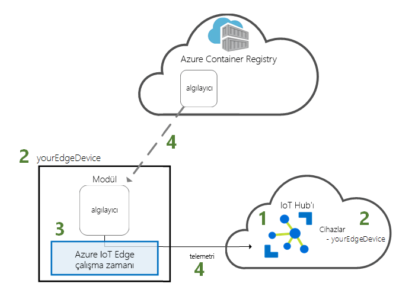
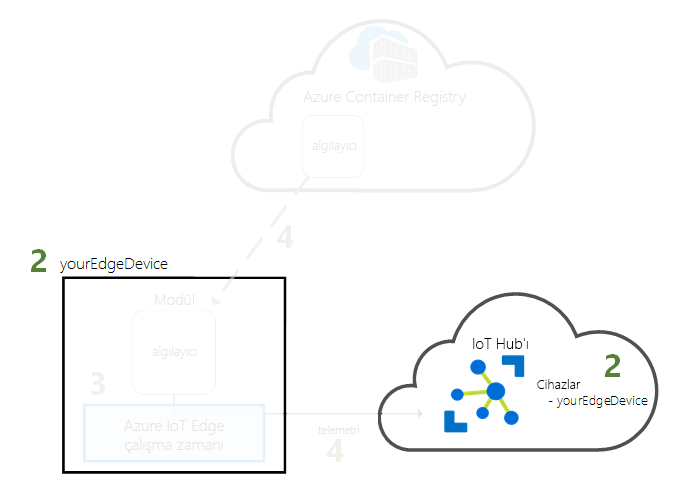
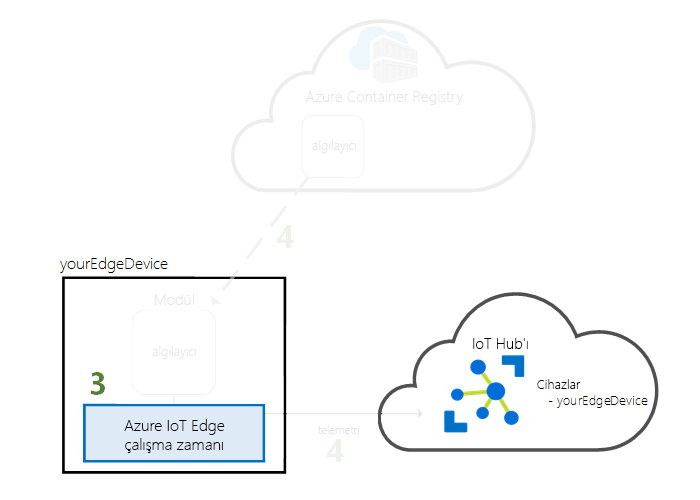
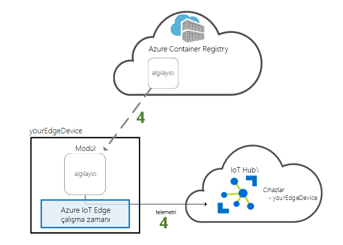

# <a name="quickstart-deploy-your-first-iot-edge-module-to-a-linux-device"></a>Hızlı Başlangıç: Linux cihazına ilk IoT Edge modülünüzü dağıtma

Azure IoT Edge, bulutun gücünü Nesnelerin İnterneti cihazlarınıza taşır. Bu hızlı başlangıçta, önceden derlenmiş kodu uzaktan bir IoT Edge cihazına dağıtmak için bulut arabirimini kullanmayı öğrenin.

Bu hızlı başlangıçta şunları yapmayı öğrenirsiniz:

1. Bir IoT Hub oluşturma.
2. Bir IoT Edge cihazını IoT hub'ınıza kaydetme.
3. IoT Edge çalışma zamanını cihazınıza yükleme ve başlatma.
4. Bir IoT Edge cihazına uzaktan modül dağıtma.



Bu hızlı başlangıçta, IOT Edge cihazı olarak yapılandırılmış bir Azure sanal makine oluşturmada size yol gösterir. Bu işlemin ardından Azure portalından cihazınıza bir modül dağıtabilirsiniz. Bu hızlı başlangıçta oluşturduğunuz modül; sıcaklık, nem ve basınç verileri üreten bir sensör simülasyonudur. Diğer Azure IoT Edge öğreticileri, burada iş içgörüsü için simülasyon verilerini analiz eden modüller dağıtarak yaptığınız çalışmayı temel alır.

Etkin bir Azure aboneliğiniz yoksa başlamadan önce [ücretsiz bir hesap](https://azure.microsoft.com/free) oluşturun.

[!INCLUDE [cloud-shell-try-it.md](../../includes/cloud-shell-try-it.md)]

Bu hızlı başlangıçtaki birçok adımı tamamlamak için Azure CLI kullanacaksınız. Azure IoT de ek işlevleri etkinleştirmek için bir uzantıya sahiptir.

Azure IoT uzantısını cloud shell örneğine ekleyin.

   ```azurecli-interactive
   az extension add --name azure-cli-iot-ext
   ```

## <a name="prerequisites"></a>Önkoşullar

Bulut kaynakları:

* Bu hızlı başlangıçta kullandığınız tüm kaynakları yönetmek için kullanacağınız bir kaynak grubu.

   ```azurecli-interactive
   az group create --name IoTEdgeResources --location westus2
   ```

IoT Edge cihazı:

* IoT Edge cihazınız olacak bir Linux cihazı veya sanal makinesi. Microsoft tarafından sağlanan kullanması gereken [Azure IOT Edge üzerinde Ubuntu'da](https://azuremarketplace.microsoft.com/marketplace/apps/microsoft_iot_edge.iot_edge_vm_ubuntu) IOT Edge bir cihaz üzerinde çalıştırmak için ihtiyacınız olan her şey önceden yükleyen sanal makine. Kullanım koşullarını kabul edin ve aşağıdaki komutları kullanarak bu sanal makine oluşturun:

   ```azurecli-interactive
   az vm image accept-terms --urn microsoft_iot_edge:iot_edge_vm_ubuntu:ubuntu_1604_edgeruntimeonly:latest
   az vm create --resource-group IoTEdgeResources --name EdgeVM --image microsoft_iot_edge:iot_edge_vm_ubuntu:ubuntu_1604_edgeruntimeonly:latest --admin-username azureuser --generate-ssh-keys
   ```

   Bu, oluşturmak ve yeni sanal makineyi başlatmak için birkaç dakika sürebilir.

   Yeni bir sanal makine oluşturduğunuzda, Not **Publicıpaddress**, oluşturma komut çıktısı bir parçası olarak sağlanır. Bu hızlı başlangıcın sonraki bölümlerinde sanal makineye bağlanmak için bu genel IP adresi kullanır.

* Azure IOT Edge çalışma zamanı kendi Cihazınızda çalıştırmak isterseniz, konumundaki yönergeleri [(x64) Linux üzerinde Azure IOT Edge çalışma zamanı yükleme](how-to-install-iot-edge-linux.md) veya [yükleme Azure IOT Edge çalışma zamanı (ARM32v7/armhf) Linux'ta](how-to-install-iot-edge-linux-arm.md).

## <a name="create-an-iot-hub"></a>IoT hub oluşturma

Bu hızlı başlangıçta, Azure CLI ile IOT hub'ı oluşturarak başlayın.


IoT Hub’ın ücretsiz düzeyi bu hızlı başlangıç için kullanılabilir. IoT Hub'ı daha önce kullandıysanız ve oluşturulmuş ücretsiz hub'ınız varsa bu IoT hub'ını kullanabilirsiniz. Her aboneliğin yalnızca bir ücretsiz IoT hub’ı olabilir.

Aşağıdaki kod, **IoTEdgeResources** kaynak grubunda ücretsiz bir **F1** hub’ı oluşturur. *{hub_name}* değerini IoT hub'ınız için benzersiz bir adla değiştirin.

   ```azurecli-interactive
   az iot hub create --resource-group IoTEdgeResources --name {hub_name} --sku F1
   ```

   Aboneliğinizde zaten bir ücretsiz hub olduğu için hata alırsanız, SKU değerini **S1** olarak değiştirin. IOT hub'ı adı kullanılamıyor, bir hata alırsanız, başka birisi zaten bu ada sahip bir hub'ı olduğu anlamına gelir. Yeni bir ad deneyin.

## <a name="register-an-iot-edge-device"></a>IoT Edge cihazı kaydetme

Yeni oluşturulan IoT hub'ına bir IoT Edge cihazı kaydedin.



IOT hub ile iletişim kurabilmesi için IOT Edge cihazınız için bir cihaz kimliği oluşturma. Cihaz kimliği bulutta kalır ve fiziksel cihazla cihaz kimliği arasında bağlantı kurmak için benzersiz bir bağlantı dizesi kullanılır.

IOT Edge cihazları sınıflardır ve tipik bir IOT cihazlarında farklı yönetilebilir olduğundan, bu kimlik ile IOT Edge cihazı için bildirmek `--edge-enabled` bayrağı.

1. Azure Cloud Shell'de aşağıdaki komutu girerek hub'ınızda **myEdgeDevice** adlı bir cihaz oluşturun.

   ```azurecli-interactive
   az iot hub device-identity create --hub-name {hub_name} --device-id myEdgeDevice --edge-enabled
   ```

   İlke anahtarları iothubowner hakkında bir hata alırsanız, cloud shell azure CLI IOT ext uzantısı'nın en son sürümünü çalıştırdığından emin olun.

2. Fiziksel cihazınızla IoT Hub'daki kimliği arasında bağlantı oluşturan cihaz bağlantı dizesini alın.

   ```azurecli-interactive
   az iot hub device-identity show-connection-string --device-id myEdgeDevice --hub-name {hub_name}
   ```

3. Değerini kopyalayın `connectionString` JSON çıktısını anahtar ve kaydedin. Cihaz bağlantı dizesi değeridir. Sonraki bölümde IOT Edge çalışma zamanı yapılandırmak için bu bağlantı dizesi kullanırsınız.

   

## <a name="configure-your-iot-edge-device"></a>IOT Edge Cihazınızı yapılandırma

Azure IOT Edge çalışma zamanı, IOT Edge cihazı başlatın.



IoT Edge çalışma zamanı tüm IoT Edge cihazlarına dağıtılır. Üç bileşeni vardır. **IOT Edge güvenlik arka plan programı** her zaman bir IOT Edge cihazı önyüklenir ve cihazın IOT Edge Aracısı'nı başlatarak bootstraps başlatır. **IoT Edge aracısı**, IoT Edge hub'ı dahil olmak üzere IoT Edge cihazındaki modüllerin dağıtımını ve izlenmesini kolaylaştırır. **IoT Edge hub'ı** IoT Edge cihazındaki modüller ve cihaz ile IoT Hub'ı arasındaki iletişimi yönetir.

Çalışma zamanı yapılandırması sırasında cihaz bağlantı dizesi sağlamanız gerekir. Azure CLI'den aldığınız dizeyi kullanın. Bu dize, fiziksel cihazınızı Azure'daki IoT Edge cihaz kimliğiyle ilişkilendirir.

### <a name="set-the-connection-string-on-the-iot-edge-device"></a>IOT Edge cihazında bağlantı dizesini Ayarla

Önkoşullarda açıklandığı Ubuntu sanal makinesi üzerinde Azure IOT Edge kullanıyorsanız, cihazınız zaten yüklü olan bir IOT Edge çalışma zamanı sahiptir. Önceki bölümde aldığınız cihaz bağlantı dizesiyle Cihazınızı yapılandırmak yeterlidir. Bunu uzaktan sanal makineye bağlanmak zorunda kalmadan yapabilirsiniz. Aşağıdaki komutu çalıştırın değiştirerek **{device_connection_string}** kendi dize ile.

   ```azurecli-interactive
   az vm run-command invoke -g IoTEdgeResources -n EdgeVM --command-id RunShellScript --script "/etc/iotedge/configedge.sh '{device_connection_string}'"
   ```

IOT Edge yerel makinenize veya ARM32 cihaz üzerinde çalıştırıyorsanız, IOT Edge çalışma zamanı ve ön cihazınıza yüklemeniz gerekir. Bölümündeki yönergeleri [(x64) Linux üzerinde Azure IOT Edge çalışma zamanı yükleme](how-to-install-iot-edge-linux.md) veya [yükleme Azure IOT Edge çalışma zamanı (ARM32v7/armhf) Linux'ta](how-to-install-iot-edge-linux-arm.md), ardından bu hızlı başlangıçta geri dönün.

### <a name="view-the-iot-edge-runtime-status"></a>IoT Edge çalışma zamanı durumunu görüntüleme

Komutlar bu hızlı başlangıçtaki kalan geçtiğine IOT Edge Cihazınızda kendisi, cihazda neler olduğunu görebilirsiniz. Bir sanal makine kullanıyorsanız, artık çıktı oluşturma komutu, genel IP adresini kullanarak bu makineye bağlanın. Genel IP adresini sanal makinenizin genel bakış sayfasında Azure Portalı'nda da bulabilirsiniz. Sanal makinenize bağlanmak için aşağıdaki komutu kullanın. Değiştirin **{azureuser}** önkoşullarda önerilen olandan farklı bir kullanıcı adı kullandıysanız. Değiştirin **{Publicıpaddress}** makinenizin adresine sahip.

   ```azurecli-interactive
   ssh azureuser@{publicIpAddress}
   ```

Çalışma zamanı başarıyla yüklenmiş ve IOT Edge Cihazınızda yapılandırılmış olduğunu doğrulayın.

>[!TIP]
>`iotedge` komutlarını çalıştırmak için yükseltilmiş ayrıcalıklara ihtiyacınız olacaktır. Makinenizdeki oturumu kapattıktan sonra IoT Edge çalışma zamanını yükleyip oturum açtığınızda izinleriniz otomatik olarak güncelleştirilir. O zamana kadar komutların önüne **sudo** eklemenize gerekir.

1. IOT Edge güvenlik arka plan programı sistem hizmeti olarak çalışıp çalışmadığını denetleyin.

   ```bash
   sudo systemctl status iotedge
   ```

   

2. Hizmetle ilgili sorunları gidermeniz gerekirse hizmet günlüklerini alın.

   ```bash
   journalctl -u iotedge
   ```

3. Cihazınızda çalışan modülleri görüntüleyin.

   ```bash
   sudo iotedge list
   ```

   

IoT Edge cihazınız yapılandırıldı. Bulutta dağıtılan modülleri çalıştırmak için hazır.

## <a name="deploy-a-module"></a>Modül dağıtma

Azure IoT Edge cihazınızı, IoT Hub'ına telemetri verileri gönderecek bir modül dağıtmak için buluttan yönetin.


[!INCLUDE [iot-edge-deploy-module](../../includes/iot-edge-deploy-module.md)]

## <a name="view-generated-data"></a>Oluşturulan verileri görüntüleme

Bu hızlı başlangıçta, yeni bir IoT Edge cihazı oluşturdunuz ve üzerine IoT Edge çalışma zamanını yüklediniz. Ardından, Azure portalı, cihazı için değişiklik yapmak zorunda kalmadan cihazda çalıştırılacak bir IOT Edge modülü dağıtmak için kullanılır.

Bu durumda, test etmek için kullanabileceğiniz örnek veriler gönderdiğiniz modülü oluşturur. Sanal sıcaklık algılayıcısı modülü, daha sonra test etmek için kullanabileceğiniz ortam verilerini oluşturur. Benzetimli algılayıcı hem bir makine hem de ortama makine geçici izler. Örneğin, bu algılayıcı sunucu odasına bir Fabrika katı veya bir Rüzgar türbini olabilir. Ortam sıcaklığı ve nem, makine sıcaklığı ve basıncı ve zaman damgasını ileti içerir. Test verileri analiz için olarak bu modülü tarafından oluşturulan verileri IOT Edge öğreticileri kullanın.

IOT Edge Cihazınızda bir komut istemi yeniden açın veya Azure CLI SSH bağlantısından kullanın. Buluttan dağıtılan modülün IoT Edge cihazınızda çalıştığından emin olun:

   ```bash
   sudo iotedge list
   ```

   

Sıcaklık algılayıcısı modülünden gönderilmekte olan iletileri görüntüleyin:

   ```bash
   sudo iotedge logs SimulatedTemperatureSensor -f
   ```

   >[!TIP]
   >Modül adlarını söz konusu olduğunda, IOT Edge komutları büyük küçük harfe duyarlıdır.

   

Kullanarak IOT hub'ınıza gelen iletileri izlemek isterseniz [Visual Studio Code için Azure IOT hub'ı Toolkit uzantısını](https://marketplace.visualstudio.com/items?itemName=vsciot-vscode.azure-iot-toolkit) (eski adıyla Azure IOT Toolkit uzantısını).

## <a name="clean-up-resources"></a>Kaynakları temizleme

IoT Edge öğreticilerine devam etmek istiyorsanız bu hızlı başlangıçta kaydettiğiniz ve ayarladığınız cihazı kullanabilirsiniz. Aksi takdirde, ücret ödememek için oluşturduğunuz Azure kaynaklarını silebilirsiniz.

Sanal makinenizi ve IoT hub’ınızı yeni bir kaynak grubunda oluşturduysanız, bu grubu ve ilişkili tüm kaynaklarını silebilirsiniz. Çifte denetim var. emin olmak için kaynak grubunun içeriğini kullanıcının tutmak istediğiniz bir şey. Tüm bir grubu silmek istemiyorsanız, bunun yerine bu kaynakları tek tek silebilirsiniz.

**IoTEdgeResources** grubunu kaldırın.

```azurecli-interactive
az group delete --name IoTEdgeResources
```

## <a name="next-steps"></a>Sonraki adımlar


Bu hızlı başlangıçta, bir IOT Edge cihazı oluşturdunuz ve Azure IOT Edge bulut arabirimi cihaza kodu dağıtmak için kullanılır. Artık ortamı hakkında ham veri üreten bir test cihazınız var.

Sonraki adım, IOT Edge çalıştıran iş mantığınızı modüllerinizi oluştururken başlayabilmeniz için yerel geliştirme ortamınızı ayarlama sağlamaktır. 

> [!div class="nextstepaction"]
> [IOT Edge modülleri Linux cihazlar için geliştirmeye başlayın](tutorial-develop-for-linux.md)
