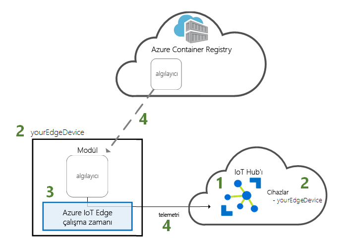
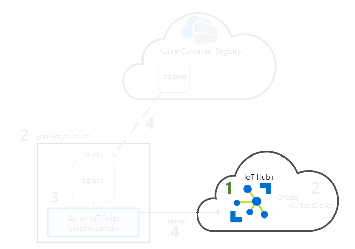
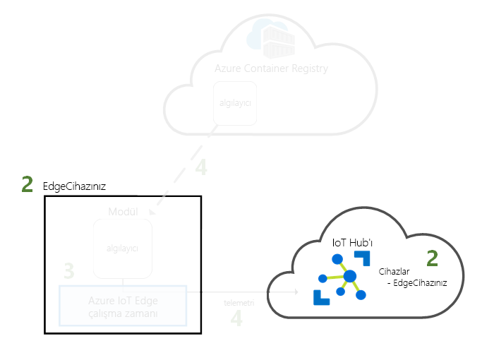
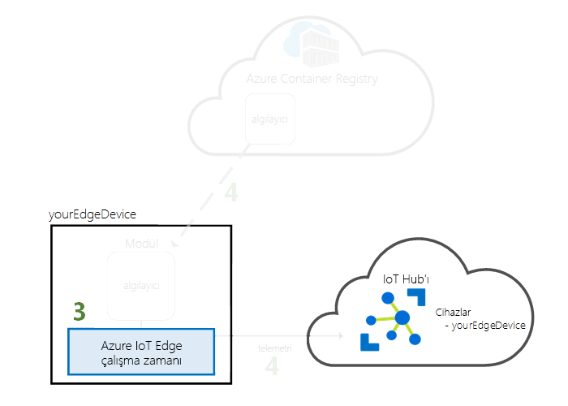
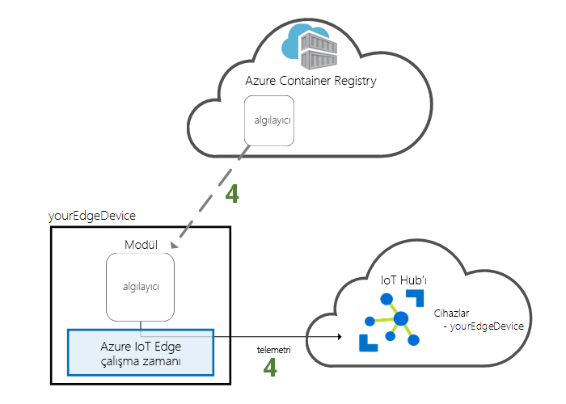

# <a name="quickstart-deploy-your-first-iot-edge-module-from-the-azure-portal-to-a-windows-device---preview"></a>Hızlı Başlangıç: İlk IOT Edge modülü Azure portalından bir Windows cihazına dağıtma - Önizleme

Bu hızlı başlangıçta, önceden derlenmiş kodu uzaktan bir IoT Edge cihazına dağıtmak için Azure IoT Edge bulut arabirimini kullanın. Bu görevi gerçekleştirmek için ilk olarak bir IoT Edge cihazının benzetimi için Windows cihazınızı kullanın; daha sonra buna bir modül dağıtabilirsiniz.

Bu hızlı başlangıçta şunları yapmayı öğrenirsiniz:

1. Bir IoT Hub oluşturma.
2. Bir IoT Edge cihazını IoT hub'ınıza kaydetme.
3. IoT Edge çalışma zamanını cihazınıza yükleme ve başlatma.
4. IoT Edge cihazına uzaktan modül dağıtma ve IoT Hub'a telemetri verileri gönderme.



Bu hızlı başlangıçta oluşturduğunuz modül; sıcaklık, nem ve basınç verileri üreten bir sensör simülasyonudur. Diğer Azure IoT Edge öğreticileri, burada iş içgörüsü için simülasyon verilerini analiz eden modüller dağıtarak yaptığınız çalışmayı temel alır.

>[!NOTE]
>Windows üzerinde IoT Edge çalışma zamanı [genel önizleme](https://azure.microsoft.com/support/legal/preview-supplemental-terms/) sürümündedir.

Etkin bir Azure aboneliğiniz yoksa başlamadan önce [ücretsiz bir hesap](https://azure.microsoft.com/free) oluşturun.

[!INCLUDE [cloud-shell-try-it.md](../../includes/cloud-shell-try-it.md)]

Bu hızlı başlangıçtaki birçok adımı tamamlamak için Azure CLI kullanacaksınız. Azure IoT de ek işlevleri etkinleştirmek için bir uzantıya sahiptir.

Azure IoT uzantısını cloud shell örneğine ekleyin.

   ```azurecli-interactive
   az extension add --name azure-cli-iot-ext
   ```

## <a name="prerequisites"></a>Önkoşullar

Bulut kaynakları:

* Bu hızlı başlangıçta kullandığınız tüm kaynakları yönetmek için kullanacağınız bir kaynak grubu.

   ```azurecli-interactive
   az group create --name IoTEdgeResources --location westus
   ```

IoT Edge cihazı:

* IoT Edge cihazınız olacak bir Windows bilgisayar veya sanal makine. Desteklenen bir Windows sürümünü kullanın:
  * Windows 10 veya IOT Core ile Ekim 2018 Güncelleştirmesi (derleme 17763)
  * Windows Server 2019
* Cihazınızı kapsayıcıları barındırabilmesi sanallaştırmasını etkinleştir
   * Bir Windows bilgisayar etkinleştirilmişse, kapsayıcı özelliğini etkinleştirin. Başlat çubuğuna gidin **kapatma Windows özelliklerini aç veya Kapat** ve yanındaki kutuyu işaretleyin **kapsayıcıları**.
   * Bir sanal makineyse etkinleştirme [iç içe sanallaştırma](https://docs.microsoft.com/virtualization/hyper-v-on-windows/user-guide/nested-virtualization) ve en az 2 GB bellek ayrılamadı.

## <a name="create-an-iot-hub"></a>IoT hub oluşturma

Bu hızlı başlangıçta, Azure CLI ile IOT hub'ı oluşturarak başlayın.



IoT Hub’ın ücretsiz düzeyi bu hızlı başlangıç için kullanılabilir. IoT Hub'ı daha önce kullandıysanız ve oluşturulmuş ücretsiz hub'ınız varsa bu IoT hub'ını kullanabilirsiniz. Her aboneliğin yalnızca bir ücretsiz IoT hub’ı olabilir.

Aşağıdaki kod, **IoTEdgeResources** kaynak grubunda ücretsiz bir **F1** hub’ı oluşturur. *{hub_name}* değerini IoT hub'ınız için benzersiz bir adla değiştirin.

   ```azurecli-interactive
   az iot hub create --resource-group IoTEdgeResources --name {hub_name} --sku F1
   ```

   Aboneliğinizde zaten bir ücretsiz hub olduğu için hata alırsanız, SKU değerini **S1** olarak değiştirin. IOT hub'ı adı kullanılamıyor, bir hata alırsanız, başka birisi zaten bu ada sahip bir hub'ı olduğu anlamına gelir. Yeni bir ad deneyin. 

## <a name="register-an-iot-edge-device"></a>IoT Edge cihazı kaydetme

Yeni oluşturulan IoT Hub'ına bir IoT Edge cihazı kaydedin.


IoT hub'ınızla iletişim kurabilmesi amacıyla simülasyon cihazınız için bir cihaz kimliği oluşturun. Cihaz kimliği bulutta kalır ve fiziksel cihazla cihaz kimliği arasında bağlantı kurmak için benzersiz bir bağlantı dizesi kullanılır.

IOT Edge cihazları sınıflardır ve tipik bir IOT cihazlarında farklı yönetilebilir olduğundan, bu kimlik ile IOT Edge cihazı için bildirmek `--edge-enabled` bayrağı. 

1. Azure Cloud Shell'de aşağıdaki komutu girerek hub'ınızda **myEdgeDevice** adlı bir cihaz oluşturun.

   ```azurecli-interactive
   az iot hub device-identity create --device-id myEdgeDevice --hub-name {hub_name} --edge-enabled
   ```

   İlke anahtarları iothubowner hakkında bir hata alırsanız, cloud shell azure CLI IOT ext uzantısı'nın en son sürümünü çalıştırdığından emin olun. 

2. Fiziksel cihazınızla IoT Hub'daki kimliği arasında bağlantı oluşturan cihaz bağlantı dizesini alın.

   ```azurecli-interactive
   az iot hub device-identity show-connection-string --device-id myEdgeDevice --hub-name {hub_name}
   ```

3. Değerini kopyalayın `cs` JSON çıktısını anahtar ve kaydedin. Cihaz bağlantı dizesi değeridir. Sonraki bölümde IOT Edge çalışma zamanı yapılandırmak için bu bağlantı dizesi kullanırsınız.

   

## <a name="install-and-start-the-iot-edge-runtime"></a>IoT Edge çalışma zamanını yükleme ve başlatma

Azure IoT Edge çalışma zamanını IoT Edge cihazınıza yükleyin ve cihaz bağlantı dizesiyle yapılandırın.


IoT Edge çalışma zamanı tüm IoT Edge cihazlarına dağıtılır. Üç bileşeni vardır. **IOT Edge güvenlik arka plan programı** her zaman bir IOT Edge cihazı önyüklenir ve cihazın IOT Edge Aracısı'nı başlatarak bootstraps başlatır. **IOT Edge Aracısı** dağıtım ve modülleri IOT Edge hub'ı dahil olmak üzere IOT Edge cihazı izlemeyi yönetir. **IOT Edge hub'ı** IOT Edge cihazı bulunan modüller arasındaki ve IOT Hub ve cihaz arasındaki iletişimleri işler.

Yükleme betiği, IOT Edge Cihazınızda kapsayıcı görüntülerini yönetir Moby adlı bir kapsayıcı altyapısı da içerir. 

Çalışma zamanı yüklemesi sırasında cihaz bağlantı dizesi istenir. Azure CLI'den aldığınız dizeyi kullanın. Bu dize, fiziksel cihazınızı Azure'daki IoT Edge cihaz kimliğiyle ilişkilendirir.

Bu bölümdeki yönergeler, Windows kapsayıcıları ile IOT Edge çalışma zamanı yapılandırın. Linux kapsayıcıları kullanmak istiyorsanız, bkz. [Windows yükleme Azure IOT Edge çalışma zamanına](how-to-install-iot-edge-windows-with-linux.md) bu Önkoşullar ve yükleme adımları için.

### <a name="connect-to-your-iot-edge-device"></a>IOT Edge Cihazınızı bağlama

Tüm bu bölümdeki adımlarda, IOT Edge Cihazınızda gerçekleşir. Bir sanal makine ya da ikincil donanım kullanıyorsanız, bu makineye artık SSH veya Uzak Masaüstü aracılığıyla bağlanmak istediğiniz. IOT Edge cihazı olarak kendi makine kullanıyorsanız, sonraki bölüme devam edebilirsiniz. 

### <a name="download-and-install-the-iot-edge-service"></a>IoT Edge hizmetini indirme ve yükleme

PowerShell'i kullanarak IoT Edge çalışma zamanını indirin ve yükleyin. Cihazınızı yapılandırmak için IoT Hub'dan aldığınız cihaz bağlantı dizesini kullanın.

1. IoT Edge cihazınızda PowerShell'i yönetici olarak çalıştırın.

2. IoT Edge hizmetini cihazınıza indirin ve yükleyin.

   ```powershell
   . {Invoke-WebRequest -useb aka.ms/iotedge-win} | Invoke-Expression; `
   Install-SecurityDaemon -Manual -ContainerOs Windows
   ```

3. **DeviceConnectionString** istendiğinde önceki bölümde kopyaladığınız dizeyi iletin. Bağlantı dizesinin etrafındaki tırnak işaretlerini dahil etmeyin.

### <a name="view-the-iot-edge-runtime-status"></a>IoT Edge çalışma zamanı durumunu görüntüleme

Çalışma zamanının başarıyla yüklendiğinden ve yapılandırıldığından emin olun.

1. IoT Edge hizmetinin durumunu kontrol edin.

   ```powershell
   Get-Service iotedge
   ```

2. Hizmetle ilgili sorunları gidermeniz gerekirse hizmet günlüklerini alın.

   ```powershell
   # Displays logs from today, newest at the bottom.

   Get-WinEvent -ea SilentlyContinue `
    -FilterHashtable @{ProviderName= "iotedged";
      LogName = "application"; StartTime = [datetime]::Today} |
    select TimeCreated, Message |
    sort-object @{Expression="TimeCreated";Descending=$false} |
    format-table -autosize -wrap
   ```

3. IoT Edge cihazınızda çalışan tüm modülleri görüntüleyin. Hizmet ilk kez başlatıldığı için yalnızca **edgeAgent** modülünün çalıştığını göreceksiniz. edgeAgent modülü varsayılan olarak çalışır ve cihazınıza dağıtmak istediğiniz ek modülleri yüklemenize ve başlatmanıza yardımcı olur.

   ```powershell
   iotedge list
   ```

   

Özellikle sınırlı kapasite veya internet erişimi olan bir cihaz kullanıyorsanız, yüklemenin tamamlanması için ve başlatmak için IOT Edge Aracısı modülü birkaç dakika sürebilir. 

IoT Edge cihazınız yapılandırıldı. Bulutta dağıtılan modülleri çalıştırmak için hazır.

## <a name="deploy-a-module"></a>Modül dağıtma

Azure IOT Edge Cihazınızı IOT Hub'ına telemetri verileri gönderen bir modül dağıtmak için buluttan yönetin.


[!INCLUDE [iot-edge-deploy-module](../../includes/iot-edge-deploy-module.md)]

## <a name="view-generated-data"></a>Oluşturulan verileri görüntüleme

Bu hızlı başlangıçta, bir IOT Edge cihazı kayıtlı ve IOT Edge çalışma zamanı yüklü. Ardından, Azure portalı, cihazı için değişiklik yapmak zorunda kalmadan cihazda çalıştırılacak bir IOT Edge modülü dağıtmak için kullanılır. 

Bu durumda, test etmek için kullanabileceğiniz örnek veriler gönderdiğiniz modülü oluşturur. Sanal sıcaklık algılayıcısı modülü, daha sonra test etmek için kullanabileceğiniz ortam verilerini oluşturur. Benzetimli algılayıcı hem bir makine hem de ortama makine geçici izler. Örneğin, bu algılayıcı sunucu odasına bir Fabrika katı veya bir Rüzgar türbini olabilir. Ortam sıcaklığı ve nem, makine sıcaklığı ve basıncı ve zaman damgasını ileti içerir. Test verileri analiz için olarak bu modülü tarafından oluşturulan verileri IOT Edge öğreticileri kullanın.

Buluttan dağıtılan modülün IoT Edge cihazınızda çalıştığından emin olun.

```powershell
iotedge list
```

   

Sıcaklık algılayıcısı modülünden buluta gönderilen iletileri görüntüleyin.

```powershell
iotedge logs SimulatedTemperatureSensor -f
```

   >[!TIP]
   >Modül adlarını söz konusu olduğunda, IOT Edge komutları büyük küçük harfe duyarlıdır.

   

Kullanarak IOT hub'ınıza gelen iletileri izlemek isterseniz [Visual Studio Code için Azure IOT hub'ı Toolkit uzantısını](https://marketplace.visualstudio.com/items?itemName=vsciot-vscode.azure-iot-toolkit) (eski adıyla Azure IOT Toolkit uzantısını). 


## <a name="clean-up-resources"></a>Kaynakları temizleme

IoT Edge öğreticilerine devam etmek istiyorsanız bu hızlı başlangıçta kaydettiğiniz ve ayarladığınız cihazı kullanabilirsiniz. Aksi halde, oluşturduğunuz Azure kaynaklarını silebilir ve IoT Edge çalışma zamanını cihazınızdan kaldırabilirsiniz.

### <a name="delete-azure-resources"></a>Azure kaynaklarını silme

Sanal makinenizi ve IoT hub’ınızı yeni bir kaynak grubunda oluşturduysanız, bu grubu ve ilişkili tüm kaynaklarını silebilirsiniz. Çifte denetim var. emin olmak için kaynak grubunun içeriğini kullanıcının tutmak istediğiniz bir şey. Tüm bir grubu silmek istemiyorsanız, bunun yerine bu kaynakları tek tek silebilirsiniz.

**IoTEdgeResources** grubunu kaldırın.

   ```azurecli-interactive
   az group delete --name IoTEdgeResources
   ```

### <a name="remove-the-iot-edge-runtime"></a>IoT Edge çalışma zamanını kaldırma

Cihazınızdaki yüklemeleri kaldırmak istiyorsanız aşağıdaki komutları kullanın.  

IoT Edge çalışma zamanını kaldırın. IOT Edge yeniden yüklenmesine planlıyorsanız dışlamayı `-DeleteConfig` ve `-DeleteMobyDataRoot` parametreleri böylece yeni ayarladığınız aynı yapılandırmaya sahip yeniden yükleyebilirsiniz.

   ```powershell
   . {Invoke-WebRequest -useb aka.ms/iotedge-win} | Invoke-Expression; `
   Uninstall-SecurityDaemon -DeleteConfig -DeleteMobyDataRoot
   ```

## <a name="next-steps"></a>Sonraki adımlar

Bu hızlı başlangıçta, bir IOT Edge cihazı oluşturdunuz ve Azure IOT Edge bulut arabirimi cihaza kodu dağıtmak için kullanılır. Artık ortamı hakkında ham veri üreten bir test cihazınız var.

Azure IoT Edge'in bu verileri Edge'de iş içgörüsüne dönüştürmenize nasıl yardımcı olabileceğini öğrenmek için diğer öğreticilere devam etmeye hazırsınız.

> [!div class="nextstepaction"]
> [Bir Azure İşlevi kullanarak sensör verilerini filtreleme](tutorial-deploy-function.md)
