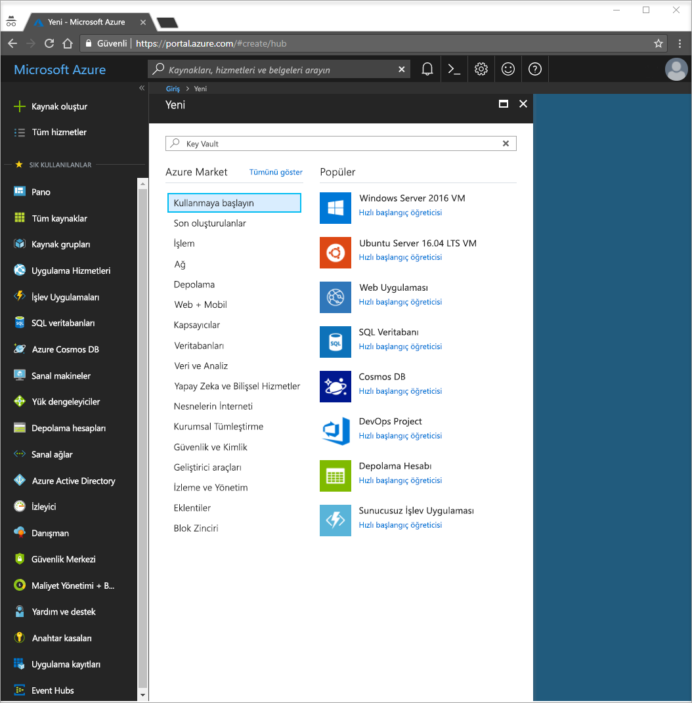
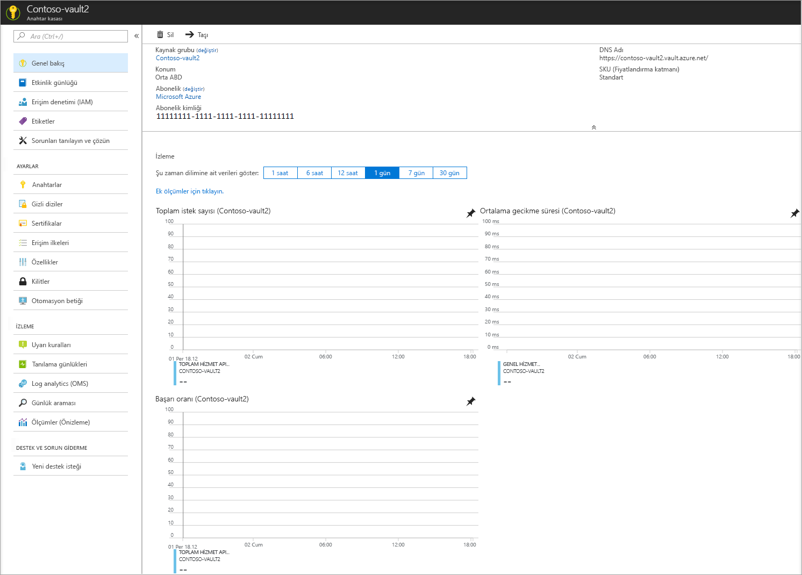
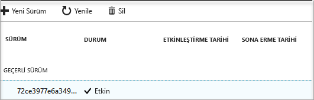

# Hızlı başlangıç: Azure portalını kullanarak Key Vault oluşturma

Azure Key Vault, güvenli bir gizli dizi deposu olarak çalışan bir bulut hizmetidir. Anahtarları, parolaları, sertifikaları ve diğer parolaları güvenli bir şekilde depolayabilirsiniz. Key Vault hakkında daha fazla bilgi için [Genel Bakış](key-vault-overview.md) bölümünü inceleyebilirsiniz. Azure anahtar kasaları Azure portalı aracılığıyla oluşturulup yönetilebilir. Bu hızlı başlangıçta bir anahtar kasası oluşturacaksınız. Bu işlemi tamamladıktan sonra bir gizli dizli depolayacaksınız.

Azure aboneliğiniz yoksa başlamadan önce [ücretsiz bir hesap](https://azure.microsoft.com/free/?WT.mc_id=A261C142F) oluşturun.

## Azure'da oturum açın

http://portal.azure.com adresinden Azure portalında oturum açın.

## Kasa oluşturma

1. Azure portalının sol üst köşesinde bulunan **Kaynak oluştur** seçeneğini belirleyin

    
2. Arama kutusuna **Key Vault** yazın.
3. Sonuç listesinden **Key Vault**’u seçin.
4. Key Vault bölümünde **Oluştur**’u seçin.
5. **Anahtar kasası oluşturma** bölümünde aşağıdaki bilgileri sağlayın:
    - **Ad**: Bu hızlı başlangıç için **Contoso-vault2** kullanılır. Testinizde benzersiz bir ad sağlamanız gerekir.
    - **Abonelik**: Bu hızlı başlangıç için kullanacağınız aboneliği seçin.
    - **Kaynak Grubu** altında **Yeni oluştur**’u seçin ve bir kaynak grubu adı girin.
    - **Konum** açılır menüsünden bir konum seçin.
    - **Panoya sabitle** onay kutusunu işaretleyin.
    - Diğer seçenekleri varsayılan değerlerinde bırakın.
6. Yukarıdaki bilgileri girdikten sonra **Oluştur**’u seçin.

Aşağıda listelenen iki özelliği not edin:

* **Kasa Adı**: Örnekte bu değer **Contoso-Vault2** şeklindedir. Bu adı diğer adımlar için kullanacaksınız.
* **Kasa URI’si**: Örnekte bu: https://contoso-vault2.vault.azure.net/. REST API'si aracılığıyla kasanızı kullanan uygulamaların bu URI'yi kullanması gerekir.

Bu noktada Azure hesabınız, bu yeni anahtar kasasında herhangi bir işlemi gerçekleştirmeye yetkili olan tek hesaptır.

## Key Vault’a gizli dizi ekleme

Kasaya bir gizli dizi eklemek için birkaç ek adım uygulamanız gerekir. Bu örnekte, bir uygulama tarafından kullanılabilecek bir parola ekleyeceğiz. Parola **ExamplePassword** şeklindedir ve içinde **Pa$$w0rd** değeri depolanır.

1. Key Vault özellikleri sayfasında **Gizli Diziler**’i seçin.
2. **Oluştur/İçeri Aktar**’a tıklayın.
3. **Gizli dizi oluşturma** ekranında aşağıdaki seçimleri yapın:
    - **Karşıya yükleme seçenekleri**: El ile.
    - **Ad**: ExamplePassword.
    - **Değer**: Pa$$w0rd.
    - Diğer değerleri varsayılan değerlerinde bırakın. **Oluştur**’a tıklayın.

Gizli dizinin başarıyla oluşturulduğunu belirten iletiyi aldıktan sonra listede gizli diziye tıklayabilirsiniz. Ondan sonra bazı özellikleri görebilirsiniz. Geçerli sürüme tıklarsanız önceki adımda belirtilen değeri görebilirsiniz.

## Kaynakları temizleme

Diğer Key Vault hızlı başlangıçları ve öğreticileri bu hızlı başlangıcı temel alır. Sonraki hızlı başlangıç ve öğreticilerle çalışmaya devam etmeyi planlıyorsanız, bu kaynakları yerinde bırakmanız yararlı olabilir.
Artık gerek kalmadığında kaynak grubunu silin. Bunu yaptığınızda Key Vault ve ilgili kaynaklar silinir. Kaynak grubunu portal aracılığıyla silmek için:

1. Portalın üst kısmındaki Arama kutusuna kaynak grubunuzun adını girin. Bu Hızlı Başlangıçta kullanılan kaynak grubunu arama sonuçlarında gördüğünüzde seçin.
2. **Kaynak grubunu sil**'i seçin.
3. **KAYNAK GRUBU ADINI YAZIN:** kutusuna kaynak grubunun adını yazın ve **Sil**’i seçin.

## Sonraki adımlar

Bu hızlı başlangıçta bir Key Vault oluşturdunuz ve bir gizli dizi depoladınız. Key Vault ve bunu uygulamalarınızla nasıl kullanabileceğiniz hakkında daha fazla bilgi almak için, Key Vault ile birlikte çalışan web uygulamalarına yönelik öğreticiye geçin.

> [!div class="nextstepaction"]
> Yönetilen hizmet kimlikleri kullanan bir web uygulamasındaki Key Vault’tan bir gizli diziyi okuma hakkında bilgi almak için aşağıdaki [Bir Azure web uygulamasını Key Vault’tan gizli dizi okuyacak şekilde yapılandırma](tutorial-web-application-keyvault.md) öğreticisine geçin.
