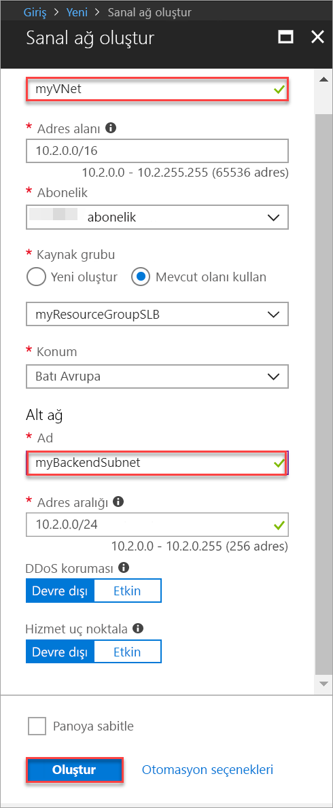
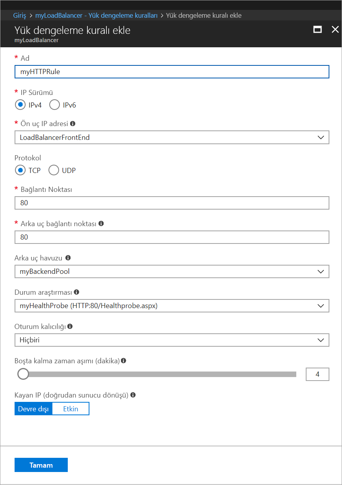
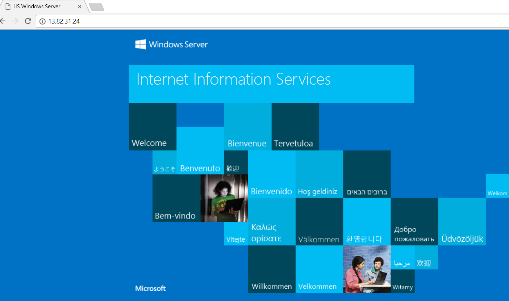

# Hızlı Başlangıç: Azure portalını kullanarak sanal makinelerde yük dengelemesi için Standart Yük Dengeleyici oluşturma

Yük dengeleme, gelen istekleri birden fazla sanal makineye yayarak daha yüksek bir kullanılabilirlik ve ölçek düzeyi sağlar. Sanal makinelerin (VM) yük dengelemesini yapmak amacıyla yük dengeleyici oluşturmak için Azure portalını kullanabilirsiniz. Bu hızlı başlangıçta Standart Yük Dengeleyici kullanılarak sanal makinelerde yük dengelemesi yapacağınız gösterilir.

Azure aboneliğiniz yoksa başlamadan önce [ücretsiz bir hesap](https://azure.microsoft.com/free/?WT.mc_id=A261C142F) oluşturun. 

## Azure'da oturum açma

[http://portal.azure.com](http://portal.azure.com) adresinden Azure portalında oturum açın.

## Genel yük dengeleyici oluşturma

Bu bölümde, sanal makinelerde yük dengelemesine yardımcı olan bir genel yük dengeleyici oluşturursunuz. Standart Yük Dengeleyici yalnızca Standart Genel IP adresini destekler. Standart Yük Dengeleyici oluşturduğunuzda, Standart Yük Dengeleyici için ön uç (varsayılan olarak *LoadBalancerFrontend* adını alır) olarak yapılandırılmış yeni bir Standart Genel IP adresi de oluşturmanız gerekir. 

1. Ekranın sol üst kısmında **Kaynak oluştur** > **Ağ** > **Yük Dengeleyici**'ye tıklayın.
2. **Yük dengeleyici oluşturma** sayfasında aşağıdaki bilgileri girin veya seçin, kalan ayarlar için varsayılan değerleri kabul edin ve sonra **Oluştur**'u seçin:

    | Ayar                 | Değer                                              |
    | ---                     | ---                                                |
    | Ad                   | *myLoadBalancer*                                   |
    | Tür          | Genel                                        |
    | SKU           | Standart                          |
    | Genel IP adresi | **Yeni oluştur**'u seçip metin kutusuna *myPublicIP* yazın. Genel IP adresi için Standart SKU varsayılan olarak seçilir. **Kullanılabilirlik bölgesi** olarak **Alanlar arası yedekli**’yi seçin. |
    | Abonelik               | Aboneliğinizi seçin.    |
    |Kaynak grubu | **Yeni oluştur**'u seçip *myResourceGroupSLB* yazın.    |
    | Konum           | **Batı Avrupa**'yı seçin.                          |
    

## Arka uç sunucular oluşturma

Bu bölümde, bir sanal ağ oluşturur, yük dengeleyicinizin arka uç havuzu için iki sanal makine oluşturur ve sonra yük dengeleyicinin test edilmesi için sanal makinelere IIS yüklersiniz.

### Sanal ağ oluşturma
1. Ekranın sol üst kısmında **Yeni** > **Ağ** > **Sanal ağ**'e tıklayın ve sanal ağ için şu değerleri girin:
    - Sanal ağ adı için *myVnet*.
    - Mevcut kaynak grubunun adı için *myResourceGroupSLB*
    - Alt ağ adı için *myBackendSubnet*.
2. Sanal ağı oluşturmak için **Oluştur**’a tıklayın.

    

### Sanal makineler oluşturma

1. Ekranın sol üst kısmında **Yeni** > **İşlem** > **Windows Server 2016 Datacenter**'a tıklayın ve sanal makine için şu değerleri girin:
    - Sanal makinenin adı için *myVM1*.        
    - *myResourceGroupSLB* - **Kaynak grubu** için **Var olanı kullan**’ı seçin ve sonra *myResourceGroupSLB* öğesini seçin.
2. **Tamam** düğmesine tıklayın.
3. Sanal makinenin boyutu için **DS1_V2** seçeneğini belirleyin ve **Seç**’e tıklayın.
4. Sanal makine ayarları için şu değerleri girin:
    1. Sanal ağ için *myVNet*, alt ağ için de *myBackendSubnet* değerinin seçildiğinden emin olun.
    2. **Ortak IP adresi** için **Ortak IP adresi oluştur** bölmesinde **Standart** seçeneğini ve ardından **Tamam**'ı seçin.
    3. **Ağ Güvenlik Grubu** bölümünde **Gelişmiş**'i seçip şu işlemleri gerçekleştirin:
        1. *Ağ güvenlik grubu (güvenlik duvarı) seçimini yapın ve **Ağ güvenlik grubu seç** sayfasında **Yeni oluştur**'u seçin. 
        2. **Ağ güvenlik grubu oluştur** sayfasının **Ad** bölümüne *myNetworkSecurityGroup* yazın ve **Tamam**'ı seçin.
5. Önyükleme tanılamalarını devre dışı bırakmak için **Devre Dışı** seçeneğine tıklayın.
6. **Tamam**’a tıklayın, özet sayfasındaki ayarları gözden geçirin ve sonra **Oluştur**’a tıklayın.
7. 1-6 arası adımları kullanarak, Kullanılabilirlik kümesi *myAvailabilityset*, sanal ağ *myVnet*, alt ağ *myBackendSubnet* ve ağ güvenlik grubu *myNetworkSecurityGroup* olarak ayarlanmış şekilde *VM2* adlı ikinci bir sanal makine oluşturun. 

### NSG kuralı oluşturma

Bu bölümde, HTTP kullanarak gelen bağlantılara izin vermek için bir NSG kuralı oluşturacaksınız.

1. Sol menüden **Tüm kaynaklar**’a tıklayın ve kaynak listesinden, **myResourceGroupSLB** kaynak grubunda bulunan **myNetworkSecurityGroup** öğesine tıklayın.
2. **Ayarlar**’ın altında **Gelen güvenlik kuralları**’na ve sonra **Ekle**’ye tıklayın.
3. 80 numaralı bağlantı noktasını kullanarak gelen HTTP bağlantılarına izin vermek için *myHTTPRule* adlı gelen güvenlik kuralı için şu değerleri girin:
    - **Kaynak** için *Hizmet Etiketi*.
    - **Kaynak hizmet etiketi** için *İnternet*
    - **Hedef bağlantı noktası aralıkları** için *80*
    - **Protokol** için *TCP*
    - **Eylem** için *İzin Ver*
    - **Öncelik** için *100*
    - Ad için *myHTTPRule*
    - Açıklama için *HTTP’ye İzin Ver*
4. **Tamam** düğmesine tıklayın.
 
### IIS yükleme

1. Sol menüden **Tüm kaynaklar**’a tıklayın ve kaynak listesinden, *myResourceGroupLB* kaynak grubunda bulunan **myVM1** öğesine tıklayın.
2. Sanal makineye yönelik RDP için **Genel Bakış** sayfasında **Bağlan**’a tıklayın.
3. *azureuser* kullanıcı adıyla sanal makinede oturum açın.
4. Sunucu masaüstünde **Windows Yönetimsel Araçları**>**Sunucu Yöneticisi** bölümüne gidin.
5. Sunucu Yöneticisi'nde **ve özellik ekle**’ye tıklayın.
6. **Rol ve Özellik Ekleme Sihirbazı** bölümünde aşağıdaki değerleri kullanın:
    - **Yükleme türünü seçin** sayfasında **Rol tabanlı veya özellik tabanlı yükleme** seçeneğine tıklayın.
    - **Hedef sunucuyu seç** sayfasında **myVM1** seçeneğine tıklayın
    - **Sunucu rolü seçin** sayfasında **Web Sunucusu (IIS)** seçeneğine tıklayın
    - Sihirbazın geri kalanını tamamlamak için yönergeleri izleyin 
7. *myVM2* sanal makinesi için 1-6 arası adımları yineleyin.

## Yük dengeleyici kaynakları oluşturma

Bu bölümde, arka uç adres havuzu ve durum araştırması için yük dengeleyici ayarlarını yapılandıracak ve bir yük dengeleyici kuralı belirteceksiniz.

### Arka uç adres havuzu oluşturma

Trafiği VM’lere dağıtmak için, bir arka uç adres havuzunda yük dengeleyiciye bağlı sanal NIC’lerin IP adresleri barındırılır. *VM1* ve *VM2*'yi eklemek için *myBackendPool* adlı arka uç adres havuzunu oluşturun.

1. Sol taraftaki menüden **Tüm kaynaklar**’a tıklayın ve sonra kaynak listesinden **myLoadBalancer** seçeneğine tıklayın.
2. **Ayarlar** bölümünde **Arka uç havuzları**’na ve sonra **Ekle**’ye tıklayın.
3. **Arka uç havuzu ekle** sayfasında aşağıdakileri yapın:
   - Ad için, arka uç havuzunuzun adı olarak *myBackendPool* yazın.
   - **Sanal ağ** olarak *myVNet* girişini seçin.
   - **Sanal Makine** bölümüne *myVM1* ve *my VM2* ipe IP adreslerini girin ve **Ekle**'yi seçin.
    - **Tamam** düğmesine tıklayın.

3. Yük dengeleyici arka uç havuzu ayarınızın hem **VM1** hem de **VM2** sanal makinelerini görüntülediğinden emin olun.

### Durum araştırması oluşturma

Yük dengeleyicinin uygulamanızın durumunu izlemesine izin vermek için durum araştırması kullanabilirsiniz. Durum yoklaması, durum denetimlerine verdikleri yanıtlara göre VM’leri dinamik olarak yük dengeleyici rotasyonuna ekler ve kaldırır. Sanal makinelerin durumunu izlemek için *myHealthProbe* durum araştırması oluşturun.

1. Sol taraftaki menüden **Tüm kaynaklar**’a tıklayın ve sonra kaynak listesinden **myLoadBalancer** seçeneğine tıklayın.
2. **Ayarlar** bölümünde **Durum araştırmaları**’na ve sonra **Ekle**’ye tıklayın.
3. Durum araştırması oluşturmak için şu değerleri kullanın:
    - Durum araştırmasının adı için *myHealthProbe*.
    - Protokol türü için **HTTP**.
    - Bağlantı noktası numarası için *80*.
    - *Healthprobe.aspx* - URI yolu. Bu değeri başka bir URI ile değiştirin veya varsayılan yol değerini tutmak **"\\"** varsayılan URI.
    - Araştırma denemeleri arasındaki saniye cinsinden **Aralık** için *15*.
    - Bir sanal makinenin sağlıksız olduğu kanısına varılmadan önce gerçekleşmesi gereken ardışık araştırma hatası veya **Sağlıksız eşik** sayısı için *2*.
4. **Tamam** düğmesine tıklayın.

   

### Yük dengeleyici kuralı oluşturma

Trafiğin VM’lere dağıtımını tanımlamak için bir yük dengeleyici kuralı kullanılır. Gerekli kaynak ve hedef bağlantı noktalarının yanı sıra gelen trafik için ön uç IP yapılandırması ve trafiği almak için arka uç IP havuzu tanımlamanız gerekir. *FrontendLoadBalancer* ön uç havuzunda 80 numaralı bağlantı noktasını dinlemek ve yine 80 numaralı bağlantı noktasını kullanarak *myBackEndPool* arka uç adres havuzuna yük dengelemesi yapılmış ağ trafiğini göndermek için *myLoadBalancerRuleWeb* yük dengeleyici kuralını oluşturun. 

1. Sol taraftaki menüden **Tüm kaynaklar**’a tıklayın ve sonra kaynak listesinden **myLoadBalancer** seçeneğine tıklayın.
2. **Ayarlar** bölümünde **Yük dengeleme kuralları**’na ve sonra **Ekle**’ye tıklayın.
3. Yük dengeleme kuralını yapılandırmak için şu değerleri kullanın:
    - Yük dengeleme kuralının adı için *myHTTPRule*.
    - Protokol türü için **TCP**.
    - Bağlantı noktası numarası için *80*.
    - Arka uç bağlantı noktası için *80*.
    - Arka uç havuzunun adı için *myBackendPool*.
    - Durum araştırmasının adı için *myHealthProbe*.
4. **Tamam** düğmesine tıklayın.
    
    

## Yük dengeleyiciyi test etme
1. **Genel Bakış** ekranında Yük Dengeleyici için genel IP adresini bulun. **Tüm kaynaklar**’a ve sonra **myPublicIP** seçeneğine tıklayın.

2. Genel IP adresini kopyalayıp tarayıcınızın adres çubuğuna yapıştırın. IIS Web sunucusunun varsayılan sayfası, tarayıcıda görüntülenir.

      

## Kaynakları temizleme

Artık gerekli olmadığında kaynak grubunu, yük dengeleyiciyi ve tüm ilgili kaynakları silin. Bunu yapmak için, yük dengeleyiciyi içeren kaynak grubunu seçin ve **Sil**’e tıklayın.

## Sonraki adımlar

Bu hızlı başlangıçta, bir Standart Yük Dengeleyici oluşturdunuz, buna sanal makineler eklediniz, yük dengeleyici trafik kuralını ve durum araştırmasını yapılandırdınız ve yük dengeleyiciyi test ettiniz. Azure Load Balancer hakkında daha fazla bilgi almak için Azure Load Balancer öğreticilerine geçin.

> [!div class="nextstepaction"]
> [Azure Load Balancer öğreticileri](tutorial-load-balancer-standard-public-zone-redundant-portal.md)
