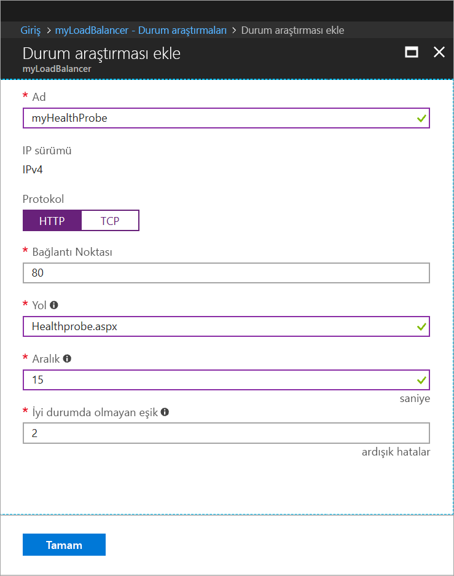

# <a name="tutorial-load-balance-internet-traffic-to-vms-using-the-azure-portal"></a>Öğretici: Azure portalını kullanarak sanal makineleri internet trafiği Yük Dengelemesi

Yük dengeleme, gelen istekleri birden fazla sanal makineye yayarak daha yüksek bir kullanılabilirlik ve ölçek düzeyi sağlar. Bu öğreticide, internet trafiği vm'lere dağıtmak ve yüksek kullanılabilirlik sağlayan farklı bileşenleri Azure Standard Load Balancer hakkında bilgi edinin. Aşağıdakileri nasıl yapacağınızı öğrenirsiniz:


> [!div class="checklist"]
> * Azure yük dengeleyici oluşturma
> * Sanal makineler oluşturma ve IIS sunucusunu yükleme
> * Yük dengeleyici kaynakları oluşturma
> * Çalışan yük dengeleyiciyi görüntüleme
> * VM’leri yük dengeleyiciye ekleme ve kaldırma

Azure aboneliğiniz yoksa başlamadan önce [ücretsiz bir hesap](https://azure.microsoft.com/free/?WT.mc_id=A261C142F) oluşturun. 

## <a name="sign-in-to-the-azure-portal"></a>Azure portalında oturum açın

[http://portal.azure.com](http://portal.azure.com) adresinden Azure portalında oturum açın.

## <a name="create-a-standard-load-balancer"></a>Standart Yük Dengeleyici oluşturma

Bu bölümde, sanal makinelerde yük dengelemesine yardımcı olan bir genel yük dengeleyici oluşturursunuz. Standart Yük Dengeleyici yalnızca Standart Genel IP adresini destekler. Standard Load Balancer oluşturduğunuzda, Standard Load Balancer için ön uç (varsayılan olarak *LoadBalancerFrontend* adını alır) olarak yapılandırılmış yeni bir Standart Genel IP adresi de oluşturmanız gerekir. 

1. Ekranın sol üst kısmında **Kaynak oluştur** > **Ağ** > **Yük Dengeleyici**'ye tıklayın.
2. **Yük dengeleyici oluşturma** sayfasında aşağıdaki bilgileri girin veya seçin, kalan ayarlar için varsayılan değerleri kabul edin ve sonra **Oluştur**'u seçin:
    
    | Ayar                 | Değer                                              |
    | ---                     | ---                                                |
    | Ad                   | *myLoadBalancer*                                   |
    | Type          | Genel                                        |
    | SKU           | Standart                          |
    | Genel IP adresi | **Yeni oluştur**'u seçip metin kutusuna *myPublicIP* yazın. Genel IP adresi için Standart SKU varsayılan olarak seçilir. **Kullanılabilirlik bölgesi** olarak **Alanlar arası yedekli**’yi seçin. |
    | Abonelik               | Aboneliğinizi seçin.    |
    |Kaynak grubu | **Yeni oluştur**'u seçip *myResourceGroupSLB* yazın.    |
    | Konum           | **Batı Avrupa**'yı seçin.                          |
    


   
## <a name="create-backend-servers"></a>Arka uç sunucular oluşturma

Bu bölümde, bir sanal ağ oluşturur, yük dengeleyicinizin arka uç havuzu için üç sanal makine oluşturur ve sonra yük dengeleyicinin test edilmesi için sanal makinelere IIS yüklersiniz.

### <a name="create-a-virtual-network"></a>Sanal ağ oluşturma
1. Azure portalın sol üst kısmında **Kaynak oluştur** > **Ağ** > **Sanal ağ**'ı seçin ve sanal ağ için şu değerleri girin:
    |Ayar|Değer|
    |---|---|
    |Ad|*myVNet* yazın.|
    |Abonelik| Aboneliğinizi seçin.|
    |Kaynak grubu| **Var olanı kullan**’ı seçin ve sonra *myResourceGroupSLB* öğesini seçin.|
    |Alt ağ adı| *myBackendSubnet* yazın.|
    
2. Sanal ağı oluşturmak için **Oluştur**’a tıklayın.

### <a name="create-virtual-machines"></a>Sanal makineler oluşturma

1. Azure portalın sol üst kısmında **Kaynak oluştur** > **İşlem** > **Windows Server 2016 Datacenter**'ı seçin ve sanal makine için şu değerleri girin:
    1. Sanal makinenin adı olarak *myVM1* yazın.        
    2. **Kaynak grubu** bölümünde, **Var olanı kullan**’ı seçin ve sonra *myResourceGroupSLB* seçeneğini belirleyin.
2. **Tamam** düğmesine tıklayın.
3. Sanal makinenin boyutu için **DS1_V2** seçeneğini belirleyin ve **Seç**’e tıklayın.
4. Sanal makine ayarları için şu değerleri girin:
    1. Sanal ağ için *myVNet*, alt ağ için de *myBackendSubnet* değerinin seçildiğinden emin olun.
    2. **Ortak IP adresi** için **Ortak IP adresi oluştur** bölmesinde **Standart** seçeneğini ve ardından **Tamam**'ı seçin.
    3. **Ağ Güvenlik Grubu** bölümünde **Gelişmiş**'i seçip şu işlemleri gerçekleştirin:
        1. *Ağ güvenlik grubu (güvenlik duvarı) seçimini yapın ve **Ağ güvenlik grubu seç** sayfasında **Yeni oluştur**'u seçin. 
        2. **Ağ güvenlik grubu seç** sayfasında **Ad** alanına yeni güvenlik grubunun adı olarak *myNetworkSecurityGroup* girin ve **Tamam**'ı seçin.
5. Önyükleme tanılamalarını devre dışı bırakmak için **Devre Dışı** seçeneğine tıklayın.
6. **Tamam**’a tıklayın, özet sayfasındaki ayarları gözden geçirin ve sonra **Oluştur**’a tıklayın.
7. 1-6 arası adımları kullanarak, sanal ağı *myVnet*, alt ağı *myBackendSubnet* ve ağ güvenlik grubu *myNetworkSecurityGroup* olarak ayarlanmış şekilde *VM2* ve *VM3* adlı iki sanal makine daha oluşturun. 

### <a name="create-network-security-group-rule"></a>Ağ güvenlik grubu kuralı oluşturma

Bu bölümde, HTTP kullanarak gelen bağlantılara izin vermek için bir NSG kuralı oluşturacaksınız.

1. Sol menüden **Tüm kaynaklar**’a tıklayın ve kaynak listesinden, **myResourceGroupSLB** kaynak grubunda bulunan **myNetworkSecurityGroup** öğesine tıklayın.
2. **Ayarlar**’ın altında **Gelen güvenlik kuralları**’na ve sonra **Ekle**’ye tıklayın.
3. 80 numaralı bağlantı noktasını kullanarak gelen HTTP bağlantılarına izin vermek için *myHTTPRule* adlı gelen güvenlik kuralı için şu değerleri girin:
    - **Kaynak** için *Hizmet Etiketi*.
    - **Kaynak hizmet etiketi** için *İnternet*
    - **Hedef bağlantı noktası aralıkları** için *80*
    - **Protokol** için *TCP*
    - **Eylem** için *İzin Ver*
    - **Öncelik** için *100*
    - Ad için *myHTTPRule*
    - Açıklama için *HTTP’ye İzin Ver*
4. **Add (Ekle)** seçeneğini belirleyin.

### <a name="install-iis-on-vms"></a>VM’lere IIS yükleme

1. Sol menüden **Tüm kaynaklar**’a tıklayın ve kaynak listesinden, *myResourceGroupSLB* kaynak grubunda bulunan **myVM1** öğesine tıklayın.
2. Sanal makineye yönelik RDP için **Genel Bakış** sayfasında **Bağlan**’a tıklayın.
3. **Sanal makineye bağlanın** açılır penceresinde **RDP Dosyasını İndir**'i seçin ve indirilen RDP dosyasını açın.
4. **Uzak Masaüstü Bağlantısı** penceresinde **Bağlan**'a tıklayın.
5. VM oluşturma işlemleri sırasında belirlediğiniz kimlik bilgilerini kullanarak VM'de oturum açın. *myVM1* adlı sanal makinede uzak masaüstü oturumu başlatılır.
6. Sunucu masaüstünde **Windows Yönetimsel Araçları**>**Windows PowerShell** bölümüne gidin.
7. PowerShell Penceresinde aşağıdaki komutları çalıştırarak IIS sunucusunu yükleyin, varsayılan iisstart.htm dosyasını kaldırın ve ardından VM’nin adını gösteren yeni bir iisstart.htm dosyasını ekleyin:

   ```azurepowershell-interactive
    
    # install IIS server role
    Install-WindowsFeature -name Web-Server -IncludeManagementTools
    
    # remove default htm file
     remove-item  C:\inetpub\wwwroot\iisstart.htm
    
    # Add a new htm file that displays server name
     Add-Content -Path "C:\inetpub\wwwroot\iisstart.htm" -Value $("Hello World from " + $env:computername)
   ```
6. *myVM1* ile RDP oturumunu kapatın.
7. IIS’yi ve *myVM2* ve *myVM3*’teki güncelleştirilmiş iisstart.htm dosyasını yüklemek için 1 ile 6 arasındaki adımları tekrarlayın.

## <a name="create-load-balancer-resources"></a>Yük dengeleyici kaynakları oluşturma

Bu bölümde, arka uç adres havuzu ve durum araştırması için yük dengeleyici ayarlarını yapılandıracak ve bir yük dengeleyici kuralı belirteceksiniz.

### <a name="create-a-backend-address-pool"></a>Arka uç adres havuzu oluşturma

Trafiği VM’lere dağıtmak için, bir arka uç adres havuzunda yük dengeleyiciye bağlı sanal NIC’lerin IP adresleri barındırılır. *VM1* ve *VM2* öğesini eklemek için *myBackendPool* adlı arka uç adres havuzunu oluşturun.

1. Sol menüden **Tüm kaynaklar**’a tıklayın ve sonra kaynak listesinden **myLoadBalancer** seçeneğine tıklayın.
2. **Ayarlar** bölümünde **Arka uç havuzları**’na ve sonra **Ekle**’ye tıklayın.
3. **Arka uç havuzu ekle** sayfasında aşağıdakileri yapın:
   - Ad için, arka uç havuzunuzun adı olarak *myBackendPool* yazın.
   - **Sanal ağ** olarak *myVNet* girişini seçin.
   - **Sanal Makine** bölümüne *myVM1*, *myVM2* ve *my VM3* ile IP adreslerini girin ve **Ekle**'yi seçin.
4. Yük dengeleyici arka uç havuzu ayarınızın *myVM1*, *myVM2* ve *myVM3* VM'lerini gösterdiğinden emin olun ve **Tamam**'a tıklayın.

### <a name="create-a-health-probe"></a>Durum araştırması oluşturma

Yük dengeleyicinin uygulamanızın durumunu izlemesine izin vermek için durum araştırması kullanabilirsiniz. Durum yoklaması, durum denetimlerine verdikleri yanıtlara göre VM’leri dinamik olarak yük dengeleyici rotasyonuna ekler ve kaldırır. Sanal makinelerin durumunu izlemek için *myHealthProbe* durum araştırması oluşturun.

1. Sol taraftaki menüden **Tüm kaynaklar**’a tıklayın ve sonra kaynak listesinden **myLoadBalancer** seçeneğine tıklayın.
2. **Ayarlar** bölümünde **Durum araştırmaları**’na ve sonra **Ekle**’ye tıklayın.
3. Durum araştırması oluşturmak için şu değerleri kullanın:
    - Durum araştırmasının adı için *myHealthProbe*.
    - Protokol türü için **HTTP**.
    - Bağlantı noktası numarası için *80*.
    - Araştırma denemeleri arasındaki saniye cinsinden **Aralık** için *15*.
    - Bir sanal makinenin sağlıksız olduğu kanısına varılmadan önce gerçekleşmesi gereken ardışık araştırma hatası veya **Sağlıksız eşik** sayısı için *2*.
4. **Tamam** düğmesine tıklayın.

   

### <a name="create-a-load-balancer-rule"></a>Yük dengeleyici kuralı oluşturma

Trafiğin VM’lere dağıtımını tanımlamak için bir yük dengeleyici kuralı kullanılır. Gerekli kaynak ve hedef bağlantı noktalarının yanı sıra gelen trafik için ön uç IP yapılandırması ve trafiği almak için arka uç IP havuzu tanımlamanız gerekir. *FrontendLoadBalancer* ön uç havuzunda 80 numaralı bağlantı noktasını dinlemek ve yine 80 numaralı bağlantı noktasını kullanarak *myBackEndPool* arka uç adres havuzuna yük dengelemesi yapılmış ağ trafiğini göndermek için *myLoadBalancerRuleWeb* yük dengeleyici kuralını oluşturun. 

1. Sol taraftaki menüden **Tüm kaynaklar**’a tıklayın ve sonra kaynak listesinden **myLoadBalancer** seçeneğine tıklayın.
2. **Ayarlar** bölümünde **Yük dengeleme kuralları**’na ve sonra **Ekle**’ye tıklayın.
3. Yük dengeleme kuralını yapılandırmak için şu değerleri kullanın:
    - Yük dengeleme kuralının adı için *myHTTPRule*.
    - Protokol türü için **TCP**.
    - Bağlantı noktası numarası için *80*.
    - Arka uç bağlantı noktası için *80*.
    - Arka uç havuzunun adı için *myBackendPool*.
    - Durum araştırmasının adı için *myHealthProbe*.
4. **Tamam** düğmesine tıklayın.

## <a name="test-the-load-balancer"></a>Yük dengeleyiciyi test etme
1. **Genel Bakış** ekranında Yük Dengeleyici için genel IP adresini bulun. **Tüm kaynaklar**’a ve sonra **myPublicIP** seçeneğine tıklayın.

2. Genel IP adresini kopyalayıp tarayıcınızın adres çubuğuna yapıştırın. IIS Web sunucusunun varsayılan sayfası, tarayıcıda görüntülenir.

      

Yük dengeleyicinin trafiği, uygulamanızı çalıştıran üç VM’ye dağıtmasını görmek için web tarayıcınızı yenilemeye zorlayabilirsiniz.

## <a name="remove-or-add-vms-from-the-backend-pool"></a>Arka uç havuzunda VM'leri kaldırma veya ekleme
Uygulamanızı çalıştıran VM’lerde işletim sistemi güncelleştirmelerini yükleme gibi bakım işlemleri gerçekleştirmeniz gerekebilir. Uygulamanıza gelen trafiği fazla trafiği yönetmek için ek VM’lere ihtiyaç duyabilirsiniz. Bu bölümde VM’yi yük dengeleyiciden nasıl kaldırabileceğiniz veya ekleyebileceğiniz gösterilmektedir.

1. Sol taraftaki menüden **Tüm kaynaklar**’a tıklayın ve sonra kaynak listesinden **myLoadBalancer** seçeneğine tıklayın.
2. **Ayarlar**'ın altında **Arka uç havuzları**'na tıklayın, ardından arka uç havuzunun listesinde **myBackendPool**'a tıklayın.
3. **myBackendPool** sayfasındaki **Hedef ağ IP yapılandırmaları**'nın altında, arka uçtan *VM1*'i kaldırmak için **Sanal makine:myVM1**'in yanındaki sil simgesine tıklayın

Artık *myVM1* arka uç adres havuzunda yer almadığından, *myVM1* üzerinde yazılım güncelleştirmelerini yükleme gibi tüm bakım görevlerini gerçekleştirebilirsiniz. Şimdi *VM1** sanal makinesinin eksikliğinde, yük *myVM2* ile *myVM3* arasında dengelenir. 

*myVM1*'i arka uç havuzuna yeniden eklemek için, bu makalenin *Arka uç havuzuna VM ekleme* bölümündeki yordamı izleyin.

## <a name="clean-up-resources"></a>Kaynakları temizleme

Artık ihtiyaç duyulmadıklarında kaynak grubunu, yük dengeleyiciyi ve ilgili tüm kaynakları silin. Bunu yapmak için, yük dengeleyiciyi içeren kaynak grubunu seçin ve **Sil**’e tıklayın.

## <a name="next-steps"></a>Sonraki adımlar

Bu öğreticide bir Standart Yük Dengeleyici oluşturdunuz, buna sanal makineler eklediniz, yük dengeleyici trafik kuralını ve durum araştırmasını yapılandırdınız ve yük dengeleyiciyi test ettiniz. Ayrıca, yük dengeli kümeden bir VM kaldırdınız ve VM'yi arka uç adres havuzuna geri eklediniz. Azure Load Balancer hakkında daha fazla bilgi almak için Azure Load Balancer öğreticisine devam edin.

> [!div class="nextstepaction"]
> [Azure Load Balancer öğreticileri](tutorial-load-balancer-standard-public-zone-redundant-portal.md)
