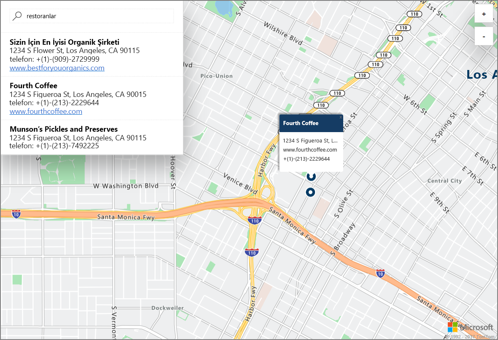

# Azure Konum Tabanlı Hizmetler (önizleme) kullanarak bir demo etkileşimli harita araması başlatma

Bu makalede, etkileşimli bir arama gerçekleştirmek için Azure Konum Tabanlı Hizmetler’in (LBS) özellikleri gösterilmektedir. Ayrıca kedi LBS hesabınızı oluşturma ve demo web uygulamasında kullanmak üzere hesap anahtarınızı alma adımları gösterilmektedir. 

Azure aboneliğiniz yoksa başlamadan önce [ücretsiz bir hesap](https://azure.microsoft.com/free/?WT.mc_id=A261C142F) oluşturun.

## Azure portalında oturum açma

[Azure Portal](https://portal.azure.com/)’da oturum açın.

## Bir Konum Tabanlı Hizmetler hesabı oluşturup hesap anahtarını alma

1. [Azure portalının](https://portal.azure.com) sol üst köşesinde bulunan **Kaynak oluştur** öğesine tıklayın.
2. *Market’te Ara* kutusunda, **konum tabanlı hizmetler** yazın.
3. *Sonuçlar* sayfasından, **Konum Tabanlı Hizmetler (önizleme)** seçeneğine tıklayın. Haritanın altında görüntülenen **Oluştur** düğmesine tıklayın. 
4. **Konum Tabanlı Hizmetler Hesabı Oluştur** sayfasında, yeni hesabınız için bir *Ad* girin, kullanılacak *Abonelik*’i seçin ve yeni veya mevcut bir *Kaynak grubu*’nun adını girin. Kaynak grubunuzun konumunu seçin, *Önizleme Koşulları*’nı kabul edin ve **Oluştur**’a tıklayın.

    

5. Hesabınız başarıyla oluşturulduğunda, hesabı açıp **AYARLAR**’a gidin. Azure Konum Tabanlı Hizmetler hesabının birincil ve ikincil anahtarlarını almak için **Anahtarlar**’a tıklayın. **Birincil Anahtar** değerini sonraki bölümde kullanmak üzere yerel panonuza kopyalayın. 

## Demo uygulamayı indirme

1. [interactiveSearch.html](https://github.com/Azure-Samples/location-based-services-samples/blob/master/src/interactiveSearch.html) dosyasının içeriklerini indirin veya kopyalayın.
2. Bu dosyanın içeriklerini **AzureMapDemo.html** olarak yerel olarak kaydedin ve bir metin düzenleyicide açın.
3. `<insert-key>` dizesini arayın ve önceki bölümde aldığınız **Birincil Anahtar** değeriyle değiştirin. 

## Demo uygulamayı başlatma

1. **AzureMapDemo.html** dosyasını istediğiniz bir tarayıcıda açın.
2. Gösterilen Los Angeles haritasına bakın. Şehir, *AzureMapDemo.html* içinde **center** adlı JavaScript değişkenine verilen `[longitude, latitude]` çiftinin değeri tarafından belirlenir. Bu koordinatları istediğiniz herhangi bir şehrin koordinatlarıyla değiştirebilirsiniz. Örneğin, New York City’nin koordinatları *[-74.0060, 40.7128]*’dir.
3. Demo web uygulamasının sol üst köşesindeki arama kutusunda, aramak istediğiniz herhangi bir konum türü veya adresini girin. 
4. Farenizi arama kutusunun altında görünen adrs/konum listesinin üzerine getirdiğinizde haritalarda ilgili raptiye açılarak bu konum hakkında bilgileri görüntüler. Örneğin, bu uygulamanın örnek bir başlatması ve *restoranlar* için arama yapılması aşağıdaki şekilde sonuçlanır. Gerçek işletmelerin gizliliğini korumak için kurgusal ad ve adreslerin kullanıldığına dikkat edin. 

    

## Kaynakları temizleme

Öğreticilerde hesabınız için Azure Konum Tabanlı Hizmetler’i kullanma ve yapılandırma ayrıntılı olarak açıklanmaktadır. Öğreticilerle çalışmaya devam etmeyi planlıyorsanız, bu Hızlı Başlangıçta oluşturulan kaynakları temizlemeyin. Devam etmeyi planlamıyorsanız, bu hızlı başlangıç ile oluşturulan tüm kaynakları silmek için aşağıdaki adımları kullanın:

1. **AzureMapDemo.html** web uygulamasını çalıştıran tarayıcıyı kapatın.
2. Azure portalında sol taraftaki menüden **Tüm kaynaklar**’ı ve ardından LBS hesabınızı seçin. **Tüm kaynaklar** dikey pencerenin en üstündeki **Sil** seçeneğine tıklayın.

## Sonraki adımlar

Bu Hızlı Başlangıç’ta Azure LBS hesabınızı oluşturdunuz ve hesabınızı kullanarak bir demo uygulaması başlattınız. Azure Konum Tabanlı Hizmetler API’lerini kullanarak kendi uygulamanızı oluşturmayı öğrenmek için, sıradaki öğretici ile devam edin.

> [!div class="nextstepaction"]
> [Azure Map ve Search öğreticisi](./tutorial-search-location.md)
