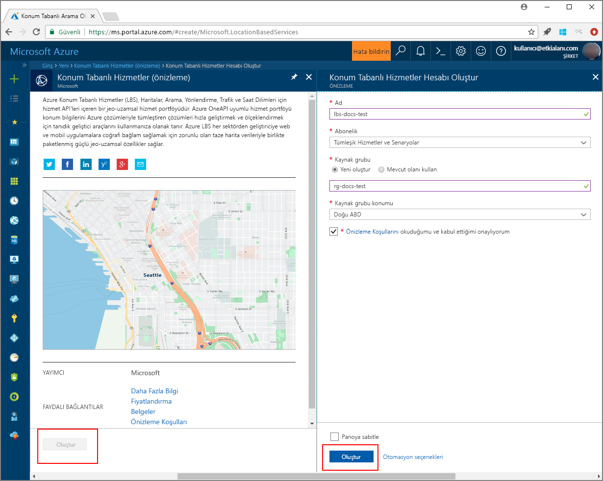

# <a name="search-nearby-point-of-interest-using-azure-location-based-services"></a>İlgi çekici Azure konum tabanlı Hizmetleri kullanarak arama

Bu öğretici, Azure konum tabanlı Hizmetleri olan bir hesap ayarlayın ve ardından ilgi için arama yapmak için sağlanan API'leri kullanın gösterilmektedir. Bu öğreticide şunların nasıl yapıldığını öğreneceksiniz:

> [!div class="checklist"]
> * Temel Azure konum Hizmetleri ile bir hesabı oluşturma
> * Hesabınız için abonelik anahtarı alma
> * Harita denetimi API'si kullanılarak yeni bir web sayfası oluşturma
> * Arama hizmeti ilgi çekici bulmak için kullanın

Azure aboneliğiniz yoksa başlamadan önce [ücretsiz bir hesap](https://azure.microsoft.com/free/) oluşturun.

# <a name="log-in-to-the-azure-portal"></a>Azure portalında oturum açma
[Azure Portal](https://portal.azure.com)’da oturum açın.

<a id="createaccount"></a>

## <a name="create-an-account-with-azure-location-based-services"></a>Temel Azure konum Hizmetleri ile bir hesabı oluşturma

Yeni bir konum tabanlı hizmetleri hesabı oluşturmak için aşağıdaki adımları izleyin.

1. [Azure portalının](https://portal.azure.com) sol üst köşesinde bulunan **Kaynak oluştur** öğesine tıklayın.
2. *Market’te Ara* kutusunda, **konum tabanlı hizmetler** yazın.
3. *Sonuçlar* sayfasından, **Konum Tabanlı Hizmetler (önizleme)** seçeneğine tıklayın. Haritanın altında görüntülenen **Oluştur** düğmesine tıklayın. 
4. Üzerinde **konum tabanlı hizmetleri hesabı oluştur** sayfasında, aşağıdaki değerleri girin:
    - *Adı* yeni hesabınızın. 
    - *Abonelik* bu hesap için kullanmak istediğiniz.
    - *Kaynak grubu* bu hesap adı. Tercih edebilirsiniz *Yeni Oluştur* veya *var olanı kullan* kaynak grubu.
    - Seçin *kaynak grubu konumu*.
    - Okuma *Önizleme koşulları* ve koşulları kabul etmek için onay kutusunu işaretleyin. 
    - Son olarak, tıklatın **oluşturma** düğmesi.
   
    


<a id="getkey"></a>

## <a name="get-the-subscription-key-for-your-account"></a>Hesabınız için abonelik anahtarı alma

Konum tabanlı Hizmetleri hesabınızı başarıyla oluşturulduktan sonra kendi harita arama API'leri bağlamak için adımları izleyin:

1. Konum tabanlı Hizmetleri hesabınızı portalda açın.
2. Hesabınıza ait gidin **ayarları**ve ardından **anahtarları**.
3. Kopya **birincil anahtar** panonuza. Devam etmeden adımlarda yerel olarak kullanmak üzere kaydedin. 

    


<a id="createmap"></a>

## <a name="create-new-web-page-using-azure-map-control-api"></a>Azure Harita Denetim API'sini kullanarak yeni bir web sayfası oluşturma
Azure Harita Denetim API'si Azure konum tabanlı Hizmetleri web uygulamanıza kolayca tümleştirmenize olanak tanıyan bir uygun istemci kitaplıktır. Tam REST hizmeti çağrıları karmaşıklığını ve styleable ve özelleştirilebilir bileşenleri verimliliğinizi artırır. Aşağıdaki adımlar konum tabanlı hizmetlerin Harita Denetim API'si ile katıştırılmış bir statik HTML sayfası oluşturulacağını gösterir. 

1. Yerel makinenizde yeni bir dosya oluşturun ve adlandırın **MapSearch.html**. 
2. Aşağıdaki HTML bileşenlerini dosyaya ekleyin:

    ```HTML
    <!DOCTYPE html>
    <html lang="en">

    <head>
        <meta charset="utf-8" />
        <meta name="viewport" content="width=device-width, user-scalable=no" />
        <title>Map Search</title>

        <link rel="stylesheet" href="https://atlas.microsoft.com/sdk/css/atlas.min.css?api-version=1.0" type="text/css" />
        <script src="https://atlas.microsoft.com/sdk/js/atlas.min.js?api-version=1.0"></script>

        <style>
            html,
            body {
                width: 100%;
                height: 100%;
                padding: 0;
                margin: 0;
            }

            #map {
                width: 100%;
                height: 100%;
            }
        </style>
    </head>

    <body>
        <div id="map"></div>
        <script>
            // Embed Map Control JavaScript code here
        </script>
    </body>

    </html>
    ``` 
    HTML üstbilgisi Azure harita denetiminin kitaplığı tarafından barındırılan CSS ve JavaScript kaynak dosyaları içerdiğine dikkat edin. Not *betik* eklenecek segment *gövde* HTML dosyası. Bu kesimin satır içi Azure konumu dayalı hizmetin API'lere erişim için JavaScript kodunu içerir.
 
3.  Şu JavaScript kodunu eklemek *betik* HTML dosyası bloğu. Yer tutucu Değiştir *< anahtar Ekle >* konum tabanlı Hizmetleri hesabınızın birincil anahtara sahip. 

    ```JavaScript
    // Instantiate map to the div with id "map"
    var subscriptionKey = "<insert-key>";
    var map = new atlas.Map("map", {
        "subscription-key": subscriptionKey
    });
    ```
    Bu kesimin abonelik anahtarınızı Harita Denetim API'si başlatır. **Atlas** Azure Harita Denetim API ve ilişkili visual bileşenleri içeren ad alanıdır. **Atlas. Harita** denetim için bir görsel ve etkileşimli web eşleme sağlar. Nasıl harita tarayıcıda HTML sayfası açarak benzer gözlemleyebilirsiniz. 

4. Şu JavaScript kodunu eklemek *betik* bloğu, arama PIN'ler bir katmanı harita denetim eklemek için:

    ```JavaScript
    // Initialize the pin layer for search results to the map
    var searchLayerName = "search-results";
    map.addPins([], {
        name: searchLayerName,
        cluster: false,
        icon: "pin-round-darkblue"
    });
    ```

5. Makinenizde dosyasını kaydedin. 


<a id="usesearch"></a>

## <a name="use-search-service-to-find-nearby-point-of-interest"></a>Arama hizmeti ilgi çekici bulmak için kullanın

Bu bölümde Azure konum tabanlı hizmetlerin arama hizmeti API'si, haritada ilginizi çeken bir noktayı bulmak için nasıl kullanılacağını gösterir. Bu bir RESTful adresleri, ilgilenilen noktaları ve diğer coğrafi bilgileri aramak geliştiricileri için tasarlanmış bir API'dir. Arama hizmeti için belirtilen bir adres enlem ve boylam bilgi atar. 

1. Açık **MapSearch.html** dosyası önceki bölümde oluşturulan ve şu JavaScript kodunu ekleyin *betik* arama hizmeti göstermeye bloğu. 
    ```JavaScript
    // Perform a request to the search service and create a pin on the map for each result
    var xhttp = new XMLHttpRequest();
    xhttp.onreadystatechange = function () {
        var searchPins = [];

        if (this.readyState === 4 && this.status === 200) {
            var response = JSON.parse(this.responseText);

            var poiResults = response.results.filter((result) => { return result.type === "POI" }) || [];

            searchPins = poiResults.map((poiResult) => {
                var poiPosition = [poiResult.position.lon, poiResult.position.lat];
                return new atlas.data.Feature(new atlas.data.Point(poiPosition), {
                    name: poiResult.poi.name,
                    address: poiResult.address.freeformAddress,
                    position: poiResult.position.lat + ", " + poiResult.position.lon
                });
            });

            map.addPins(searchPins, {
                name: searchLayerName
            });

            var lons = searchPins.map((pin) => { return pin.geometry.coordinates[0] });
            var lats = searchPins.map((pin) => { return pin.geometry.coordinates[1] });

            var swLon = Math.min.apply(null, lons);
            var swLat = Math.min.apply(null, lats);
            var neLon = Math.max.apply(null, lons);
            var neLat = Math.max.apply(null, lats);

            map.setCameraBounds({
                bounds: [swLon, swLat, neLon, neLat],
                padding: 50
            });
        }
    };
    ```
    Bu kod parçacığını oluşturur bir [XMLHttpRequest](https://xhr.spec.whatwg.org/), ve gelen yanıtı ayrıştırılamadı olay işleyicisi ekler. Başarılı bir yanıt için topladığı adresleri, adları, buna, döndürülen her konum için enlem ve logitude bilgi `searchPins` değişkeni. Son olarak, bu koleksiyon için konum noktalarının ekler `map` denetim PIN'ler olarak. 

2. Aşağıdaki kodu ekleyin *betik* XMLHttpRequest Azure konum tabanlı hizmetlerin arama hizmetine göndermek için engelle:

    ```JavaScript
    var url = "https://atlas.microsoft.com/search/fuzzy/json?";
    url += "&api-version=1.0";
    url += "&query=gasoline%20station";
    url += "&subscription-key=" + subscriptionKey;
    url += "&lat=47.6292";
    url += "&lon=-122.2337";
    url += "&radius=100000";

    xhttp.open("GET", url, true);
    xhttp.send();
    ``` 
    Bu kod parçacığında adlı arama hizmeti temel arama API kullanan **benzer arama**. Girdi adresi herhangi bir bileşimini işleme en belirsiz işleme veya *POI* belirteçleri. Arar yakındaki **Akaryakıt istasyon**, belirli bir adresi enlem ve boylam ve belirtilen RADIUS içinde için. Konum tabanlı Hizmetleri çağrısı yapmak için daha önce örnek dosyasında sağlanan hesabınızın abonelik anahtarı kullanır. Enlem/boylam sonuçlar getirir bulunan konumlar için çiftleri. Tarayıcıda HTML sayfası açarak arama PIN'ler gözlemleyebilirsiniz. 

3. Aşağıdaki satırları ekleyin *betik* bloğu, arama hizmeti tarafından döndürülen ilgilenilen noktaları için açılır pencereleri oluşturmak için:

    ```JavaScript
    // Add a popup to the map which will display some basic information about a search result on hover over a pin
    var popup = new atlas.Popup();
    map.addEventListener("mouseover", searchLayerName, (e) => {
        var popupContentElement = document.createElement("div");
        popupContentElement.style.padding = "5px";

        var popupNameElement = document.createElement("div");
        popupNameElement.innerText = e.features[0].properties.name;
        popupContentElement.appendChild(popupNameElement);

        var popupAddressElement = document.createElement("div");
        popupAddressElement.innerText = e.features[0].properties.address;
        popupContentElement.appendChild(popupAddressElement);

        var popupPositionElement = document.createElement("div");
        popupPositionElement.innerText = e.features[0].properties.position;
        popupContentElement.appendChild(popupPositionElement);

        popup.setPopupOptions({
            position: e.features[0].geometry.coordinates,
            content: popupContentElement
        });

        popup.open(map);
    });
    ```
    API **atlas. Açılan** bilgi sağlayan pencere bağlantılı harita üzerinde gerekli konumunda. Bu kod parçacığında içerik ve açılan konumunu ayarlar yanı sıra bir olay dinleyicisi ekler `map` bekleniyor denetim _fare_ açılan alma. 

4. Dosyayı kaydedin ve ardından açın **MapSearch.html** dosya tercih ettiğiniz bir web tarayıcısında ve sonucu uyun. Bu noktada, gösterilen, aşağıdakine benzer arama PIN'ler hiçbirini üzerine geldiğinizde tarayıcıda haritada bilgileri açılır pencereleri gösterilir. 

    


## <a name="next-steps"></a>Sonraki adımlar
Bu öğreticide, şunların nasıl yapıldığını öğrendiniz:

> [!div class="checklist"]
> * Temel Azure konum Hizmetleri ile bir hesabı oluşturma
> * Hesabınız için abonelik anahtarı alma
> * Harita denetimi API'si kullanılarak yeni bir web sayfası oluşturma
> * Arama hizmeti ilgi çekici bulmak için kullanın

Öğreticisine devam [Azure konum tabanlı Hizmetleri kullanarak ilgi rotaya](./tutorial-route-location.md) Azure konum tabanlı Hizmetleri noktanızı ilgi yönlendirmek için nasıl kullanılacağını öğrenin. 
