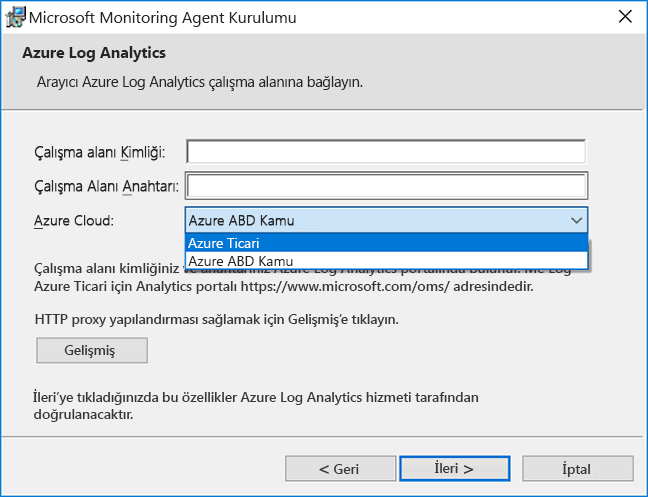
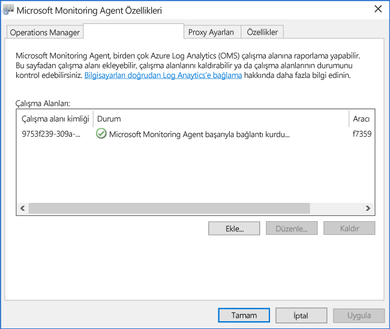

# <a name="connect-windows-computers-to-the-log-analytics-service-in-azure"></a>Windows bilgisayarları Azure günlük analizi hizmetine bağlanın

İzlemek ve sanal makine ya da yerel veri merkeziniz veya başka bir bulut ortamında günlük analizi ile fiziksel bilgisayarları yönetmek için Microsoft İzleme Aracısı'nı (MMA) dağıtma ve bir veya daha fazla günlük analizi çalışma alanları için rapor şekilde yapılandırmanız gerekir.  Aracı, karma Runbook çalışanı rolü için Azure Automation de destekler.  

İzlenen bir Windows bilgisayarda, aracı Microsoft İzleme Aracısı hizmeti olarak listelenir. Microsoft İzleme Aracısı hizmeti, günlük dosyaları ve Windows olay günlüğü, performans verilerini ve başka telemetriyle olayları toplar. Aracının rapor günlük analizi hizmeti ile iletişim kuramıyor olsa bile, aracı çalışmaya devam eder ve toplanan verileri izlenen bilgisayarın diskinde sıralar. Bağlantı geri geldiğinde, Microsoft İzleme Aracısı hizmeti toplanan verileri hizmetine gönderir.

Aracı, aşağıdaki yöntemlerden biri kullanılarak yüklenebilir. Çoğu yüklemeler farklı bilgisayarlar, uygun şekilde yüklemek için bu yöntemlerinin bir birleşimini kullanın.

* El ile yükleme. Kurulum, komut satırından Kurulum Sihirbazı kullanılarak bilgisayarda el ile çalıştırın veya varolan bir yazılım dağıtım aracı kullanılarak dağıtılabilir.
* Azure Otomasyonu istenen durum yapılandırması (DSC). DSC Azure Otomasyonu'nda ortamınızda dağıtılmış Windows bilgisayarları için bir komut dosyasıyla kullanma.  
* PowerShell Betiği.
* Şirket içi için Windows Azure yığınında çalışan sanal makineler için Resource Manager şablonu.  

Windows aracısını dağıtmak için ağ ve sistem gereksinimleri hakkında bilgilere [Azure Log Analytics ile ortamınızdan veri toplama](log-analytics-concept-hybrid.md#prerequisites) sayfasından ulaşabilirsiniz.

## <a name="obtain-workspace-id-and-key"></a>Çalışma alanı kimliği ve anahtarını alma
Windows için Microsoft Monitoring Agent'ı yüklemeden önce, Log Analytics çalışma alanınızın kimliği ve anahtarına ihtiyacınız olacak.  Bu bilgiler, düzgün olarak aracıyı yapılandırmak ve günlük analizi ile başarıyla iletişim kurabilmesini sağlamak için her yükleme yönteminden Kurulum sırasında gereklidir.  

1. Azure portalında tıklatın **tüm hizmetleri**. Kaynak listesinde **Log Analytics** yazın. Yazmaya başladığınızda liste, girişinize göre filtrelenir. **Log Analytics**’i seçin.
2. Günlük analizi çalışma alanları, listeden, aracının yapılandırılması hakkında rapor istediğiniz çalışma alanı seçin.
3. **Gelişmiş ayarlar**’ı seçin.<br><br> <br><br>  
4. **Bağlı Kaynaklar**’ı seçin ve ardından **Windows Sunucuları**’nı seçin.   
5. **Çalışma Alanı Kimliği** ve **Birincil Anahtar**’ın sağındaki değer. Her ikisini de kopyalayıp sık kullandığınız bir düzenleyiciye yapıştırın.   
   
## <a name="install-the-agent-using-setup"></a>Kurulumu kullanarak aracı yükleme
Aşağıdaki adımlar, bilgisayarınızda Microsoft Monitoring Agent'ın kurulumunu kullanarak Azure'da ve Azure Kamu bulutunda Log Analytics'in aracısını yükler ve yapılandırır.  Aracısı için Kurulum programı indirilen dosyasında yer alan ve aşağıdakileri yapmak için ayıklanan gerekir 

1. **Windows Sunucuları** sayfasında, Windows işletim sisteminin işlemci mimarisine bağlı olarak indirilecek uygun **Windows Aracısını İndir** sürümünü seçin.
2. Aracıyı bilgisayarınıza yüklemek için Kurulum'u çalıştırın.
2. **Hoş Geldiniz** sayfasında **İleri**'ye tıklayın.
3. **Lisans Koşulları** sayfasında, lisansı okuyun ve **Kabul Ediyorum**'a tıklayın.
4. **Hedef Klasör** sayfasında, varsayılan yükleme klasörünü değiştirin veya koruyun ve ardından **İleri**'ye tıklayın.
5. **Aracı Kurulum Seçenekleri** sayfasında, aracıyı Azure Log Analytics'e (OMS) bağlamayı seçin ve ardından **İleri**'ye tıklayın.   
6. **Azure Log Analytics** sayfasında aşağıdakileri yapın:
   1. Daha önce kopyaladığınız **Çalışma Alanı Kimliği** ve **Çalışma Alanı Anahtarı (Birincil Anahtar)** değerlerini yapıştırın.  Bilgisayarın Azure Kamu bulutundaki bir Log Analytics çalışma alanına raporlaması gerekiyorsa, **Azure Cloud** açılan listesinden **Azure ABD Kamu**'yu seçin.  
   2. Bilgisayarın Log Analytics hizmetiyle bir ara sunucu üzerinden iletişim kurması gerekiyorsa, **Gelişmiş**'e tıklayın ve ara sunucunun URL'siyle bağlantı noktası numarasını sağlayın.  Ara sunucunuz kimlik doğrulaması gerektiriyorsa, ara sunucuyla kimlik doğrulaması yapmak için kullanıcı adını ve parolayı yazın, ardından **İleri**'ye tıklayın.  
7. Gerekli yapılandırma ayarlarını sağlamayı tamamladığınızda **İleri**'ye tıklayın.<br><br> <br><br>
8. **Yüklemeye Hazır** sayfasında seçimlerinizi gözden geçirin ve ardından **Yükle**'ye tıklayın.
9. **Yapılandırma başarıyla tamamlandı** sayfasında **Son**'a tıklayın.

Tamamlandığında, **Denetim Masası**'nda **Microsoft Monitoring Agent** gösterilir. Günlük analizi için raporlama da onaylamak için gözden [günlük analizi aracı bağlanabilirliği doğrulamak](#verify-agent-connectivity-to-log-analytics). 

## <a name="install-the-agent-using-the-command-line"></a>Komut satırını kullanarak aracı yükleme
Aracı için indirilen dosya ile IExpress oluşturulan müstakil yükleme paketidir.  Kurulum programı destekleyici dosyaları ve aracı için pakette yer alan ve düzgün aşağıdaki örneklerde gösterildiği komut satırını kullanarak yüklemek için ayıklanan gerekir.  Bu yöntem, Azure ticari ve ABD devlet kurumları bulut bildirmeye Aracısı Yapılandırma destekler.  

>[!NOTE]
>Bir aracıyı yükseltmek istiyorsanız, betik API'si günlük analizi kullanmanız gerekir. Konusuna [yönetme ve Windows ve Linux için günlük analizi aracı Bakımı](log-analytics-agent-manage.md) daha fazla bilgi için.

Aşağıdaki tabloda kurulum tarafından desteklenen Automation DSC kullanılarak dağıtıldığında dahil olmak üzere aracı için özel günlük analizi parametreleri vurgular.

|MMA özgü seçenekleri                   |Notlar         |
|---------------------------------------|--------------|
|ADD_OPINSIGHTS_WORKSPACE               | 1 = çalışma alanına bildirmeye Aracısı Yapılandırma                |
|OPINSIGHTS_WORKSPACE_ID                | Eklemek için çalışma alanı kimliği (GUID) çalışma alanı için                    |
|OPINSIGHTS_WORKSPACE_KEY               | Başlangıçta çalışma alanıyla kimliğini doğrulamak için kullanılan çalışma alanı anahtarı |
|OPINSIGHTS_WORKSPACE_AZURE_CLOUD_TYPE  | Çalışma alanı bulunduğu bulut ortamını belirtin <br> 0 = azure ticari bulut (varsayılan) <br> 1 azure kamu = |
|OPINSIGHTS_PROXY_URL               | Kullanılacak proxy için URI |
|OPINSIGHTS_PROXY_USERNAME               | Kimliği doğrulanmış bir proxy sunucusuna erişmek için kullanıcı adı |
|OPINSIGHTS_PROXY_PASSWORD               | Kimliği doğrulanmış bir proxy sunucusuna erişmek için parola |

1. Aracı yükleme dosyalarını çalıştırmak yükseltilmiş komut isteminden ayıklamak için `extract MMASetup-<platform>.exe` ve bu dosyaları ayıklamak yol için ister.  Bağımsız değişkenler geçirerek yolunu alternatif olarak, belirtebilirsiniz `extract MMASetup-<platform>.exe /c:<Path> /t:<Path>`.  IExpress tarafından desteklenen komut satırı swtiches hakkında daha fazla bilgi için bkz: [IExpress komut satırı anahtarları](https://support.microsoft.com/help/197147/command-line-switches-for-iexpress-software-update-packages) ve örnek gereksinimlerinize uyacak şekilde güncelleştirin.
2. Yazmak için kurulum dosyalarını ayıkladığınız sessizce aracısını yüklemek ve Azure ticari bulut çalışma klasöründen Rapor şekilde yapılandırın: 
   
     ```dos
    setup.exe /qn ADD_OPINSIGHTS_WORKSPACE=1 OPINSIGHTS_WORKSPACE_AZURE_CLOUD_TYPE=0 OPINSIGHTS_WORKSPACE_ID=<your workspace id> OPINSIGHTS_WORKSPACE_KEY=<your workspace key> AcceptEndUserLicenseAgreement=1
    ```

   veya Azure ABD devlet kurumları buluta bildirmeye aracısı yapılandırmak için şunu yazın: 

     ```dos
    setup.exe /qn ADD_OPINSIGHTS_WORKSPACE=1 OPINSIGHTS_WORKSPACE_AZURE_CLOUD_TYPE=1 OPINSIGHTS_WORKSPACE_ID=<your workspace id> OPINSIGHTS_WORKSPACE_KEY=<your workspace key> AcceptEndUserLicenseAgreement=1
    ```

## <a name="install-the-agent-using-dsc-in-azure-automation"></a>Azure Otomasyonu'nda DSC kullanarak aracı yükleme

Azure Otomasyonu DSC kullanarak aracıyı yüklemek için aşağıdaki komut dosyası örneği kullanabilirsiniz.   Bir Otomasyon hesabı yoksa bkz [Azure Automation ile çalışmaya başlama](../automation/automation-offering-get-started.md) gereksinimleri ve Automation DSC kullanmadan önce gerekli bir Otomasyon hesabı oluşturma adımları anlamak için.  Automation DSC ile bilmiyorsanız gözden [Otomasyonu DSC'ye Başlarken](../automation/automation-dsc-getting-started.md).

64-bit aracısı tarafından tanımlanan, aşağıdaki örnek yükler `URI` değeri. URI değerini değiştirerek 32-bit sürümünü de kullanabilirsiniz. URI'ler için her iki sürümü vardır:

- Windows 64-bit Aracısı - https://go.microsoft.com/fwlink/?LinkId=828603
- Windows 32-bit Aracısı - https://go.microsoft.com/fwlink/?LinkId=828604


>[!NOTE]
>Bu yordam ve komut dosyası örneği zaten bir Windows bilgisayara dağıtılan aracı yükseltmeyi desteklemez.

Farklı ürün kodları aracı paketi 32-bit ve 64 bit sürümlerine sahip ve yayımlanan yeni sürümleri de benzersiz bir değere sahip.  Ürün kodu, bir uygulama veya ürün asıl kimliği ve Windows Installer tarafından temsil edilen bir GUID'dir **ProductCode** özelliği.  `ProductId value` İçinde **MMAgent.ps1** komut dosyası varsa 32 bit veya 64 bit aracı Yükleyici paketi ürün kodundan eşleşecek şekilde.

Ürün kodu aracı yükleme paketinden doğrudan almak için gelen Orca.exe'yi kullanabilirsiniz [Windows Installer geliştiricileri için Windows SDK Bileşenleri](https://msdn.microsoft.com/library/windows/desktop/aa370834%27v=vs.85%28.aspx) Windows Yazılım Geliştirme Seti diğer bir deyişle bir bileşeninin veya kullanma PowerShell aşağıdaki bir [örnek komut dosyası](http://www.scconfigmgr.com/2014/08/22/how-to-get-msi-file-information-with-powershell/) bir Microsoft değerli Professional (MVP) tarafından yazılmış.

1. İçeri aktarma xPSDesiredStateConfiguration DSC modülünden [http://www.powershellgallery.com/packages/xPSDesiredStateConfiguration](http://www.powershellgallery.com/packages/xPSDesiredStateConfiguration) Azure Otomasyonu içine.  
2.  İçin Azure Otomasyonu değişken varlıkları oluşturma *OPSINSIGHTS_WS_ID* ve *OPSINSIGHTS_WS_KEY*. Ayarlama *OPSINSIGHTS_WS_ID* günlük analizi çalışma alanı kimliği ve kümesi *OPSINSIGHTS_WS_KEY* çalışma alanınızın birincil anahtarı.
3.  Komut dosyasını kopyalayıp MMAgent.ps1 Kaydet

    ```PowerShell
    Configuration MMAgent
    {
        $OIPackageLocalPath = "C:\Deploy\MMASetup-AMD64.exe"
        $OPSINSIGHTS_WS_ID = Get-AutomationVariable -Name "OPSINSIGHTS_WS_ID"
        $OPSINSIGHTS_WS_KEY = Get-AutomationVariable -Name "OPSINSIGHTS_WS_KEY"

        Import-DscResource -ModuleName xPSDesiredStateConfiguration

        Node OMSnode {
            Service OIService
            {
                Name = "HealthService"
                State = "Running"
                DependsOn = "[Package]OI"
            }

            xRemoteFile OIPackage {
                Uri = "https://go.microsoft.com/fwlink/?LinkId=828603"
                DestinationPath = $OIPackageLocalPath
            }

            Package OI {
                Ensure = "Present"
                Path  = $OIPackageLocalPath
                Name = "Microsoft Monitoring Agent"
                ProductId = "8A7F2C51-4C7D-4BFD-9014-91D11F24AAE2"
                Arguments = '/C:Deploy"setup.exe /qn ADD_OPINSIGHTS_WORKSPACE=1 OPINSIGHTS_WORKSPACE_ID=' + $OPSINSIGHTS_WS_ID + ' OPINSIGHTS_WORKSPACE_KEY=' + $OPSINSIGHTS_WS_KEY + ' AcceptEndUserLicenseAgreement=1"'
                DependsOn = "[xRemoteFile]OIPackage"
            }
        }
    }

    ```

4. [MMAgent.ps1 yapılandırma betiğini alma](../automation/automation-dsc-getting-started.md#importing-a-configuration-into-azure-automation) Otomasyon hesabınızda. 
5. [Windows bilgisayar veya düğüm atamak](../automation/automation-dsc-getting-started.md#onboarding-an-azure-vm-for-management-with-azure-automation-dsc) yapılandırması. 15 dakika içinde düğüm yapılandırmasını denetler ve aracının düğüme gönderilir.

## <a name="verify-agent-connectivity-to-log-analytics"></a>Günlük analizi aracı bağlanabildiğini doğrulayın

Aracısı'nın instalaltion tamamlandıktan sonra doğrulama başarıyla bağlandı ve raporlama iki yolla gerçekleştirilebilir.  

Bilgisayar **Denetim Masası**, öğeyi bulur **Microsoft İzleme Aracısı**.  Seçin ve **Azure günlük analizi (OMS)** sekmesinde, aracıyı belirten iletisi görüntülenmelidir: **Microsoft Monitoring Agent Microsoft Operations Management Suite hizmetine başarıyla bağlandı.**<br><br> 

Azure portalında bir basit günlük arama de gerçekleştirebilirsiniz.  

1. Azure portalında tıklatın **tüm hizmetleri**. Kaynak listesinde **Log Analytics** yazın. Yazmaya başladığınızda liste, girişinize göre filtrelenir. **Log Analytics**’i seçin.  
2. Günlük analizi çalışma sayfasında, hedef çalışma alanını seçin ve ardından **günlük arama** döşeme. 
2. Günlük arama bölmesinde üzerinde sorgu alan türü:  

    ```
    search * 
    | where Type == "Heartbeat" 
    | where Category == "Direct Agent" 
    | where TimeGenerated > ago(30m)  
    ```

Döndürülen arama sonuçlarında, bağlı olduğu belirten ve hizmet raporlama bilgisayar için sinyal kayıtlarını görmeniz gerekir.   

## <a name="next-steps"></a>Sonraki adımlar

Gözden geçirme [yönetme ve Windows ve Linux için günlük analizi aracı Bakımı](log-analytics-agent-manage.md) makinelerinizi üzerinde kendi dağıtım yaşam döngüsü sırasında Aracısı yönetme hakkında bilgi edinmek için.  