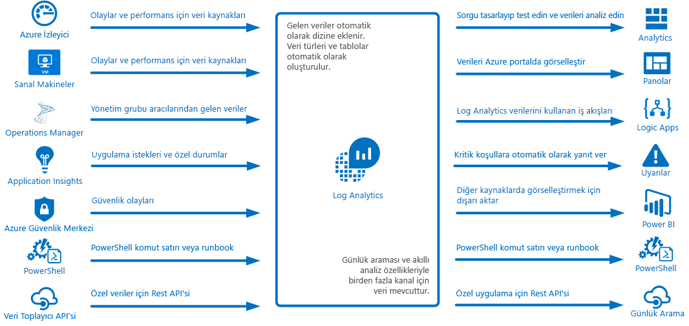
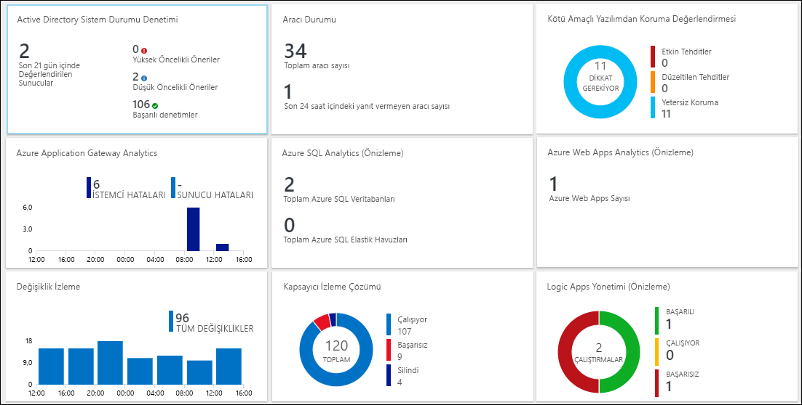
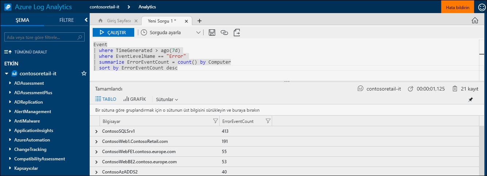
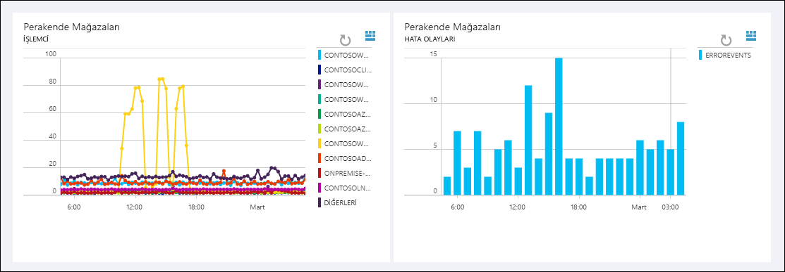
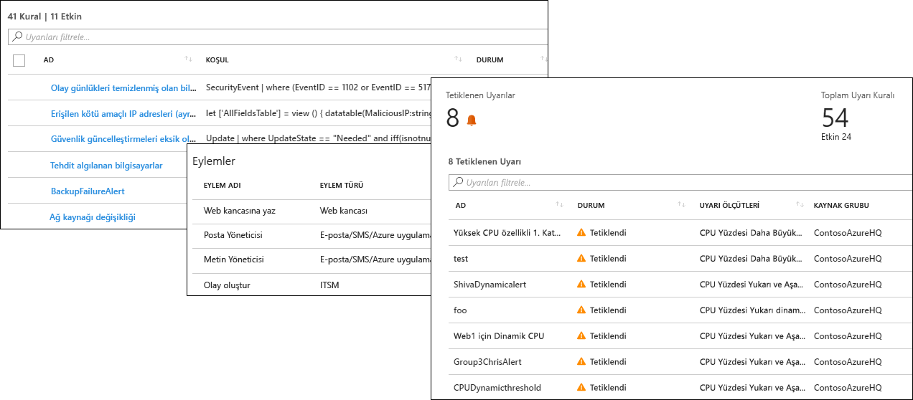
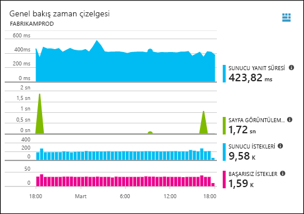
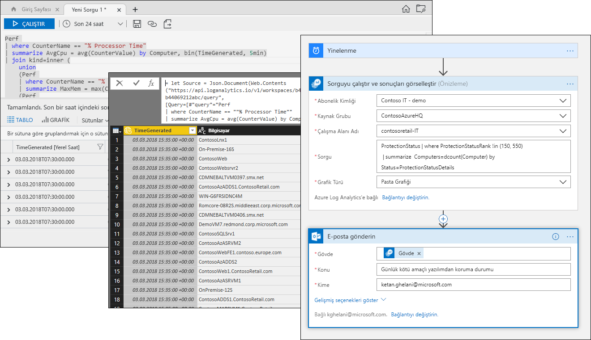

# Azure Log Analytics nedir?
Log Analytics, çeşitli kaynaklardan telemetri ve diğer verileri toplayıp uygulamalarınızın ve kaynaklarınızın çalışmasına yönelik içgörüler sunan bir analiz altyapısı ve sorgu dili sağlayarak Azure yönetiminde merkezi bir rol oynar.  Günlük aramaları ve görünümleri yoluyla Log Analytics verileriyle doğrudan etkileşime geçebilir veya Log Analytics’te verilerini depolayan Application Insights ya da Azure Güvenlik Merkezi gibi diğer Azure hizmetlerinde analiz araçlarını kullanabilirsiniz.  

Log Analytics, minimum yapılandırma gerektirir ve diğer Azure hizmetleriyle tümleştirilmiştir.  Toplamayı etkinleştirmek için bir çalışma alanı oluşturmanız gerekir.  Daha sonra sanal makinelere aracılar yükleyerek bunları çalışma alanına dahil edebilir ve farklı uygulamalara yönelik ek içgörüler sağlama mantığını içeren yönetim çözümlerini etkinleştirebilirsiniz.  Arka planda veri türleri önceden tanımlanmıştır ya da veriler toplanırken otomatik olarak oluşturulur.

## İzleme rolü

[Azure uygulamalarını ve kaynaklarını izleme](../monitoring-and-diagnostics/monitoring-overview.md) bölümünde, Azure’daki farklı izleme hizmetleri açıklanmaktadır.  Log Analytics, farklı kaynaklardaki izleme verilerini birleştirerek ve birleştirme ve analiz için güçlü bir sorgu dili sağlayarak merkezi bir rol oynar.  

Ancak Log Analytics, Azure kaynaklarını izleme ile sınırlı değildir.  Hibrit izleme ortamı oluşturmak için şirket içinde veya diğer bulutlarda bulunan kaynaklardan veri toplayabilir ve mevcut aracılardan telemetri toplamak için doğrudan System Center Operations Manager’a bağlanabilir.  Log Analytics’in günlük aramaları, görünümler ve yönetim çözümleri gibi analiz araçları, toplanan tüm verilere karşı çalışarak tüm ortamınızı merkezi analiz etme yeteneği sağlar.

## Veri toplama
Log Analytics, çeşitli kaynaklardan veri toplar.  Toplandığında, veriler her bir veri türü için ayrı tablolar halinde düzenlenir ve böylece özgün kaynağına bakılmaksızın tüm verilerin birlikte analiz edilmesi sağlanır.

Log Analytics’e veri toplama yöntemleri şunlardır:

- Azure İzleyici’yi, Azure kaynaklarından topladığı ölçüm ve günlükleri kopyalayacak şekilde yapılandırma.
- [Windows](log-analytics-windows-agent.md) ve [Linux](log-analytics-linux-agents.md) sanal makinelerindeki aracılar, yapılandırdığınız [Veri Kaynakları](log-analytics-data-sources.md)’na göre Log Analytics’e konuk işletim sisteminden telemetri gönderir.  
- Aracılarından veri toplamak için bir [System Center Operations Manager yönetim grubunu](log-analytics-om-agents.md) Log Analytics’e bağlama.
- [Application Insights](https://docs.microsoft.com/azure/application-insights/) ve [Azure Güvenlik Merkezi](https://docs.microsoft.com/azure/security-center/) gibi Azure hizmetleri, herhangi bir yapılandırma olmadan verilerini doğrudan Log Analytics’te depolar.
- Log Analytics cmdlet’lerini kullanarak PowerShell komut satırından veya [Azure Otomasyonu runbook](../automation/automation-runbook-types.md)‘undan veri yazma.
- Özel gereksinimleriniz varsa, bir REST API istemcisinden Log Analytics’e veri yazmak için [HTTP Veri Toplayıcı API’sini](log-analytics-data-collector-api.md) kullanabilirsiniz.

## Yönetim çözümleriyle işlevsellik ekleme
[Yönetim çözümleri](log-analytics-add-solutions.md), belirli bir ürün veya senaryo için önceden paketlenmiş mantık sağlar.  Log Analytics’e ek veri toplayabilir veya önceden toplanmış olan verileri işleyebilir.  Genellikle bu ek verileri analiz etmenize yardımcı olacak bir görünüm içerir.  Çeşitli işlevlere yönelik çözümler mevcuttur ve sürekli olarak başka çözümler eklenmektedir.  Azure Market’ten mevcut çözümlere kolayca göz atabilir ve bu çözümleri [çalışma alanınıza ekleyebilirsiniz](log-analytics-add-solutions.md).  

## Sorgu dili

Log Analytics, toplanan verileri hızlı şekilde almak, birleştirmek ve analiz etmek için [zengin sorgu dili](http://docs.loganalytics.io) içerir.  [Günlük Araması veya Gelişmiş Analiz portallarını](log-analytics-log-search-portals.md) kullanarak sorgular oluşturabilir ve test edebilir, daha sonra bu araçları kullanarak doğrudan verileri analiz edebilir veya görselleştirmeler ve uyarılarla kullanmak üzere sorguları kaydedebilir ya da Power BI veya Excel gibi diğer araçlara dışarı aktarabilirsiniz.

Log Analytics sorgu dili basit günlük aramaları için uygundur, ancak toplamalar, birleştirmeler ve akıllı analiz gibi gelişmiş işlevleri de içerir. Kullanılabilir olan [birden çok öğretici](https://docs.loganalytics.io/docs/Learn/Tutorials) kullanarak sorgu dilini hızlı şekilde öğrenebilirsiniz.  [SQL](https://docs.loganalytics.io/docs/Learn/References/SQL-to-Azure-Log-Analytics) ve [Splunk](https://docs.loganalytics.io/docs/Learn/References/Splunk-to-Azure-Log-Analytics)’u önceden bilen kullanıcılara belirli yönergeler sağlanır.

## Log Analytics verilerini görselleştirme

[Log Analytics’teki görünümler](log-analytics-view-designer.md), günlük aramalarındaki verileri görsel olarak sunar.  Her görünüm, kritik verileri özetleyen listelerin yanı sıra çubuk ve çizgi grafikler gibi görselleştirmelerin birleşimini içerir.  [Yönetim çözümleri](#add-functionality-with-management-solutions), belirli bir uygulama için verileri özetleyen görünümleri içerir ve herhangi bir Log Analytics günlük aramasından verileri sunmak için kendi görünümlerinizi oluşturabilirsiniz.

Log Analytics sorgusunun sonuçlarını bir [Azure panosuna](../azure-portal/azure-portal-dashboards.md) da sabitleyebilir, böylece farklı Azure hizmetlerinden kutucukları birleştirebilirsiniz.  Log Analytics görünümünü bir panoya da sabitleyebilirsiniz.

## Log Analytics verilerinden uyarılar oluşturma

Sizin için önemli olan Log Analytics verilerindeki koşulları proaktif olarak size bildirmesi için [Azure Uyarıları](../monitoring-and-diagnostics/monitoring-overview-unified-alerts.md)’nı kullanın.  Zamanlanan aralıklarda otomatik olarak bir sorgu çalıştırılır ve sonuçlar belirli ölçütlerle eşleşirse bir uyarı oluşturulur.  Böylece uyarı koşullarına yanıt için [Eylem gruplarını](../monitoring-and-diagnostics/monitoring-action-groups.md) paylaşarak gerçek zamanlı uyarılar ([Azure İzleyici](../monitoring-and-diagnostics/monitoring-near-real-time-metric-alerts.md)) ve uygulama özel durumları ([Application Insights](../application-insights/app-insights-alerts.md)) gibi diğer kaynaklarla Log Analytics’ten gelen uyarıları birleştirmeniz sağlanır.

## Diğer hizmetlerde Log Analytics verilerini kullanma
Application Insights ve Azure Güvenlik Merkezi gibi hizmetler verilerini Log Analytics’te depolar.  Genellikle bu hizmetler tarafından sağlanan zengin analiz araçlarıyla etkileşim kurarsınız, ancak bunların verilerine erişmek ve bu verileri diğer hizmetlerden gelen verilerle birleştirmek için Log Analytics sorgularını da kullanabilirsiniz.  

Örneğin, aşağıdaki görünüm Application Insights’a aittir.  Sağ üst kısımdaki simgeye tıklarsanız, graf tarafından kullanılan sorgularla Log Analytics analitik konsolu başlatılır.

## Log Analytics verilerini dışarı aktarma

Log Analytics, verilerini Azure dışında da kullanıma sunar.  [Power BI](log-analytics-powerbi.md)’ı, bir sorgunun sonuçlarını zamanlanan aralıklarda içeri aktaracak şekilde yapılandırabilir, böylece farklı kaynaklardan verileri birleştirme ve raporları web’de ve mobil cihazlarda paylaşma gibi özelliklerden yararlanabilirsiniz.  Log Analytics verilerini kullanan özel çözümler oluşturmak veya başka sistemlerle tümleştirmek için [Günlük Arama API’sini](log-analytics-log-search-api.md) de kullanabilirsiniz.

Log Analytics verilerine dayalı özel iş akışları oluşturmak için Azure’da [Logic Apps](../logic-apps/logic-apps-overview.md)’i kullanabilirsiniz.  PowerShell’e dayalı daha karmaşık mantık için [Azure Otomasyonu’ndaki runbook](../automation/automation-runbook-types.md)’ları kullanabilirsiniz.

## Sonraki adımlar
- [Azure sanal makinelerinden veri toplayarak](log-analytics-quick-collect-azurevm.md) başlayın.
- [Basit bir sorguyla Log Analytics verilerini analiz etme ile ilgili öğretici](log-analytics-tutorial-viewdata.md) adımlarını izleyin.
* Log Analytics’e işlev eklemek için [kullanılabilir çözümlere göz atın](log-analytics-add-solutions.md).

