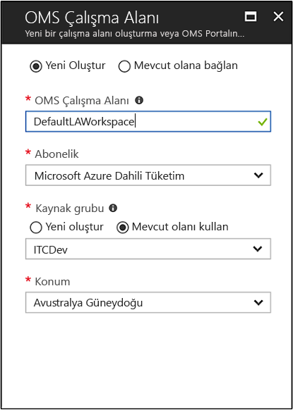
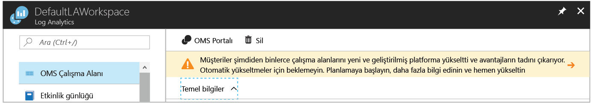
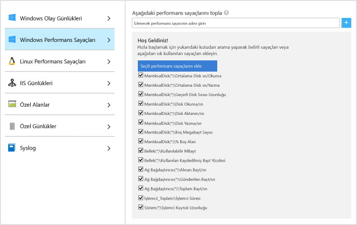
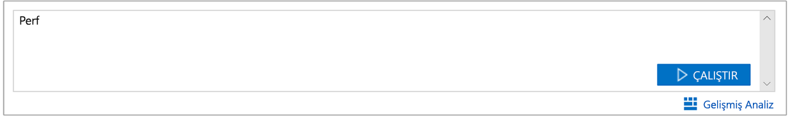

# Azure Sanal Makineleri hakkında veri toplama
[Azure Log Analytics](log-analytics-overview.md), doğrudan Azure sanal makinelerinizden ve ortamınızdaki diğer kaynaklardan verileri ayrıntılı analiz ve bağıntı için tek bir depoda toplayabilir.  Bu hızlı başlangıçta birkaç kolay adımda Azure Linux veya Windows VM’lerinizi nasıl yapılandırabileceğiniz ve veri toplayabileceğiniz gösterilmektedir.  
 
Bu hızlı başlangıçta mevcut bir Azure sanal makinenizin olduğu varsayılmaktadır. Yoksa VM hızlı başlangıçlarımızı izleyerek bir [Windows VM](../virtual-machines/windows/quick-create-portal.md) veya bir [Linux VM](../virtual-machines/linux/quick-create-cli.md) oluşturabilirsiniz.

## Azure portalında oturum açın
[https://portal.azure.com](https://portal.azure.com) adresinden Azure portalında oturum açın. 

## Çalışma alanı oluşturma
1. Azure portalında **Tüm hizmetler**’e tıklayın. Kaynak listesinde **Log Analytics** yazın. Yazmaya başladığınızda liste, girişinize göre filtrelenir. **Log Analytics**’i seçin.     
2. **Oluştur**’a tıklayın, ardından şu öğeler için seçim yapın:

  * Yeni **OMS Çalışma Alanı** için *DefaultLAWorkspace* gibi bir ad sağlayın. 
  * Varsayılan seçili abonelik uygun değilse açılan listeden bağlanacak bir **Abonelik** seçin.
  * **Kaynak Grubu** için, bir veya daha fazla Azure sanal makinesi içeren mevcut bir kaynak grubunu seçin.  
  * VM’lerinizin dağıtıldığı **Konum**’u seçin.  Ek bilgi için bkz. [Log Analytics’in sunulduğu bölgeler](https://azure.microsoft.com/regions/services/).
  * 2 Nisan 2018 tarihinden sonra oluşturulan yeni bir abonelikte çalışma alanı oluşturuyorsanız bu, otomatik olarak *GB başına* fiyatlandırma planını kullanır ve fiyatlandırma katmanı seçme seçeneği kullanılamaz.  2 Nisan’dan önce oluşturulmuş mevcut bir abonelik için veya mevcut bir EA kaydına bağlı aboneliğe yönelik çalışma alanı oluşturuyorsanız, üç fiyatlandırma katmanı arasında tercih yapma seçeneğiniz vardır.  Bu hızlı başlangıçta ücretsiz katmanı seçeceksiniz.  Katmanlar hakkında daha fazla bilgi için bkz. [Log Analytics Fiyatlandırma Ayrıntıları](https://azure.microsoft.com/pricing/details/log-analytics/).
  
           

3. **OMS Çalışma Alanı** bölmesinde gerekli bilgileri girdikten sonra **Tamam**’a tıklayın.  

Bilgilerin doğrulanıp çalışma alanının oluşturulması sırasında işlemin ilerleme durumunu menüdeki **Bildirimler**’in altından izleyebilirsiniz. 

>[!NOTE]
>2 Nisan 2018 tarihinden sonra oluşturulan yeni bir aboneliğe bağlı yeni bir çalışma alanı oluşturduğunuzda bu otomatik olarak *PerGB2018* fiyatlandırma planını kullanır.  Bu plan, Application Insights ve Log Analytics kaynaklarında ayda 5 GB ücretsiz veri içerir. Fiyatlandırma modeli hakkında daha fazla bilgi için bkz. [Log Analytics Fiyatlandırma Ayrıntıları](https://azure.microsoft.com/pricing/details/log-analytics/).
>

## Log Analytics VM Uzantısını etkinleştirme
Zaten Azure’da dağıtılan Windows ve Linux sanal makineler için, Log Analytics aracısını Log Analytics VM Uzantısı ile yüklersiniz.  Uzantıyı kullanmak yükleme işlemini kolaylaştırır ve aracıyı belirttiğiniz Log Analytics çalışma alanına veri göndermek üzere otomatik olarak yapılandırır. Ayrıca aracı otomatik olarak yükseltilerek her zaman en yeni özellik ve düzeltmelere sahip olmanız sağlanır.

>[!NOTE]
>Linux için OMS aracısı birden fazla Log Analytics çalışma alanına raporlamak için yapılandırılamaz. 

Azure Kamu bulutunda bir çalışma alanı oluşturduysanız, portalda Log Analytics kaynak sayfanızın yukarısında yükseltme yapmanızı isteyen başlığı görmüş olabilirsiniz.  Yükseltme bu hızlı başlangıç için gerekli değildir. 

.    
1. Azure portalının sol alt köşesinde bulunan **Tüm hizmetler**’e tıklayın. Kaynak listesinde **Log Analytics** yazın. Yazmaya başladığınızda liste, girişinize göre filtrelenir. **Log Analytics**’i seçin.
2. Log Analytics çalışma alanlarınızın listesinde, daha önceden oluşturduğunuz *DefaultLAWorkspace* çalışma alanını seçin.
3. Sol menüde, Çalışma Alanı Veri Kaynakları altında, **Sanal makineler**’e tıklayın.  
4. **Sanal makine** listesinden aracıyı yüklemek istediğiniz bir sanal makine seçin. VM için **OMS bağlantı durumunun** **Bağlı değil** olduğuna dikkat edin.
5. Sanal makinenizin ayrıntılarında, **Bağlan**’ı seçin. Aracı otomatik olarak yüklenir ve Log Analytics çalışma alanınız için yapılandırılır. Bu işlem birkaç dakika sürer. Bu süre boyunca **Durum** **Bağlanıyor** olarak görünür.
6. Aracıyı yükleyip bağlandıktan sonra, **OMS bağlantı durumu** **Bu çalışma alanı** olarak güncelleştirilir.

## Olay ve performans verilerini toplama
Log Analytics uzun süreli analiz ve raporlama için belirttiğiniz Windows olay günlükleri veya Linux Syslog ve performans sayaçlarından olayları toplayarak belirli bir koşul algılandığında işlem yapabilir.  Windows sistem günlüğü ve Linux Syslog’dan olayları toplamayı yapılandırmak ve birkaç ortak performans sayacı ile başlamak için bu adımları izleyin.  

### Windows VM’den veri toplama
1. **Gelişmiş ayarlar**’ı seçin.    
3. **Veri**’yi seçin ve ardından **Windows Olay Günlükleri**’ni seçin.  
4. Bir olay günlüğü eklemek için günlüğün adını yazın.  **Sistem** yazıp artı işaretine **+** tıklayın.  
5. Tabloda, **Hata** ve **Uyarı** önem derecelerini işaretleyin.   
6. Yapılandırmayı kaydetmek için sayfanın en üstünde yer alan **Kaydet**’e tıklayın.
7. Bir Windows bilgisayarda performans sayaçlarını toplamayı etkinleştirmek için **Windows Performans Verileri**’ni seçin. 
8. Yeni bir Log Analytics çalışma alanı için Windows Performans sayaçlarını ilk kez yapılandırırken, birkaç ortak sayacı hızlı bir şekilde oluşturma seçenekleri sunulur. Her birinin yanında bir onay kutusu görüntülenir.  .  **Seçili performans sayaçlarını ekle**’ye tıklayın.  Eklenir ve on saniye koleksiyon örnek aralığı ile ayarlanır.  
9. Yapılandırmayı kaydetmek için sayfanın en üstünde yer alan **Kaydet**’e tıklayın.

### Linux VM’den veri toplama

1. **Syslog**’u seçin.  
2. Bir olay günlüğü eklemek için günlüğün adını yazın.  **Syslog** yazıp artı işaretine **+** tıklayın.  
3. Tabloda, **Bilgiler**, **Bildirim** ve **Hata Ayıklama** önem derecelerinin işaretini kaldırın. 
4. Yapılandırmayı kaydetmek için sayfanın en üstünde yer alan **Kaydet**’e tıklayın.
5. Bir Windows bilgisayarda performans sayaçlarını toplamayı etkinleştirmek için **Linux Performans Verileri**’ni seçin. 
6. Yeni bir Log Analytics çalışma alanı için Linux Performans sayaçlarını ilk kez yapılandırırken, birkaç ortak sayacı hızlı bir şekilde oluşturma seçenekleri sunulur. Her birinin yanında bir onay kutusu görüntülenir.  .  **Seçili performans sayaçlarını ekle**’ye tıklayın.  Eklenir ve on saniye koleksiyon örnek aralığı ile ayarlanır.  
7. Yapılandırmayı kaydetmek için sayfanın en üstünde yer alan **Kaydet**’e tıklayın.

## Toplanan verileri görüntüleyin
Veri toplamayı etkinleştirdiyseniz, şimdi hedef VM’lerden verileri görmek için basit bir günlük araması örneği çalıştıralım.  

1. Azure portalında, Log Analytics’e gidip önceden oluşturduğunuz çalışma alanını seçin.
2. **Günlük Araması** kutucuğuna tıklayın ve Günlük Araması bölmesinde, sorgu alanında `Perf` yazıp Enter tuşuna basın veya sorgu alanının sağındaki arama düğmesine tıklayın.    

   >[!NOTE]
   >Çalışma alanınız Azure Kamu bulutunda oluşturulduysa, `Type=Perf` sorgusunu kullanırsınız.  
   >

Örneğin, aşağıdaki resimdeki sorgu 78.000 Performans kaydı döndürdü.  Sonuçlarınız önemli ölçüde daha az olacaktır.  

## Kaynakları temizleme
Artık gerekli olmadığında, Log Analytics çalışma alanını silin. Bunu yapmak için, önceden oluşturduğunuz Log Analytics çalışma alanını seçin ve kaynak sayfasında **Sil**’e tıklayın.  

## Sonraki adımlar
Şimdi Windows veya Linux sanal makinelerinizden işletimsel verileri ve performans verilerini topluyorsunuz ve *ücretsiz* olarak topladığınız verileri kolayca keşfetmeye, analiz etmeye ve verilerde işlem gerçekleştirmeye başlayabilirsiniz.  

Verileri görüntüleme ve analiz etmeyi öğrenmek için, öğreticiye devam edin.   

> [!div class="nextstepaction"]
> [Log Analytics’te verileri görüntüleme veya analiz etme](log-analytics-tutorial-viewdata.md)
