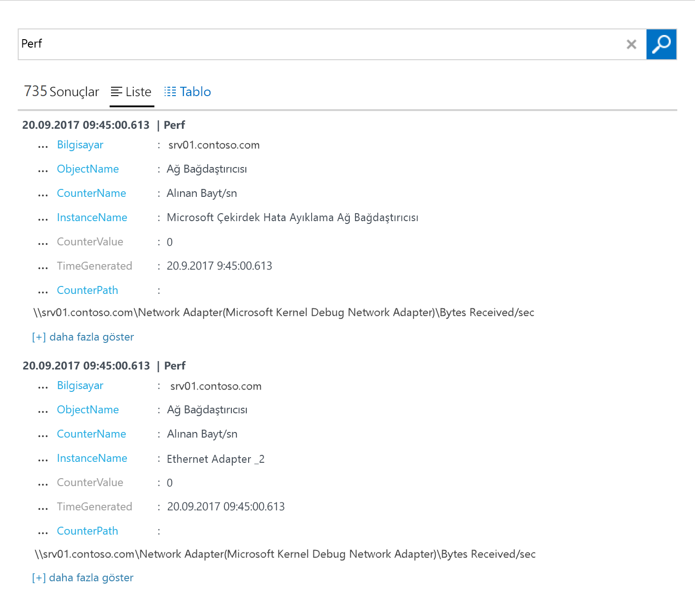

# Ortamınızda barındırılan Windows bilgisayarlardan veri toplama
[Azure günlük analizi](log-analytics-overview.md) veri ayrıntılı bir analiz ve bağıntı için tek bir depoda, fiziksel veya sanal Windows bilgisayarları ve diğer kaynakları ortamınızdaki doğrudan toplayabilirsiniz.  Bu hızlı başlangıç birkaç kolay adımda, bir Windows bilgisayardan veri toplamak ve yapılandırma gösterilmektedir.  Azure Windows VM'ler için aşağıdaki konuya bakın [verileri Azure sanal makineler hakkında toplama](log-analytics-quick-collect-azurevm.md).  
 
Azure aboneliğiniz yoksa başlamadan önce [ücretsiz bir hesap](https://azure.microsoft.com/free/?WT.mc_id=A261C142F) oluşturun.

## Azure portalında oturum açın
Oturum açtığınızda Azure portalında [https://portal.azure.com](https://portal.azure.com). 

## Çalışma alanı oluşturma
1. Azure portalında tıklatın **daha fazla hizmet** sol alt köşesindeki üzerinde bulunamadı. Kaynak listesinde **Log Analytics** yazın. Yazmaya başladığınızda liste, girişinize göre filtrelenir. Seçin **oturum Analytics**.       
2. Tıklatın **oluşturma**ve ardından aşağıdaki öğeler için seçenekleri seçin:

  * İçin yeni bir ad **OMS çalışma**, gibi *DefaultLAWorkspace*. 
  * Varsayılan seçili abonelik uygun değilse açılan listeden bağlanacak bir **Abonelik** seçin.
  * İçin **kaynak grubu**, bir veya daha fazla Azure sanal makineleri varolan bir kaynak grubu seçin.  
  * Seçin **konumu** Vm'leriniz dağıtılır.  Ek bilgi için bkz: [günlük analizi bulunan bölgelere](https://azure.microsoft.com/regions/services/).
  * Üç farklı seçebilirsiniz **fiyatlandırma katmanlarına** günlük analizi, ancak bulacağınızı seçmek için bu hızlı başlangıç için **ücretsiz** katmanı.  Belirli katmanları hakkında ek bilgi için bkz: [günlük analizi fiyatlandırma ayrıntıları](https://azure.microsoft.com/pricing/details/log-analytics/).

           
3. Üzerinde gerekli bilgileri girdikten sonra **OMS çalışma** bölmesinde tıklatın **Tamam**.  

Bilgilerin doğrulanıp çalışma alanının oluşturulması sırasında işlemin ilerleme durumunu menüdeki **Bildirimler**’in altından izleyebilirsiniz. 

## Çalışma alanı kimliği ve anahtarı edinin
Microsoft İzleme Aracısı için Windows yüklemeden önce çalışma alanı kimliği ve anahtarı ihtiyacınız günlük analizi çalışma alanınız için.  Bu bilgiler, düzgün olarak aracıyı yapılandırmak ve günlük analizi ile başarıyla iletişim kurabilmesini sağlamak için Kurulum Sihirbazı tarafından gereklidir.  

1. Azure portalında tıklatın **daha fazla hizmet** sol alt köşesindeki üzerinde bulunamadı. Kaynak listesinde **Log Analytics** yazın. Yazmaya başladığınızda liste, girişinize göre filtrelenir. Seçin **oturum Analytics**.
2. Günlük analizi çalışma alanları, listeden seçin *DefaultLAWorkspace* daha önce oluşturduğunuz.
3. Seçin **Gelişmiş ayarları**.       
4. Seçin **bağlı kaynakları**ve ardından **Windows sunucuları**.   
5. Değerin sağındaki **çalışma alanı kimliği** ve **birincil anahtar**. Kopyalayın ve her ikisi de, sık kullanılan düzenleyicisine yapıştırın.   

## Windows aracısı yükleyin
Aşağıdaki adımları yükleyip, bilgisayarınıza Microsoft Monitoring Agent için Kurulum kullanılarak Azure ve Azure kamu bulutta aracı günlük analizi için yapılandırın.  

1. Üzerinde **Windows sunucuları** sayfasında, uygun **Windows Aracısı indirme** Windows işletim sistemi işlemci mimarisine bağlı olarak indirmek için sürümü.
2. Aracısı bilgisayarınıza yüklemek için Kurulumu çalıştırın.
2. Üzerinde **Hoş Geldiniz** sayfasında, **sonraki**.
3. Üzerinde **Lisans Koşulları'nı** sayfasında, lisans okuyun ve ardından **ediyorum**.
4. Üzerinde **hedef klasörü** sayfasında, değiştirmek veya varsayılan yükleme klasörünü ve ardından **sonraki**.
5. Üzerinde **aracı Kur Seçenekleri** sayfasında, aracıyı Azure günlük analizi (OMS) bağlayın ve ardından **sonraki**.   
6. Üzerinde **Azure günlük analizi** sayfasında, aşağıdakileri yapın:
   1. Yapıştır **çalışma alanı kimliği** ve **çalışma alanı anahtarı (birincil anahtar)** daha önce kopyaladığınız.  Günlük analizi çalışma alanı Azure kamu bulutta bilgisayarın raporlama, seçin **Azure ABD devlet kurumları** gelen **Azure bulut** aşağı açılan liste.  
   2. Bilgisayar günlük analizi hizmeti için bir proxy sunucu üzerinden iletişim kurması gerekirse, tıklatın **Gelişmiş** URL'sini sağlayın ve bağlantı noktası proxy sunucusu sayısı.  Proxy sunucusu kimlik doğrulaması gerektiriyorsa, kullanıcı adı ve parola ile proxy sunucusuna kimlik doğrulaması ve ardından yazın **sonraki**.  
7. Tıklatın **sonraki** gerekli yapılandırma ayarlarını sağlama tamamladıktan sonra.     
8. Üzerinde **yüklemeye hazır** sayfasında, seçimlerinizi gözden geçirin ve ardından **yükleme**.
9. Üzerinde **yapılandırması başarıyla tamamlandı** sayfasında, **son**.

Tamamlandığında, **Microsoft İzleme Aracısı** görünür **Denetim Masası**. Yapılandırmanızı gözden geçirin ve aracı için günlük analizi bağlı olduğunu doğrulayın. , On bağlıyken **Azure günlük analizi (OMS)** sekmesinde, aracıyı görüntüler belirten iletiyi: **Microsoft Monitoring Agent Microsoft Operations Management Suite hizmetine başarıyla bağlandı.**   

## Olay ve performans verileri toplama
Günlük analizi uzun vadeli çözümleme ve raporlama için belirttiğiniz performans sayaçları ve Windows olay günlüğü olaylarını toplamak ve belirli bir koşula algılandığında adımları uygulayın.  Olaylar Windows olay günlüğü ve birkaç ortak performans sayaçlarını toplama başlamak yapılandırmak için aşağıdaki adımları izleyin.  

1. Azure portalında tıklatın **daha fazla hizmet** sol alt köşesindeki üzerinde bulunamadı. Kaynak listesinde **Log Analytics** yazın. Yazmaya başladığınızda liste, girişinize göre filtrelenir. Seçin **oturum Analytics**.
2. Seçin **Gelişmiş ayarları**.      
3. Seçin **veri**ve ardından **Windows olay günlüklerini**.  
4. Bir olay günlüğü, günlük adını yazarak ekleyin.  Tür **sistem** ve artı işaretini tıklatın  **+** .  
5. Tabloda önem derecelerine denetleyin **hata** ve **uyarı**.   
6. Tıklatın **kaydetmek** yapılandırmayı kaydetmek için sayfanın üstündeki.
7. Seçin **Windows performans verilerini** bir Windows bilgisayarda performans sayacı toplamayı etkinleştirmek için. 
8. Windows performans sayaçlarını yeni bir günlük analizi çalışma alanı için ilk yapılandırırken hızla birçok ortak sayaçları oluşturma seçeneği verilir. Bunlar, her yanındaki onay kutusunu ile listelenir.  .  Tıklatın **Seçili performans sayaçlarını Ekle**.  Bunlar eklenir ve on ikinci koleksiyon örnekleme aralığı ile hazır.  
9. Tıklatın **kaydetmek** yapılandırmayı kaydetmek için sayfanın üstündeki.

## Toplanan görünüm verileri
Veri toplama etkinleştirdiğinize göre bazı veriler hedef bilgisayardan görmek için basit günlük arama örneği çalıştırmak olanak sağlar.  

1. Seçilen çalışma alanı altında Azure portal'ı tıklatın **günlük arama** döşeme.  
2. Günlük arama bölmesinde Sorgu alan türü üzerinde `Perf` ve ardından isabet girin veya sorgu alanının sağındaki arama düğmesini tıklatın.      Örneğin, aşağıdaki resimde sorguda 735 performans kayıtları döndürdü.   

## Kaynakları temizleme
Artık gerekli olduğunda, bir Windows bilgisayardan aracıyı kaldırın ve günlük analizi çalışma alanı silin.  

Aracıyı kaldırmak için aşağıdaki adımları gerçekleştirin.

1. **Denetim Masası**'nı açın.
2. Açık **programlar ve Özellikler**.
3. İçinde **programlar ve Özellikler**seçin **Microsoft İzleme Aracısı** tıklatıp **kaldırma**.

Çalışma alanını silmek için daha önce ve kaynak sayfası tıklatıldığında oluşturduğunuz günlük analizi çalışma alanı seçin **silmek**.   

## Sonraki adımlar
Artık, işletimsel topluyorsunuz ve performans verileri şirket içi Linux bilgisayarınızdan, kolayca başlayabilir keşfetme, çözümleme ve için topladığınız veri alma eylemini *ücretsiz*.  

Görüntüleme ve verileri çözümleme öğrenmek için Öğreticisine devam edin.   

> [!div class="nextstepaction"]
> [Görüntülemek veya günlük analizi veri çözümleme](log-analytics-tutorial-viewdata.md)
