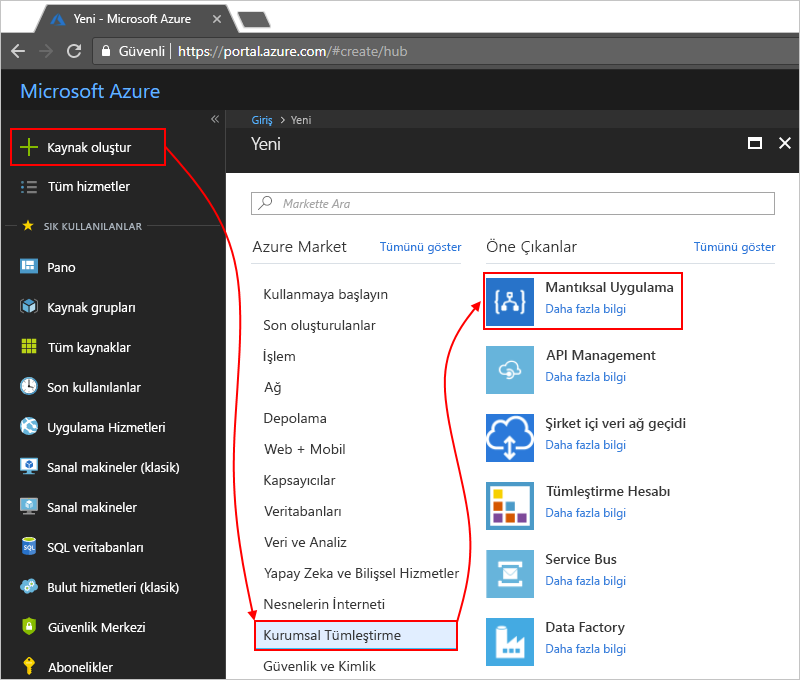

# Azure İzleyici günlükleri ile mantıksal uygulamaları izleme

İzleme ve logic apps hakkında daha zengin hata ayıklama bilgi almak üzere açmak [Azure İzleyici günlükleri](../log-analytics/log-analytics-overview.md) mantıksal uygulamanızı oluşturduğunuzda. Azure İzleyici günlüklerine Logic Apps yönetimi çözümü Azure Portalı'nda yüklediğinizde, logic apps için izleme ve günlüğe kaydetme tanılama sağlar. Bu çözüm, ayrıca mantıksal uygulamanız için toplanan bilgileri durumunu, yürütme süresi, yeniden gönderme durumu ve bağıntı kimlikleri gibi belirli Ayrıntılar ile çalışan sağlar. Bu makale Azure İzleyici günlüklerine üzerinde çalışma zamanı olayları görüntüleyebilir ve mantıksal uygulamanız için veri çalıştıran devre dışı bırakma.

Var olan mantıksal uygulamalar için Azure İzleyici günlüklerine etkinleştirmek için bu adımları izleyin. [tanılama günlük özelliğini açar ve Azure İzleyici günlüklerine logic app çalışma zamanı veri gönderme](../logic-apps/logic-apps-monitor-your-logic-apps.md#azure-diagnostics).

> [!NOTE]
> Bu sayfa, Microsoft Operations Management Suite (olan OMS ile), bu görevleri gerçekleştirmek adımlar daha önce açıklanan [Ocak 2019 ' devre dışı bırakma](../azure-monitor/platform/oms-portal-transition.md), bu adımlar, bunun yerine Azure Log Analytics ile değiştirir. 

[!INCLUDE [azure-monitor-log-analytics-rebrand](../../includes/azure-monitor-log-analytics-rebrand.md)]

## Önkoşullar

Başlamadan önce Log Analytics çalışma alanı gerekir. Bilgi [bir Log Analytics çalışma alanı oluşturma](../azure-monitor/learn/quick-create-workspace.md). 

## Mantıksal uygulama oluşturma tanılama günlüğünü etkinleştirme

1. İçinde [Azure portalında](https://portal.azure.com), mantıksal uygulama oluşturun. Seçin **kaynak Oluştur** > **tümleştirme** > **mantıksal uygulama**.

   

1. Altında **mantıksal uygulama oluştur**, gösterildiği gibi şu görevleri gerçekleştirebilirsiniz:

   1. Mantıksal uygulamanız için bir ad belirtin ve Azure aboneliğinizi seçin. 

   1. Oluşturun veya bir Azure kaynak grubu seçin.

   1. Ayarlama **Log Analytics** için **üzerinde**. 

   1. Liste Log Analytics çalışma alanı listeden mantıksal uygulamanız için veri çalıştıran göndermek istediğiniz çalışma alanını seçin. 

      

      Bu adımı tamamladıktan sonra Azure artık, mantıksal uygulama oluşturur, Log Analytics çalışma alanıyla ilişkili. 
      Ayrıca, bu adım ayrıca otomatik olarak çalışma alanınızda Logic Apps yönetim çözümü yükler.

   1. İşiniz bittiğinde **Oluştur**’u seçin.

1. Mantıksal uygulamanızı görüntülemek için çalıştığında, [bu adımlarla devam edin](#view-logic-app-runs-oms).

## Logic Apps yönetim çözümü yükleme

Mantıksal uygulamanızı oluştururken Azure İzleyici açtığında zaten etkinleştirdiyseniz, bu adımı atlayın. Zaten yüklü Logic Apps yönetimi çözümü vardır.

1. [Azure portalda](https://portal.azure.com) **Tüm hizmetler**’i seçin. Arama kutusuna "log analytics" bulup seçin **Log Analytics**.

   

1. Altında **Log Analytics**bulup Log Analytics çalışma alanınızı seçin. 

   

1. Altında **Log Analytics ile çalışmaya başlama** > **izleme çözümleri yapılandırma**, seçin **çözümleri görüntülemek**.

   

1. Genel bakış sayfasında, **Ekle**, açan **yönetim çözümleri** listesi. Bu listeden **Logic Apps Yönetimi**. 

   

   Listenin, çözüm bulamazsanız seçin **daha fazla Yükle** çözüm görünene kadar.

1. Seçin **Oluştur**, doğrulamak istediğiniz çözümü yüklemek ve sonra Log Analytics çalışma alanı **Oluştur** yeniden.   

   

   Mevcut bir çalışma alanı kullanmak istemiyorsanız, şu anda yeni bir çalışma alanı da oluşturabilirsiniz.

   İşiniz bittiğinde, Logic Apps yönetim çözümü genel bakış sayfasında görüntülenir. 

## Bilgi görünümü mantıksal uygulama

Mantıksal uygulamanızı çalıştıktan sonra bu çalıştırmaları sayısını ve durum görüntüleyebilirsiniz **Logic Apps Yönetimi** Döşe. 

1. Log Analytics çalışma alanınıza gidin ve genel bakış sayfasını açın. Seçin **Logic Apps Yönetimi**. 

   

   Burada, mantıksal uygulama çalıştırmalarınızı adına veya yürütme durumu göre gruplandırılır. 
   Bu sayfa ayrıca eylemler veya mantıksal uygulama çalıştırmaları için Tetikleyiciler hatalarıyla ilgili ayrıntıları gösterir.

   
   
1. Belirli bir mantıksal uygulama ya da durumu için tüm çalıştırmalarını görüntülemek için bir mantıksal uygulamada veya bir durum için satır seçin.

   Belirli bir mantıksal uygulama için tüm çalıştırmalarını gösteren bir örnek aşağıda verilmiştir:

   

   Bu sayfa, bu Gelişmiş seçenekler vardır:

   * **İzlenen özellikler:**

     Bu sütun, Eylemler, mantıksal uygulamanın göre gruplandırılmış izlenen özellikleri gösterir. İzlenen özellikleri görüntülemek için seçin **görünümü**. 
     İzlenen özellikler aramak için sütun filtresi kullanın.
   
     

     Yeni eklenen tüm izlenen özellikler, bunlar ilk kez görünmesi 10-15 dakika sürebilir. Bilgi [mantıksal uygulamanız için izlenen Özellikler ekleme](logic-apps-monitor-your-logic-apps.md#azure-diagnostics-event-settings-and-details).

   * **Yeniden gönderin:** Başarısız, bir veya daha fazla mantıksal uygulama çalıştırmaları başarılı, yeniden gönderebilirsiniz veya hala çalışıyor. Çalıştırmaları yeniden gönderin ve istediğiniz onay kutularını seçin **yeniden**. 

     

1. Bu sonuçları filtrelemek için hem istemci hem de sunucu tarafı filtreleme gerçekleştirebilirsiniz.

   * **İstemci tarafı filtresi**: Her sütun için örneğin istediğiniz filtreleri seçin:

     

   * **Sunucu tarafı filtresi**: Belirli bir zaman penceresinin seçin ya da görünen çalışmaları sayısını sınırlamak için sayfanın en üstündeki kapsam denetimi kullanın. Varsayılan olarak, aynı anda yalnızca 1.000 kayıtları görünür.
   
     
 
1. Tüm eylemleri ve belirli bir çalıştırma ayrıntılarını görüntülemek için bir mantıksal uygulama çalıştırması için bir satır seçin.

   Belirli bir mantıksal uygulama için çalıştırma için tüm eylemleri gösteren bir örnek aşağıda verilmiştir:

   
   
1. Tüm sonuçları sayfasında, sonuçları ardındaki sorguyu görüntülemek için veya tüm sonuçları görmek için seçin **bkz tüm**, günlük araması sayfasını açar.
   
   
   
   Günlük araması sayfasında

   * Bir tablodaki sorgu sonuçlarını görmek için **tablo**.

   * Sorguyu değiştirmek için sorgu dizesini arama çubuğunda düzenleyebilirsiniz. 
   Daha iyi bir deneyim için seçin **Advanced Analytics**.

     
     
     Log analytics sayfasında güncelleştirme sorguları ve tablodan sonuçları görüntüleyin. Bu sorgu kullanan [Kusto sorgu dili](https://aka.ms/LogAnalyticsLanguageReference), farklı sonuçlar görüntülemek istiyorsanız, düzenleyebilirsiniz. 

     

## Sonraki adımlar

* [B2B iletilerini izleme](../logic-apps/logic-apps-monitor-b2b-message.md)