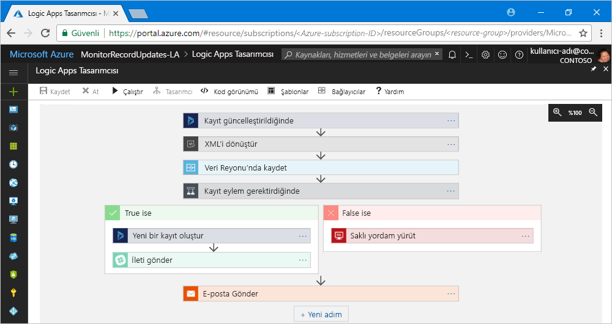

# Azure Logic Apps nedir?

[Azure Logic Apps](https://azure.microsoft.com/services/logic-apps), farklı kurumlardaki veya kuruluşlardaki uygulamaları, verileri, sistemleri ve hizmetleri tümleştirmeye ihtiyaç duyduğunuzda görevleri, iş süreçlerini ve [iş akışlarını](#logic-app-concepts) otomatikleştirmenize ve düzenlemenize yardımcı olan bir bulut hizmetidir. Mantıksal uygulamalar tasarlama ve uygulama için ölçeklenebilen çözümler oluşturun basitleştirir [tümleştirme](https://azure.microsoft.com/product-categories/integration/), veri tümleştirmesi, sistem tümleştirmesi, kuruluş uygulaması tümleştirme (EAI) ve işletmeden işletmeye (B2B) iletişimi elinizin altında Bulut, şirket içi veya her ikisi de.

Mantıksal uygulamalarla otomatikleştirebileceğiniz birkaç iş yükü örneği aşağıda verilmiştir:

* Şirket içi sistemlerde ve bulut hizmetlerinde siparişleri işleme ve yönlendirme.
* Çeşitli sistemlerde, uygulamalarda ve hizmetlerde olaylar gerçekleştiğinde Office 365 ile e-posta bildirimi gönderme.
* Karşıya yüklenen dosyaları bir SFTP veya FTP sunucusundan Azure Depolama’ya taşıma. 
* Belirli bir konu için tweet’leri izleme, yaklaşımı analiz etme ve gözden geçirilmesi gereken öğeler için uyarılar veya görevler oluşturma.

Azure Logic Apps ile kurumsal tümleştirme çözümleri oluşturmak için Azure Service Bus, İşlevler ve Depolama gibi Azure hizmetleri; SQL, Office 365, Dynamics, Salesforce, BizTalk, SAP, Oracle DB, dosya paylaşımları ve diğer birçok hizmet dahil olmak üzere [200'den fazla bağlayıcıya](../connectors/apis-list.md) sahip olan galeriden seçim yapabilirsiniz. [Bağlayıcılar](#logic-app-concepts), verilere gerçek zamanlı olarak güvenli bir şekilde erişen ve verileri işleyen mantıksal uygulamalar oluşturmaya yönelik [tetikleyiciler](#logic-app-concepts), [eylemler](#logic-app-concepts) veya her ikisini de sağlar.

> [!VIDEO https://channel9.msdn.com/Blogs/Azure/Introducing-Azure-Logic-Apps/player]

## Logic Apps nasıl çalışır? 

Her mantıksal uygulama, belirli bir olay gerçekleştiğinde veya yeni kullanılabilir veriler belirli ölçütleri karşıladığında tetiklenen bir tetikleyici ile başlar. Birçok tetikleyici, iş yüklerinizin ne düzende çalıştırılacağını belirtebilmeniz için temel zamanlama özellikleri içerir. Diğer özel zamanlama senaryoları için iş akışlarınızı Zamanlama tetikleyicisiyle başlatın. [Zamanlama tabanlı iş akışları oluşturma](../logic-apps/tutorial-build-schedule-recurring-logic-app-workflow.md) hakkında daha fazla bilgi edinin.

Tetikleyici her tetiklendiğinde, Logic Apps altyapısı iş akışındaki eylemleri çalıştıran bir mantıksal uygulama örneği oluşturur. Bu eylemlere koşullu deyimler, switch deyimleri, döngüler ve dallanma gibi veri dönüşümleri ve akış denetimleri de dahil olabilir. Örneğin, bu mantıksal uygulama yerleşik olarak “Bir kayıt güncelleştirildiğinde” ölçütüne sahip olan bir Dynamics 365 tetikleyicisi ile başlatılır. Tetikleyici bu ölçütle eşleşen bir olay algıladığında tetiklenir ve iş akışının eylemlerini çalıştırır. Burada, bu eylemlere XML dönüşümü, veri güncelleştirmeleri, karar dallanması ve e-posta bildirimleri dahildir.

Mantıksal uygulamalarınızı tarayıcınız aracılığıyla Azure portalda ve Visual Studio’da sunulan Logic Apps Tasarımcısı ile görsel olarak oluşturabilirsiniz. Daha özel mantıksal uygulamalar için “kod görünümü” düzenleyicisinde çalışarak JavaScript Nesne Gösterimi (JSON) biçiminde mantıksal uygulama tanımları oluşturabilir ya da bu tanımları düzenleyebilirsiniz. Belirli görevler için Azure PowerShell komutlarını ve Azure Resource Manager şablonlarını da kullanabilirsiniz. Mantıksal uygulamalar Azure’a dağıtılarak bulutta çalıştırılır. Daha ayrıntılı bir giriş için bu videoyu izleyin: [Azure Kurumsal tümleştirme hizmetlerini uygun ölçekte bulut uygulamaları çalıştırmak için kullanın](https://channel9.msdn.com/Events/Connect/2017/T119/)

## Logic Apps neden kullanılmalı?

İşletmelerin dijitalleşmeye yönelmesiyle birlikte, mantıksal uygulamalar önceden oluşturulmuş API’ler ve Microsoft tarafından yönetilen bağlayıcılar sağlayarak eski, modern ve son teknoloji sistemleri daha kolay ve hızlı bir şekilde bağlamanıza yardımcı olur. Bu sayede, uygulamalarınızın iş mantığına ve işlevselliğine odaklanabilirsiniz. Uygulamalarınızı oluşturma, barındırma, ölçeklendirme, yönetme, izleme ve uygulamalarınızın bakımını yapma gibi konularda endişelenmeniz gerekmez. Logic Apps bu işlemleri sizin yerinize halleder. Üstelik, bir tüketim [fiyatlandırma modeline](../logic-apps/logic-apps-pricing.md) göre yalnızca kullandığınız kadar ödersiniz. 

Çoğu durumda kod yazmanız gerekmez. Bununla birlikte, kod yazmanız gerekiyorsa [Azure İşlevleri](../azure-functions/functions-overview.md) ile kod parçacıkları oluşturup mantıksal uygulamalardan isteğe bağlı olarak çalıştırabilirsiniz. Ayrıca, mantıksal uygulamalarınızın Azure hizmetleri, özel uygulamalar veya diğer çözümlerden olaylarla etkileşim kurması gerekiyorsa olay izleme, yönlendirme ve yayımlama için mantıksal uygulamalarınızda [Azure Event Grid](../event-grid/overview.md)’i kullanabilirsiniz.

Logic Apps, İşlevler ve Event Grid’in Microsoft Azure tarafından tam olarak yönetilmesi sayesinde, çözümlerinizi oluşturma, barındırma, ölçeklendirme, yönetme, izleme ve çözümlerinizin bakımını yapma konusunda endişelenmeniz gerekmez. [“Sunucusuz” uygulamalar ve çözümler](../logic-apps/logic-apps-serverless-overview.md) oluşturma olanağı sayesinde yalnızca iş mantığına odaklanabilirsiniz. Bu hizmetler, ihtiyaçlarınızı karşılayacak, tümleştirme işlemlerini hızlandıracak ve olabildiğince az kodla sağlam bulut uygulamaları oluşturmanıza yardımcı olacak şekilde otomatik olarak ölçeklenir. Üstelik, bir tüketim [fiyatlandırma modeline](../logic-apps/logic-apps-pricing.md) göre yalnızca kullandığınız kadar ödersiniz. 

İşletmelerin Logic Apps’i diğer Azure hizmetleri ve Microsoft ürünleriyle birleştirerek nasıl çevikliklerini geliştirdiğini ve asıl işlerine odaklanabildiğini öğrenmek için bu [müşteri hikayelerine](https://aka.ms/logic-apps-customer-stories) göz atın.

İşte Logic Apps ile sahip olacağınız özellik ve avantajların diğer ayrıntıları:

### Kullanımı kolay araçlarla görsel olarak iş akışları oluşturun

Görsel tasarım araçlarıyla zamandan tasarruf edin ve karmaşık işlemleri basitleştirin. Mantıksal uygulama oluşturma sürecinin başından sonuna kadar tarayıcınız aracılığıyla Azure portalında ya da Visual Studio’da Logic Apps Tasarımcısı’nı kullanın. İş akışınızı bir tetikleyiciyle başlatın ve [bağlayıcı galerisinden](../connectors/apis-list.md) dilediğiniz sayıda eylem ekleyin.

### Mantıksal uygulama şablonlarıyla daha hızlı bir başlangıç yapın

[Şablon galerisindeki](../logic-apps/logic-apps-create-logic-apps-from-templates.md) önceden tanımlanmış iş akışlarından seçim yaparak yaygın olarak kullanılan çözümleri daha hızlı bir şekilde oluşturun. Hizmet olarak yazılım (SaaS) uygulamaları için basit bağlantıdan tutun B2B çözümlerine ve "eğlencelik" şablonlara kadar çeşitlilik gösteren şablonlar vardır. [Önceden oluşturulmuş şablonlardan mantıksal uygulama oluşturma](../logic-apps/logic-apps-create-logic-apps-from-templates.md) hakkında bilgi edinin.

### Farklı ortamlardaki bağımsız sistemleri bağlama

Kolayca açıklanabilen bazı desen ve iş akışlarının kodda uygulanması zordur. Mantıksal uygulamalar, şirket içindeki ve buluttaki ortamlarda bulunan bağımsız sistemleri sorunsuzca bağlamanıza yardımcı olur. Örneğin, bir bulut pazarlama çözümünü şirket içi bir faturalandırma sistemine bağlayabilir ya da API’ler ve sistemler arası mesajlaşmayı bir Enterprise Service Bus ile merkezi hale getirebilirsiniz. Mantıksal uygulamalar, bu senaryolar için yeniden kullanılabilir ve yeniden yapılandırılabilir çözümler sunmanın hızlı, güvenilir ve tutarlı bir yoludur.

### Kurumsal tümleştirme ve B2B senaryoları için birinci sınıf destek

İşletme ve kuruluşlar, EDIFACT, AS2 ve X12 gibi endüstri standardı haline gelmesine rağmen farklı olan mesaj protokollerini ve biçimlerini kullanarak birbirleriyle elektronik olarak iletişim kurar. [Enterprise Integration Pack (EIP)](../logic-apps/logic-apps-enterprise-integration-overview.md) paketindeki özelliklerle, iş ortaklarınız tarafından kullanılan mesaj biçimlerini kuruluşunuzdaki sistemlerin yorumlayıp işleyebileceği biçimlere dönüştüren matıksal uygulamalar oluşturabilirsiniz. Logic Apps, bu değişimleri pürüzsüz bir şekilde işlemesinin yanı sıra şifreleme ve dijital imzalarla güvenlik sağlar.

Geçerli sistem ve hizmetlerinizi kullanarak küçük bir başlangıç yapın ve kendinize uygun bir hızda kademeli olarak büyütün. Hazır olduğunuzda, Logic Apps ve EIP tarafından sağlanan bu ve diğer özellikler çözümünüzü uygulamanıza ve ölçeği daha olgun tümleştirme senaryoları elde edecek şekilde büyütmenize yardımcı olur:

* Şu ürün ve hizmetlerden yararlanarak oluşturun:

  * [Microsoft BizTalk Server](https://docs.microsoft.com/biztalk/core/introducing-biztalk-server)
  * [Azure Service Bus](../service-bus-messaging/service-bus-messaging-overview.md)
  * [Azure İşlevleri](../azure-functions/functions-overview.md)
  * [Azure API Management](../api-management/api-management-key-concepts.md)

* [XML mesajlarını](../logic-apps/logic-apps-enterprise-integration-xml.md) işleme
* [Düz dosyaları](../logic-apps/logic-apps-enterprise-integration-flatfile.md) işleme
* [EDIFACT](../logic-apps/logic-apps-enterprise-integration-edifact.md), [AS2](../logic-apps/logic-apps-enterprise-integration-as2.md) ve [X12](../logic-apps/logic-apps-enterprise-integration-x12.md) protokolleriyle mesaj alışverişi yapma
* [Tümleştirme hesapları](../logic-apps/logic-apps-enterprise-integration-accounts.md) ile bu B2B yapıtlarını ve daha fazlasını tek bir yerde depolayıp yönetin:

  * [İş ortakları](../logic-apps/logic-apps-enterprise-integration-partners.md)
  * [Sözleşmeler](../logic-apps/logic-apps-enterprise-integration-agreements.md) 
  * [XML dönüştürme eşlemeleri](../logic-apps/logic-apps-enterprise-integration-maps.md)
  * [XML doğrulama şemaları](../logic-apps/logic-apps-enterprise-integration-schemas.md)
   
Örneğin Microsoft BizTalk Server kullanıyorsanız Logic Apps [BizTalk Server bağlayıcısını](../connectors/apis-list.md#on-premises-connectors) kullanarak BizTalk Server ile iletişim kurabilir. Ardından Enterprise Integration Pack ile sunulan [tümleştirme hesabı bağlayıcılarını](../connectors/apis-list.md#integration-account-connectors) dahil ederek Logic Apps uygulamalarınızda BizTalk benzeri işlemlerini genişletebilir veya gerçekleştirebilirsiniz. 

Diğer taraftan BizTalk Server da [Microsoft BizTalk Server Adapter for Logic Apps](https://www.microsoft.com/download/details.aspx?id=54287) uygulamasını kullanarak Logic Apps ile bağlantı ve iletişim kurabilir. BizTalk Server örneğinizde [BizTalk Server Adapter uygulamasını ayarlamayı ve kullanmayı](https://docs.microsoft.com/biztalk/core/logic-app-adapter) öğrenin.

### Bir kere yazın, tekrar tekrar kullanın

Mantıksal uygulamalarınızı birden çok ortamda ve bölgede [dağıtıp yeniden yapılandırabilmek](../logic-apps/logic-apps-create-deploy-template.md) için şablon olarak oluşturun.

### Yerleşik genişletilebilirlik

İstediğiniz veya özel kod çalıştırmak için gereksinim duyduğunuz bağlayıcıyı bulamazsanız [Azure İşlevleri](../azure-functions/functions-overview.md) aracılığıyla isteğe bağlı olarak kendi kod parçacıklarınızı oluşturup bunlara çağrı yaparak mantıksal uygulamaları genişletebilirsiniz. Mantıksal uygulamalardan arayabileceğiniz kendi [API’lerinizi](../logic-apps/logic-apps-create-api-app.md) ve [özel bağlayıcılarınızı](../logic-apps/custom-connector-overview.md) oluşturun.

### Yalnızca kullandığınız kadar ödeyin
  
Logic Apps, daha önce App Service planlarıyla mantıksal uygulamalar oluşturmadıysanız tüketim tabanlı [fiyatlandırma ve ölçüm](../logic-apps/logic-apps-pricing.md) kullanır.

Bu giriş videoları ile Logic Apps hakkında daha fazla bilgi edinin:

* [Logic Apps ile tümleştirme - Sıfırdan başlayıp zirveye tırmanın](https://channel9.msdn.com/Events/Build/2017/C9R17)
* [Microsoft Azure Logic Apps ile kurumsal tümleştirme](https://channel9.msdn.com/Events/Ignite/Microsoft-Ignite-Orlando-2017/BRK2188)
* [Logic Apps ile gelişmiş iş süreçleri oluşturma](https://channel9.msdn.com/Events/Ignite/Microsoft-Ignite-Orlando-2017/BRK3179)

## Önemli terimler

* **İş akışı**: Görselleştirme, tasarlamasına, hazırlamasına, otomatikleştirin ve iş süreçlerini adımları bir dizi olarak dağıtın.

* **Yönetilen Bağlayıcılar**: Mantıksal uygulamalarınızın veri, hizmetlerinize ve sistemlerinize erişim gerekir. Önceden oluşturulmuş, Microsoft tarafından yönetilen ve verilerinize bağlanmak, erişmek ve verilerle çalışmak için tasarlanan bağlayıcıları kullanabilirsiniz. Bkz. [Azure Logic Apps için Bağlayıcılar](../connectors/apis-list.md)

* **Tetikleyiciler**: Birçok Microsoft tarafından yönetilen bağlayıcılar, olayları ya da yeni veri belirtilen koşulları karşıladığında tetiklenen Tetikleyiciler sağlar. Örneğin, bir olay e-posta alıyor veya Azure Depolama hesabınızdaki değişiklikleri algılıyor olabilir. Tetikleyici her tetiklendiğinde, Logic Apps altyapısı iş akışını çalıştıran yeni bir mantıksal uygulama örneği oluşturur.

* **Eylemler**: Eylemler tetikleyiciden sonra gerçekleşen tüm adımlardır. Genellikle her eylem, yönetilen bir bağlayıcı, özel API veya özel bağlayıcı tarafından tanımlanan bir işlemle eşlenir.

* **Enterprise Integration Pack**: Daha gelişmiş tümleştirme senaryoları için Logic Apps, BizTalk Server özelliklerini içerir. Enterprise Integration Pack, mantıksal uygulamaların doğrulama ve dönüştürme gibi işlemleri kolayca gerçekleştirmesine yardımcı olan bağlayıcılar sağlar.

## Logic Apps ile İşlevler, Web İşleri ve Flow arasındaki fark nedir?

Bu hizmetlerin tümü, bir "yapıştırıcı" ile bağımsız sistemleri birleştirmenize yardımcı olur. Her hizmetin kendine özgü avantajları olduğundan, hızlı bir şekilde ölçeklenebilen, tam özellikli bir tümleştirme sistemi oluşturmanın en iyi yolu bunların özelliklerini birleştirmektir. Daha fazla bilgi için bkz. [Flow, Logic Apps, Azure İşlevleri ve Web İşleri arasında seçim yapma](../azure-functions/functions-compare-logic-apps-ms-flow-webjobs.md).

## başlarken 

Logic Apps, Microsoft Azure’da barındırılan birçok hizmetten biridir. Bu nedenle, başlamak için önce bir Azure aboneliğine sahip olmanız gerekir. Aboneliğiniz yoksa, <a href="https://azure.microsoft.com/free/" target="_blank">ücretsiz bir Azure hesabı için kaydolun</a>. 

Azure aboneliğiniz varsa, bir RSS akışı aracılığıyla bir web sitesindeki yeni içerikleri izleyen ve yeni içerik göründüğünde e-posta gönderen [ilk mantıksal uygulamanızı oluşturmak için bu hızlı başlangıcı](../logic-apps/quickstart-create-first-logic-app-workflow.md) deneyin.

## Destek ve geri bildirim

* Sorularınız için [Azure Logic Apps forumunu](https://social.msdn.microsoft.com/Forums/en-US/home?forum=azurelogicapps) ziyaret edin.
* Özelliklerle ilgili fikirlerinizi göndermek veya gönderilmiş olanları oylamak için [Logic Apps kullanıcı geri bildirimi sitesini](https://aka.ms/logicapps-wish) ziyaret edin.

## Sonraki adımlar

* [Zamanlama tabanlı mantıksal uygulama ile trafiği denetleme](../logic-apps/tutorial-build-schedule-recurring-logic-app-workflow.md)
* [Azure ile sunucusuz çözümler](../logic-apps/logic-apps-serverless-overview.md) hakkında daha fazla bilgi edinin
* [Enterprise Integration Pack ile B2B tümleştirmesi](../logic-apps/logic-apps-enterprise-integration-overview.md) hakkında daha fazla bilgi edinin
