# <a name="quickstart-create-your-first-automated-workflow-with-azure-logic-apps---azure-portal"></a>Hızlı Başlangıç: Azure Logic Apps - Azure portalı ile ilk otomatik iş akışınızı oluşturun

Bu hızlı başlangıçta, [Azure Logic Apps](../logic-apps/logic-apps-overview.md) ile ilk otomatik iş akışınızı nasıl oluşturabileceğiniz konusuna giriş yapılır. Bu makalede, bir web sitesinin RSS akışında yeni öğe olup olmadığını düzenli olarak denetleyen bir mantıksal uygulama oluşturursunuz. Yeni öğeler varsa, mantıksal uygulama her öğe için bir e-posta gönderir. İşlemi tamamladığınızda, mantıksal uygulamanız bu yüksek düzeyli iş akışı gibi görünür:


Bu hızlı başlangıcı izleyebilmeniz için Logic Apps tarafından desteklenen Office 365 Outlook, Outlook.com veya Gmail gibi bir sağlayıcıdan e-posta hesabınız olmalıdır. Diğer sağlayıcılar için [buradaki bağlayıcı listesini inceleyin](https://docs.microsoft.com/connectors/). Bu mantıksal uygulama bir Office 365 Outlook hesabı kullanır. Başka bir e-posta hesabı kullanıyorsanız genel adımlar aynıdır, ancak kullanıcı arabirimi biraz farklı olabilir. 

Ayrıca, Azure aboneliğiniz yoksa [ücretsiz bir Azure hesabı için kaydolun](https://azure.microsoft.com/free/).

## <a name="sign-in-to-the-azure-portal"></a>Azure portalında oturum açın

Azure hesabınızın kimlik bilgileriyle [Azure portalında](https://portal.azure.com) oturum açın.

## <a name="create-your-logic-app"></a>Mantıksal uygulamanızı oluşturma 

1. Azure ana menüsünden **Kaynak oluştur** > **Tümleştirme** > **Mantıksal Uygulama**'yı seçin.

   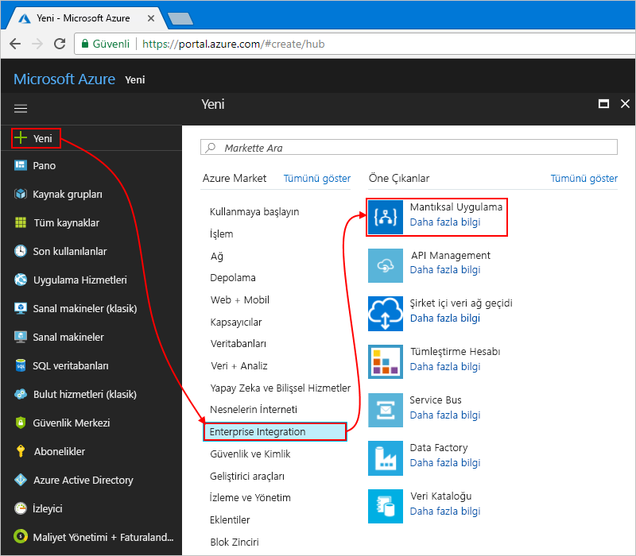

1. **Mantıksal uygulama oluştur** bölümünde, mantıksal uygulamanızın ayrıntılarını burada gösterildiği gibi sağlayın. Bitirdikten sonra seçin **Oluştur**.

   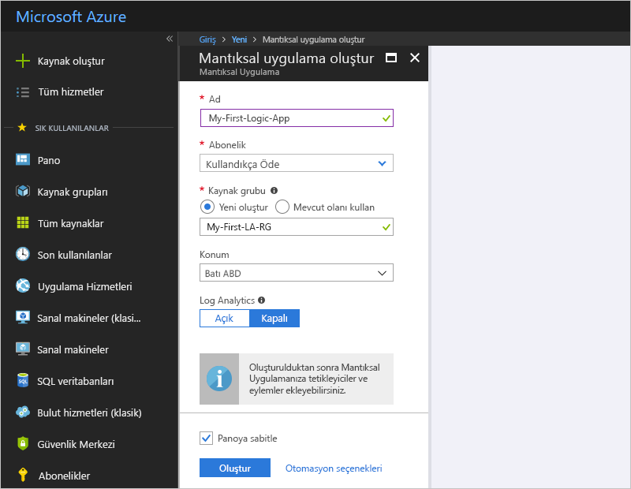

   | Özellik | Değer | Açıklama | 
   |----------|-------|-------------| 
   | **Ad** | MyFirstLogicApp | Mantıksal uygulamanızın adı | 
   | **Abonelik** | <*your-Azure-subscription-name*> | Azure aboneliğinizin adı | 
   | **Kaynak grubu** | My-First-LA-RG | İlgili kaynakların düzenlenmesi için kullanılan [Azure kaynak grubunun](../azure-resource-manager/resource-group-overview.md) adı | 
   | **Konum** | Batı ABD | Mantıksal uygulamanıza ait bilgilerin depolanacağı bölge | 
   | **Log Analytics** | Kapalı | Tanılama günlüğüne kaydetme ayarını **Kapalı** durumda bırakın. | 
   |||| 

1. Uygulamanız Azure tarafından dağıtıldıktan sonra Logic Apps Tasarımcısı açılır ve bir tanıtım videosu ile sık kullanılan tetikleyicilerin bulunduğu bir sayfa görüntülenir. **Şablonlar** bölümünde **Boş Mantıksal Uygulama**'yı seçin.

   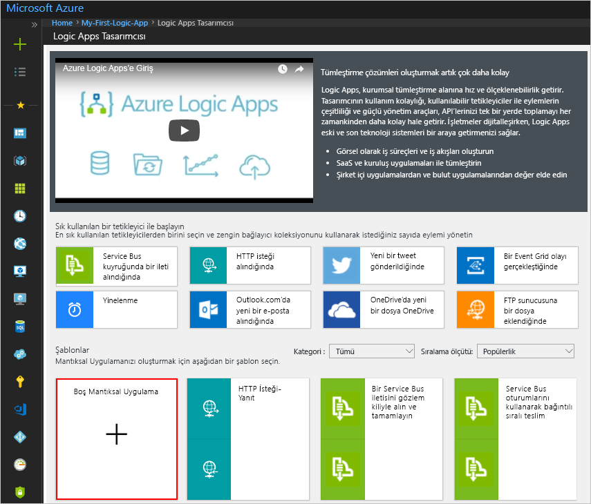

Sonra, yeni bir RSS akışı öğesi göründüğünde tetiklenen bir [tetikleyici](../logic-apps/logic-apps-overview.md#logic-app-concepts) ekleyin. Her mantıksal uygulama, belirli bir olay gerçekleştiğinde ya da belirli bir koşul karşılandığında tetiklenen bir tetikleyiciyle başlamalıdır. Tetikleyici her etkinleştirildiğinde Logic Apps altyapısı iş akışınızı başlatan ve çalıştıran bir mantıksal uygulama örneği oluşturur.

<a name="add-rss-trigger"></a>

## <a name="check-rss-feed-with-a-trigger"></a>Bir tetikleyici ile RSS akışı denetleme

1. Logic Apps Tasarımcısı'nda arama kutusunun altındaki seçin **tüm**.

1. Arama kutusuna "rss" yazın. Tetikleyiciler listesinden şu tetikleyiciyi seçin: **Akış öğesi yayımlandığında - RSS**

   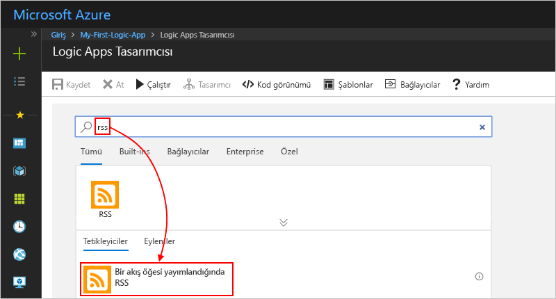

1. Tetikleyicinize ait bu bilgileri gösterildiği ve açıklandığı gibi sağlayın:

   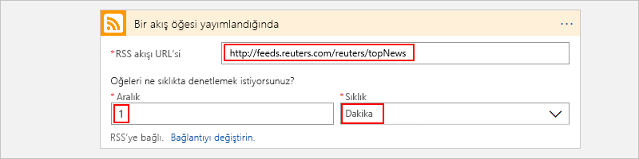

   | Özellik | Değer | Açıklama | 
   |----------|-------|-------------| 
   | **RSS akışının URL'si** | ```http://feeds.reuters.com/reuters/topNews``` | İzlemek istediğiniz RSS akışının bağlantısı | 
   | **Aralık** | 1 | Denetimler arasında beklenecek aralık sayısı | 
   | **Sıklık** | Dakika | Denetimler arası her aralık için zaman birimi  | 
   |||| 

   Aralık ve sıklık özelliği, mantıksal uygulamanızın tetikleyicisi için zamanlamayı tanımlar. 
   Bu mantıksal uygulama, akışı dakika başı denetler.

1. Tetikleyici ayrıntılarını şimdilik gizlemek için tetikleyicinin başlık çubuğunun içine tıklayın.

   

1. Mantıksal uygulamanızı kaydedin. Tasarımcı araç çubuğunda **Kaydet**'i seçin.

Mantıksal uygulamanız çalışıyor ancak RSS akışını kontrol etme dışında bir işlem gerçekleştirmiyor. Şimdi, tetikleyici etkinleştirildiğinde gerçekleştirilecek bir eylem ekleyin.

## <a name="send-email-with-an-action"></a>Bir eylemle e-posta gönderme

Şimdi, RSS akışında yeni bir öğe göründüğünde e-posta gönderen bir [eylem](../logic-apps/logic-apps-overview.md#logic-app-concepts) ekleyin.

1. Altında **ne zaman bir akış öğesi yayımlandığında** tetikleme öğesini **yeni adım**.

   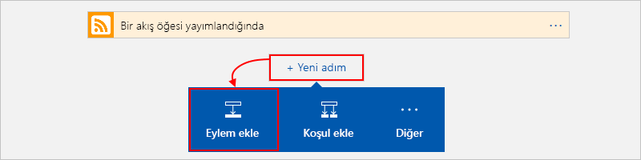

1. Altında **eylem seçin** ve arama kutusunda **tüm**.

1. Arama kutusuna "e-posta Gönder" girin. Eylemler listesinden istediğiniz e-posta sağlayıcısıyla "e-posta gönder" eylemini seçin.

   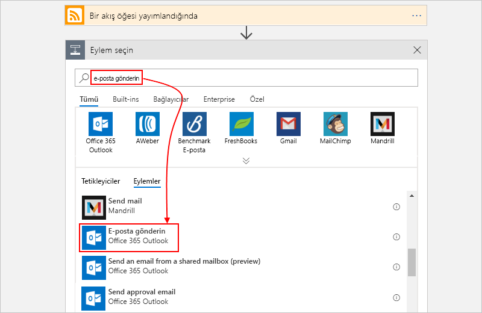

   Eylem listesini belirli bir uygulama veya hizmeti içerek şekilde filtrelemek için önce uygulama ya da hizmeti seçebilirsiniz:

   * Azure iş veya okul hesapları için Office 365 Outlook girişini seçin. 
   * Kişisel Microsoft hesapları için Outlook.com girişini seçin.

1. Kimlik bilgileriniz istenirse, Logic Apps’in e-posta hesabınıza yönelik bir bağlantı oluşturması için e-posta hesabınızda oturum açın.

1. **E-posta gönderme** eyleminde, e-postanızın içermesini istediğiniz verileri belirtin.

   1. **Alıcı** kutusuna alıcının e-posta adresini girin. 
   Test için kendi e-posta adresinizi kullanabilirsiniz.

      Görüntülenen **Dinamik içerik ekle** listesini şimdilik yoksayın. 
      Bazı düzenleme kutularının içine tıkladığınızda bu liste görünür ve önceki adımdan iş akışınıza girdi olarak ekleyebileceğiniz tüm kullanılabilir parametreleri gösterir. 

   1. **Konu** kutusuna, sonuna bir boşluk koyarak şu metni girin: ```New RSS item:```

      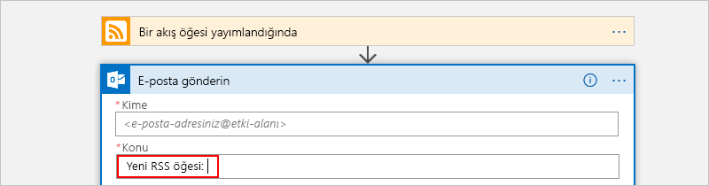

   1. RSS öğesinin başlığını eklemek için **Dinamik içerik ekle** listesinden **Akış başlığı**’nı seçin.

      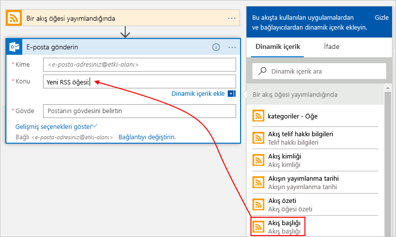

      İşlem tamamlandığında e-posta konusu şu örnekteki gibi görünür:

      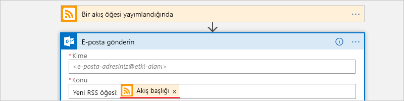

      Tasarımcıda bir "For each" döngüsü görünüyorsa, dizi için belirteç (örneğin, **categories-item** belirteci) seçmişsiniz demektir. 
      Bu tür belirteçler için tasarımcı otomatik olarak ilgili belirtece başvuran eylemin etrafına bu döngüyü ekler. 
      Bu şekilde mantıksal uygulamanız dizideki tüm öğeler için aynı eylemi gerçekleştirir. 
      Döngüyü kaldırmak için döngünün başlık çubuğundaki **üç nokta** (**...**) simgesini ve ardından **Sil**'i seçin.

   1. **Gövde** kutusuna bu metni girin ve e-posta gövdesi için bu belirteçleri seçin. 
   Bir düzenleme kutusuna boş satır eklemek için Shift + Enter tuşlarını kullanın. 

      

      | Özellik | Açıklama | 
      |----------|-------------| 
      | **Akış başlığı** | Öğenin başlığı | 
      | **Akış yayımlanma zamanı** | Öğenin yayımlandığı tarih ve saat | 
      | **Birincil akış bağlantısı** | Öğenin URL'si | 
      |||

1. Mantıksal uygulamanızı kaydedin.

Daha sonra, mantıksal uygulamanızı test edin.

## <a name="run-your-logic-app"></a>Mantıksal uygulamanızı çalıştırın

Mantıksal uygulamanızı el ile başlatmak için tasarımcı araç çubuğundan **Çalıştır**'ı seçin. Veya mantıksal uygulamanızın belirttiğiniz zamanlamaya (dakika başı) göre RSS akışını denetlemesini bekleyin. RSS akışında yeni öğeler olduğunda mantıksal uygulamanız her yeni öğe için bir e-posta gönderir. Aksi takdirde mantıksal uygulamanız yeniden denetlemek için bir sonraki zaman aralığını bekler. 

Örneğin, bu mantıksal uygulamanın gönderdiği örnek bir e-posta aşağıda verilmiştir. E-posta gelmezse istenmeyen e-posta klasörüne bakın.

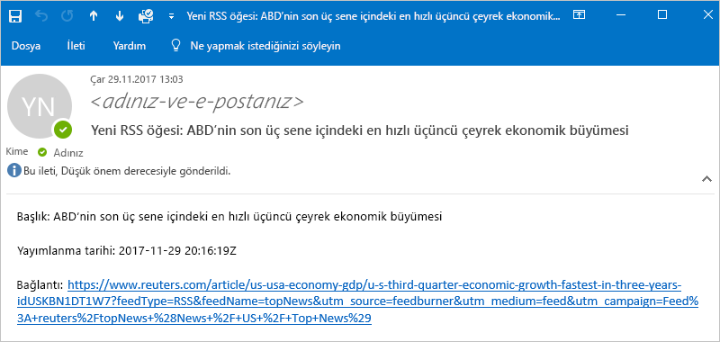

Teknik olarak tetikleyici, RSS akışını denetleyip yeni öğeler bulduğunda tetikleyici etkinleşir ve Logic Apps altyapısı, mantıksal uygulama iş akışınızın, iş akışında eylemleri çalıştıran bir örneğini oluşturur.
Tetikleyici yeni öğeler bulmazsa tetikleyici etkinleşmez ve iş akışı örneğini oluşturma işlemini "atlar".

Tebrikler, artık Azure portalı ile ilk mantıksal uygulamanızı başarıyla derleyip çalıştırdınız!

## <a name="clean-up-resources"></a>Kaynakları temizleme

Artık bu örneğe ihtiyacınız yoksa mantıksal uygulamanızı ve ilgili kaynakları içeren kaynak grubunu silin. 

1. Ana Azure menüsünde **Kaynak grupları**’na gidin ve mantıksal uygulamanızın kaynak grubunu seçin. **Genel Bakış** sayfasında **Kaynak grubunu sil**’i seçin. 

   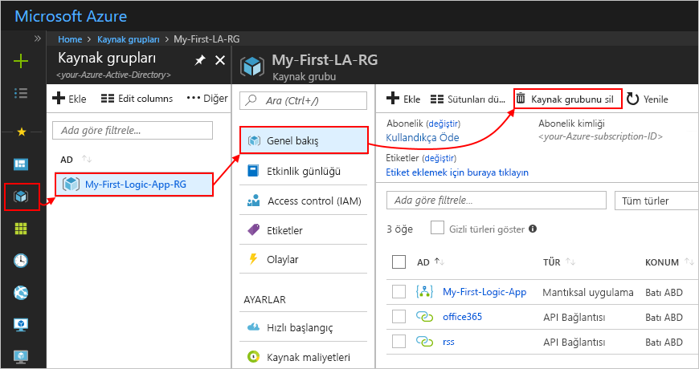

1. Onay olarak kaynak grubunun adını girip **Sil**’i seçin.

   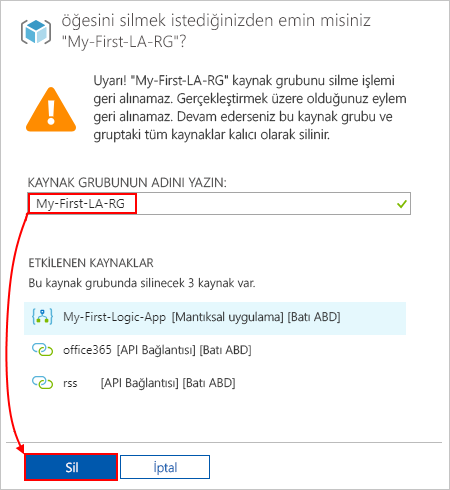

> [!NOTE]
> Mantıksal uygulamayı sildiğinizde yeni çalıştırma başlatılmaz. Devam eden ve bekleme durumunda olan tüm çalıştırmalar iptal edilir. Binlerce çalıştırma varsa iptal işleminin tamamlanması zaman alabilir.

## <a name="get-support"></a>Destek alın

Sorularınız için [Azure Logic Apps forumunu](https://social.msdn.microsoft.com/Forums/home?forum=azurelogicapps) ziyaret edin.

## <a name="next-steps"></a>Sonraki adımlar

Bu hızlı başlangıçta, belirttiğiniz zamanlamayı (dakika başı) temel alarak RSS güncelleştirmelerini denetleyen ve güncelleştirme olduğunda eylem gerçekleştiren (e-posta gönderen) ilk mantıksal uygulamanızı oluşturdunuz. Daha fazla bilgi edinmek için daha gelişmiş zamanlama temelli iş akışlarının oluşturulduğu şu öğreticiye geçin:

> [!div class="nextstepaction"]
> [Zamanlama tabanlı mantıksal uygulama ile trafiği denetleme](../logic-apps/tutorial-build-schedule-recurring-logic-app-workflow.md)
