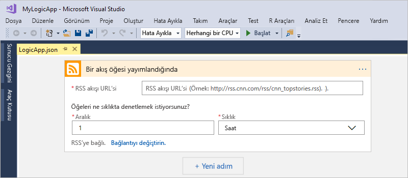

# Hızlı başlangıç: Azure Logic Apps ile görevleri, işlemleri ve iş akışlarını oluşturma ve otomatik hale getirme - Visual Studio

[Azure Logic Apps](../logic-apps/logic-apps-overview.md) ve Visual Studio ile uygulama, veri, sistem ve hizmetleri kurum ve kuruluşlar arasında otomatik hale getiren iş akışları oluşturabilirsiniz. Bu hızlı başlangıçta, Visual Studio’da mantıksal uygulamalar oluşturup bu uygulamaları bulutta <a href="https://docs.microsoft.com/azure/guides/developer/azure-developer-guide" target="_blank">Azure</a>’a dağıtarak söz konusu iş akışlarını nasıl tasarlayıp derleyebileceğiniz gösterilmektedir. Ayrıca, bu görevleri <a href="https://portal.azure.com" target="_blank">Azure portalında</a> gerçekleştirebilmenize rağmen, Visual Studio’yu kullanarak kaynak denetimine mantıksal uygulamalar ekleyebilir, farklı sürümler yayımlayabilir ve farklı dağıtım ortamları için Azure Resource Manager şablonları oluşturabilirsiniz. 

Azure Logic Apps kullanmaya yeni başladıysanız ve yalnızca temel kavramları istiyorsanız, bunun yerine [Azure portalında mantıksal uygulama oluşturmak için hızlı başlangıç](../logic-apps/quickstart-create-first-logic-app-workflow.md) makalesini deneyin. Mantıksal Uygulama Tasarımcısı hem Azure portalında hem de Visual Studio’da benzer şekilde çalışır. 

Burada, aynı mantıksal uygulamayı Azure portalı hızlı başlangıcında bu kez Visual Studio ile oluşturursunuz. Bu mantıksal uygulama bir web sitesinin RSS akışını izler ve sitede yayınlanan her yeni öğe için e-posta gönderir. İşlemi tamamladığınızda mantıksal uygulamanız şu yüksek düzeyli iş akışı gibi görünür:

Başlamadan önce şunlara sahip olduğunuzdan emin olun:

* Azure aboneliğiniz yoksa <a href="https://azure.microsoft.com/free/" target="_blank">ücretsiz bir Azure hesabı için kaydolun</a>.

* Henüz yoksa şu araçları indirip yükleyin: 

  * <a href="https://www.visualstudio.com/downloads" target="_blank">Visual Studio 2017 veya Visual Studio 2015 - Community sürümü veya üzeri</a>. 
  Bu hızlı başlangıçta ücretsiz olan Visual Studio Community 2017 kullanılmaktadır.

  * <a href="https://azure.microsoft.com/downloads/" target="_blank">.NET için Microsoft Azure SDK (2.9.1 veya üzeri)</a> ve <a href="https://github.com/Azure/azure-powershell#installation" target="_blank">Azure PowerShell</a>. 
  <a href="https://docs.microsoft.com/dotnet/azure/dotnet-tools?view=azure-dotnet">Azure SDK for .NET</a> hakkında daha fazla bilgi edinin.

  * <a href="https://marketplace.visualstudio.com/items?itemName=VinaySinghMSFT.AzureLogicAppsToolsforVisualStudio-18551" target="_blank">Visual Studio 2017 için Azure Logic Apps Araçları</a> veya <a href="https://marketplace.visualstudio.com/items?itemName=VinaySinghMSFT.AzureLogicAppsToolsforVisualStudio" target="_blank">Visual Studio 2015 sürümü</a>
  
    Azure Logic Apps Araçlarını doğrudan Visual Studio Market’ten indirip yükleyebilir veya <a href="https://docs.microsoft.com/visualstudio/ide/finding-and-using-visual-studio-extensions" target="_blank">bu uzantıyı Visual Studio’nun içinden yükleme</a> hakkında bilgi edinebilirsiniz. 
    Yükleme işlemini tamamladıktan sonra Visual Studio’yu yeniden başlattığınızdan emin olun.

* Logic Apps tarafından desteklenen Office 365 Outlook, Outlook.com veya Gmail gibi bir e-posta hesabı. Diğer sağlayıcılar için <a href="https://docs.microsoft.com/connectors/" target="_blank">buradaki bağlayıcı listesini inceleyin</a>. Bu mantıksal uygulama Office 365 Outlook kullanır. Farklı bir sağlayıcı kullanıyorsanız genel adımlar aynıdır, ancak kullanıcı arabirimi biraz farklı olabilir.

* Ekli Mantıksal Uygulama Tasarımcısı kullanılırken web erişimi

  Tasarımcının Azure'da kaynak oluşturması ve mantıksal uygulamanızdaki bağlayıcılardan özellik ve verileri okuması için İnternet bağlantısı gerekir. 
  Örneğin, Dynamics CRM Online bağlayıcısını kullanıyorsanız, tasarımcı CRM örneğinizdeki varsayılan ve özel kullanılabilir özellikleri denetler.

## Azure kaynak grubu projesi oluşturma

Başlamak için bir [Azure Kaynak Grubu projesi](../azure-resource-manager/vs-azure-tools-resource-groups-deployment-projects-create-deploy.md) oluşturun. [Azure kaynak grupları ve kaynakları](../azure-resource-manager/resource-group-overview.md) hakkında daha fazla bilgi edinin.

1. Visual Studio’yu başlatın ve Azure hesabınızla oturum açın.

2. **Dosya** menüsünde **Yeni** > **Proje**’yi seçin. (Klavye: Ctrl+Shift+N)

   

3. **Yüklü** altında **Visual C#** veya **Visual Basic**’i seçin. **Bulut** > **Azure Kaynak Grubu**’nu seçin. Projenizi adlandırın, örneğin:

   

4. **Mantıksal Uygulama** şablonunu seçin. 

   

   Visual Studio projenizi oluşturduktan sonra, Çözüm Gezgini açılır ve çözümünüzü gösterir. 

   

   Çözümünüzde **LogicApp.json** dosyası yalnızca mantıksal uygulamanızın tanımını depolamaz, aynı zamanda dağıtım için ayarlayabileceğiniz bir Azure Resource Manager şablonudur.

## Boş mantıksal uygulama oluşturma

Azure Kaynak Grubu projenizi oluşturduktan sonra **Boş Mantıksal Uygulama** şablonundan başlayarak mantıksal uygulamanızı oluşturup derleyin.

1. Çözüm Gezgini'nde **LogicApp.json** dosyasının kısayol menüsünü açın. **Mantıksal Uygulama Tasarımcısı ile Aç**’ı seçin. (Klavye: Ctrl+L)

   

2. **Abonelik** için kullanmak istediğiniz Azure aboneliğini seçin. **Kaynak Grubu** için **Yeni Oluştur...**  öğesini seçerek yeni bir Azure kaynak grubu oluşturun. 

   

   Visual Studio, mantıksal uygulamanızla ilişkili kaynakları ve bağlantıları oluşturup dağıtmak için Azure aboneliğinize ve bir kaynak grubuna ihtiyaç duyar. 

   | Ayar | Örnek değer | Açıklama | 
   | ------- | ------------- | ----------- | 
   | Kullanıcı profili listesi | Contoso   jamalhartnett@contoso.com | Varsayılan olarak oturum açmak için kullandığınız hesap | 
   | **Abonelik** | Kullandıkça Öde   (jamalhartnett@contoso.com) | Azure aboneliğinizin ve ilişkili hesabın adı |
   | **Kaynak Grubu** | MyLogicApp-RG   (Batı ABD) | Azure kaynak grubu ve mantıksal uygulamanızın kaynaklarını depolama ve dağıtma konumu | 
   | **Konum** | MyLogicApp-RG2   (Batı ABD) | Kaynak grubu konumunu kullanmak istemiyorsanız farklı bir konum |
   ||||

3. Logic Apps Tasarımcısı açılır ve bir tanıtım videosu ile sık kullanılan tetikleyicilerin bulunduğu bir sayfa görüntülenir. Video ve tetikleyicileri kaydırın. **Şablonlar** altında **Boş Mantıksal Uygulama**'yı seçin.

   

## Mantıksal uygulama iş akışı derleme

Sonra, yeni bir RSS akışı öğesi göründüğünde tetiklenen bir [tetikleyici](../logic-apps/logic-apps-overview.md#logic-app-concepts) ekleyin. Her mantıksal uygulama belirli ölçütler karşılandığında başlatılan bir tetikleyici ile başlamalıdır. Tetikleyici her etkinleştirildiğinde Logic Apps altyapısı iş akışınızı çalıştıran bir mantıksal uygulama örneği oluşturur.

1. Mantıksal Uygulama Tasarımcısı’nda arama kutusuna "rss" yazın. Şu tetikleyiciyi seçin: **Akış öğesi yayımlandığında**

   

   Tetikleyici artık tasarımcıda görünür:

   

2. Mantıksal uygulama oluşturma işlemini tamamlamak için [Azure portalı hızlı başlangıcı](../logic-apps/quickstart-create-first-logic-app-workflow.md#add-rss-trigger) içindeki iş akışı adımlarını izleyin, sonra bu makaleye geri dönün.

   İşiniz bittiğinde mantıksal uygulamanız şu örnekteki gibi görünür: 

   

3. Mantıksal uygulamanızı kaydetmek için Visual Studio çözümünüzü kaydedin. (Klavye: Ctrl + S)

Şimdi mantıksal uygulamanızı test edebilmemiz için uygulamanızı Azure’a dağıtın.

## Mantıksal uygulamanızı Azure'a dağıtma

Mantıksal uygulamanızı çalıştırabilmeniz için uygulamanızı yalnızca birkaç adımda Visual Studio’dan Azure'a dağıtın.

1. Çözüm Gezgini'nde projenizin kısayol menüsünden **Dağıt** > **Yeni**'yi seçin. Sorulursa Azure hesabınızla oturum açın.

   

2. Bu dağıtım için Azure aboneliği, kaynak grubu ve diğer varsayılan ayarları değiştirmeyin. Hazır olduğunuzda **Dağıt**’ı seçin. 

   

3. **Parametreleri Düzenle** kutusu görüntülenirse, mantıksal uygulamanın dağıtımda kullanacağı kaynak adını belirtin, ardından ayarlarınızı kaydedin, örneğin:

   

   Dağıtım başladığında uygulamanızın dağıtım durumu Visual Studio **Çıktı** penceresinde görünür. 
   Durum görünmezse **Çıktıyı göster** listesini açıp Azure kaynak grubunuzu seçin.

   

   Seçtiğiniz bağlayıcılar bir şey yazmanızı gerektiriyorsa, arka planda bir PowerShell penceresi açılabilir ve gerekli parolaları veya gizli anahtarları isteyebilir. Bu bilgileri girdikten sonra dağıtım işlemi devam eder.
   
   
   
   Dağıtım tamamlandıktan sonra mantıksal uygulamanız Azure portalında etkindir ve belirttiğiniz zamanlamaya göre (dakikada bir kez) RSS akışını denetler. 
   RSS akışında yeni öğeler olduğunda mantıksal uygulamanız her yeni öğe için bir e-posta gönderir. 
   Aksi takdirde mantıksal uygulamanız yeniden denetlemek için bir sonraki zaman aralığını bekler. 

   Örneğin, bu mantıksal uygulamanın gönderdiği örnek e-postalar aşağıda verilmiştir. 
   E-posta gelmezse istenmeyen e-posta klasörüne bakın. 

   

   Teknik olarak tetikleyici, RSS akışını denetleyip yeni öğeler bulduğunda tetikleyici etkinleşir ve Logic Apps altyapısı, mantıksal uygulama iş akışınızın, iş akışında eylemleri çalıştıran bir örneğini oluşturur.
   Tetikleyici yeni öğeler bulmazsa tetikleyici etkinleşmez ve iş akışı örneğini oluşturma işlemini "atlar".

Tebrikler, Visual Studio ile mantıksal uygulamanızı başarıyla derleyip dağıttınız! Mantıksal uygulamanızı yönetmek ve çalıştırma geçmişini gözden geçirmek için bkz. [Visual Studio ile mantıksal uygulamaları yönetme](../logic-apps/manage-logic-apps-with-visual-studio.md).

## Kaynakları temizleme

Artık gerek kalmadığında mantıksal uygulamanızı ve ilgili kaynakları içeren kaynak grubunu silin.

1. Mantıksal uygulamanızı oluşturmak için kullandığınız hesapla <a href="https://portal.azure.com" target="_blank">Azure portalında</a> oturum açın. 

2. Azure menüsünde **Kaynak grupları**'nı seçin.
Mantıksal uygulamanızın kaynak grubunu ve ardından **Genel bakış**'ı seçin.

3. **Genel Bakış** sayfasında **Kaynak grubunu sil**’i seçin. Onay olarak kaynak grubunun adını girip **Sil**’i seçin.

   

4. Visual Studio çözümünü yerel bilgisayarınızdan silin.

## Destek alın

* Sorularınız için <a href="https://social.msdn.microsoft.com/Forums/en-US/home?forum=azurelogicapps" target="_blank">Azure Logic Apps forumunu</a> ziyaret edin.
* Özelliklerle ilgili fikirlerinizi göndermek veya gönderilmiş olanları oylamak için <a href="http://aka.ms/logicapps-wish" target="_blank">Logic Apps kullanıcı geri bildirimi sitesini</a> ziyaret edin.

## Sonraki adımlar

Bu makalede Visual Studio kullanarak mantıksal uygulamanızı derlediniz, dağıttınız ve çalıştırdınız. Visual Studio ile mantıksal uygulamalarda gelişmiş dağıtımı yönetme ve gerçekleştirme hakkında daha fala bilgi almak için şu makalelere bakın:

> [!div class="nextstepaction"]
> * [Visual Studio ile mantıksal uygulamaları yönetme](../logic-apps/manage-logic-apps-with-visual-studio.md)
> * [Visual Studio ile mantıksal uygulamalar için dağıtım şablonları oluşturma](../logic-apps/logic-apps-create-deploy-template.md)
