# Hızlı Başlangıç: Azure Logic Apps - Visual Studio ile otomatik görevler, süreçleri ve iş akışları oluşturma

[Azure Logic Apps](../logic-apps/logic-apps-overview.md) ve Visual Studio ile uygulama, veri, sistem ve hizmetleri kurum ve kuruluşlar arasında otomatik hale getiren iş akışları oluşturabilirsiniz. Bu hızlı başlangıçta, nasıl tasarım ve Visual Studio'da mantıksal uygulamalar oluşturup bu uygulamaları Azure'a dağıtma bu iş akışları oluşturma gösterilmektedir. Bu görevleri, Azure portalında gerçekleştirebilirsiniz ancak, Visual Studio, kaynak denetimi, farklı sürümler yayımlayabilir ve farklı dağıtım ortamları için Azure Resource Manager şablonları oluşturmak için mantıksal uygulamalarınızı eklemenizi sağlar.

Azure Logic Apps kullanmaya yeni başladıysanız ve yalnızca temel kavramları istiyorsanız, deneyin [Azure portalında bir mantıksal uygulama oluşturmaya yönelik hızlı başlangıç](../logic-apps/quickstart-create-first-logic-app-workflow.md). Mantıksal Uygulama Tasarımcısı hem Azure portalında hem de Visual Studio benzer şekilde çalışır.

Bu hızlı başlangıçta, aynı mantıksal uygulamayı Azure portalı hızlı başlangıcı Visual Studio ile oluşturun. Bu mantıksal uygulama bir Web sitesinin RSS akışı izler ve bu akış her yeni öğe için e-posta gönderir. Tamamlanmış mantıksal uygulamanız bu üst düzey iş akışı gibi görünür:

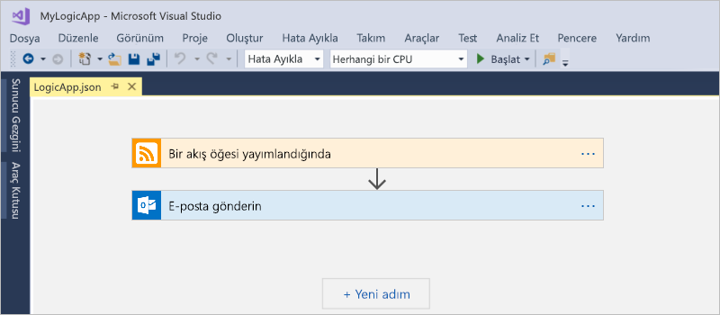

## Önkoşullar

* Azure aboneliği. Azure aboneliğiniz yoksa [ücretsiz bir Azure hesabı için kaydolun](https://azure.microsoft.com/free/).

* Henüz yoksa şu araçları indirip yükleyin:

  * [Visual Studio 2019, 2017 veya 2015 - Community sürümü veya üzeri](https://aka.ms/download-visual-studio). 
  Bu hızlı başlangıçta, Visual Studio Community 2017 kullanılmaktadır.

    > [!IMPORTANT]
    > Visual Studio 2019 veya 2017'yi yüklediğinizde, seçtiğinizden emin olun **Azure geliştirme** iş yükü.

  * [.NET için Microsoft Azure SDK (2.9.1 veya sonrası)](https://azure.microsoft.com/downloads/). 
  [Azure SDK for .NET](https://docs.microsoft.com/dotnet/azure/dotnet-tools?view=azure-dotnet) hakkında daha fazla bilgi edinin.

  * [Azure PowerShell](https://github.com/Azure/azure-powershell#installation)

  * Azure Logic Apps araçları istediğiniz Visual Studio sürümü için:

    * [Visual Studio 2019](https://aka.ms/download-azure-logic-apps-tools-visual-studio-2019)

    * [Visual Studio 2017](https://aka.ms/download-azure-logic-apps-tools-visual-studio-2017)

    * [Visual Studio 2015](https://aka.ms/download-azure-logic-apps-tools-visual-studio-2015)
  
    Azure Logic Apps Araçlarını doğrudan Visual Studio Market’ten indirip yükleyebilir veya [bu uzantıyı Visual Studio’nun içinden yükleme](https://docs.microsoft.com/visualstudio/ide/finding-and-using-visual-studio-extensions) hakkında bilgi edinebilirsiniz. 
    Yükleme işlemini tamamladıktan sonra Visual Studio’yu yeniden başlattığınızdan emin olun.

* Ekli Mantıksal Uygulama Tasarımcısı kullanılırken web erişimi

  Tasarımcının Azure'da kaynak oluşturmak ve mantıksal uygulamanızdaki bağlayıcılardan özellik ve verileri okumak için internet bağlantısı gerekir. 
  Örneğin, Dynamics CRM Online bağlantıları için tasarımcı CRM Örneğinizdeki varsayılan ve özel özellikleri denetler.

* Logic Apps tarafından desteklenen Office 365 Outlook, Outlook.com veya Gmail gibi bir e-posta hesabı. Diğer sağlayıcılar için [buradaki bağlayıcı listesini inceleyin](https://docs.microsoft.com/connectors/). Bu örnekte Office 365 Outlook kullanılmaktadır. Farklı bir sağlayıcı kullanıyorsanız genel adımlar aynıdır, ancak kullanıcı arabirimi biraz farklı olabilir.

## Azure kaynak grubu projesi oluşturma

Başlamak için bir [Azure Kaynak Grubu projesi](../azure-resource-manager/vs-azure-tools-resource-groups-deployment-projects-create-deploy.md) oluşturun. [Azure kaynak grupları ve kaynakları](../azure-resource-manager/resource-group-overview.md) hakkında daha fazla bilgi edinin.

1. Visual Studio’yu çalıştırın. Azure hesabınızla oturum açın.

1. **Dosya** menüsünde **Yeni** > **Proje**’yi seçin. (Klavye: Ctrl+Shift+N)

   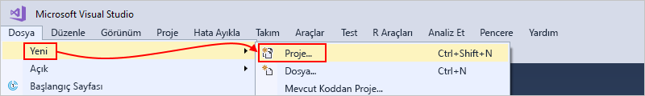

1. **Yüklü** altında **Visual C#** veya **Visual Basic**’i seçin. **Bulut** > **Azure Kaynak Grubu**’nu seçin. Projenizi adlandırın, örneğin:

   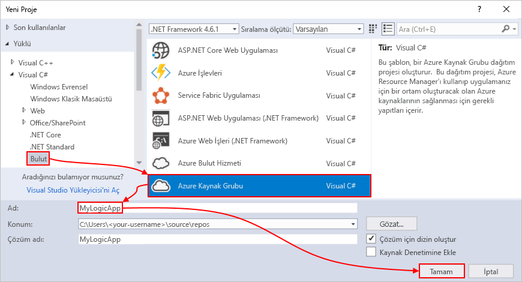

   > [!NOTE]
   > Varsa **bulut** veya **Azure kaynak grubu** görünür değil, Visual Studio için Azure SDK'sını yüklediğinizden emin olun.

   Visual Studio 2019 kullanıyorsanız, aşağıdaki adımları izleyin:

   1. İçinde **yeni bir proje oluşturma** kutusunda **Azure kaynak grubu** görsel için proje C# veya Visual Basic. **İleri**’yi seçin.

   1. Kullanmak istediğiniz Azure kaynak grubu ve diğer proje bilgileri için bir ad sağlayın. **Oluştur**’u seçin.

1. Şablon listesinden **mantıksal uygulama** şablonu. **Tamam**’ı seçin.

   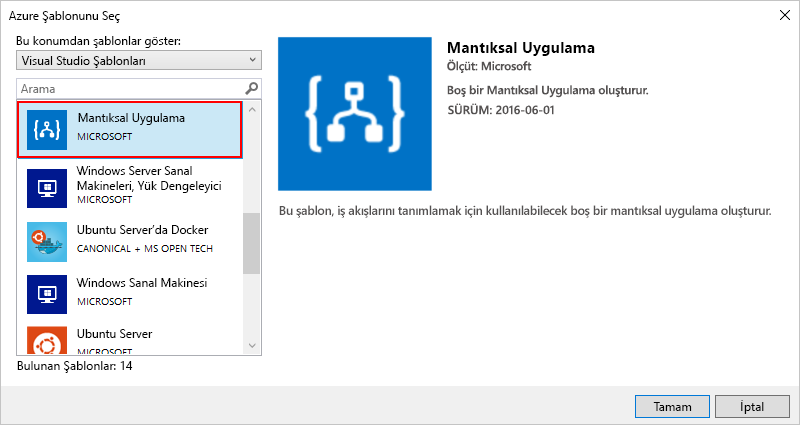

   Visual Studio projenizi oluşturduktan sonra, Çözüm Gezgini açılır ve çözümünüzü gösterir. 
   Çözümünüzdeki **LogicApp.json** dosyası yalnızca mantıksal uygulama tanımınızı depolar ancak aynı zamanda dağıtım için kullanabileceğiniz bir Azure Resource Manager şablonu olduğundan.

   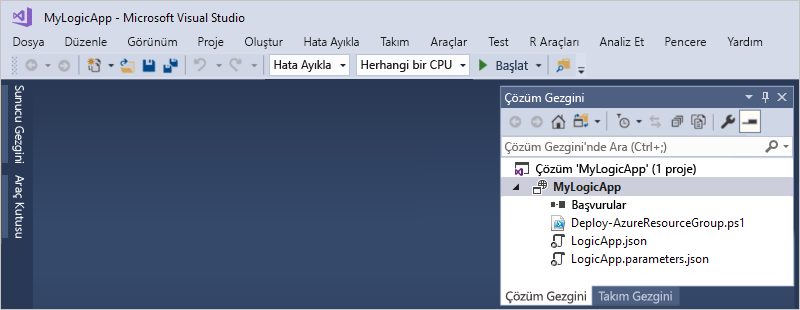

## Boş mantıksal uygulama oluşturma

Azure kaynak proje, mantıksal uygulamanızı oluşturma grubunuz varsa **boş mantıksal uygulama** şablonu.

1. Çözüm Gezgini'nde açın **LogicApp.json** dosyanın kısayol menüsü. **Mantıksal Uygulama Tasarımcısı ile Aç**’ı seçin. (Klavye: Ctrl+L)

   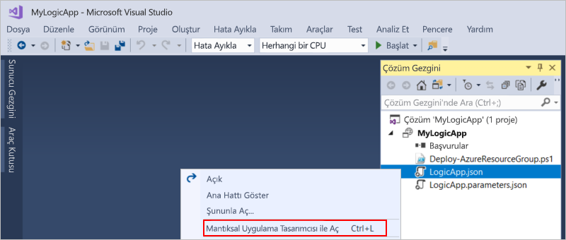

   Visual Studio için Azure aboneliğinizi ve Azure kaynak grubu oluşturma ve dağıtma kaynakları için mantıksal uygulama ve bağlantıları ister.

1. İçin **abonelik**, Azure aboneliğinizi seçin. İçin **kaynak grubu**seçin **Yeni Oluştur** yeni bir Azure kaynak grubu oluşturmak için.

   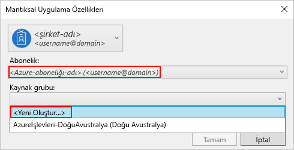

   | Ayar | Örnek değer | Açıklama |
   | ------- | ------------- | ----------- |
   | Kullanıcı profili listesi | Contoso   jamalhartnett@contoso.com | Varsayılan olarak oturum açmak için kullandığınız hesap |
   | **Abonelik** | Kullandıkça Öde   (jamalhartnett@contoso.com) | Azure aboneliğinizin ve ilişkili hesabın adı |
   | **Kaynak Grubu** | MyLogicApp-RG   (Batı ABD) | Azure kaynak grubu ve konum depolamak ve mantıksal uygulamanızın kaynaklarını dağıtma |
   | **Konum** | MyLogicApp-RG2   (Batı ABD) | Kaynak grubu konumunu kullanmak istemiyorsanız farklı bir konum |
   ||||

1. Logic Apps Tasarımcısı'nda giriş video gösterir ve sık kullanılan tetikleyicilerin bir sayfa açılır. Kaydırma aşağı video ve Tetikleyicileri için geçmiş **şablonları**seçip **boş mantıksal uygulama**.

   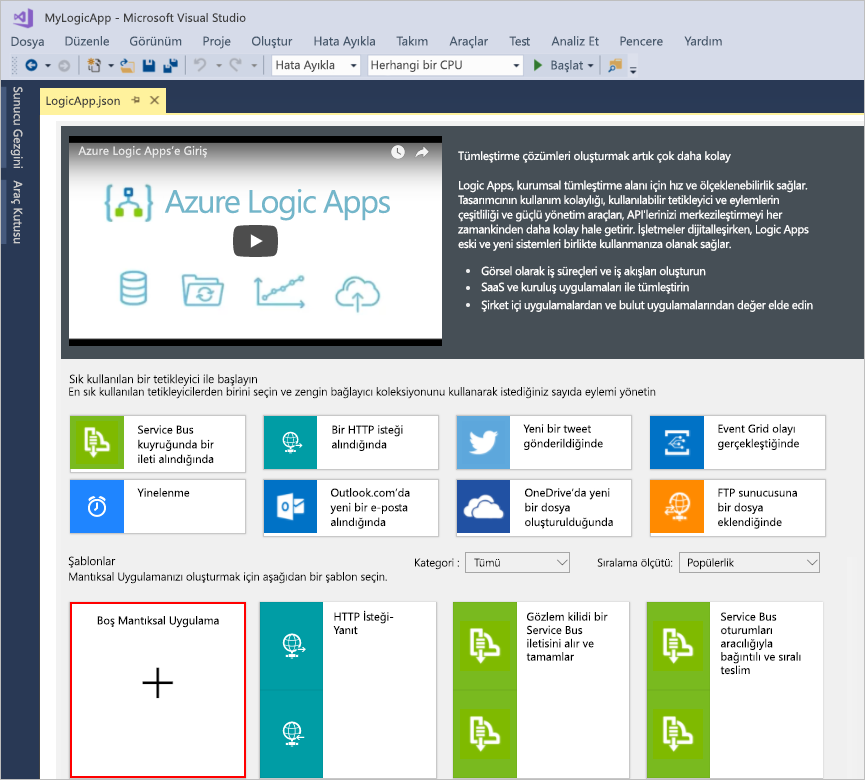

## Mantıksal uygulama iş akışı derleme

Ardından, bir RSS ekleyin [tetikleyici](../logic-apps/logic-apps-overview.md#logic-app-concepts) yeni bir akış öğesi göründüğünde tetikler. Her mantıksal uygulama belirli bir ölçüte başlatılan bir tetikleyici ile başlar karşılanır. Tetikleyici her etkinleştirildiğinde Logic Apps altyapısı iş akışınızı çalıştıran bir mantıksal uygulama örneği oluşturur.

1. Logic Apps Tasarımcısı'nda arama kutusunun altındaki seçin **tüm**.
Arama kutusuna "rss" yazın. Tetikleyiciler listesinden şu tetikleyiciyi seçin: **Akış öğesi yayımlandığında - RSS**

   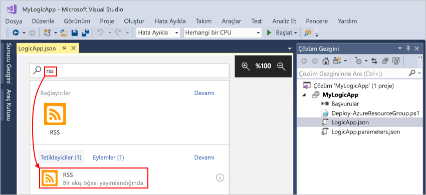

1. Tetikleyici Tasarımcısı'nda göründükten sonra mantıksal uygulama iş akışını izleyerek adımları derlemeyi tamamlamak [Azure portalı hızlı başlangıcı](../logic-apps/quickstart-create-first-logic-app-workflow.md#add-rss-trigger), sonra bu makaleye geri dönün. İşiniz bittiğinde mantıksal uygulamanız şu örnekteki gibi görünür:

   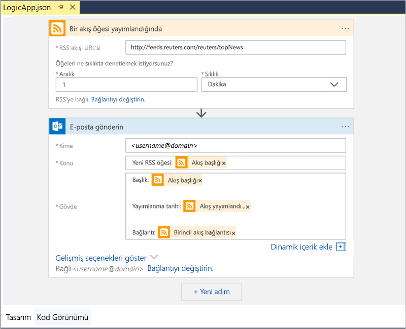

1. Visual Studio çözümünüzü kaydedin. (Klavye: Ctrl + S)

## Mantıksal uygulamanızı Azure'a dağıtma

Çalıştırın ve mantıksal uygulamanızı test etmek için önce uygulamayı Visual Studio'dan Azure'a dağıtın.

1. Çözüm Gezgini'nde projenizin kısayol menüsünden **Dağıt** > **Yeni**'yi seçin. Sorulursa Azure hesabınızla oturum açın.

   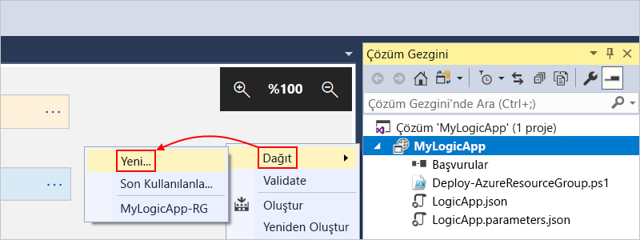

1. Bu dağıtım için varsayılan Azure aboneliği, kaynak grubu ve diğer ayarlarını koruyabilirsiniz. Seçin **dağıtma**.

   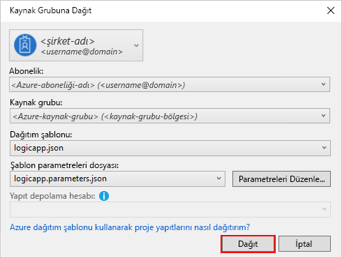

1. Varsa **parametreleri Düzenle** kutusu görüntülenirse, mantıksal uygulamanız için bir kaynak adı sağlayın. Ayarlarınızı kaydedin.

   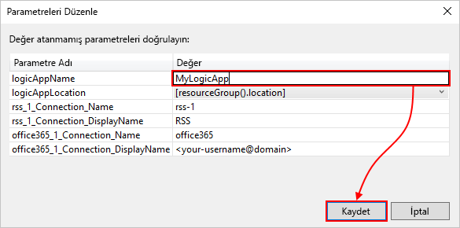

   Dağıtım başladığında uygulamanızın dağıtım durumu Visual Studio **Çıktı** penceresinde görünür. Durum görünmezse **Çıktıyı göster** listesini açıp Azure kaynak grubunuzu seçin.

   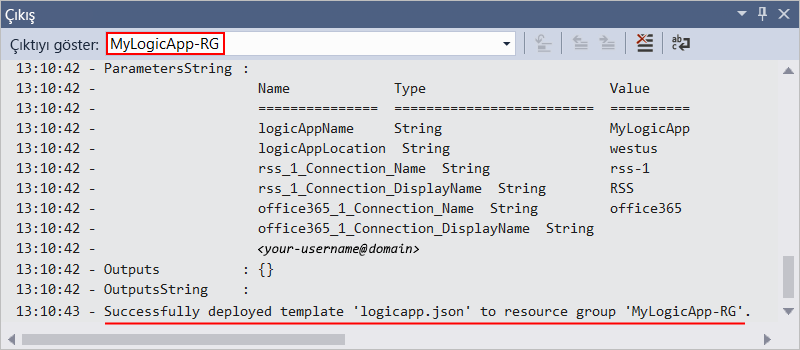

   Seçili bağlayıcılarınızı giriş sağlamanız gerekiyorsa, bir PowerShell penceresi arka planda açılır ve tüm gerekli parolaları veya gizli anahtarları için ister. Bu bilgileri girdikten sonra dağıtım işlemi devam eder.

   

   Dağıtım tamamlandıktan sonra mantıksal uygulamanızı Azure portalında etkindir ve belirttiğiniz zamanlamaya (dakika başı) göre çalıştırır. Tetikleyici akış yeni öğeler bulursa, mantıksal uygulamanın eylemleri çalıştıran bir iş akışı örneği oluşturan tetikleyici etkinleştirilir. Mantıksal uygulamanız her yeni öğe için e-posta gönderir. Aksi takdirde, tetikleyici yeni öğeler bulmazsa tetikleyici etkinleşmez ve "iş akışı örnekleme atlar". Mantıksal uygulamanızı etmeden sonraki aralığı kadar bekler.

   Bu mantıksal uygulamanın gönderdiği örnek e-postalar aşağıda verilmiştir. 
   E-posta gelmezse istenmeyen e-posta klasörüne bakın.

   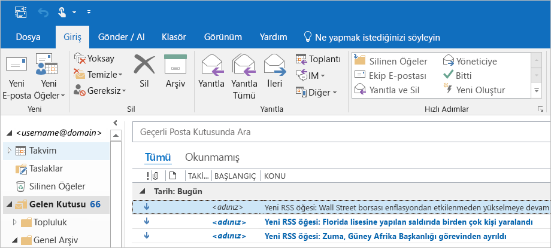

Tebrikler, başarıyla oluşturulmuş ve Visual Studio ile mantıksal uygulamanızı dağıtılmış. Mantıksal uygulamanızı yönetmek ve çalıştırma geçmişini gözden geçirmek için bkz. [Visual Studio ile mantıksal uygulamaları yönetme](../logic-apps/manage-logic-apps-with-visual-studio.md).

## Kaynakları temizleme

Mantıksal uygulama ile işiniz bittiğinde mantıksal uygulamanızı ve ilgili kaynakları içeren kaynak grubunu silin.

1. Mantıksal uygulamanızı oluşturmak için kullandığınız hesapla [Azure portalında](https://portal.azure.com) oturum açın.

1. Azure menüsünde **Kaynak grupları**'nı seçin.
Mantıksal uygulamanızın kaynak grubunu seçip **genel bakış**.

1. **Genel Bakış** sayfasında **Kaynak grubunu sil**’i seçin. Onay olarak kaynak grubunun adını girip **Sil**’i seçin.

   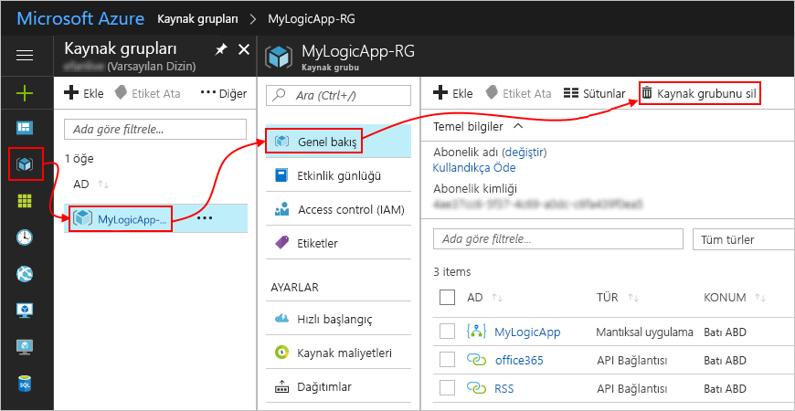

1. Visual Studio çözümünü yerel bilgisayarınızdan silin.

## Sonraki adımlar

Bu makalede Visual Studio kullanarak mantıksal uygulamanızı derlediniz, dağıttınız ve çalıştırdınız. Yönetme ve Visual Studio ile mantıksal uygulamalarda Gelişmiş dağıtımı gerçekleştirme hakkında bilgi edinmek için şu makalelere bakın:

> [!div class="nextstepaction"]
> * [Visual Studio ile mantıksal uygulamaları yönetme](../logic-apps/manage-logic-apps-with-visual-studio.md)