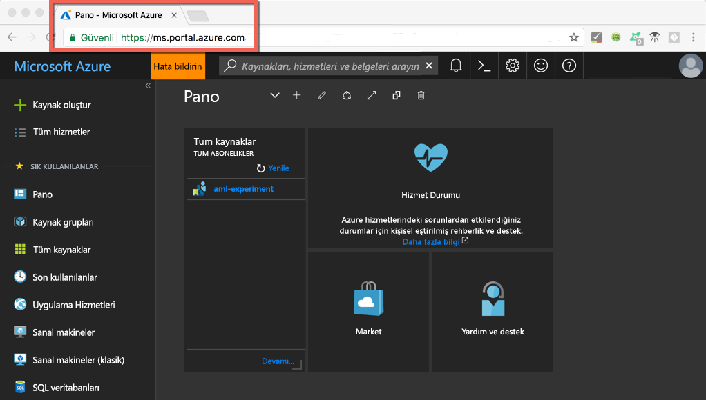
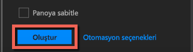

# <a name="quickstart-install-and-get-started-with-azure-machine-learning-services"></a>Hızlı Başlangıç: Azure Machine Learning hizmetlerini yükleme ve kullanmaya başlama
Azure Machine Learning hizmetleri (önizleme) tümleşik ve uçtan uca bir veri bilimi ve gelişmiş analiz çözümüdür. Bu çözüm uzman veri bilimcilerin bulut ölçeğinde veri hazırlamasına, deneme geliştirmesine ve model dağıtmasına yardımcı olur.

Bu hızlı başlangıçta şu işlemleri nasıl yapacağınız gösterilir:

* Azure Machine Learning hizmetleri için hizmet hesapları oluşturma
* Azure Machine Learning Workbench'i yükleme ve oturumunu açma.
* Workbench'te proje oluşturma
* Bu projede betik çalıştırma  
* Komut satırı arabirimine (CLI) erişme


Microsoft Azure portföyünün bir parçası olarak, Azure Machine Learning hizmetleri için bir Azure aboneliği gerekir. Azure aboneliğiniz yoksa başlamadan önce [ücretsiz bir hesap](https://azure.microsoft.com/free/?WT.mc_id=A261C142F) oluşturun.

Buna ek olarak, Kaynak Grupları ve Sanal Makineler gibi varlıkları oluşturmak için uygun izinlere sahip olmalısınız. 

<a name="prerequisites"></a>Azure Machine Learning Workbench uygulamasını şu işletim sistemlerine yükleyebilirsiniz:
- Windows 10 veya Windows Server 2016
- macOS Sierra veya High Sierra

## <a name="create-azure-machine-learning-services-accounts"></a>Azure Machine Learning hizmet hesapları oluşturma
Azure Machine Learning hesaplarınızı sağlamak için Azure portalını kullanın: 
1. Azure aboneliği için kullandığınız hesap bilgilerini kullanarak [Azure portalında](https://portal.azure.com/) oturum açın. Azure aboneliğiniz yoksa şimdi [ücretsiz bir hesap](https://azure.microsoft.com/free/?WT.mc_id=A261C142F) oluşturun. 

   

1. Portalın sol üst köşesinde bulunan **Kaynak oluştur** düğmesini (+) seçin.

   

1. Arama çubuğuna **Machine Learning** yazın. **Machine Learning Denemesi** adlı arama sonucunu seçin. 

   

1. **Machine Learning Denemesi** bölmesinde, en alta gidin ve deneme hesabınızı tanımlamaya başlamak için **Oluştur**'u seçin.  

   

1. **ML Denemesi** bölmesinde Machine Learning Denemesi hesabınızı yapılandırın. 

   Ayar|Öğretici için önerilen değer|Açıklama
   ---|---|---
   Deneme hesabı adı | _Benzersiz ad_ |Hesabınızı tanımlayan benzersiz bir ad girin. Kendi adınızı veya denemeyi en iyi şekilde tanımlayan departman ya da proje adını kullanabilirsiniz. Adı 2-32 karakter arasında olmalıdır. Yalnızca alfasayısal karakterler ve kısa çizgi (-) karakteri kullanılabilir. 
   Abonelik | _Aboneliğiniz_ |Denemeniz için kullanmak istediğiniz Azure aboneliğini seçin. Birden fazla aboneliğiniz varsa kaynağın faturalanacağı uygun aboneliği seçin.
   Kaynak grubu | _Kaynak grubunuz_ | Aboneliğinizde mevcut kaynak gruplarından birini seçin veya bir ad girerek bu deneme hesabı için yeni kaynak grubu oluşturun. 
   Konum | _Kullanıcılarınıza en yakın bölge_ | Kullanıcılarınıza ve veri kaynaklarınıza en yakın konumu seçin.
   Bilgisayar lisansı sayısı | 2 | Bilgisayar lisansı sayısını girin. [Bilgisayar lisansının fiyatı nasıl etkilediğini](https://azure.microsoft.com/pricing/details/machine-learning/) öğrenin.<br/><br/>Bu Hızlı Başlangıç için yalnızca iki bilgisayar lisansına ihtiyacınız vardır. Bilgisayar lisansları gerektiğinde Azure portalından eklenebilir veya kaldırılabilir.
   Depolama hesabı | _Benzersiz ad_ | [Azure depolama hesabı](https://docs.microsoft.com/en-us/azure/storage/common/storage-quickstart-create-account?tabs=portal) oluşturmak için **Yeni oluştur**'u seçin ve bir ad girin. Alternatif olarak **Var olanı kullan**'ı seçin ve açılır listeden var olan depolama hesabını belirleyin. Depolama hesabı gereklidir ve proje yapıtlarını tutmak ve geçmiş verileri çalıştırmak için kullanılır. 
   Deneme hesabı için çalışma alanı | IrisGarden<br/>(öğreticilerde kullanılan ad) | Bu hesap için çalışma alanına bir ad sağlayın. Adı 2-32 karakter arasında olmalıdır. Yalnızca alfasayısal karakterler ve kısa çizgi (-) karakteri kullanılabilir. Bu çalışma alanı, denemeleri oluşturmak, yönetmek ve yayımlamak için ihtiyacınız olan araçları içerir.
   Çalışma alanının sahibini atama | _Hesabınız_ | Çalışma alanı sahibi olarak kendi hesabınızı seçin.
   Model Yönetimi Hesabı oluşturma | **işaretle** |Modellerinizi gerçek zamanlı web hizmetleri olarak dağıtmak ve yönetmek istediğinizde bu kaynağın kullanılabilir olması için şimdi bir Model Yönetim hesabı oluşturun. <br/><br/>İsteğe bağlı olsa da, Model Yönetimi hesabını Deneme hesabı ile aynı zamanda oluşturmanız önerilir.
   Hesap adı | _Benzersiz ad_ | Model Yönetimi hesabınızı tanımlayan benzersiz bir ad seçin. Kendi adınızı veya denemeyi en iyi şekilde tanımlayan departman ya da proje adını kullanabilirsiniz. Adı 2-32 karakter arasında olmalıdır. Yalnızca alfasayısal karakterler ve kısa çizgi (-) karakteri kullanılabilir. 
   Model Yönetimi fiyatlandırma katmanı | **DEVTEST** | Yeni Model Yönetimi hesabınıza ait fiyatlandırma katmanını belirtmek için **Fiyatlandırma katmanı seçilmedi** öğesini seçin. Maliyet tasarrufu için, aboneliğinizde varsa **DEVTEST** fiyatlandırma katmanını (sınırlı kullanılabilirlik) seçin. Yoksa maliyet tasarrufu için S1 fiyatlandırma katmanını seçin. Fiyatlandırma katmanı seçimini kaydetmek için **Seç**’e tıklayın. 
   Panoya sabitle | _işaretle_ | Azure portalının ön pano sayfasında Machine Learning Deneme hesabınızın kolayca izlenmesine izin vermek için **Panoya sabitle**'yi seçin.

   

5. Model Yönetim hesabıyla birlikte Deneme hesabı oluşturma işlemine başlamak için **Oluştur**'u seçin.

   

   Hesap oluşturmak birkaç dakika sürebilir. Azure portalı araç çubuğundaki zile tıklayarak dağıtım işleminin durumunu denetleyebilirsiniz.
   
   


## <a name="install-and-log-in-to-workbench"></a>Workbench'i yükleme ve oturumunu açma

Azure Machine Learning Workbench, Windows veya macOS için sağlanır. [Desteklenen platformların](#prerequisites) listesine bakın.

>[!WARNING]
>Yüklemenin tamamlanması 30 dakika kadar sürebilir. 

1. En son Workbench yükleyicisini indirin ve başlatın. 
   >[!IMPORTANT]
   >Yükleyiciyi diske tam olarak indirip oradan çalıştırın. Doğrudan tarayıcınızın indirme penceresinden çalıştırmayın.

   **Windows'da:** 

   &nbsp;&nbsp;&nbsp;&nbsp;A. [AmlWorkbenchSetup.msi](https://aka.ms/azureml-wb-msi) dosyasını indirin.  <br/>
   &nbsp;&nbsp;&nbsp;&nbsp;B. Dosya Gezgini'nde indirilen yükleyiciye çift tıklayın.

   **macOS'ta:** 

   &nbsp;&nbsp;&nbsp;&nbsp;A. [AmlWorkbench.dmg](https://aka.ms/azureml-wb-dmg) dosyasını indirin. <br/>
   &nbsp;&nbsp;&nbsp;&nbsp;B. Bulucu'da indirilen yükleyiciye çift tıklayın.<br/><br/>

1. Yükleyicinizde ekranda gösterilen yönergeleri tamamlayana kadar izleyin. 

   **Yüklemenin tamamlanması 30 dakika kadar sürebilir.**  
   
   | |Azure Machine Learning Workbench'in yükleme yolu|
   |--------|------------------------------------------------|
   |Windows|C:\Users\<kullanıcı>\AppData\Local\AmlWorkbench|
   |macOS|/Applications/Azure ML Workbench.app|

   Yükleyici Python, Miniconda ve diğer ilgili kitaplıklar gibi gereken tüm bağımlılıkları indirir ve kurar.    Bu yükleme ayrıca Azure platformlar arası komut satırı aracı veya Azure CLI’yi içerir.

  
1. Yükleyicinin son ekranındaki **Workbench'i Başlat** düğmesini seçerek Workbench'i başlatın. 

   Yükleyici kapattıysanız, sorun değil. 
   + Windows’da **Machine Learning Workbench** masaüstü kısayolunu kullanarak uygulamayı başlatın. 
   + macOS’ta Launchpad’den **Azure ML Workbench**’i seçin.

1. İlk ekranda, Azure Machine Learning Workbench'te kimlik doğrulaması yapmak için **Oturum aç**'ı seçin. Deneme ve Model Yönetim hesaplarını oluştururken, azure portalında kullandığınız kimlik bilgilerini kullanın. 

   Oturum açtığınızda, Workbench Azure aboneliklerinizde bulduğu ilk Deneme hesabını kullanır.  Workbench bulduğu ilk Deneme hesabını kullanır ve bu hesapla ilişkilendirilmiş tüm çalışma alanlarıyla projeleri görüntüler. 

   >[!TIP]
   > Workbench uygulama penceresinin sol alt köşesindeki simgeyi kullanarak farklı bir Deneme hesabına geçebilirsiniz.

## <a name="create-a-project-in-workbench"></a>Workbench'te proje oluşturma

Azure Machine Learning'de proje, bir sorunu çözmek için yapılan tüm çalışmanın mantıksal kapsayıcısıdır. Yerel diskinizde tek bir dosya klasörüne eşlenir ve buna istediğiniz tüm dosyaları veya alt klasörleri ekleyebilirsiniz. 

Burada, [Süsen çiçeği veri kümesini](https://en.wikipedia.org/wiki/iris_flower_data_set) içeren bir şablon kullanarak yeni bir Workbench projesi oluşturuyoruz. Bu hızlı başlangıcı izleyen öğreticiler, bu verilere dayanarak bazı fiziksel özellikleri temelinde süsenin cinsini tahmin eden bir model oluşturur.  

1. Azure Machine Learning Workbench açık durumdayken, **PROJELER** bölmesindeki artı işaretini (+) seçin ve sonra da **Yeni Proje**'yi seçin.  

   

1. Form alanlarını doldurun ve **Oluştur** düğmesini seçerek Workbench’te yeni projeyi oluşturun.

   Alan|Öğretici için önerilen değer|Açıklama
   ---|---|---
   Proje adı | myIris |Hesabınızı tanımlayan benzersiz bir ad girin. Kendi adınızı veya denemeyi en iyi şekilde tanımlayan departman ya da proje adını kullanabilirsiniz. Adı 2-32 karakter arasında olmalıdır. Yalnızca alfasayısal karakterler ve kısa çizgi (-) karakteri kullanılabilir. 
   Proje dizini | c:\Temp\ | Projenin oluşturulduğu dizini belirtin.
   Proje açıklaması | _boş bırakın_ | Projeleri açıklamak için kullanışlı bir isteğe bağlı alan.
   Visualstudio.com |_boş bırakın_ | İsteğe bağlı alan. Bir proje, kaynak denetimi ve işbirliği için isteğe bağlı olarak Visual Studio Team Services’de bir Git deposuyla ilişkilendirilebilir. [Bunun nasıl ayarlanacağını öğrenin](https://docs.microsoft.com/en-us/azure/machine-learning/preview/using-git-ml-project#step-3-set-up-a-machine-learning-project-and-git-repo). 
   Çalışma alanı | IrisGarden (varsa) | Azure portalında Deneme hesabınız için oluşturduğunuz bir çalışma alanını seçin. <br/>Hızlı Başlangıç’ı izlediyseniz, IrisGarden adlı bir çalışma alanınız olmalıdır. Bu çalışma alanı yoksa, Deneme hesabınızı açtığınızda oluşturduğunuz çalışma alanını veya kullanmak istediğiniz başka bir çalışma alanını seçin.
   Proje şablonu | Classifying Iris | Şablonlar, ürünü keşfetmek için kullanabileceğiniz betikleri ve verileri içerir. Bu şablon, bu hızlı başlangıcın yanı sıra bu belge sitesindeki diğer öğreticiler için gereksinim duyduğunuz betikleri ve verileri de içerir. 

   
 
 Yeni proje oluşturulur ve bu projeyi içeren proje panosu açılır. Bu noktada proje giriş sayfası, veri kaynakları, dizüstü bilgisayarlar ve kaynak kodu dosyalarını keşfedebilirsiniz. 

>[!TIP]
>Rahat bir veri bilimi geliştirme deneyimi için Workbench'i Python IDE ile çalışacak şekilde yapılandırabilirsiniz. Ardından, IDE'de projenizle etkileşimli çalışabilirsiniz. [Nasıl olduğunu öğrenin](how-to-configure-your-IDE.md). 

## <a name="run-a-python-script"></a>Python betiği çalıştırma

Şimdi yerel bilgisayarınızda **iris_sklearn.py** betiğini çalıştırabilirsiniz. Bu betik, **Classifying Iris** proje şablonuna varsayılan olarak eklenmiştir. Betik, popüler Python [scikit-learn](http://scikit-learn.org/stable/index.html) kitaplığındaki [mantıksal regresyon](https://en.wikipedia.org/wiki/logistic_regression) algoritmasını kullanarak bir model oluşturur.

1. **Proje Panosu** sayfasının en üstündeki komut çubuğunda, yürütme hedefi olarak **yerel** ve çalıştırılacak betik olarak **iris_sklearn.py** seçin. Bu değerler varsayılan olarak önceden seçilmiştir. 

   Örnekte daha sonra gözden geçirebileceğiniz başka dosyalar da vardır, ama bu hızlı başlangıçta biz yalnızca **iris_sklearn.py** ile ilgileniyoruz. 

   

1. **Bağımsız değişkenler** metin kutusuna **0,01** yazın. Bu sayı betik kodunda normalleştirme oranını ayarlamak için kullanılır. Bu değer doğrusal regresyon modelinin eğitilme biçimini yapılandırmak için kullanılır. 

1. Bilgisayarınızda betiğin yürütülmesini başlatmak için **Çalıştır**'ı seçin. Sağ taraftaki **İşler** bölmesinde **iris_sklearn** işi hemen gösterilir ve böylelikle betiğin yürütülmesini izleyebilirsiniz.

   Tebrikler! Azure Machine Learning Workbench uygulamasında Python betiğini başarıyla çalıştırdınız.

1. **0,001** ile **10** arasında değişen farklı bağımsız değişken değerlerini kullanarak 2. ve 3. adımları birkaç kez yineleyin. Her yürütme işi **İşler** bölmesinde gösterilir.

1. **Çalıştırmalar** görünümünü ve Çalıştırmalar listesinde **iris_sklearn.py** öğesini seçip bu betiğin çalıştırma geçmişini görüntüleyerek, çalıştırma geçmişini denetleyin. 

   

   **iris_sklearn.py** üzerinde yürütülen her çalıştırmayı gösterir. Çalıştırma geçmişi panosu ayrıca her çalışma için başlıca ölçümleri, bir dizi varsayılan grafiği ve ölçüm listesini görüntüler. 

1. Dişli veya filtre simgelerini kullanıp yapılandırmaları sıralayarak, filtreleyerek ve ayarlayarak bu görünümü özelleştirebilirsiniz.

   

3. İşler bölmesinde tamamlanan bir çalıştırmayı seçerek bu yürütmenin ayrıntılı görünümüne bakabilirsiniz. Ayrıntılar arasında ek ölçümler, oluşturduğu dosyalar ve diğer faydalı günlükler bulunur.

## <a name="start-the-cli"></a>CLI'yi başlatma

Azure Machine Learning komut satırı arabirimi (CLI) de yüklenir. CLI arabirimi `az` komutlarını kullanarak Azure Machine Learning hizmetlerinizle etkileşimli çalışmanıza, uçtan uca bir veri bilimi iş akışı için gereken tüm görevleri gerçekleştirmenize olanak tanır. [Daha fazla bilgi edinin.](tutorial-iris-azure-cli.md)

**Dosya --> Komut İstemini Aç**'ı kullanarak Workbench'in araç çubuğundan azure-cli-ml CLI'sini başlatabilirsiniz.

azure-cli-ml CLI'sinde --help bağımsız değişkenini kullanarak komutlarla ilgili yardım alabilirsiniz.

```az ml --help```

## <a name="clean-up-resources"></a>Kaynakları temizleme

[!INCLUDE [aml-delete-resource-group](../../../includes/aml-delete-resource-group.md)]

## <a name="next-steps"></a>Sonraki adımlar
Artık gerekli Azure Machine Learning hesaplarını oluşturdunuz ve Azure Machine Learning Workbench uygulamasını yüklediniz. Bu uygulamada yeni bir proje oluşturdunuz, betik çalıştırdınız ve betiğin çalıştırma geçmişini incelediniz.

Iris modelinizi web hizmeti olarak dağıtma dahil olmak üzere bu iş akışı hakkında daha ayrıntılı bir deneyim için *Iris Sınıflandırma* öğreticisinin tamamını izleyin. Öğretici [veri hazırlığı](tutorial-classifying-iris-part-1.md), [deneme](tutorial-classifying-iris-part-2.md) ve [model yönetimi](tutorial-classifying-iris-part-3.md) hakkında ayrıntılı adımları içerir. 

> [!div class="nextstepaction"]
> [Öğretici: Iris Sınıflandırması (Bölüm 1)](tutorial-classifying-iris-part-1.md)

>[!NOTE]
> Model yönetim hesabınız olsa da, ortamınız henüz web hizmetlerinin dağıtımı için ayarlanmadı.  [Dağıtım ortamınızı](deployment-setup-configuration.md) ayarlamayı öğrenin.