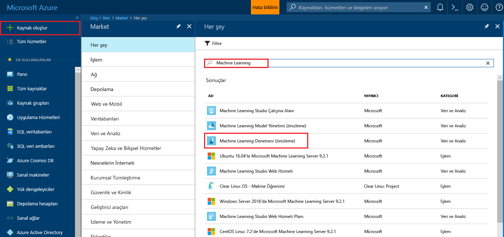

# Azure Machine Learning Önizleme hesapları oluşturma ve Azure Machine Learning Workbench'i yükleme
Azure Machine Learning hizmetleri (önizleme) tümleşik ve uçtan uca bir veri bilimi ve gelişmiş analiz çözümüdür. Bu çözüm uzman veri bilimcilerin bulut ölçeğinde veri hazırlamasına, deneme geliştirmesine ve model dağıtmasına yardımcı olur.

Bu Hızlı Başlangıç, Azure Machine Learning Önizlemesi'nde deneme ve model yönetim hesapları oluşturma işlemini göstermektedir. Ayrıca, Azure Machine Learning Workbench masaüstü uygulamasını ve CLI araçlarını yükleme adımları gösterilmektedir. Ardından, bazı fiziksel özelliklerine göre iris türünü tahmin eden bir model oluşturmak üzere [Iris çiçek veri kümesini](https://en.wikipedia.org/wiki/iris_flower_data_set) kullanarak Azure Machine Learning önizleme özelliklerinde hızlı bir tura çıkacaksınız.  

Azure aboneliğiniz yoksa başlamadan önce [ücretsiz bir hesap](https://azure.microsoft.com/free/?WT.mc_id=A261C142F) oluşturun.

## Ön koşullar

Şu anda Azure Machine Learning Workbench masaüstü uygulaması yalnızca şu işletim sistemlerine yüklenebilir: 
- Windows 10
- Windows Server 2016
- macOS Sierra
- macOS High Sierra

## Azure portalında oturum açın
[Azure Portal](https://portal.azure.com/) oturum açın.

## Azure Machine Learning hesapları oluşturma
Azure Machine Learning hesapları sağlamak için Azure portalını kullanın: 
1. Portalın sol üst köşesinde bulunan **Yeni** düğmesini (+) seçin.

2. Arama çubuğuna **Machine Learning** yazın. **Machine Learning Denemesi (önizleme)** adlı arama sonucunu seçin.  Bu seçimi Azure portalında sık kullanılanlara eklemek için yıldız simgesine tıklayın.

   

3. Yeni bir Machine Learning Denemesi hesabı yapılandırmak için **+ Ekle**'yi seçin. Ayrıntılı form açılır.

   

4. Machine Learning Denemesi formunu aşağıdaki bilgilerle doldurun:

   Ayar|Önerilen değer|Açıklama
   ---|---|---
   Deneme hesabı adı | _Benzersiz ad_ |Hesabınızı tanımlayan benzersiz bir ad seçin. Kendi adınızı veya denemeyi en iyi şekilde tanımlayan departman ya da proje adını kullanabilirsiniz. Adı 2-32 karakter arasında olmalıdır. Yalnızca alfasayısal karakterler ve kısa çizgi (-) karakteri kullanılabilir. 
   Abonelik | _Aboneliğiniz_ |Denemeniz için kullanmak istediğiniz Azure aboneliğini seçin. Birden fazla aboneliğiniz varsa kaynağın faturalanacağı uygun aboneliği seçin.
   Kaynak grubu | _Kaynak grubunuz_ | Yeni bir kaynak grubu adı oluşturabilir veya mevcut bir aboneliğinizi kullanabilirsiniz.
   Konum | _Kullanıcılarınıza en yakın bölge_ | Kullanıcılarınız ve veri kaynaklarınız için en yakın konumu seçin.
   Bilgisayar lisansı sayısı | 2 | Bilgisayar lisansı sayısını girin. Bu seçim [fiyatlandırmayı](https://azure.microsoft.com/pricing/details/machine-learning/) etkiler. İlk iki bilgisayar lisansı ücretsizdir. Bu Hızlı Başlangıç için iki bilgisayar lisansı kullanın. Bilgisayar lisansı sayısını daha sonra Azure portalında gereken şekilde güncelleştirebilirsiniz.
   Depolama hesabı | _Benzersiz ad_ | Azure depolama hesabı oluşturmak için **Yeni oluştur**'u seçin ve bir ad girin. Alternatif olarak **Var olanı kullan**'ı seçin ve açılır listeden var olan depolama hesabını belirleyin. Depolama hesabı gereklidir ve proje yapıtlarını tutmak ve geçmiş verileri çalıştırmak için kullanılır. 
   Deneme hesabı için çalışma alanı | _Benzersiz ad_ | Yeni çalışma alanı için bir ad belirtin. Adı 2-32 karakter arasında olmalıdır. Yalnızca alfasayısal karakterler ve kısa çizgi (-) karakteri kullanılabilir.
   Çalışma alanının sahibini atama | _Hesabınız_ | Çalışma alanı sahibi olarak kendi hesabınızı seçin.
   Model Yönetimi Hesabı oluşturma | *işaretle* | Deneme hesabı oluşturma deneyiminin bir parçası olarak, aynı zamanda Machine Learning Model Yönetimi hesabını oluşturma seçeneğine sahipsiniz. Bu kaynak, modellerinizi gerçek zamanlı web hizmetleri olarak dağıtıp yönetmeye hazır olduğunuzda kullanılır. Model Yönetimi hesabını Deneme hesabı ile aynı zamanda oluşturmanız önerilir.
   Hesap adı | _Benzersiz ad_ | Model Yönetimi hesabınızı tanımlayan benzersiz bir ad seçin. Kendi adınızı veya denemeyi en iyi şekilde tanımlayan departman ya da proje adını kullanabilirsiniz. Adı 2-32 karakter arasında olmalıdır. Yalnızca alfasayısal karakterler ve kısa çizgi (-) karakteri kullanılabilir. 
   Model Yönetimi fiyatlandırma katmanı | **DEVTEST** | Yeni Model Yönetimi hesabınıza ait fiyatlandırma katmanını belirtmek için **Fiyatlandırma katmanı seçilmedi** öğesini seçin. Maliyet tasarrufu için, aboneliğinizde varsa **DEVTEST** fiyatlandırma katmanını (sınırlı kullanılabilirlik) seçin. Yoksa maliyet tasarrufu için S1 fiyatlandırma katmanını seçin. Fiyatlandırma katmanı seçimini kaydetmek için **Seç**’e tıklayın. 
   Panoya sabitle | _işaretle_ | Azure portalının ön pano sayfasında Machine Learning Deneme hesabınızın kolayca izlenmesine izin vermek için **Panoya sabitle**'yi seçin.

5. Oluşturma işlemini başlatmak için **Oluştur**'u seçin.

6. Azure portalı araç çubuğunda **Bildirimler**'e (zil simgesi) tıklayarak dağıtım işlemini izleyin. 

   Bildirim **Dağıtım devam ediyor** ifadesini gösterir. İşlem tamamlandıktan sonra durum **Dağıtım başarılı** olarak değişir. Başarılı olduktan sonra Machine Learning Denemesi hesap sayfanız açılır.
   
   

Yerel bilgisayarınızda kullandığınız işletim sistemine bağlı olarak, sonraki iki bölümden birini izleyerek Azure Machine Learning Workbench'i yükleyin. 

## Windows’da Azure Machine Learning Workbench Yükleme
Azure Machine Learning Workbench'i Windows 10, Windows Server 2016 veya daha yeni bir sürümü çalıştıran bilgisayarınıza yükleyin.

1. En son Azure Machine Learning Workbench yükleyicisi [AmlWorkbenchSetup.msi](https://aka.ms/azureml-wb-msi) dosyasını indirin.

2. İndirilen **AmlWorkbenchSetup.msi** yükleyicisine Dosya Gezgini'nde çift tıklayın.

   >[!IMPORTANT]
   >Yükleyiciyi diske tam olarak indirip oradan çalıştırın. Doğrudan tarayıcınızın indirme penceresinden çalıştırmayın.

3. Ekrandaki yönergeleri izleyerek yüklemeyi tamamlayın.

   Yükleyici Python, Miniconda ve diğer ilgili kitaplıklar gibi gereken tüm bağımlı bileşenleri indirir. Yüklemenin tüm bileşenleri tamamlaması yaklaşık yarım saat sürebilir. 

4. Azure Machine Learning Workbench aşağıdaki dizine yüklenir:
   
   `C:\Users\<user>\AppData\Local\AmlWorkbench`

## macOS’ta Azure Machine Learning Workbench Yükleme
Azure Machine Learning Workbench’i macOS Sierra veya üstünü çalıştıran bilgisayarınıza yükleyin.

1. En son Azure Machine Learning Workbench yükleyicisi [AmlWorkbench.dmg](https://aka.ms/azureml-wb-dmg) dosyasını indirin.

   >[!IMPORTANT]
   >Yükleyiciyi diske tam olarak indirip oradan çalıştırın. Doğrudan tarayıcınızın indirme penceresinden çalıştırmayın.

2. İndirilen **AmlWorkbench.dmg** yükleyicisine Finder’da çift tıklayın.

3. Ekrandaki yönergeleri izleyerek yüklemeyi tamamlayın.

   Yükleyici Python, Miniconda ve diğer ilgili kitaplıklar gibi gereken tüm bağımlı bileşenleri indirir. Yüklemenin tüm bileşenleri tamamlaması yaklaşık yarım saat sürebilir. 

4. Azure Machine Learning Workbench aşağıdaki dizine yüklenir: 

   `/Applications/Azure ML Workbench.app`

## İlk kez oturum açmak üzere Azure Machine Learning Workbench'i çalıştırma
1. Yükleme işlemi tamamlandıktan sonra, yükleyicinin son ekranındaki **Workbench'i Başlat** düğmesine tıklayın. Yükleyiciyi kapattıysanız, masaüstü ve **Başlat** menüsünde **Azure Machine Learning Workbench** adlı Machine Learning Workbench kısayolunu bularak uygulamayı çalıştırın.

2. Daha önce Azure kaynaklarınızı sağlamak için kullandığınız hesabı kullanarak Workbench oturumunu açın. 

3. Oturum açma işlemi başarılı olduğunda, Workbench daha önce oluşturduğunuz Machine Learning Denemesi hesaplarını bulmaya çalışır. Kimlik bilginizin erişimi olan tüm Azure aboneliklerini arar. En az bir Deneme hesabı bulunduğunda, Workbench bu hesapla açılır. Daha sonra bu hesapta bulunan çalışma alanları ve projeler listelenir. 

   >[!TIP]
   > Birden fazla Deneme hesabına erişiminiz varsa, Workbench uygulamasının sol alt köşesindeki avatar simgesini seçerek farklı bir hesaba geçiş yapabilirsiniz.

Web hizmetlerinizi dağıtmaya yönelik bir ortam oluşturmak için bkz. [Dağıtım ortamı kurulumu](deployment-setup-configuration.md).

## Yeni bir proje oluşturma
1. Azure Machine Learning Workbench uygulamasını başlatın ve oturum açın. 

2. **Dosya** > **Yeni Projeler**'i seçin (veya **+** öğesini seçerek **PROJELER** bölmesinde oturum açın). 

3. **Proje adı** ve **Proje dizini** kutularını doldurun. **Proje açıklaması** isteğe bağlıdır ancak faydalıdır. **Visualstudio.com GIT Deposu URL'si** kutusunu şimdilik boş bırakın. Bir çalışma alanı seçin ve proje şablonu olarak **Iris Sınıflandırma** seçeneğini belirleyin.

   >[!TIP]
   >İsteğe bağlı olarak, [Visual Studio Team Services](https://www.visualstudio.com) projesinde barındırılan bir Git deposunun URL'si ile Git deposu metin kutusunu doldurabilirsiniz. Bu Git deposu önceden var olmalıdır ve ana dal içermeksizin boş olmalıdır. Ayrıca bu depoya yazma erişiminiz olmalıdır. Şu anda bir Git deposunun eklenmesi, dolaşıma ve daha sonra senaryoları paylaşmanıza olanak tanır. [Daha fazla bilgi edinin](using-git-ml-project.md).

4. Projeyi oluşturmak için **Oluştur** düğmesini seçin. Yeni bir proje oluşturulup açılır. Bu noktada proje giriş sayfası, veri kaynakları, dizüstü bilgisayarlar ve kaynak kodu dosyalarını keşfedebilirsiniz. 

    >[!TIP]
    >Ayrıca, projeyi Visual Studio Code veya diğer düzenleyicilerde bir tümleşik geliştirme ortamı (IDE) bağlantısı yapılandırarak açabilir ve sonra içindeki proje dizinini açabilirsiniz. [Daha fazla bilgi edinin](how-to-configure-your-IDE.md). 

## Python betiği çalıştırma
Şimdi yerel bilgisayarınızda bir betik çalıştıralım. 

1. Her proje kendi **Proje Panosu** sayfasında açılır. Uygulamanın üst kısmındaki komut çubuğundan yürütme hedefi olarak **yerel** seçeneğini belirleyin ve çalıştırılacak betik olarak **iris_sklearn.py** öğesini seçin. Örnekte daha sonra bakabileceğiniz başka dosyalar da mevcuttur. 

   

2. **Bağımsız değişkenler** metin kutusuna **0,01** yazın. Bu sayı kodda normalleştirme oranını ayarlamak için kullanılır. Doğrusal regresyon modelinin eğitilme biçimini yapılandırmak için kullanılan bir değerdir. 

3. **iris_sklearn.py** dosyasını bilgisayarınızda çalıştırmaya başlamak için **Çalıştır** düğmesini seçin. 

   Bu kod, modeli oluşturmak için popüler Python [scikit-learn](http://scikit-learn.org/stable/index.html) kitaplığındaki [mantıksal regresyon](https://en.wikipedia.org/wiki/logistic_regression) algoritmasını kullanır.

4. **İşler** paneli henüz görünmüyorsa sağ taraftan kaydırılır ve panele bir **iris_sklearn** işi eklenir. İş çalıştırılmaya başladığında **Gönderiliyor** olan durum **Çalıştırılıyor** olarak değişir, birkaç saniye sonra ise **Tamamlandı** olur. 

   Tebrikler. Azure Machine Learning Workbench uygulamasında Python betiğini başarıyla yürüttünüz.

6. Adım 2-4 arasını birkaç kez yineleyin. Her defasında **10** ile **0,001** aralığındaki farklı bağımsız değişken değerlerini kullanın.

## Çalıştırma geçmişini görüntüleme
1. **Çalıştırmalar** görünümüne gidin ve çalıştırma listesindeki **iris_sklearn.py** öğesini seçin. **iris_sklearn.py** için çalıştırma geçmişi panosu açılır. **iris_sklearn.py** üzerinde yürütülen her çalıştırmayı gösterir. 

   

2. Çalıştırma geçmişi panosu ayrıca her çalışma için başlıca ölçümleri, bir dizi varsayılan grafiği ve ölçüm listesini görüntüler. Yapılandırmaları sıralayarak, filtreleyerek ve ayarlayarak bu görünümü özelleştirebilirsiniz. Yapılandırma simgesini veya filtreleme simgesini seçmeniz yeterlidir.

   

3. Tamamlanan bir çalıştırmayı seçtiğinizde ilgili yürütme için ayrıntılı görünüm açılır. Ayrıntılar arasında ek ölçümler, oluşturduğu dosyalar ve diğer faydalı günlükler bulunur.

## Sonraki adımlar
Bir Azure Machine Learning Denemesi hesabını ve Azure Machine Learning Model Yönetimi hesabını başarıyla oluşturdunuz. Azure Machine Learning Workbench masaüstü uygulamasını ve komut satırı arabirimini yüklediniz. Yeni bir proje oluşturdunuz, betik çalıştırarak bir model oluşturdunuz ve betiğin çalıştırma geçmişini incelediniz.

Iris modelinizi web hizmeti olarak dağıtma dahil olmak üzere bu iş akışı hakkında daha ayrıntılı bir deneyim için *Iris Sınıflandırma* öğreticisinin tamamını izleyin. Öğretici [veri hazırlığı](tutorial-classifying-iris-part-1.md), [deneme](tutorial-classifying-iris-part-2.md) ve [model yönetimi](tutorial-classifying-iris-part-3.md) hakkında ayrıntılı adımları içerir. 

> [!div class="nextstepaction"]
> [Iris Sınıflandırma Öğreticisi](tutorial-classifying-iris-part-1.md)
