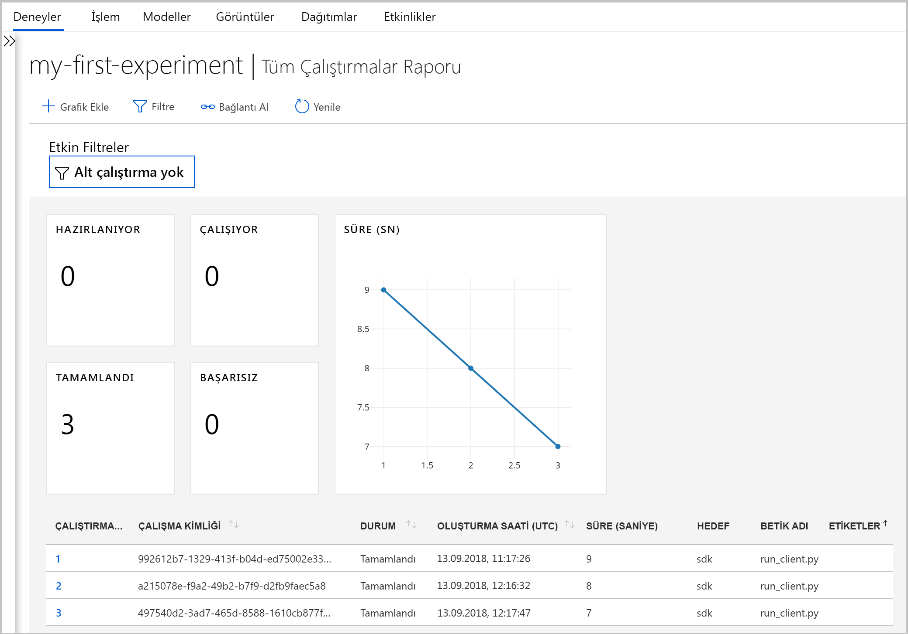
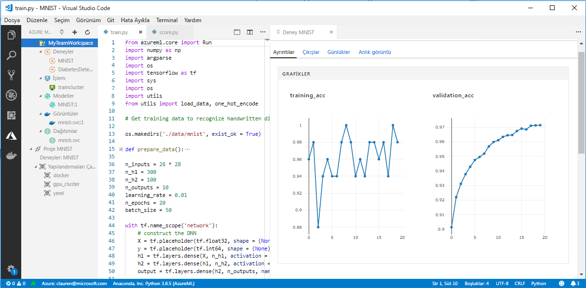

# <a name="what-happened-to-azure-machine-learning-workbench"></a>Azure Machine Learning Workbench’te neler oldu?

Azure Machine Learning Workbench uygulamasını ve bazı diğer erken özellikler kullanım dışı ve geliştirilmiş bir yol sağlamak için Eylül 2018 sürümünden yerine [mimarisi](concept-azure-machine-learning-architecture.md). 

Deneyiminizi iyileştirmek için sürüm tarafından müşteri geri bildirimi istenir birçok önemli güncelleştirme içerir. Model dağıtımı için temel işlevleri deneme çalıştırmalardan değişmedi. Ancak artık sağlam kullanabilir <a href="https://aka.ms/aml-sdk" target="_blank">SDK</a> ve [Azure CLI](reference-azure-machine-learning-cli.md) , makine öğrenimi görevlerini ve işlem hatlarını gerçekleştirmek için.  

Azure Machine Learning hizmeti önceki sürümünde oluşturulmuştur yapıtları çoğunu, kendi yerel depolanır veya Bulut depolama. Bu yapıtlar hiçbir zaman kaybolmayacaktır.

Bu makalede, değişiklikler ve Azure Machine Learning Workbench ve API'lerini önceden mevcut olan iş nasıl etkilediği hakkında bilgi edinin.

>[!Warning]
>Bu makalede, Azure Machine Learning Studio kullanıcılar için değil. Workbench (Önizleme) uygulamasının yüklü olması ve/veya deneme ve model Yönetimi Önizleme hesapları Azure Machine Learning hizmeti müşteriler için var.


## <a name="what-changed"></a>Ne değişti?

Azure Machine Learning hizmetinin en son sürüm, aşağıdaki özellikleri içerir:
+ A [Basitleştirilmiş Azure kaynaklarını modeli](concept-azure-machine-learning-architecture.md).
+ A [yeni portalı kullanıcı arabirimini](how-to-track-experiments.md) denemelerinizi yönetmek ve hedef işlem.
+ Yeni, daha kapsamlı bir Python <a href="https://aka.ms/aml-sdk" target="_blank">SDK</a>.
+ Yeni Genişletilmiş [Azure CLI uzantısı](reference-azure-machine-learning-cli.md) machine learning için.

[Mimarisi](concept-azure-machine-learning-architecture.md) kullanım kolaylığı için tasarlanmıştır. Birden çok Azure kaynağı ve hesabı yerine, size gereken yalnızca bir [Azure Machine Learning hizmeti Çalışma Alanı](concept-azure-machine-learning-architecture.md#workspace)'dır. [Azure portal]((setup-create-workspace.md#portal) içinde. hızlı bir şekilde çalışma alanları oluşturabilir Bir çalışma alanı kullanarak, birden çok kullanıcı eğitimi depolayabilir ve dağıtım işlem hedefleri, model denemeleri, Docker görüntülerini, dağıtılan modellerinde ve benzeri.

Geçerli sürümde geliştirilmiş yeni CLI ve SDK'sı istemciler olsa da Masaüstü workbench uygulamasını kullanımdan kaldırılmıştır. Denemeleri yönetilebilir [Azure portalında çalışma alanı Pano](how-to-track-experiments.md#view-the-experiment-in-the-azure-portal). Deneme geçmişinizi almak, çalışma alanınıza bağlı işlem hedeflerini yönetmek, modellerinizi ve Docker görüntülerinizi yönetmek, hatta web hizmetlerini dağıtmak için panoyu kullanın.

<a name="timeline"></a>

## <a name="support-timeline"></a>Destek zaman çizelgesi

Machine Learning Workbench, Azure Machine Learning denemesi ve Model Yönetimi hesapları için 9 Ocak 2019 üzerinde destekler ve bunların ilişkili SDK ve CLI sona erdi. 

Bunu kullanarak en son özellikleri tüm kullanılabilir <a href="https://aka.ms/aml-sdk" target="_blank">SDK</a>, [CLI](reference-azure-machine-learning-cli.md)ve [portalı](setup-create-workspace.md#portal).

## <a name="what-about-run-histories"></a>Çalıştırma geçmişleri ne olacak?

Eski çalıştırma geçmişleri artık erişilebilir, en son sürümündeki çalıştırmalarınızı nasıl yine de görebilirsiniz. 

Çalıştırma geçmişleri artık adlı **denemeleri**. Modelinizin denemeleri toplamak ve SDK'sı, CLI veya Azure portalını kullanarak keşfedin.

Portal'ın çalışma Pano yalnızca Microsoft Edge, Chrome ve Firefox tarayıcılarda desteklenir:

[](./media/overview-what-happened-to-workbench/image001.png#lightbox)

Modellerinizde eğitim ve yeni CLI ve SDK'sını kullanarak çalıştırma geçmişleri izleme başlatın. Şunları öğrenebilirsiniz nasıl [öğretici: Azure Machine Learning hizmeti ile modellerinin eğitilmesi](tutorial-train-models-with-aml.md).

## <a name="can-i-still-prep-data"></a>Verileri yine hazırlayabilir miyim?

Machine Learning Workbench artık sahip değilseniz çünkü önceden var olan veri hazırlama dosyalarınızı en son sürüme taşınabilir değildir. Ancak yine de herhangi bir boyut veri kümesi için modelleme hazırlayabilirsiniz.   

Her boyuttaki veri kümeleri ile kullanabileceğiniz [Azure Machine Learning veri hazırlığı SDK'sı](https://aka.ms/data-prep-sdk) hızla verilerinizi modelleme önce Python kod yazarak hazırlamak için. 

İzleyebileceğiniz [Bu öğreticide](tutorial-data-prep.md) Azure Machine Learning veri hazırlığı SDK'sı kullanma hakkında daha fazla bilgi için.

## <a name="will-projects-persist"></a>Projeler kalacak mı?

Hiçbir kodu veya çalışmayı kaybetmeyeceksiniz. Eski sürümde projeler yerel dizini olan bulut varlıklarıydı. En son sürümü, yerel yapılandırma dosyası kullanarak Azure Machine Learning hizmeti için çalışma alanı yerel dizin ekleyin. Bkz: bir [son mimarisi diyagramı](concept-azure-machine-learning-architecture.md).

Proje içeriğin yerel makinenizde zaten oluştu. Bu nedenle bu dizinde bir yapılandırma dosyası oluşturma ve kod, çalışma alanına bağlamak için referans yeterlidir. Dosyaları ve komut dosyalarını içeren yerel dizine kullanmaya devam etmek için dizinin adını belirtin. ['experiment.submit'](https://docs.microsoft.com/python/api/azureml-core/azureml.core.experiment.experiment?view=azure-ml-py) Python komutunu ya da kullanarak `az ml project attach` CLI komutu.  Örneğin:
```python
run = exp.submit(source_directory = script_folder, script = 'train.py', run_config = run_config_system_managed)
```

[Çalışma alanı oluşturma](setup-create-workspace.md#portal) kullanmaya başlamak için.

## <a name="what-about-my-registered-models-and-images"></a>My kayıtlı modelleri ve görüntüleri hakkında neler diyeceksiniz?

Eski model kayıt defterinizde kayıtlı modelleri, bunları kullanmaya devam etmek istiyorsanız yeni çalışma alanınıza geçirilmelidir. Modellerinizi geçirmek için modelleri indirin ve bunları yeni çalışma alanınızda yeniden kaydedin. 

Eski görüntü kayıt defterinizde oluşturduğunuz görüntüleri kullanmaya devam etmek için, bunların yeni çalışma alanında yeniden oluşturulması gerekir. Bu görüntüler aşağıdaki kullanarak yeniden oluşturabilirsiniz [yapılandırma ve görüntü oluşturma](how-to-deploy-and-where.md#configureimage) bölümler. 

## <a name="what-about-deployed-web-services"></a>Dağıtılan web hizmetlerine ne oldu?

Bu eski CLI desteği sona erdi, şimdi modelleri yeniden dağıtın veya ilk olarak, Model Yönetimi hesabı ile dağıtılan web hizmetleri yönetin. Ancak, bu web hizmetleri için Azure Container Service (ACS) hala destekleniyor sürece çalışmaya devam eder.

En son sürümde modelleri web hizmetleri için Azure Container Instances'a (ACI) veya Azure Kubernetes Service (AKS) kümesi olarak dağıtılır. Ayrıca, FPGA ve Azure IOT Edge için dağıtabilirsiniz. 

Bu makalelerde daha fazla bilgi edinin:
+ [Burada ve modelleri dağıtma](how-to-deploy-and-where.md)
+ [Öğretici: Azure Machine Learning hizmeti ile modelleri dağıtma](tutorial-deploy-models-with-aml.md)

## <a name="what-about-the-old-sdk-and-cli"></a>CLI ve eski SDK'sı hakkında neler diyeceksiniz?

Evet, bunlar Ocak tarihine kadar çalışmaya devam edeceğiz. Önceki bkz [zaman çizelgesi](#timeline). En son SDK'sı veya CLI ile yeni denemeler ve modelleri oluşturmaya başlamanızı öneririz.

En son sürümdeki yeni Python SDK'sını kullanarak Azure Machine Learning hizmetindeki herhangi bir Python ortamı etkileşim kurabilirsiniz. En son <a href="https://aka.ms/aml-sdk" target="_blank">SDK</a>’yı yüklemeyi öğrenin. Güncelleştirilmiş kullanabilirsiniz [Azure Machine Learning CLI uzantısı](reference-azure-machine-learning-cli.md) ile zengin `az ml` Azure Cloud Shell dahil olmak üzere herhangi bir komut satırı ortamında hizmetiyle etkileşim kurmak için komutları.

## <a name="what-about-visual-studio-code-tools-for-ai"></a>AI için Visual Studio Code araçları hakkında neler diyeceksiniz?

Bu en son sürümde uzantısı Azure Machine Learning için Visual Studio Code için yeniden adlandırıldı ve olduğundan genişletilmiş ve önceki yeni özellikler ile çalışacak şekilde geliştirildi.

[](./media/overview-what-happened-to-workbench/vscode-big.png#lightbox)

## <a name="what-about-domain-packages"></a>Etki alanı paketlerine ne oldu?

Görüntü işleme, metin analizi ve tahmin için etki alanı paketlerin en son sürümü Azure Machine Learning ile kullanılamaz. Ancak, yine de oluşturabilir ve görüntü işleme, metin ve tahmin modellerinin en son Azure Machine Learning Python ile eğitme <a href="https://aka.ms/aml-sdk" target="_blank">SDK</a>. Metin analizi, görüntü işleme kullanılarak oluşturulmuş mevcut modellerde geçirmeyi öğrenin ve paketler, tahmin başvurun [ AML-Packages@microsoft.com ](mailto:AML-Packages@microsoft.com).

## <a name="next-steps"></a>Sonraki adımlar

Hakkında bilgi edinin [Azure Machine Learning hizmeti için en son mimarisi](concept-azure-machine-learning-architecture.md). 

Hizmetine genel bakış için okuma [Azure Machine Learning hizmeti nedir?](overview-what-is-azure-ml.md)

Bir betiği çalıştırmak ve betiğin çalıştırma geçmişini Azure Machine Learning hizmetinin en son sürümle keşfetmek nasıl gösteren Hızlı Başlangıç için deneyin [Azure Machine Learning hizmeti ile çalışmaya başlama](quickstart-run-cloud-notebook.md).

Bu iş akışının daha ayrıntılı bir deneyim izleyin [eksiksiz öğreticide](tutorial-train-models-with-aml.md) eğitim ve modeller Azure Machine Learning hizmeti ile dağıtmak için ayrıntılı adımları içerir. 
