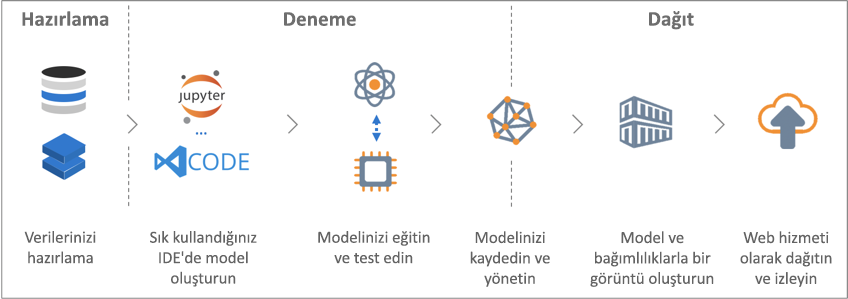

# Azure Machine Learning hizmeti nedir?

Azure Machine Learning hizmeti eğitmek, dağıtma, otomatikleştirin ve tüm bulut sunuyor Geniş ölçekte makine öğrenimi modelleri yönetmek için kullandığınız bir bulut hizmetidir.

## Machine learning nedir?

Makine öğrenimi; bilgisayarların var olan verileri kullanarak gelecekteki davranışları, sonuçları ve eğilimleri öngörmelerini sağlayan bir veri bilimi tekniğidir. Machine learning kullanarak açıkça programlamaya gerek kalmadan bilgisayarlar öğrenin.

Makine öğreniminin öngörüleri veya tahminleri, uygulama ve cihazları daha akıllı hale getirir. Örneğin, çevrimiçi alışveriş yaparken makine öğrenimi, ne, satın aldığım üzerinde göre isteyebileceğiniz diğer ürünleri önermede yardımcı olur. Veya kredi kartınız makineden geçirildiğinde, makine öğrenimi işlemi bir işlem veritabanıyla karşılaştırır ve sahtekarlıkların saptanmasına yardımcı olur. Elektrikli süpürge robotunuz bir odayı temizlediğinde ise, makine öğrenimi robotunuzun işin tamamlanıp tamamlanmadığına karar vermesine yardımcı olur.

## Azure Machine Learning hizmeti nedir?

Azure Machine Learning hizmeti, veri hazırlama, eğitme, test, dağıtma, yönetme ve makine öğrenimi modelleri izlemek için kullanabileceğiniz bulut tabanlı bir ortam sağlar.

Azure Machine Learning hizmeti tamamen açık kaynak teknolojilerini destekler. Bu nedenle, makine öğrenimi bileşenleri on binlerce açık kaynak Python paketlerini kullanabilirsiniz. Örnekler PyTorch, TensorFlow ve scikit-öğrenin.
Zengin Araçlar desteği etkileşimli olarak keşfedin ve verileri hazırlama geliştirme ve test modelleri daha kolay hale getirir. Örnekler [Jupyter not defterleri](https://jupyter.org) veya [Visual Studio Code için Azure Machine Learning](https://marketplace.visualstudio.com/items?itemName=ms-toolsai.vscode-ai#overview) uzantısı.
Azure Machine Learning hizmeti ayrıca kolaylık, verimlilik ve doğrulukla modeller oluşturmanıza yardımcı olan [model oluşturma ve ayarlama işlemini otomatik hale getiren](tutorial-auto-train-models.md) özellikler içerir.

Azure Machine Learning hizmetini kullanarak, yerel makinenizde eğitim başlatın ve sonra ölçeği buluta genişletme. Kullanılabilir birçok [hedefleri işlem](how-to-set-up-training-targets.md), ister Azure Machine Learning işlem ve [Azure Databricks](/azure/azure-databricks/what-is-azure-databricks)ile [Hizmetleri ayarlama hiper parametre Gelişmiş](how-to-tune-hyperparameters.md), oluşturabileceğinizi bulutun gücünü kullanarak daha hızlı bir şekilde daha iyi modelleri.

Doğru modeli kullandığınızda, Docker gibi bir kapsayıcıya kolayca dağıtabilirsiniz. Bu nedenle, Azure Container Instances veya Azure Kubernetes hizmeti dağıtmak basit bir işlemdir. Veya kendi dağıtımlarda, şirket içinde veya bulutta kapsayıcı kullanabilirsiniz. Daha fazla bilgi için makaleye bakın [nasıl dağıtılacağı ve nerede](how-to-deploy-and-where.md).

Dağıtılan modellerinde yönetebilir ve en uygun çözümü bulmak için denerken birden çok çalıştırma izleyin.
Modeliniz dağıtıldıktan sonra elde edilmesi de döndürebilir [gerçek zamanlı](how-to-consume-web-service.md) veya [zaman uyumsuz olarak](how-to-run-batch-predictions.md) büyük miktarlarda veri çubuğunda.

İle Gelişmiş [makine öğrenimi işlem hatları](concept-ml-pipelines.md), veri hazırlama, model eğitiminin ve değerlendirme ve dağıtım tüm adımları üzerinde işbirliği yapabilirsiniz.

## Azure Machine Learning hizmeti ile neler yapabilirim?

Kullanarak <a href="https://aka.ms/aml-sdk" target="_blank">ana Python SDK'sını</a> ve <a href="https://aka.ms/data-prep-sdk" target="_blank">Data Prep SDK'sını</a> Azure Machine Learning yanı sıra açık kaynak Python paketlerini, derleme ve yüksek oranda doğru makine öğrenimi ve derin öğrenme modelleri eğitme kendiniz bir Azure Machine Learning hizmetinde çalışma alanı.
Aşağıdaki örnekler gibi açık kaynak Python paketlerini de kullanılabilen bileşenler birçok makine arasından seçim yapabilirsiniz:

- <a href="https://scikit-learn.org/stable/" target="_blank">Scikit-learn</a>
- <a href="https://www.tensorflow.org" target="_blank">Tensorflow</a>
- <a href="https://pytorch.org" target="_blank">PyTorch</a>
- <a href="https://www.microsoft.com/en-us/cognitive-toolkit/" target="_blank">CNTK</a>
- <a href="https://mxnet.io" target="_blank">MXNet</a>

Azure Machine Learning hizmeti aynı zamanda autotrain bir model ve Otomatik Ayarla bunu sizin için.
Bir örnek için bkz. [otomatik machine learning ile bir regresyon modeli Eğitimi](tutorial-auto-train-models.md).

Bir modeli oluşturduktan sonra yerel olarak test etmek için dağıtılabilecek Docker gibi bir kapsayıcı oluşturmak için kullanın. Test tamamlandıktan sonra bir üretim web hizmetine veya Azure Container Instances, hem de Azure Kubernetes hizmeti olarak modeli dağıtabilirsiniz. Daha fazla bilgi için makaleye bakın [nasıl dağıtılacağı ve nerede](how-to-deploy-and-where.md).

Dağıtılan Modellerinizi kullanarak yönetebileceğiniz sonra [Python için Azure Machine Learning SDK](https://aka.ms/aml-sdk) veya [Azure portalında](https://portal.azure.com/).
Modelin denemeleri tümünü havada modeli ölçümler, retrain ve yeniden dağıtma modeli yeni sürümlerini değerlendirebilirsiniz.

Azure Machine Learning hizmeti ile çalışmaya başlamak için bkz: [sonraki adımlar](#next-steps).

## Azure Machine Learning hizmetini Machine Learning Studio'dan farklı mı?

[Azure Machine Learning Studio](../studio/what-is-ml-studio.md) Burada, oluşturabilir, test ve kod yazmaya gerek kalmadan, makine öğrenimi çözümleri dağıtma bir işbirliğine dayalı, sürükle ve bırak visual çalışma alanıdır. Önceden oluşturulmuş ve önceden yapılandırılmış makine öğrenimi algoritmaları ve veri işleme modüllerini kullanır.

Makine öğrenimi modelleri ile hızlı ve kolay bir şekilde deneme yapmak istediğinizde ve yerleşik makine öğrenimi algoritmaları çözümleriniz için yeterli olduğunda Machine Learning Studio’yu kullanın.

Bir Python ortamında çalışıyorsanız, makine öğrenimi algoritmalarınız üzerinde daha fazla denetime sahip olmak istiyorsanız veya açık kaynaklı makine öğrenimi kitaplıkları kullanmak istiyorsanız, Machine Learning hizmetini kullanın.

> [!NOTE]
> Azure Machine Learning Studio'da oluşturulan modeller dağıtılan veya Azure Machine Learning hizmeti tarafından yönetilir.

## Ücretsiz deneme sürümü

Azure aboneliğiniz yoksa başlamadan önce ücretsiz bir hesap oluşturun. Deneyin [Azure Machine Learning hizmetinin ücretsiz veya Ücretli sürümüne](https://aka.ms/AMLFree) bugün.

Azure hizmetlerinde harcayabileceğiniz krediler alırsınız. Krediler bittikten sonra hesabı tutabilir ve [ücretsiz Azure hizmetlerini](https://azure.microsoft.com/free/) kullanabilirsiniz. Açıkça ayarlarınızı değiştirip ücretlendirme istemediğiniz sürece kredi kartınız asla ücretlendirilmez. Veya [MSDN abone Avantajlarınızı etkinleştirebilir](https://azure.microsoft.com/pricing/member-offers/msdn-benefits-details/?WT.mc_id=A261C142F), ücretli Azure Hizmetleri, size, için kullanabildiğiniz her ay krediler sunar.

## Sonraki adımlar

- [Machine Learning hizmeti çalışma alanı oluşturma](setup-create-workspace.md) kullanmaya başlamak için.

- Eksiksiz öğreticileri izleyin: 
  + [Bir Azure Machine Learning hizmeti ile görüntü sınıflandırma modeli eğitme](tutorial-train-models-with-aml.md) 
  + [Veri hazırlama ve otomatik-bir regresyon modeli eğitimi için otomatik makine öğrenimi kullanıyor](tutorial-data-prep.md)

- Kullanım [Azure Machine Learning veri hazırlığı SDK'sı](https://aka.ms/data-prep-sdk) verilerinizi hazırlamak için.

- Makine öğrenmesi senaryolarınızı derlemek, iyileştirmek ve yönetmek için [makine öğrenmesi işlem hatları](/azure/machine-learning/service/concept-ml-pipelines) hakkında bilgi edinin.

- Ayrıntılı okuma [Azure Machine Learning hizmeti mimarisi ve kavramları](concept-azure-machine-learning-architecture.md) makalesi.

- Daha fazla bilgi için [diğer makine öğrenimi ürünlerini Microsoft gelen](/azure/architecture/data-guide/technology-choices/data-science-and-machine-learning).
