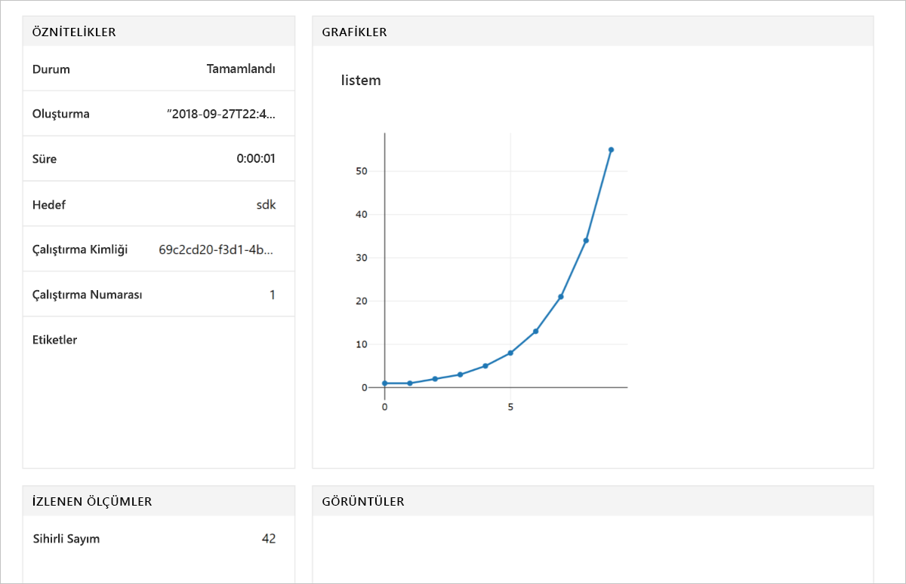

# <a name="quickstart-use-the-python-sdk-to-get-started-with-azure-machine-learning"></a>Hızlı Başlangıç: Azure Machine Learning'i kullanmaya başlamak için Python SDK'sını kullanma

Bu makalede, Python 3 için Azure Machine Learning SDK'sı oluşturun ve ardından bir Azure Machine Learning hizmeti için kullandığınız [çalışma](concept-azure-machine-learning-architecture.md). Çalışma alanı, denemeler, eğitmek ve Machine Learning ile makine öğrenimi modelleri dağıtmak için kullandığınız bulutta temel taşıdır.

Kendi Python ortamını ve Jupyter Notebook sunucusu yapılandırarak başlamadan. Bu yükleme ile çalıştırmak için bkz [hızlı başlangıç: Azure Machine Learning'i kullanmaya başlamak için Azure portal'ı kullanmanızı](quickstart-get-started.md). 

Bu hızlı başlangıç videosu görüntüleyin:

> [!VIDEO https://www.microsoft.com/en-us/videoplayer/embed/RE2G9N6]

Bu hızlı başlangıçta:

* Python SDK'yı yükleyin.
* Azure aboneliğinizde çalışma alanı oluşturma.
* Bu çalışma alanı için daha sonra diğer notebook'larda ve betiklerde kullanmak üzere bir yapılandırma dosyası oluşturma.
* Çalışma alanına değer kaydeden bir kod yazma.
* Günlüğe kaydedilen değerleri çalışma alanınızda görüntüleme.

Bir çalışma alanı ve diğer Machine Learning öğreticileri ve nasıl yapılır makaleleri için önkoşul olarak kullanılacak bir yapılandırma dosyası oluşturun. Diğer Azure hizmetlerinde olduğu gibi bazı limitler ve kotalar Machine Learning ile ilişkilendirilir. [Kotalar ve artış talebinde bulunma hakkında bilgi edinin.](how-to-manage-quotas.md)

Aşağıdaki Azure kaynakları, bölgesel kullanıma sunulduğunda çalışma alanınıza otomatik olarak eklenir:
 
- [Azure Container Registry](https://azure.microsoft.com/services/container-registry/)
- [Azure Depolama](https://azure.microsoft.com/services/storage/)
- [Azure Application Insights](https://azure.microsoft.com/services/application-insights/) 
- [Azure Anahtar Kasası.](https://azure.microsoft.com/services/key-vault/)

>[!NOTE]
> Bu makalede kod gerektiren Azure Machine Learning SDK'sı sürüm 1.0.2 veya üzeri ve zamanlarını 1.0.8 sürümü ile test edilmiştir.


Azure aboneliğiniz yoksa başlamadan önce ücretsiz bir hesap oluşturun. Deneyin [Azure Machine Learning hizmetinin ücretsiz veya Ücretli sürümüne](http://aka.ms/AMLFree) bugün.

## <a name="install-the-sdk"></a>SDK yükle

> [!IMPORTANT]
> Bir Azure veri bilimi sanal makinesi veya Azure Databricks kullanırsanız, bu bölümü atlayın.
> * 27 Eylül 2018'den sonra oluşturulan Azure veri bilimi sanal makineleri, önceden yüklenmiş Python SDK ile birlikte gelir.
> * Azure Databricks ortamda [Databricks yükleme adımlarını](how-to-configure-environment.md#azure-databricks) yerine.

SDK'yı yüklemeden yalıtılmış bir Python ortamı oluşturmanızı öneririz. Bu makalede kullansa [Miniconda](https://docs.conda.io/en/latest/miniconda.html), ayrıca tam kullanabilirsiniz [Anaconda](https://www.anaconda.com/) yüklü veya [Python virtualenv](https://virtualenv.pypa.io/en/stable/).

Bu hızlı başlangıçtaki yönergeler hızlı ve öğretici not defterlerini çalıştırmak için gereken tüm paketleri yükler.  Diğer örnek not defterleri, ek bileşen yüklenmesini gerektirebilir.  Bu bileşenler hakkında daha fazla bilgi için bkz. [Python için Azure Machine Learning SDK'sını yükleme](https://docs.microsoft.com/python/api/overview/azure/ml/install).

### <a name="install-miniconda"></a>Miniconda'yı yükleme

[Miniconda yükleyip](https://docs.conda.io/en/latest/miniconda.html). Python 3.7 sürümün yükleneceğini seçin. Python 2.x sürümünü seçmeyin.  

### <a name="create-an-isolated-python-environment"></a>Yalıtılmış Python ortamı oluşturma

1. Bir komut satırı penceresi açın ve ardından adlı yeni bir conda ortam oluşturmak *myenv* ve Python 3.6.5 yükleyin. Python 3.5.2 ile iş veya üzeri Azure Machine Learning SDK'sı olacaktır, ancak otomatik makine bileşenleri öğrenimi Python-3.7 tam işlevsel değildir.  Bileşenleri ve paketleri indirilen ortamı oluşturmak için birkaç dakika sürer.

    ```shell
    conda create -n myenv python=3.6.5
    ```

1. Ortamı etkinleştirin.

    ```shell
    conda activate myenv
    ```

1. Ortama özgü ıpython çekirdekler etkinleştir:

    ```shell
    conda install notebook ipykernel
    ```

    Ardından çekirdek oluşturun:

    ```shell
    ipython kernel install --user
    ```

### <a name="install-the-sdk"></a>SDK yükle

1. Etkinleştirilen conda ortamında, Machine Learning SDK'sı temel bileşenleri ile Jupyter not defteri özellikleri yükleyin. Yükleme, makinenizin yapılandırmasına göre tamamlanması birkaç dakika sürer.

    ```shell
    pip install --upgrade azureml-sdk[notebooks]
    ```

1. Azure Machine Learning öğreticileri için bu ortamı kullanmak için bu paketleri yükleyin.

    ```shell
    conda install -y cython matplotlib pandas
    ```

1. Azure Machine Learning öğreticileri için bu ortamı kullanmak için otomatik makine öğrenme bileşenleri yükleyin.

    ```shell
    pip install --upgrade azureml-sdk[automl]
    ```

> [!IMPORTANT]
> Bazı komut satırı araçlarını, tırnak işaretleri gibi eklemeniz gerekebilir: * 'azureml-sdk [Not]' * 'azureml-sdk [automl]'
>


## <a name="create-a-workspace"></a>Çalışma alanı oluşturma

Python SDK'sını kullanarak bir Jupyter not defterinde çalışma alanınızı oluşturun.

1. Oluşturma ve/veya öğreticileri ve hızlı başlangıç için kullanmak istediğiniz dizine cd.

1. Jupyter not defteri başlatmak için şu komutu girin:

    ```shell
    jupyter notebook
    ```

1. Tarayıcı penceresinde varsayılan `Python 3` çekirdeğini kullanarak yeni bir notebook oluşturun. 

1. SDK sürümü görüntülemek için girin ve ardından bir not defteri hücreye aşağıdaki Python kodunu yürütün:

   [!code-python[](~/aml-sdk-samples/ignore/doc-qa/quickstart-create-workspace-with-python/quickstart.py?name=import)]

1. Bulma için bir değer `<azure-subscription-id>` parametresinde [Azure portalında abonelikleri listesi](https://ms.portal.azure.com/#blade/Microsoft_Azure_Billing/SubscriptionsBlade). Sahip veya katkıda bulunan rolüne sahip olduğunuz herhangi bir aboneliği kullanabilirsiniz.

   ```python
   from azureml.core import Workspace
   ws = Workspace.create(name='myworkspace',
                         subscription_id='<azure-subscription-id>', 
                         resource_group='myresourcegroup',
                         create_resource_group=True,
                         location='eastus2' 
                        )
   ```

   Siz kodu yürütürken, Azure hesabınızda oturum açmanız istenebilir. Oturum açtıktan sonra kimlik doğrulama belirteci yerel önbelleğe alınır.

1. Çalışma alanını görüntülemek için aşağıdaki kodu ilişkili depolama, kapsayıcı kayıt defteri ve anahtar kasası gibi ayrıntılarını girin:

    [!code-python[](~/aml-sdk-samples/ignore/doc-qa/quickstart-create-workspace-with-python/quickstart.py?name=getDetails)]


## <a name="write-a-configuration-file"></a>Yapılandırma dosyası yazma

Bir yapılandırma dosyası geçerli dizin için çalışma alanınızı ayrıntılarını kaydedin. Bu dosya adında *aml_config\config.json*.  

Bu çalışma alanı yapılandırma dosyası, aynı çalışma alanına daha sonra yüklemek kolaylaştırır. Bunu başka notebook'lar ve betiklerle aynı dizine veya bir alt dizine yükleyebilirsiniz.  

[!code-python[](~/aml-sdk-samples/ignore/doc-qa/quickstart-create-workspace-with-python/quickstart.py?name=writeConfig)]

Bu `write_config()` API çağrısı, yapılandırma dosyasını geçerli dizinde oluşturur. *Config.json* dosyası şunları içerir:

```json
{
    "subscription_id": "<azure-subscription-id>",
    "resource_group": "myresourcegroup",
    "workspace_name": "myworkspace"
}
```

## <a name="use-the-workspace"></a>Çalışma alanını kullanma

Deneme çalıştırmalarınızın izlemek için SDK'ın temel API'leri kullanan bazı kod çalıştırın:

1. Bir deney, çalışma alanınızda oluşturun.
1. Tek bir değer alanına oturum açın.
1. Değerlerin bir listesini ve denemenin oturum açın.

[!code-python[](~/aml-sdk-samples/ignore/doc-qa/quickstart-create-workspace-with-python/quickstart.py?name=useWs)]

## <a name="view-logged-results"></a>Günlüğe kaydedilen sonuçları görüntüleme
Çalıştırma tamamlandığında deneme çalıştırmasının sonucunu Azure portalda görüntüleyebilirsiniz. Son çalıştırmanın sonuçlarını ızgaranın URL yazdırmak için aşağıdaki kodu kullanın:

```python
print(run.get_portal_url())
```

Bağlantıyı kullanarak Azure portala kaydedilen değerleri tarayıcınızda görüntüleyebilirsiniz.



## <a name="clean-up-resources"></a>Kaynakları temizleme 
>[!IMPORTANT]
>Kullanabileceğiniz kaynakları oluşturduğunuz diğer Machine Learning öğreticileri için ön koşulları olarak burada ve nasıl yapılır makaleleri.

Bu makalede oluşturduğunuz kaynakları kullanmayı planlamıyorsanız, tüm geçmeyecekseniz ücretlendirmeden kaçınmak için bunları silin.

[!code-python[](~/aml-sdk-samples/ignore/doc-qa/quickstart-create-workspace-with-python/quickstart.py?name=delete)]

## <a name="next-steps"></a>Sonraki adımlar

Bu makalede, denemeler ve modelleri dağıtmak için ihtiyacınız olan kaynakları oluşturdunuz. Kod içinde bir not defteri çalıştırdığınız ve bulutta çalışma alanınızdaki kodunu çalıştırma geçmişini incelediniz.

> [!div class="nextstepaction"]
> [Öğretici: Bir görüntü sınıflandırma modeli eğitme](tutorial-train-models-with-aml.md)

[GitHub'daki daha gelişmiş örnekleri](https://aka.ms/aml-notebooks) de keşfedebilirsiniz.
