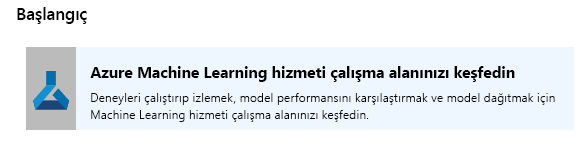
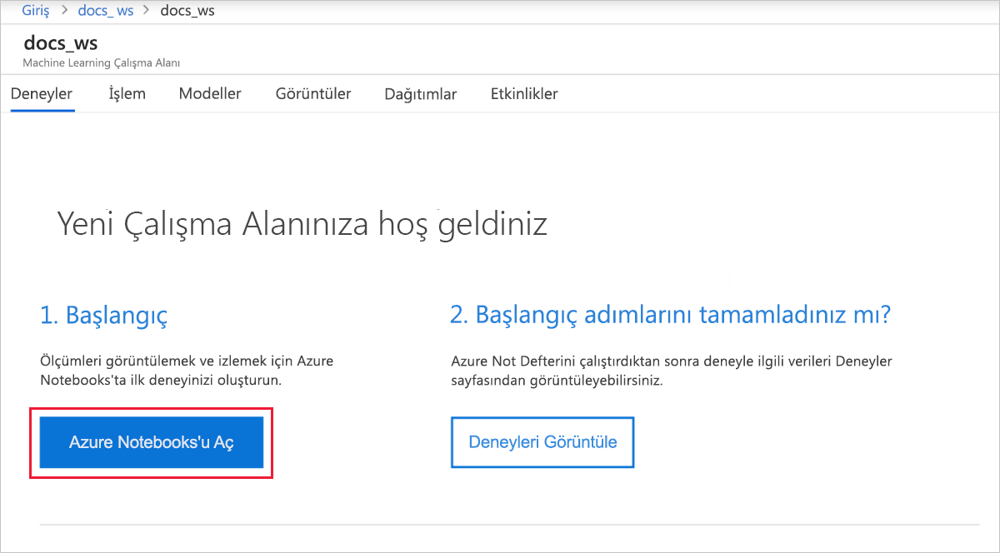
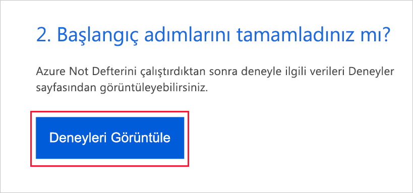
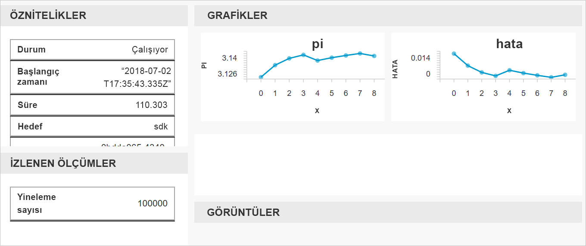

# Hızlı Başlangıç: Azure Machine Learning'i kullanmaya başlamak için Azure portalını kullanma

Azure Machine Learning çalışma alanı oluşturmak için Azure portalını kullanın. Bu çalışma alanı Machine Learning ile bulutta makine öğrenmesi modellerini denemek, eğitmek ve dağıtmak için kullanabileceğiniz temel bileşenlerden biridir. Bu hızlı başlangıçta bulut kaynakları kullanılmaktadır ve bu nedenle herhangi bir yükleme yapmanıza gerek yoktur. Bunun yerine kendi Jupyter Notebook sunucusu yapılandırmak için bkz [hızlı başlangıç: Azure Machine Learning'i kullanmaya başlamak için Python kullanma](quickstart-create-workspace-with-python.md).  
 
Bu hızlı başlangıçta, aşağıdaki eylemleri gerçekleştirin:

* Azure aboneliğinizde çalışma alanı oluşturma.
* Python ile bir Jupyter not defteri ve günlük değerleri arasında birden çok yineleme deneyin.
* Günlüğe kaydedilen değerleri çalışma alanınızda görüntüleme.

Aşağıdaki Azure kaynakları, bölgesel kullanıma sunulduğunda çalışma alanınıza otomatik olarak eklenir:

  - [Azure Container Registry](https://azure.microsoft.com/services/container-registry/)
  - [Azure Depolama](https://azure.microsoft.com/services/storage/)
  - [Azure Application Insights](https://azure.microsoft.com/services/application-insights/) 
  - [Azure Anahtar Kasası.](https://azure.microsoft.com/services/key-vault/)

Oluşturduğunuz kaynaklar, diğer Machine Learning hizmeti öğreticileri ve nasıl yapılır makalelerinde önkoşul olarak kullanılabilir. Diğer Azure hizmetlerinde de olduğu gibi, Machine Learning hizmetiyle ilişkilendirilmiş bazı kaynakların sınırları vardır. İşlem kümesi boyutu buna bir örnektir. Daha fazla bilgi edinin [varsayılan limitler ve kotanızı artırmak nasıl](how-to-manage-quotas.md).

Azure aboneliğiniz yoksa başlamadan önce ücretsiz bir hesap oluşturun. Deneyin [Azure Machine Learning hizmetinin ücretsiz veya Ücretli sürümüne](http://aka.ms/AMLFree) bugün.

## Çalışma alanı oluşturma 

[!INCLUDE [aml-create-portal](../../../includes/aml-create-in-portal.md)]

## Çalışma alanını kullanma

> [!VIDEO https://www.microsoft.com/en-us/videoplayer/embed/RE2F9Ad]

Artık bir çalışma alanı, makine öğrenimi betiklerini yönetmenize nasıl yardımcı olduğunu öğrenin. Bu bölümde, aşağıdaki adımları uygulayın:

* Azure Notebooks'da bir not defteri açma.
* Günlüğe kaydedilen bazı değerler oluşturan kodu çalıştırma.
* Günlüğe kaydedilen değerleri çalışma alanınızda görüntüleme.

Bu örnek, çalışma alanının betikte oluşturulan bilgileri izlemenize nasıl yardımcı olduğunu gösterir. 

### Not defterini açma 

[Azure not defterleri](https://notebooks.azure.com) Machine Learning çalıştırmak için gereken her şeyi ile önceden yapılandırılmış Jupyter not defterleri için ücretsiz bulut platformu sağlar. Çalışma alanınızdan çalışma alanınızı Azure Machine Learning hizmeti ile çalışmaya başlamak için bu platform başlatabilirsiniz.

1. Çalışma sayfasında **çalışma, Azure Machine Learning hizmetini keşfedin**.

 

1. Seçin **açık Azure not defterleri** ilk denemenizi Azure not defterlerinde denemek için.  Azure not defterleri, ücretsiz bulutta çalıştırmadan Jupyter Notebook sağlayan ayrı bir hizmettir.  Bu bağlantı hizmeti kullandığınızda, çalışma alanınıza bağlanma hakkında bilgi Azure not defterlerinde oluşturduğunuz kitaplığa eklenir.

 

1. Azure Not Defterleri'nda oturum açın.  Azure portalında oturum açmak için kullandığınız hesapla oturum açmanız emin olun. Oturum açabilmeniz için kuruluşunuzda [yönetici onayı](https://notebooks.azure.com/help/signing-up/work-or-school-account/admin-consent) gerekli olabilir.

1. Siz oturum açtıktan sonra, yeni bir sekme açılır ve `Clone Library` istemi görüntülenir. Bu kitaplık kopyalama not defterleri ve diğer dosyaları bir dizi Azure not defterleri hesabınızda yükler.  Bu dosyaları Azure Machine Learning yeteneklerini keşfetmenize yardımcı olur.

1. Onay kutusunu temizleyin **genel** böylece çalışma alanı bilgilerinizi başkalarıyla paylaşmayın.

1. Seçin **kopya**.

 

1. Proje durumu durdurulduğunu görüyorsanız tıklayın **ücretsiz işlem çalıştırma** ücretsiz notebook sunucusu kullanmak için.

    

### Not defterini çalıştırma

Bu proje için dosya listesinde, gördüğünüz bir `config.json` dosya. Bu yapılandırma dosyası, çalışma alanı bilgilerini Azure portalında oluşturduğunuz içerir.  Bu dosya bağlanmak ve bilgi çalışma alanınıza eklemek için kodunuzu sağlar.

1. Seçin **01.run experiment.ipynb** not defterini açın.

1. Durum alanı çekirdek başlatıldı kadar beklenecek söyler.  Çekirdek hazır olduğunda ileti kaybolur.

    

1. Çekirdek başlatıldıktan sonra bir hücre, bir zaman kullanarak çalıştırın **Shift + Enter**. Veya **hücreleri** > **tümünü Çalıştır** tüm not defterlerini çalıştırmak için. Bir yıldız işareti gördüğünüzde __*__, hücrede yanında hücre hala çalışıyor. Hücredeki kodun çalışması tamamlandığında bir sayı görünür. 

1. Azure aboneliğinizin kimlik doğrulaması yapmak için not defterindeki yönergeleri izleyin.

Not defterinde çalıştıran tüm hücreleri bitirdikten sonra çalışma alanınızda günlüğe kaydedilen değerleri görüntüleyebilirsiniz.

## Günlüğe kaydedilen değerleri görüntüleme

1. Çıkışı `run` hücre geri çalışma alanınızda deneme sonuçlarını görüntülemek için Azure portalına bir bağlantı içerir. 

    

1. Tıklayın **Azure portalı bağlantısını** çalışma alanınızda çalıştırma hakkında bilgi görüntülemek için.  Bu bağlantı, Azure portalında çalışma alanınızı açar.

1. Çizimler gördüğünüz günlüğe kaydedilen değerler otomatik olarak çalışma alanında oluşturulur. Aynı ad parametresine sahip birden fazla değeri günlüğe kaydettiğinizde otomatik olarak bir çizim oluşturulur.

   

Yaklaşık PI koda rastgele değerler kullandığından, çizimleri farklı değerler gösterilir.  

## Kaynakları temizleme 

[!INCLUDE [aml-delete-resource-group](../../../includes/aml-delete-resource-group.md)]

Ayrıca, kaynak grubunu korumakla birlikte tek bir çalışma alanını silebilirsiniz. Çalışma alanı özelliklerini görüntülemek ve seçmek **Sil**.

## Sonraki adımlar

Deneme ve model dağıtımı için gerekli kaynakları oluşturdunuz. Ayrıca bir defterde bulunan bazı kodları da çalıştırdınız. Buluttaki çalışma alanınızda bu koddan gelen çalıştırma geçmişini de incelediniz.

Ayrıntılı iş akışı deneyimi için eğitmek ve model dağıtma için Machine Learning öğreticileri izleyin:  

> [!div class="nextstepaction"]
> [Öğretici: Bir görüntü sınıflandırma modeli eğitme](tutorial-train-models-with-aml.md)
