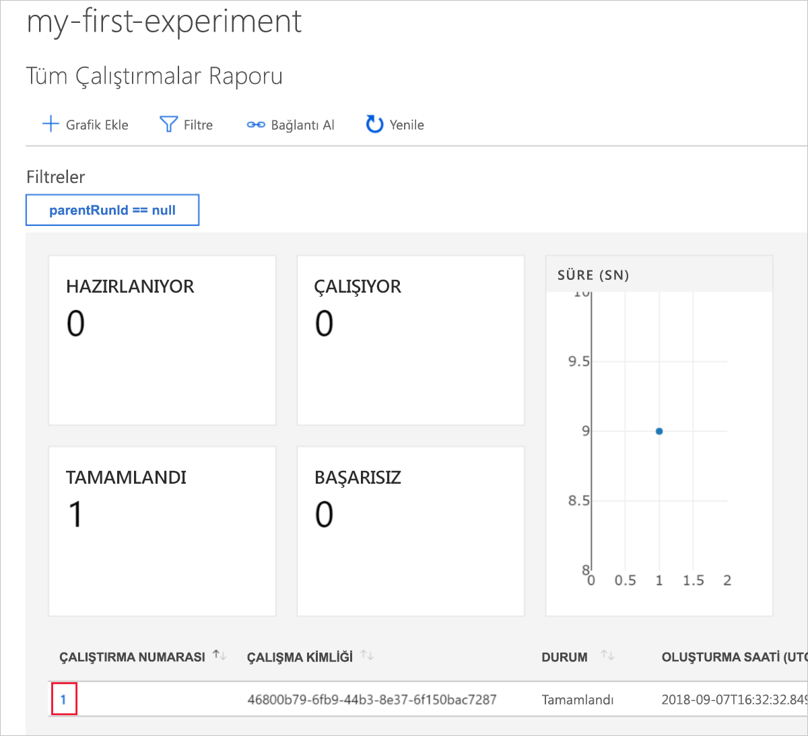
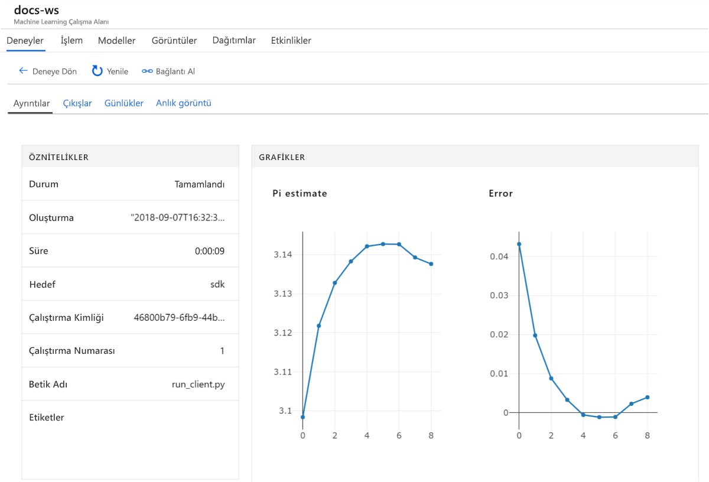

# <a name="quickstart-use-the-azure-portal-to-get-started-with-azure-machine-learning-service"></a>Hızlı başlangıç: Azure portalı kullanarak Azure Machine Learning hizmetini kullanmaya başlama

Bu hızlı başlangıçta Azure Machine Learning hizmeti çalışma alanı oluşturmak için Azure portalını kullanacaksınız. Bu çalışma alanı Azure Machine Learning hizmetiyle makine öğrenmesi modellerini denemek, eğitmek ve dağıtmak için bulutta temel bir yapıdır. 

Bu öğreticide şunları yapacaksınız:

* Azure aboneliğinizde çalışma alanı oluşturma
* Azure Notebooks'da Python ile deneme ve birden çok yinelemeden değerleri günlüğe kaydetme
* Günlüğe kaydedilen değerleri çalışma alanınızda görüntüleme

Size kolaylık sağlamak için, şu Azure kaynakları bölgesel olarak sağlandığında otomatik olarak çalışma alanınıza eklenir: [kapsayıcı kayıt defteri](https://azure.microsoft.com/services/container-registry/), [depolama](https://azure.microsoft.com/services/storage/), [uygulama içgörüleri](https://azure.microsoft.com/services/application-insights/), ve [anahtar kasası](https://azure.microsoft.com/services/key-vault/).

Oluşturduğunuz kaynaklar, diğer Azure Machine Learning hizmeti öğreticileri ve nasıl yapılır makalelerinde önkoşul olarak kullanılabilir. Diğer Azure hizmetlerinde de olduğu gibi, Azure Machine Learning hizmetiyle ilişkilendirilmiş bazı kaynakların sınırları vardır (BatchAI küme boyutu gibi). Varsayılan sınırları ve daha fazla kota isteğinde bulunmayı öğrenmek için lütfen [bu](how-to-manage-quotas.md) makaleyi okuyun.

Azure aboneliğiniz yoksa başlamadan önce [ücretsiz bir hesap](https://azure.microsoft.com/free/?WT.mc_id=A261C142F) oluşturun.


## <a name="create-a-workspace"></a>Çalışma alanı oluşturma 

[!INCLUDE [aml-create-portal](../../../includes/aml-create-in-portal.md)]

Çalışma alanı sayfasında `Explore your Azure Machine Learning service workspace` öğesine tıklayın

 


## <a name="use-the-workspace"></a>Çalışma alanını kullanma

Şimdi çalışma alanının makine öğrenmesi betiklerinizin yönetimine nasıl yardımcı olduğunu göreceksiniz. Bu bölümde şunları yapacaksınız:

* Azure Notebooks'da bir not defteri açma
* Günlüğe kaydedilen bazı değerler oluşturan kodu çalıştırma
* Günlüğe kaydedilen değerleri çalışma alanınızda görüntüleme

Bu, çalışma alanının betikte oluşturulan bilgileri izlemenize nasıl yardımcı olduğunu gösteren bir örnektir. 

### <a name="open-a-notebook"></a>Not defterini açma 

Azure Notebooks, Azure Machine Learning hizmetini çalıştırmak için gereken her şeyle önceden yapılandırılmıştır ve Jupyter not defterleri için ücretsiz bir bulut platformu sağlar.  

İlk denemenizi yapmak için `Open Azure Notebooks` düğmesine tıklayın.

 

Siz oturum açtıktan sonra, yeni bir sekme açılır ve `Clone Library` istemi görüntülenir.  `Clone` öğesine tıklayın


### <a name="run-the-notebook"></a>Not defterini çalıştırma

İki not defterinin yanı sıra bir de `config.json` dosyası görürsünüz.  Bu yapılandırma dosyası az önce oluşturduğunuz çalışma alanıyla ilgili bilgileri içerir.  

`01.run-experiment.ipynb` öğesine tıklayarak not defterini açın.

`Shift`+`Enter` tuşlarını kullanarak hücreleri teker teker çalıştırabilirsiniz.  Öte yandan `Cells` > `Run All` menüsünü kullanarak not defterinin tamamını da çalıştırabilirsiniz.  Hücrenin yanında [*] simgesinin görünmesi çalıştığını gösterir.  Bu hücrenin kodu tamamlandığında bir sayı görüntülenir.

Oturum açmanız istenebilir.  İletideki kodu kopyalayın, sonra bağlantıya tıklayın ve kodu yeni pencereye yapıştırın.  Kodun başında veya sonunda boşluk kopyalamamaya dikkat edin.  Azure portalda kullandığınız hesapla oturum açın.

 

Not defterinde, ikinci hücre çalışma alanınıza bağlanmak için `config.json` dosyasından alınır.
```
ws = Workspace.from_config()
```

Üçüncü kod hücresi "my-first-experiment" adlı bir deneme başlatır.  Çalışma alanınıza dönüp çalıştırma hakkındaki bilgileri aramak için bu adı kullanacaksınız.

```
experiment = Experiment(workspace_object=ws, name = "my-first-experiment")
```

Not defterinin son hücresindeki değerlerin bir günlük dosyasına yazıldığına dikkat edin.

```
# Log final results
run.log("Final estimate: ",pi_estimate)
run.log("Final error: ",math.pi-pi_estimate)
```

Kod çalıştırıldıktan sonra bu değerleri çalışma alanınızda görüntüleyebilirsiniz.

## <a name="view-logged-values"></a>Günlüğe kaydedilen değerleri görüntüleme

Not defterindeki hücrelerin tümü tamamlandıktan sonra portal sayfasına dönün.  

`View Experiments` öğesine tıklayın.


`Reports` açılan listesini kapatın.

`my-first-experiment` öğesine tıklayın.

Az önce gerçekleştirdiğiniz çalışma hakkındaki bilgilere bakın.  Çalıştırma tablosunu bulmak için sayfayı aşağı kaydırın ve çalıştırma numarası bağlantısına tıklayın.

 

Günlüğe kaydedilen verilerden otomatik olarak oluşturulan çizimlere bakın:

   

## <a name="clean-up-resources"></a>Kaynakları temizleme 

[!INCLUDE [aml-delete-resource-group](../../../includes/aml-delete-resource-group.md)]

Çalışma alanı özelliklerini görüntüleyerek ve Sil düğmesini seçerek kaynak grubunu koruyup tek bir çalışma alanını silmeniz de mümkündür.

## <a name="next-steps"></a>Sonraki adımlar

Artık modelleri denemeye ve dağıtmaya başlamak için gerekli kaynakları oluşturdunuz. Ayrıca not defterinden kod çalıştırdınız ve buluttaki çalışma alanınızda bu koddan gelen çalıştırma geçmişini incelediniz.

Ayrıntılı bir iş akışı deneyimi için, Azure Machine Learning öğreticilerini izleyerek bir modeli eğitin ve dağıtın.  

> [!div class="nextstepaction"]
> [Öğretici: Görüntü sınıflandırma modelini eğitme](tutorial-train-models-with-aml.md)
