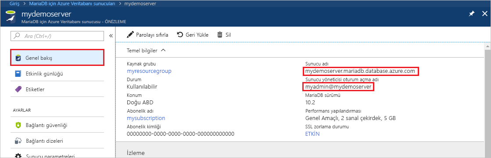
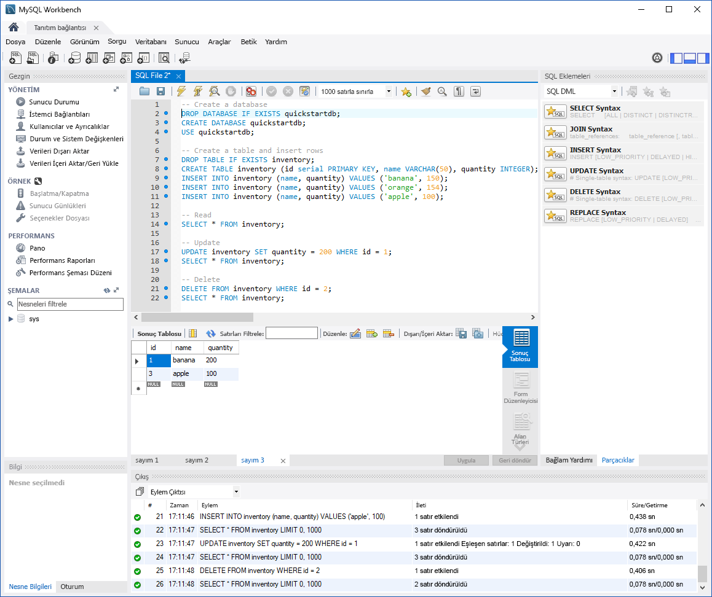

# <a name="azure-database-for-mariadb-use-mysql-workbench-to-connect-and-query-data"></a>MariaDB için Azure Veritabanı: Bağlanmak ve veri sorgulamak için MySQL Workbench kullanma

Bu hızlı başlangıçta MySQL Workbench'i kullanarak MariaDB için Azure Veritabanı örneğine nasıl bağlanacağınız gösterilmiştir. 

## <a name="prerequisites"></a>Önkoşullar

Bu hızlı başlangıçta, başlangıç noktası olarak aşağıdaki kılavuzlardan birinde oluşturulan kaynaklar kullanılmaktadır:

- [Azure portalı kullanarak MariaDB için Azure Veritabanı sunucusu oluşturma](./quickstart-create-mariadb-server-database-using-azure-portal.md)
- [Azure CLI kullanarak MariaDB için Azure Veritabanı sunucusu oluşturma](./quickstart-create-mariadb-server-database-using-azure-cli.md)

## <a name="install-mysql-workbench"></a>MySQL Workbench’i yükleme

[MySQL Workbench'i indirin](https://dev.mysql.com/downloads/workbench/) ve bilgisayarınıza yükleyin.

## <a name="get-connection-information"></a>Bağlantı bilgilerini alma

MariaDB için Azure Veritabanı örneğine bağlanmak üzere gereken bağlantı bilgilerini alın. Tam sunucu adına ve oturum açma kimlik bilgilerine ihtiyacınız vardır.

1. [Azure Portal](https://portal.azure.com/) oturum açın.

2. Azure portalın sol tarafındaki menüden **Tüm kaynaklar**'ı seçin. Oluşturduğunuz sunucuyu arayın (**demosunucum** gibi).

3. Sunucu adını seçin.

4. Sunucunun **Genel Bakış** sayfasında **Sunucu adı** ve **Sunucu yöneticisi oturum açma adı** değerlerini not edin. Parolanızı unuttuysanız, bu sayfadan parolayı da sıfırlayabilirsiniz.

   

## <a name="connect-to-the-server-by-using-mysql-workbench"></a>MySQL Workbench kullanarak sunucuya bağlanma

MySQL Workbench ile MariaDB için Azure Veritabanı sunucusuna bağlanmak için:

1. Bilgisayarınızda MySQL Workbench uygulamasını açın. 

2. **Setup New Connection** (Yeni Bağlantı Oluştur) iletişim kutusundaki **Parameters** (Parametreler) sekmesine aşağıdaki bilgileri girin:

   | Ayar | Önerilen değer | Alan açıklaması |
   |---|---|---|
   |   Bağlantı Adı | **Tanıtım bağlantısı** | Bu bağlantı için bir etiket belirtin. |
   | Bağlantı Yöntemi | **Standart (TCP/IP)** | Standart (TCP/IP) yeterlidir. |
   | Ana Bilgisayar Adı | *sunucu adı* | MariaDB için Azure Veritabanı örneğini oluşturmak üzere kullandığınız sunucu adı değerini belirtin. Örnek sunucumuz: **mydemoserver.mariadb.database.azure.com**. Örnekte gösterildiği gibi tam etki alanı adını (\*.mariadb.database.azure.com) kullanın. Sunucu adınızı anımsamıyorsanız bağlantı bilgilerini almak için bir önceki bölümdeki adımları tamamlayın.  |
   | Bağlantı noktası | **3306** | MariaDB için Azure Veritabanı’na bağlanırken her zaman bağlantı noktası olarak 3306 kullanın. |
   | Kullanıcı adı |  *sunucu yöneticisi oturum açma adı* | MariaDB için Azure Veritabanı örneğini oluşturmak üzere kullandığınız sunucu yöneticisi oturum açma kullanıcı adını girin. Bizim örnek kullanıcı adı **myadmin\@demosunucum**. Sunucu kullanıcısı oturum açma adını anımsamıyorsanız bağlantı bilgilerini almak için bir önceki bölümdeki adımları tamamlayın. Biçim *kullanıcıadı\@servername*.
   | Parola | *parolanız* | Parolayı kaydetmek için **Store in Vault** (Kasada depola) seçeneğini belirtin. |

   

3. Tüm parametrelerin doğru yapılandırılıp yapılandırılmadığını denetlemek için **Test Connection** (Bağlantıyı Sına) öğesini seçin. 

4. Bağlantıyı kaydetmek için **Tamam**’a tıklayın. 

5. **MySQL Connections** (MySQL Bağlantılarım) bölümünde sunucunuza karşılık gelen kutucuğu seçin. Bağlantının kurulmasını bekleyin.

   Sorgularınızı yazabileceğiniz boş bir düzenleyici içeren yeni bir SQL sekmesi açılır.
    
   > [!NOTE]
   > Varsayılan olarak SSL bağlantısının güvenli olması gerekir ve MariaDB için Azure Veritabanı sunucunuzda zorunlu tutulur. Normalde MySQL Workbench'in sunucunuza bağlanması için SSL sertifikalı ek yapılandırma gerekmez ancak SSL CA sertifikasını MySQL Workbench sunucunuza bağlamanızı öneririz. SSL özelliğini devre dışı bırakmanız gerekiyorsa Azure portalda sunucu genel bakış sayfasına gidin ve menüden **Bağlantı güvenliği** girişini seçin. **SSL bağlantısını zorla** bölümünde **Devre dışı** girişini seçin.

## <a name="create-table-and-insert-read-update-and-delete-data"></a>Tablo oluşturma ve veri ekleme, okuma, güncelleştirme ve silme

1. Bazı örnek verileri görmek için aşağıdaki örnek SQL kodunu kopyalayıp SQL sekmesindeki boş bir sayfaya tıklayın.

    Bu kod **quickstartdb** adlı boş bir veritabanı oluşturur. Ardından **inventory** adlı bir örnek tablo oluşturur. Kod birkaç satır ekler ve sonra bu satırları okur. Verileri bir güncelleştirme deyimiyle değiştirir ve ardından satırları yeniden okur. Kod son olarak bir satırı siler ve satırları yeniden okur.
    
    ```sql
    -- Create a database
    -- DROP DATABASE IF EXISTS quickstartdb;
    CREATE DATABASE quickstartdb;
    USE quickstartdb;
    
    -- Create a table and insert rows
    DROP TABLE IF EXISTS inventory;
    CREATE TABLE inventory (id serial PRIMARY KEY, name VARCHAR(50), quantity INTEGER);
    INSERT INTO inventory (name, quantity) VALUES ('banana', 150);
    INSERT INTO inventory (name, quantity) VALUES ('orange', 154);
    INSERT INTO inventory (name, quantity) VALUES ('apple', 100);
    
    -- Read
    SELECT * FROM inventory;
    
    -- Update
    UPDATE inventory SET quantity = 200 WHERE id = 1;
    SELECT * FROM inventory;
    
    -- Delete
    DELETE FROM inventory WHERE id = 2;
    SELECT * FROM inventory;
    ```

    Ekran görüntüsünde, MySQL Workbench’te örnek bir SQL kodu ve kod çalıştırıldıktan sonra oluşan çıktı gösterilmektedir:
    
    

2. Örnek SQL kodunu çalıştırmak için **SQL Dosyası** sekmesindeki araç çubuğunda bulunan şimşek simgesine tıklayın.
3. Sayfanın ortasındaki **Sonuç Izgarası** bölümünde üç sekme halinde sonuçların yer aldığına dikkat edin. 
4. Sayfanın en altındaki **Çıktı** listesine dikkat edin. Her komutun durumu gösterilir. 

Bu hızlı başlangıçta MySQL Workbench kullanarak MariaDB için Azure Veritabanı’na bağlandınız ve SQL dilini kullanarak verileri sorguladınız.

<!--
## Next steps
> [!div class="nextstepaction"]
> [Migrate your database using Export and Import](./concepts-migrate-import-export.md)
-->
