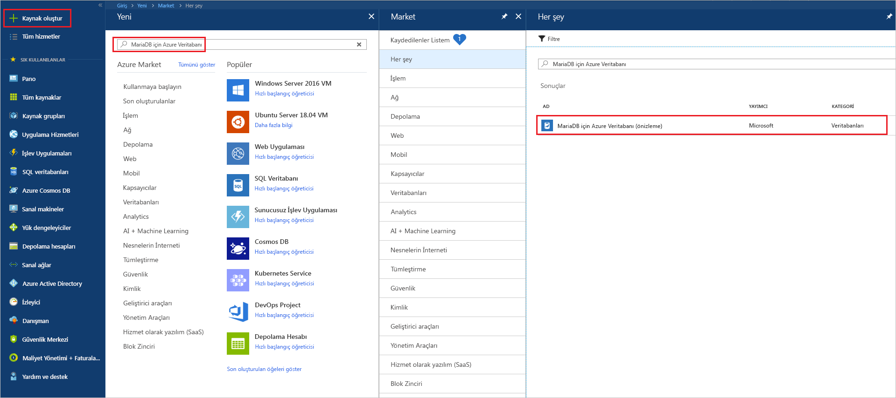
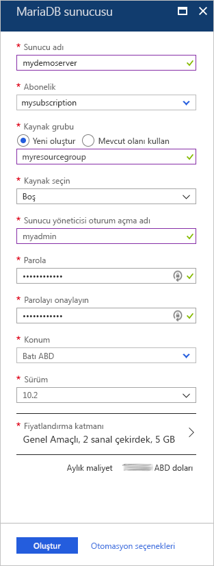
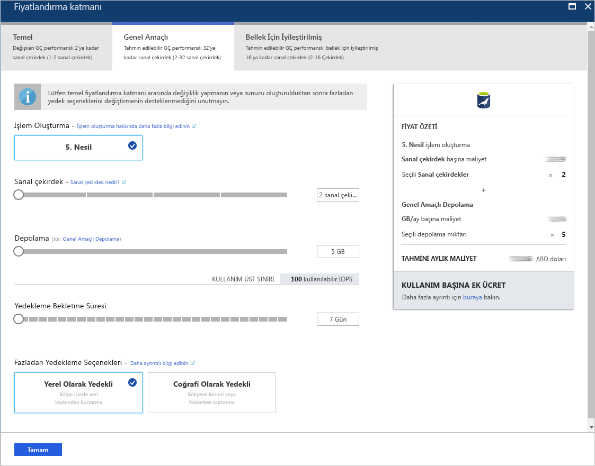
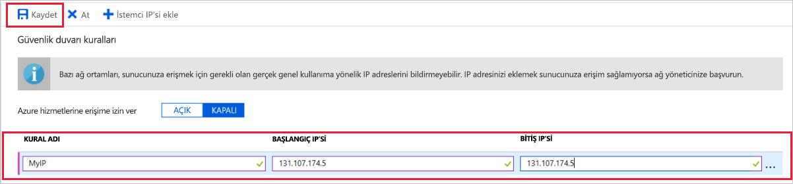
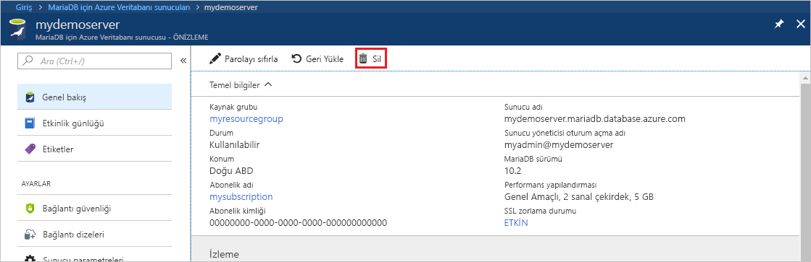

# <a name="create-an-azure-database-for-mariadb-server-by-using-the-azure-portal"></a>Azure portalı kullanarak MariaDB için Azure Veritabanı sunucusu oluşturma

MariaDB için Azure Veritabanı, bulutta yüksek oranda kullanılabilir olan MariaDB veritabanlarını çalıştırmak, yönetmek ve ölçeklendirmek için kullanılan, yönetilen bir hizmettir. Bu hızlı başlangıçta, Azure portalı kullanarak yaklaşık beş dakikada nasıl MariaDB için Azure Veritabanı sunucusu oluşturacağınız gösterilmektedir.  

Azure aboneliğiniz yoksa başlamadan önce [ücretsiz bir Azure hesabı](https://azure.microsoft.com/free/) oluşturun.

## <a name="sign-in-to-the-azure-portal"></a>Azure portalında oturum açın

Web tarayıcınızda [Azure portala](https://portal.azure.com/) gidin. Portalda oturum açmak için kimlik bilgilerinizi girin. Varsayılan görünüm hizmet panonuzu içerir.

## <a name="create-an-azure-database-for-mariadb-server"></a>MariaDB için Azure Veritabanı sunucusu oluşturma

Tanımlı bir dizi [işlem ve depolama kaynağı](concepts-pricing-tiers.md) ile MariaDB için Azure Veritabanı sunucusu oluşturulur. Sunucu, [Azure kaynak grubu](../azure-resource-manager/resource-group-overview.md) içinde oluşturulur.

MariaDB için Azure Veritabanı sunucusu oluşturmak için:

1. Portalın sol üst köşesinde bulunan **Kaynak oluştur** düğmesini (+) seçin.

2. Seçin **veritabanları** > **MariaDB için Azure veritabanı**. Ayrıca **MariaDB** hizmeti bulmak için arama kutusuna.

   

3. Aşağıdaki sunucu bilgilerini girin veya seçin:
   
   

    Ayar | Önerilen değer | Açıklama
    ---|---|---
    Sunucu adı | *benzersiz sunucu adı* | MariaDB için Azure Veritabanı sunucunuzu tanımlayan benzersiz bir ad seçin. Örneğin, **demosunucum**. Girdiğiniz sunucu adına *.mariadb.database.azure.com* etki alanı adı eklenir. Sunucu adı yalnızca küçük harf, sayı ve kısa çizgi (-) karakterini içerebilir. 3 ile 63 arasında karakter içermelidir.
    Abonelik | *aboneliğiniz* | Sunucunuz için kullanmak istediğiniz Azure aboneliğini seçin. Birden fazla aboneliğiniz varsa kaynağın faturalandırıldığı aboneliği seçin.
    Kaynak grubu | **myresourcegroup** | Yeni bir kaynak grubu adı girin veya var olan bir kaynak grubunu seçin. 
    Kaynak seçme | **Boş** | Sıfırdan yeni bir sunucu oluşturmak için **Boş**’u seçin. (Mevcut bir MariaDB için Azure Veritabanı sunucusunun coğrafi yedeğinden bir sunucu oluşturuyorsanız, **Yedek**'i seçin.)
    Sunucu yöneticisi oturum açma | **myadmin** | Sunucuya bağlanırken kullanılacak oturum açma hesabı. Yönetici oturum açma adı **azure_superuser**, **admin**, **administrator**, **root**, **guest** veya **public** olamaz.
    Parola | *tercih ettiğiniz* | Sunucu yönetici hesabı için yeni bir parola girin. 8 ile 128 arasında karakter içermelidir. Parolanız şu kategorilerin üçünden karakterler içermelidir: İngilizce büyük harfler, İngilizce küçük harfler, sayılar (0-9) ve alfasayısal olmayan karakterler (!, $, #, % vb.).
    Parolayı onayla | *tercih ettiğiniz*| Yönetici hesabı parolasını onaylayın.
    Konum | *kullanıcılarınıza en yakın bölge*| Kullanıcılarınıza veya diğer Azure uygulamalarınıza en yakın konumu seçin.
    Sürüm | *en son sürüm*| En son sürüm (başka bir sürüm kullanmak için belirli gereksinimleriniz yoksa).
    Fiyatlandırma katmanı | Açıklamaya bakın. | Yeni sunucunuz için işlem, depolama ve yedekleme yapılandırmaları. **Fiyatlandırma katmanı** > **Genel Amaçlı**'yı seçin. Aşağıdaki ayarlar için varsayılan değerleri kullanın:<br><ul><li>**İşlem Oluşturma** (Gen 5)</li><li>**Sanal çekirdek** (4 çekirdek)</li><li>**Depolama** (100 GB)</li><li>**Yedekleme Saklama Dönemi** (7 gün)</li></ul><br>Coğrafi olarak yedekli depolamada sunucu yedeklerinizi etkinleştirmek için **Fazladan Yedek Seçenekleri**’nde **Coğrafi Olarak Yedeklemeli**’yi seçin. <br><br>Bu fiyatlandırma katmanı seçimini kaydetmek için **Tamam**’ı seçin. Sonraki ekran görüntüsü bu seçimleri yakalar.
  
   > [!NOTE]
   > Temel fiyatlandırma katmanını kullanarak göz önünde bulundurun hafif işlem ve g/ç iş yükünüz için yeterli olup olmadığını. Temel fiyatlandırma katmanında oluşturulan sunucular daha sonra genel amaçlı veya bellek için iyileştirilmiş ölçeklendirilemiyor olduğunu unutmayın. Bkz: [fiyatlandırma sayfası](https://azure.microsoft.com/pricing/details/mariadb/) daha fazla bilgi için.
   > 

   

4.  Sunucuyu sağlamak için **Oluştur**’u seçin. Hazırlama işlemi 20 dakika kadar sürebilir.
   
5.  Dağıtım işlemini izlemek için araç çubuğunda **Bildirimler**’i (zil simgesi) seçin.
   
Varsayılan olarak, sunucunuz altında aşağıdaki veritabanları oluşturulur: **information_schema**, **mysql**, **performance_schema** ve **sys**.


## <a name="configure-firewall-rule"></a>Sunucu düzeyinde güvenlik duvarı kuralı oluşturma

MariaDB için Azure Veritabanı hizmeti, sunucu düzeyinde bir güvenlik duvarı oluşturur. Güvenlik duvarı, belirli IP adresleri için güvenlik duvarını açmak üzere bir güvenlik duvarı kuralı oluşturulmadıkça, dış uygulama ve araçların sunucuya veya sunucu üzerindeki herhangi bir veritabanına bağlanmasını engeller. 

Sunucu düzeyinde bir güvenlik duvarı kuralı oluşturmak için:

1. Dağıtım tamamlandıktan sonra sunucunuzu bulun. Gerekirse arama yapabilirsiniz. Örneğin soldaki menüden **Tüm Kaynaklar**'ı seçin. Ardından sunucu adını girin. Örneğin **demosunucum** yazarak yeni oluşturduğunuz sunucuyu arayabilirsiniz. Arama sonuçları listesinden sunucu adını seçin. Sunucunuzun **Genel Bakış** sayfası açılır. Bu sayfada diğer ayarları değiştirebilirsiniz.

2. Sunucu genel bakış sayfasında **Bağlantı güvenliği**’ni seçin.

3. **Güvenlik duvarı kuralları** bölümünde, güvenlik duvarı kuralı oluşturmaya başlamak için **Kural Adı** sütunundaki boş metin kutusunu seçin. Bu sunucuya bağlanacak istemcilerin hassas IP aralığını belirtin.
   
   

4. **Bağlantı güvenliği** sayfasının üst araç çubuğunda **Kaydet**’i seçin. Devam etmeden önce güncelleştirmenin başarıyla tamamlandığını belirten bildirim görünene kadar bekleyin. 

   > [!NOTE]
   > MariaDB için Azure Veritabanı bağlantıları, 3306 numaralı bağlantı noktası üzerinden iletişim kurar. Kurumsal ağ içinden bağlanmaya çalışıyorsanız, 3306 numaralı bağlantı noktası üzerinden giden trafiğe izin verilmiyor olabilir. Bu örnekte sunucunuza bağlanabilmek için BT departmanınızın 3306 numaralı bağlantı noktasını açması gerekir.
   > 

## <a name="get-connection-information"></a>Bağlantı bilgilerini alma

Veritabanı sunucusuna bağlanmak için tam sunucu adı ve yönetici oturum açma kimlik bilgileri gerekir. Bu değerleri bu makalenin önceki bölümlerinde not almış olabilirsiniz. Aksi takdirde, Azure portalındaki sunucuya **Genel Bakış** sayfasında veya **Özellikler** sayfasında sunucu adını ve oturum açma bilgilerini kolayca bulabilirsiniz:

1. Sunucunuzun **Genel Bakış** sayfasına gidin. **Sunucu adı** ve **Sunucu yöneticisi oturum açma adı** değerlerini not edin. 

2. Değerleri kopyalamak için imlecinizi kopyalamak istediğiniz alanın üzerine getirin. Metnin sağ tarafında kopyalama simgesi görünür. Değerleri kopyalamak için gerektiği şekilde Kopyala simgesini seçin.

Bu örnekte sunucu adı şöyledir **mydemoserver.mariadb.database.azure.com** ve Sunucu Yöneticisi oturum açma adını **myadmin\@demosunucum**.

## <a name="connect-to-azure-database-for-mariadb-by-using-the-mysql-command-line"></a>mysql komut satırını kullanarak MariaDB için Azure Veritabanı'na bağlanma

MariaDB için Azure Veritabanı sunucunuza çeşitli uygulamalar kullanarak bağlanabilirsiniz.

İlk olarak sunucuya nasıl bağlanılacağını göstermek için [mysql](https://dev.mysql.com/doc/refman/5.7/en/mysql.html) komut satırı aracını kullanacağız. Bir web tarayıcısını ve Azure Cloud Shell’i yazılım yüklemeden kullanabilirsiniz. Yerel olarak yüklü mysql yardımcı programınız varsa, oradan da bağlanabilirsiniz.

1. Azure portalda sağ üst köşedeki araç çubuğunda bulunan terminal simgesi aracılığıyla (**>_**) Azure Cloud Shell’i başlatın.
   

2. Azure Cloud Shell tarayıcınızda açılır. Cloud Shell'de bash kabuk komutlarını kullanabilirsiniz.

   

3. Cloud Shell isteminde, mysql komut satırına girerek MariaDB için Azure Veritabanı sunucunuza bağlanın.

    mysql yardımcı programını kullanarak MariaDB için Azure Veritabanı sunucusuna bağlanmak için aşağıdaki biçimi kullanın:

    ```bash
    mysql --host <fully qualified server name> --user <server admin login name>@<server name> -p
    ```

    Örneğin, aşağıdaki komut örnek sunucumuza bağlanır:

    ```azurecli-interactive
    mysql --host mydemoserver.mariadb.database.azure.com --user myadmin@mydemoserver -p
    ```

    mysql parametresi |Önerilen değer|Açıklama
    ---|---|---
    --host | *sunucu adı* | MariaDB için Azure Veritabanı sunucusunu oluşturmak üzere kullandığınız sunucu adı değeri. Örnek sunucumuz: **mydemoserver.mariadb.database.azure.com**. Örnekte gösterildiği gibi tam etki alanı adını (**\*.mariadb.database.azure.com**) kullanın. Sunucu adınızı anımsamıyorsanız bağlantı bilgilerini almak için bir önceki bölümdeki adımları tamamlayın.
    --kullanıcı | *sunucu yöneticisi oturum açma adı* |MariaDB için Azure Veritabanı sunucusunu oluşturmak üzere kullandığınız sunucu yöneticisi oturum açma kullanıcı adı. Kullanıcı adını anımsamıyorsanız bağlantı bilgilerini almak için bir önceki bölümdeki adımları tamamlayın. Biçim *kullanıcıadı\@servername*.
    -p | *parolanız*<br>(istenene kadar bekleyin) |İstendiğinde sunucuyu oluşturmak için kullandığınız parolayı girin. Yazılan parola karakterleri bash isteminde gösterilmez. Parolayı girdikten sonra Enter tuşuna basın.

   mysql yardımcı programı bağlandığında `mysql>` istemi görüntülenir. İsteme komut girebilirsiniz. 

   mysql çıktısı örneği aşağıda verilmiştir:

    ```bash
    Welcome to the MySQL monitor.  Commands end with ; or \g.
    Your MySQL connection id is 65505
    Server version: 5.6.39.0 MariaDB Server
    
    Copyright (c) 2000, 2017, Oracle and/or its affiliates. All rights reserved.
    
    Oracle is a registered trademark of Oracle Corporation and/or its
    affiliates. Other names may be trademarks of their respective
    owners.

    Type 'help;' or '\h' for help. Type '\c' to clear the current input statement.
    
    mysql>
    ```
    
    > [!TIP]
    > Güvenlik duvarı Azure Cloud Shell IP adreslerine izin verecek biçimde yapılandırılmamışsa aşağıdaki hata oluşur:
    >
    >   HATA 2003 (28000): 123.456.789.0 IP adresli istemcinin sunucuya erişmesine izin verilmiyor.
    >
    > Hatayı gidermek için sunucu yapılandırmasının [Sunucu düzeyinde güvenlik duvarı kuralı yapılandırma](#configure-firewall-rule) bölümünde yer alan adımlarla eşleştiğinden emin olun.

4. Bağlantıyı doğrulamak için `mysql>` isteminde **status** yazarak sunucu durumunu denetleyebilirsiniz.

    ```sql
    status
    ```

   > [!TIP]
   > Ek komutlar için bkz. [MySQL 5.7 Başvuru Kılavuzu - Bölüm 4.5.1](https://dev.mysql.com/doc/refman/5.7/en/mysql.html).

5. Aşağıdaki komutu yazarak `mysql>` isteminde boş bir veritabanı oluşturun:

   ```sql
   CREATE DATABASE quickstartdb;
   ```
   Komutun bitmesi birkaç dakika sürebilir. 

   MariaDB için Azure Veritabanı sunucusunda bir veya daha fazla veritabanı oluşturabilirsiniz. Tüm kaynakları kullanmak için sunucu başına tek bir veritabanı veya kaynakları paylaşmak için birden çok veritabanı oluşturabilirsiniz. Sınırsız sayıda veritabanı oluşturabilirsiniz, ancak birden fazla veritabanı aynı sunucu kaynağını paylaşır. 

6. Veritabanlarını listelemek için `mysql>` isteminde şu komutu girin:

    ```sql
    SHOW DATABASES;
    ```

7. **\q** yazıp Enter tuşuna basarak mysql aracını kapatın. Ardından Azure Cloud Shell’i de kapatabilirsiniz.

MariaDB için Azure Veritabanı sunucusuna bağladınız ve boş bir kullanıcı veritabanı oluşturdunuz. Bir sonraki bölümde aynı sunucuya başka bir genel araç olan MySQL Workbench'i kullanarak bağlanacağız.

## <a name="connect-to-the-server-by-using-mysql-workbench"></a>MySQL Workbench kullanarak sunucuya bağlanma

MySQL Workbench kullanarak sunucuya bağlanmak için:

1. İstemci bilgisayarınızda MySQL Workbench uygulamasını açın. MySQL Workbench'i indirip yüklemek için [MySQL Workbench’i İndir](https://dev.mysql.com/downloads/workbench/) bağlantısını kullanabilirsiniz.

2. Yeni bağlantı oluşturmak için **MySQL Connections** (MySQL Bağlantıları) üst bilgisinin yanındaki artı simgesini (**+**) seçin.

3. **Setup New Connection** (Yeni Bağlantı Oluştur) iletişim kutusundaki **Parameters** (Parametreler) sekmesine sunucunuzun bağlantı bilgilerini girin. Yer tutucu değerleri örnek olarak gösterilmiştir. **Hostname** (Ana Bilgisayar Adı), **Username** (Kullanıcı Adı) ve **Password** (Parola) yerine kendi değerlerinizi yazın.

   

    |Ayar |Önerilen değer|Alan açıklaması|
    |---|---|---|
     Bağlantı adı | **Tanıtım bağlantısı** | Bu bağlantı için bir etiket. |
    Bağlantı yöntemi | **Standart (TCP/IP)** | Standart (TCP/IP) yeterlidir. |
    Ana Bilgisayar Adı | *sunucu adı* | MariaDB için Azure Veritabanı sunucusunu oluşturmak üzere kullandığınız sunucu adı değeri. Örnek sunucumuz: **mydemoserver.mariadb.database.azure.com**. Örnekte gösterildiği gibi tam etki alanı adını (**\*.mariadb.database.azure.com**) kullanın. Sunucu adınızı anımsamıyorsanız bağlantı bilgilerini almak için bu makalenin önceki bölümlerinde verilen adımları tamamlayın.|
     Bağlantı noktası | 3306 | MariaDB için Azure Veritabanı sunucunuza bağlanılırken kullanılacak bağlantı noktası. |
    Kullanıcı adı |  *sunucu yöneticisi oturum açma adı* | MariaDB için Azure Veritabanı sunucusunu oluşturmak üzere kullandığınız sunucu yöneticisi oturum açma bilgileri. Bizim örnek kullanıcı adı **myadmin\@demosunucum**. Kullanıcı adını anımsamıyorsanız bağlantı bilgilerini almak için bu makalenin önceki bölümlerinde verilen adımları tamamlayın. Biçim *kullanıcıadı\@servername*.
    Parola | *parolanız* | Parolayı kaydetmek için **Store in Vault** (Kasada depola) seçeneğini belirtin. |

4. Tüm parametrelerin doğru yapılandırılıp yapılandırılmadığını denetlemek için **Test Connection** (Bağlantıyı Sına) öğesini seçin. Ardından bağlantıyı kaydetmek için **OK** (Tamam) öğesine tıklayın. 

    > [!NOTE]
    > Sunucunuzda varsayılan olarak SSL uygulanır. Bağlantının başarılı olması için ek yapılandırma gerçekleştirilmesi gerekir. Daha ayrıntılı bilgi için bkz. [MariaDB için Azure Veritabanı'na güvenli bir şekilde bağlanmak üzere uygulamanızda SSL bağlantısını yapılandırma](./howto-configure-ssl.md). Bu hızlı başlangıçta SSL özelliğini devre dışı bırakmak için Azure portalda sunucu genel bakış sayfasına gidin ve menüden **Bağlantı güvenliği** girişini seçin. **SSL bağlantısını zorla** bölümünde **Devre dışı** girişini seçin.
    >

## <a name="clean-up-resources"></a>Kaynakları temizleme

Bu hızlı başlangıçta oluşturduğunuz kaynakları iki şekilde temizleyebilirsiniz. [Azure kaynak grubunu](../azure-resource-manager/resource-group-overview.md) silebilirsiniz. Bu seçenek, kaynak grubundaki tüm kaynakları siler. Diğer kaynakları korumak istiyorsanız yalnızca bir sunucu kaynağını silin.

> [!TIP]
> Bu koleksiyondaki diğer hızlı başlangıçlar, bu hızlı başlangıcı temel alır. MariaDB için Azure Veritabanı hızlı başlangıçlarıyla çalışmaya devam etmeyi planlıyorsanız bu hızlı başlangıçta oluşturulan kaynakları temizlemeyin. Devam etmeyi planlamıyorsanız, bu hızlı başlangıçta oluşturduğunuz tüm kaynakları silmek için aşağıdaki adımları kullanın.
>

Yeni oluşturulan sunucu dahil olmak üzere kaynak grubunun tamamını silmek için:

1.  Azure portalda kaynak grubunuzu bulun. Sol taraftaki menüden, **Kaynak grupları**'nı ve ardından kaynak grubunuzun adını (örneğimizdeki **myresourcegroup** gibi) seçin.

2.  Kaynak grubunun sayfasında **Sil**’i seçin. Ardından silmeyi onaylamak için kaynak grubunuzun adını (örnekteki **myresourcegroup** gibi) yazın. **Sil**’i seçin.

Yalnızca yeni oluşturulan sunucuyu silmek için:

1. Sunucunuz zaten açık değilse Azure portalda sunucuyu bulun. Soldaki menüden **Tüm kaynaklar**'ı seçin. Ardından, oluşturduğunuz sunucuyu arayın.

2. **Genel Bakış** sayfasında **Sil**’i seçin. 

   

3. Silmek istediğiniz sunucunun adını girin. Silme işleminden etkilenecek veritabanları gösterilir. Silme işlemini onaylamak için sunucu adını (örnekteki **mydemoserver** gibi) girin. **Sil**’i seçin.

## <a name="next-steps"></a>Sonraki adımlar

- [İlk MariaDB için Azure Veritabanı veritabanınızı tasarlama](./tutorial-design-database-using-portal.md)
