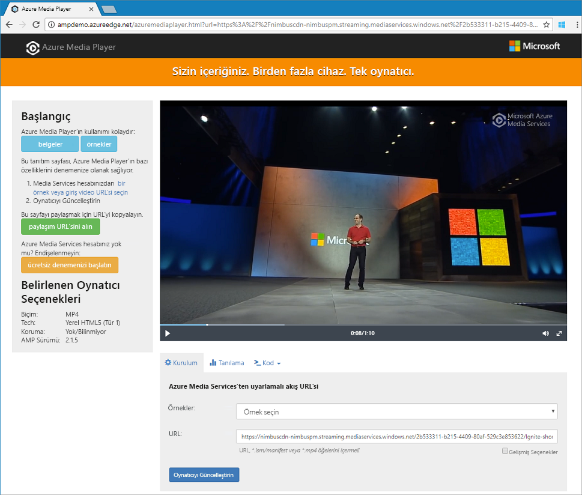

# <a name="tutorial-stream-video-files---cli"></a>Öğretici: Stream video dosyaları - CLI

Bu öğreticide, kolayca kodlayın ve bunların Azure Media Services ve Azure CLI kullanarak tarayıcılar ve cihazlar çeşitli videoların akışını gösterilmektedir. Azure Blob depolamadaki dosyaları, HTTPS veya SAS URL'lerini veya yolları kullanarak giriş içeriği belirtebilirsiniz.

Bu makalede örnek bir HTTPS URL'si aracılığıyla erişilebilir duruma içerik kodlar. Media Services v3 öbekli aktarım kodlamasını HTTPS URL'lerini şu anda desteklemiyor.

Bu öğreticinin sonunda bir video akışını yapmak mümkün olacaktır.  



[!INCLUDE [quickstarts-free-trial-note](../../../includes/quickstarts-free-trial-note.md)]

## <a name="create-a-media-services-account"></a>Media Services hesabı oluşturma

Şifrelemek, kodlamak, analiz, yönetebilir ve azure'da medya içeriği akışı önce bir Media Services hesabı oluşturmanız gerekir. Bu hesabın bir veya daha fazla depolama hesapları ile ilişkili olması gerekir.

Media Services hesabınızdan ve tüm ilişkili depolama hesapları aynı Azure aboneliğinde olması gerekir. Gecikme süresi ve veri kullanım maliyetleri sınırlamak için Media Services hesabıyla aynı yerde depolama hesaplarının kullanmanızı öneririz.

### <a name="create-a-resource-group"></a>Kaynak grubu oluşturun

```azurecli
az group create -n amsResourceGroup -l westus2
```

### <a name="create-an-azure-storage-account"></a>Azure Storage hesabı oluşturma

Bu örnekte, bir genel amaçlı v2 standart LRS hesabına oluştururuz.

Depolama hesapları ile denemek istiyorsanız, kullanın `--sku Standard_LRS`. Üretim için bir SKU seçilmesi sırasında kullanmayı `--sku Standard_RAGRS`, coğrafi çoğaltma için iş sürekliliği sağlar. Daha fazla bilgi için [depolama hesapları](https://docs.microsoft.com/cli/azure/storage/account?view=azure-cli-latest).
 
```azurecli
az storage account create -n amsstorageaccount --kind StorageV2 --sku Standard_LRS -l westus2 -g amsResourceGroup
```

### <a name="create-an-azure-media-services-account"></a>Azure Media Services hesabı oluşturma

```azurecli
az ams account create --n amsaccount -g amsResourceGroup --storage-account amsstorageaccount -l westus2
```

Şuna benzer bir yanıt olursunuz:

```
{
  "id": "/subscriptions/<id>/resourceGroups/amsResourceGroup/providers/Microsoft.Media/mediaservices/amsaccount",
  "location": "West US 2",
  "mediaServiceId": "8b569c2e-d648-4fcb-9035-c7fcc3aa7ddf",
  "name": "amsaccount",
  "resourceGroup": "amsResourceGroupTest",
  "storageAccounts": [
    {
      "id": "/subscriptions/<id>/resourceGroups/amsResourceGroup/providers/Microsoft.Storage/storageAccounts/amsstorageaccount",
      "resourceGroup": "amsResourceGroupTest",
      "type": "Primary"
    }
  ],
  "tags": null,
  "type": "Microsoft.Media/mediaservices"
}
```

## <a name="start-the-streaming-endpoint"></a>Akış uç noktasını başlatma

Aşağıdaki Azure CLI komutu varsayılan başlar **akış uç noktası**.

```azurecli
az ams streaming-endpoint start  -n default -a amsaccount -g amsResourceGroup
```

Şuna benzer bir yanıt olursunuz:

```
az ams streaming-endpoint start  -n default -a amsaccount -g amsResourceGroup
{
  "accessControl": null,
  "availabilitySetName": null,
  "cdnEnabled": true,
  "cdnProfile": "AzureMediaStreamingPlatformCdnProfile-StandardVerizon",
  "cdnProvider": "StandardVerizon",
  "created": "2019-02-06T21:58:03.604954+00:00",
  "crossSiteAccessPolicies": null,
  "customHostNames": [],
  "description": "",
  "freeTrialEndTime": "2019-02-21T22:05:31.277936+00:00",
  "hostName": "amsaccount-usw22.streaming.media.azure.net",
  "id": "/subscriptions/<id>/resourceGroups/amsResourceGroup/providers/Microsoft.Media/mediaservices/amsaccount/streamingendpoints/default",
  "lastModified": "2019-02-06T21:58:03.604954+00:00",
  "location": "West US 2",
  "maxCacheAge": null,
  "name": "default",
  "provisioningState": "Succeeded",
  "resourceGroup": "amsResourceGroup",
  "resourceState": "Running",
  "scaleUnits": 0,
  "tags": {},
  "type": "Microsoft.Media/mediaservices/streamingEndpoints"
}
```

Akış uç noktasını zaten çalışıyorsa, bu iletiyi alırsınız:

```
(InvalidOperation) The server cannot execute the operation in its current state.
```

## <a name="create-a-transform-for-adaptive-bitrate-encoding"></a>Uyarlamalı bit hızlı kodlama için dönüşüm oluşturma

Oluşturma bir **dönüştürme** kodlama veya videoları analiz için ortak görevler yapılandırmak için. Bu örnekte, Uyarlamalı bit hızlı kodlama yapın. Biz ardından, oluşturduğumuz Dönüştür altında bir iş gönderin. Media Services belirli bir video veya ses içerik girişi Dönüşüm Uygulama isteğini işidir.

```azurecli
az ams transform create --name testEncodingTransform --preset AdaptiveStreaming --description 'a simple Transform for Adaptive Bitrate Encoding' -g amsResourceGroup -a amsaccount
```

Şuna benzer bir yanıt olursunuz:

```
{
  "created": "2019-02-15T00:11:18.506019+00:00",
  "description": "a simple Transform for Adaptive Bitrate Encoding",
  "id": "/subscriptions/<id>/resourceGroups/amsResourceGroup/providers/Microsoft.Media/mediaservices/amsaccount/transforms/testEncodingTransform",
  "lastModified": "2019-02-15T00:11:18.506019+00:00",
  "name": "testEncodingTransform",
  "outputs": [
    {
      "onError": "StopProcessingJob",
      "preset": {
        "odatatype": "#Microsoft.Media.BuiltInStandardEncoderPreset",
        "presetName": "AdaptiveStreaming"
      },
      "relativePriority": "Normal"
    }
  ],
  "resourceGroup": "amsResourceGroup",
  "type": "Microsoft.Media/mediaservices/transforms"
}
```

## <a name="create-an-output-asset"></a>Çıktı varlığı oluşturma

Çıktı oluşturma **varlık** kodlama işinin çıktı olarak kullanmak için.

```azurecli
az ams asset create -n testOutputAssetName -a amsaccount -g amsResourceGroup
```

Şuna benzer bir yanıt olursunuz:

```
{
  "alternateId": null,
  "assetId": "96427438-bbce-4a74-ba91-e38179b72f36",
  "container": null,
  "created": "2019-02-14T23:58:19.127000+00:00",
  "description": null,
  "id": "/subscriptions/<id>/resourceGroups/amsResourceGroup/providers/Microsoft.Media/mediaservices/amsaccount/assets/testOutputAssetName",
  "lastModified": "2019-02-14T23:58:19.127000+00:00",
  "name": "testOutputAssetName",
  "resourceGroup": "amsResourceGroup",
  "storageAccountName": "amsstorageaccount",
  "storageEncryptionFormat": "None",
  "type": "Microsoft.Media/mediaservices/assets"
}
```

## <a name="start-a-job-by-using-https-input"></a>HTTPS giriş kullanarak iş Başlat

Videolarınızı işleyin işleri gönderdiğinizde, Media Services'ı giriş videosunun bulunacağı yeri bildirme gerekir. Bu örnekte gösterildiği gibi bir HTTPS URL'si iş girdisi belirtmek için bir seçenek olur.

Çalıştırdığınızda `az ams job start`, bir etiket işin çıktı olarak ayarlayın. Etiket sonra çıktı varlığına ne olduğunu belirlemek için de kullanabilirsiniz.

- Etiket için bir değer atadığınız verilirse '--çıktı-varlıklarına "assetname label =".
- Etiket için bir değer atamayın verilirse '--çıktı-varlıklarına "assetname =".

  Eklediğimiz, "=" için fark `output-assets`.

```azurecli
az ams job start --name testJob001 --transform-name testEncodingTransform --base-uri 'https://nimbuscdn-nimbuspm.streaming.mediaservices.windows.net/2b533311-b215-4409-80af-529c3e853622/' --files 'Ignite-short.mp4' --output-assets testOutputAssetName= -a amsaccount -g amsResourceGroup 
```

Şuna benzer bir yanıt olursunuz:

```
{
  "correlationData": {},
  "created": "2019-02-15T05:08:26.266104+00:00",
  "description": null,
  "id": "/subscriptions/<id>/resourceGroups/amsResourceGroup/providers/Microsoft.Media/mediaservices/amsaccount/transforms/testEncodingTransform/jobs/testJob001",
  "input": {
    "baseUri": "https://nimbuscdn-nimbuspm.streaming.mediaservices.windows.net/2b533311-b215-4409-80af-529c3e853622/",
    "files": [
      "Ignite-short.mp4"
    ],
    "label": null,
    "odatatype": "#Microsoft.Media.JobInputHttp"
  },
  "lastModified": "2019-02-15T05:08:26.266104+00:00",
  "name": "testJob001",
  "outputs": [
    {
      "assetName": "testOutputAssetName",
      "error": null,
      "label": "",
      "odatatype": "#Microsoft.Media.JobOutputAsset",
      "progress": 0,
      "state": "Queued"
    }
  ],
  "priority": "Normal",
  "resourceGroup": "amsResourceGroup",
  "state": "Queued",
  "type": "Microsoft.Media/mediaservices/transforms/jobs"
}
```

### <a name="check-status"></a>Durumu kontrol etme

Beş dakika içinde işinin durumunu denetleyin. Bu "tamamlanması." Henüz tamamlanmadı, birkaç dakika içinde yeniden kontrol edin. Tamamlandığında, sonraki adıma gidin ve oluşturma bir **akış Bulucu**.

```azurecli
az ams job show -a amsaccount -g amsResourceGroup -t testEncodingTransform -n testJob001
```

## <a name="create-a-streaming-locator-and-get-a-path"></a>Akış Bulucusu oluşturmak ve bir yolunu alma

Kodlama tamamlandıktan sonra sonraki adım video çıktı varlığı kullanılabilir kayıttan yürütme için istemcilere olmasını sağlamaktır. Bunu yapmak için önce bir akış Bulucu oluşturun. Ardından, istemcilerin kullandığı URL'leri akış oluşturun.

### <a name="create-a-streaming-locator"></a>Akış bulucusu oluşturma

```azurecli
az ams streaming-locator create -n testStreamingLocator --asset-name testOutputAssetName --streaming-policy-name Predefined_ClearStreamingOnly  -g amsResourceGroup -a amsaccount 
```

Şuna benzer bir yanıt olursunuz:

```
{
  "alternativeMediaId": null,
  "assetName": "output-3b6d7b1dffe9419fa104b952f7f6ab76",
  "contentKeys": [],
  "created": "2019-02-15T04:35:46.270750+00:00",
  "defaultContentKeyPolicyName": null,
  "endTime": "9999-12-31T23:59:59.999999+00:00",
  "id": "/subscriptions/<id>/resourceGroups/amsResourceGroup/providers/Microsoft.Media/mediaservices/amsaccount/streamingLocators/testStreamingLocator",
  "name": "testStreamingLocator",
  "resourceGroup": "amsResourceGroup",
  "startTime": null,
  "streamingLocatorId": "e01b2be1-5ea4-42ca-ae5d-7fe704a5962f",
  "streamingPolicyName": "Predefined_ClearStreamingOnly",
  "type": "Microsoft.Media/mediaservices/streamingLocators"
}
```

### <a name="get-streaming-locator-paths"></a>Akış Bulucusu yolları

```azurecli
az ams streaming-locator get-paths -a amsaccount -g amsResourceGroup -n testStreamingLocator
```

Şuna benzer bir yanıt olursunuz:

```
{
  "downloadPaths": [],
  "streamingPaths": [
    {
      "encryptionScheme": "NoEncryption",
      "paths": [
        "/e01b2be1-5ea4-42ca-ae5d-7fe704a5962f/ignite.ism/manifest(format=m3u8-aapl)"
      ],
      "streamingProtocol": "Hls"
    },
    {
      "encryptionScheme": "NoEncryption",
      "paths": [
        "/e01b2be1-5ea4-42ca-ae5d-7fe704a5962f/ignite.ism/manifest(format=mpd-time-csf)"
      ],
      "streamingProtocol": "Dash"
    },
    {
      "encryptionScheme": "NoEncryption",
      "paths": [
        "/e01b2be1-5ea4-42ca-ae5d-7fe704a5962f/ignite.ism/manifest"
      ],
      "streamingProtocol": "SmoothStreaming"
    }
  ]
}
```

HTTP canlı akış (HLS) yoluna kopyalayın. Bu durumda sahip `/e01b2be1-5ea4-42ca-ae5d-7fe704a5962f/ignite.ism/manifest(format=m3u8-aapl)`.

## <a name="build-the-url"></a>URL oluştur 

### <a name="get-the-streaming-endpoint-host-name"></a>Akış uç noktası ana bilgisayar adını alma

```azurecli
az ams streaming-endpoint list -a amsaccount -g amsResourceGroup -n default
```
Kopyalama `hostName` değeri. Bu durumda sahip `amsaccount-usw22.streaming.media.azure.net`.

### <a name="assemble-the-url"></a>URL bir araya getirin

"https:// " + &lt;hostName value&gt; + &lt;Hls path value&gt;

Bir örneği aşağıda verilmiştir:

`https://amsaccount-usw22.streaming.media.azure.net/7f19e783-927b-4e0a-a1c0-8a140c49856c/ignite.ism/manifest(format=m3u8-aapl)`

## <a name="test-playback-by-using-azure-media-player"></a>Azure Media Player'ı kullanarak, testi kayıttan yürütme

> [!NOTE]
> Oyuncu bir HTTPS site üzerinde barındırılıyorsa, URL "https" ile başlatmak emin olun.

1. Bir web tarayıcısı açın ve gidin [ https://aka.ms/azuremediaplayer/ ](https://aka.ms/azuremediaplayer/).
2. İçinde **URL** kutusunda, önceki bölümde oluşturulan URL'yi yapıştırın. HLS, Dash veya kesintisiz biçiminde URL'yi yapıştırabilirsiniz. Azure Media Player, Cihazınızda kayıttan yürütme için uygun bir Akış Protokolü otomatik olarak kullanır.
3. Seçin **Player güncelleştirme**.

>[!NOTE]
>Azure Media Player, test için kullanılabilir, ancak üretim ortamında kullanılmamalıdır.

## <a name="clean-up-resources"></a>Kaynakları temizleme

Artık herhangi bir kaynağa medya Hizmetleri ve Bu öğreticide, oluşturulan depolama hesapları dahil olmak üzere, kaynak grubundaki ihtiyacınız varsa, kaynak grubunu silin.

Bu CLI komutunu çalıştırın:

```azurecli
az group delete --name amsResourceGroup
```

## <a name="next-steps"></a>Sonraki adımlar

[Media Services'e genel bakış](media-services-overview.md)

