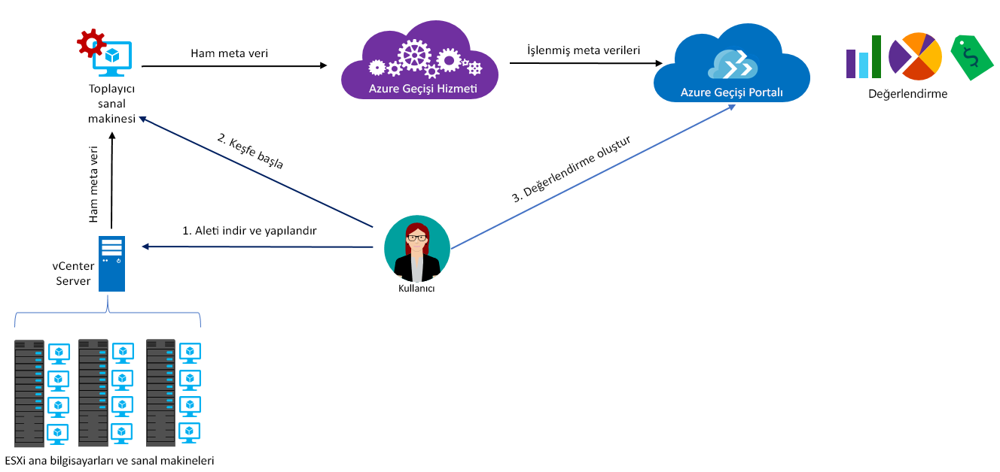

# Azure Geçişi Hakkında

Azure Geçişi hizmeti, Azure’a geçiş için şirket içi iş yüklerini değerlendirir. Hizmet, şirket içi makinelerin Azure’a geçiş uygunluğunu değerlendirir, performans tabanlı boyutlandırma gerçekleştirir ve şirket içi makineleri Azure’da çalıştırmaya yönelik maliyet tahminleri sağlar. Lift-and-shift ile taşımayı düşünüyorsanız veya geçişin ilk değerlendirme aşamalarındaysanız bu hizmet size uygundur. Değerlendirme sonrasında, makineleri Azure’a geçirmek için [Azure Site Recovery](https://docs.microsoft.com/azure/site-recovery/site-recovery-overview) ve [Azure Veritabanı Geçiş Hizmeti](https://docs.microsoft.com/azure/dms/dms-overview) gibi hizmetleri kullanabilirsiniz.

## Azure Geçişi hizmetini neden kullanmalısınız?

Azure Geçişi şunları yapmanıza yardımcı olur:

- **Azure için hazır olma değerlendirmek**: Şirket içi makinelerinizin Azure'da çalıştırılmaya uygun olup olmadığını değerlendirin.
- **Boyut önerileri alma**: Şirket içi sanal makinelerin performans geçmişi temel alarak Azure Vm'leri için boyut önerileri alın.
- **Aylık maliyetleri tahmin etme**: Şirket içi makineleri Azure'da çalıştırmanın tahmini maliyetleri alın.  
- **Yüksek güvenle geçiş**: Değerlendirmek ve birlikte geçirmek makine grupları oluşturmak için şirket içi makinelerin bağımlılıklarını görselleştirin.

## Geçerli sınırlamalar

- Azure sanal makinelerine geçiş için yalnızca şirket içi VMware sanal makinelerini (VM) değerlendirebilirsiniz. VMware sanal makineleri, vCenter Server (sürüm 5.5, 6.0, 6.5 veya 6.7) tarafından yönetilmelidir.
- Destek sunuluyor çalışırken ilgileniyorsanız Hyper-V şu anda önizlemede üretim desteği için lütfen kaydolun [burada.](https://aka.ms/migratefuture)
- Fiziksel sunucuları değerlendirme için yararlanabileceğiniz bizim [iş ortağı Araçları](https://azure.microsoft.com/migration/partners/).
- Tek keşifte en fazla 1500 sanal makine ve tek projede en fazla 1500 sanal makine bulabilirsiniz. Ayrıca tek değerlendirmede en fazla 1500 sanal makineyi değerlendirebilirsiniz.
- Daha büyük bir ortam keşfetmek istiyorsanız keşfi bölüp birden fazla proje oluşturabilirsiniz. [Daha fazla bilgi edinin](how-to-scale-assessment.md). Azure Geçişi, abonelik başına 20’ye kadar projeyi destekler.
- Azure Geçişi yalnızca yönetilen disklerin geçiş değerlendirmesini destekler.
-  Bu gibi durumlarda, Azure geçişi projesini yalnızca aşağıdaki coğrafyalardaki oluşturabilirsiniz. Bu ancak diğer değerlendirmeler oluşturup oluşturamayacağınız kısıtlamaz Azure konumları hedefleyin.

    **Coğrafya** | **Depolama konumu**
    --- | ---
    Azure Kamu | ABD Devleti Virginia
    Asya | Güneydoğu Asya veya Doğu Asya
    Avrupa | Kuzey Avrupa veya Batı Avrupa
    Amerika Birleşik Devletleri | Doğu ABD ve Batı Orta ABD

    Geçiş proje ile ilişkili Coğrafya, şirket içi ortamda bulunan meta verileri depolamak için kullanılır. Meta veri geçiş projesi için belirtilen coğrafyaya göre bölgelerden birine depolanır. Yeni bir Log Analytics çalışma alanı oluşturarak bağımlılık görselleştirmesi kullanırsanız, çalışma alanını proje ile aynı bölgede oluşturulur.
- Bağımlılık görselleştirme işlevini Azure Kamu'da kullanılabilir değil.

## Ne için ödeme yapmam gerekiyor?

Azure Geçişi fiyatlandırması hakkında [daha fazla bilgi edinin](https://azure.microsoft.com/pricing/details/azure-migrate/).

## Bir değerlendirme neleri içerir?

Değerlendirme ayarları ihtiyaçlarınıza göre özelleştirilebilir. Değerlendirme özellikleri aşağıdaki tabloda özetlenmiştir.

**Özellik** | **Ayrıntılar**
--- | ---
**Hedef konum** | Geçişi yapmak istediğiniz Azure konumu.  Azure geçişi, geçiş hedef konumları olarak 33 bölge şu anda destekler. [Hangi bölgeler olduğuna bakın](https://azure.microsoft.com/global-infrastructure/services/). Varsayılan olarak, hedef bölge Doğu ABD olarak ayarlanır.
**Depolama türü** | Yönetilen diskler değerlendirmesinin bir parçası olan tüm VM'ler için ayırmak istediğiniz türü. Boyutlandırma ölçütü ise *şirket içi olarak boyutlandırma* hedef disk türü olarak premium diskler (varsayılan), standart SSD disk veya standart HDD diskler belirtebilirsiniz. İçin *performansa dayalı boyutlandırma*, yukarıdaki seçeneklerin yanı sıra, disk boyutlandırma önerisi otomatik olarak sanal makinelerin performans verilerini göre yapıldığını sağlayacak otomatik seçilecek seçeneğiniz de vardır. Örneğin, elde etmek istiyorsanız bir [Tek Örnekli sanal makine SLA'sı % 99,9 düzeyinde](https://azure.microsoft.com/support/legal/sla/virtual-machines/v1_8/), tüm değerlendirmesi diskleri Premium yönetilen diskler olarak önerilen sağlayacak Premium yönetilen diskler olarak depolama türünü belirtmek isteyebilirsiniz. Azure Geçişi’nin yönetilen diskleri yalnızca geçiş değerlendirmesi için desteklediğini unutmayın.
**Ayrılmış Örnekler** |  Azure'da [ayrılmış örneklere](https://azure.microsoft.com/pricing/reserved-vm-instances/) sahip olup olmama durumunuz. Azure Geçişi, buna göre bir maliyet tahmini oluşturur.
**Boyutlandırma ölçütü** | Boyutlandırma temel **performans geçmişi** şirket içi sanal makinelerin (varsayılan) veya **şirket içi olarak**, performans geçmişini dikkate almadan.
**Performans geçmişi** | Varsayılan olarak Azure Geçişi, %95 yüzdebirlik değer ile son günün performans geçmişini kullanarak şirket içi makinelerin performansını değerlendirir.
**Konfor katsayısı** | Azure Geçişi, değerlendirme sırasında bir tamponu (konfor katsayısı) göz önünde bulundurur. Bu tampon, VM’lerin makine kullanım verilerinin (CPU, bellek, disk ve ağ) üzerine uygulanır. Konfor katsayısı; sezona özgü kullanım, kısa performans geçmişi ve gelecek kullanımlarda oluşabilecek artışlar gibi konuları hesaba katar.   Örneğin, %20 kullanıma sahip 10 çekirdekli bir VM normalde 2 çekirdekli VM ile sonuçlanır. Ancak, 2.0x konfor katsayısı ile sonuç 4 çekirdekli VM olur. Varsayılan konfor ayarı 1,3x’tir.
**VM serisi** | VM serisi, boyut tahmini için kullanılır. Örneğin, Azure’da A serisi VM’lere geçirmeyi planlamadığınız bir üretim ortamınız varsa, A serisini liste veya serilerin dışında bırakabilirsiniz. Boyutlandırma yalnızca seçili serilerde yapılır.   
**Para birimi** | Fatura para birimi. Varsayılan, ABD Doları’dır.
**İndirim (%)** | Azure teklifinin yanı sıra aldığınız, aboneliğe özgü indirim. Varsayılan ayar, %0’dır.
**VM'nin çalışır durumda kalma süresi** | Sanal makinelerinizi Azure'da 7/24 çalıştırılması kullanmayacaksanız, bunlar çalıştırıyordur için süresi (gün / ay sayısı) ve her gün saat sayısı belirtebilirsiniz ve maliyet tahminleri uygun şekilde gerçekleştirilir. 31 gün / ay ve günde 24 saat varsayılan değerdir.
**Azure teklifi** | Kaydolduğunuz [Azure teklifi](https://azure.microsoft.com/support/legal/offer-details/). Azure Geçişi, buna göre bir maliyet tahmini oluşturur.
**Azure Hibrit Avantajı** | İndirimli fiyatlardan yararlanmak için yazılım güvencesine sahip olup olmadığınız ve [Azure Hibrit Avantajı](https://azure.microsoft.com/pricing/hybrid-use-benefit/) için uygun olup olmadığınız bilgisi.

## Azure Geçişi nasıl çalışır?

1. Bir Azure Geçişi projesi oluşturursunuz.
2. Azure Geçişi, toplayıcı aleti adı verilen bir şirket içi VM kullanarak şirket içi makinelerinize ilişkin bilgileri bulur. Aleti oluşturmak için Open Virtualization Appliance (.ova) biçimindeki kurulum dosyasını indirirsiniz ve şirket içi vCenter Server’ınıza VM olarak aktarırsınız.
3. VM'ye vCenter Server'dan bağlanır ve bağlantı sırasında yeni bir parola belirtirsiniz.
4. Bulmayı başlatmak için VM'de toplayıcıyı çalıştırırsınız.
5. Toplayıcı, VMware PowerCLI cmdlet’lerini kullanarak VM meta verilerini toplar. Bulma işlemi aracısızdır ve VMware konaklarına ya da VM’lere herhangi bir yükleme yapmaz. Toplanan meta veriler VM bilgilerini (çekirdekler, bellek, diskler, disk boyutları ve ağ bağdaştırıcıları) içerir. Ayrıca, CPU ve bellek kullanımı, disk IOPS, disk aktarım hızı (MB/sn) ve ağ çıktısı (MB/sn) gibi VM’lere ait performans verilerini toplar.
5. Meta veriler Azure Geçişi projesine gönderilir. Verileri Azure portalında görüntüleyebilirsiniz.
6. Değerlendirme amacıyla keşfedilen VM’leri gruplar halinde toplayın. Örneğin, aynı uygulamayı çalıştıran VM’leri gruplandırabilirsiniz. Daha kesin gruplandırma için, bir gruptaki belirli bir makine ya da tüm makinelerin bağımlılıklarını görüntülemek ve grubu geliştirmek için bağımlılık görselleştirmeyi kullanabilirsiniz.
7. Grup tanımlandıktan sonra bir değerlendirme oluşturursunuz.
8. Değerlendirme tamamlandıktan sonra portalda görüntüleyebilir veya Excel biçiminde indirebilirsiniz.

   

## Bağlantı noktası gereksinimleri nelerdir?

Tabloda Azure Geçişi iletişimleri için gereken bağlantı noktaları özetlenmektedir.

| Bileşen | İletişim kurar |  Ayrıntılar |
| --- | --- |--- |
|Toplayıcı  | Azure Geçişi hizmeti | Toplayıcı SSL bağlantı noktası 443 üzerinden hizmete bağlanır.|
|Toplayıcı | vCenter Server | Varsayılan olarak toplayıcı, 443 numaralı bağlantı noktası üzerinden vCenter Server’a bağlanır. Sunucu farklı bir bağlantı noktasında dinliyorsa, VM üzerinde giden bağlantı noktası olarak yapılandırın.|
|Şirket içi VM | Log Analytics Çalışma Alanı | [Microsoft Monitoring Agent (MMA)](../log-analytics/log-analytics-windows-agent.md) Azure İzleyici günlüklerine bağlanmak için 443 numaralı TCP bağlantı noktasını kullanır. Bu bağlantı noktası yalnızca MMA aracısına ihtiyaç duyan bağımlılık görselleştirmesi özelliğini kullanıyorsanız gereklidir.|

## Değerlendirmeden sonra ne olur?

Şirket içi makineleri değerlendirdikten sonra, geçiş işlemini gerçekleştirmek üzere birkaç araç kullanabilirsiniz:

- **Azure Site Recovery**: Azure Site Recovery, Azure'a geçirmek için kullanabilirsiniz. Bunu yapmak için depolama hesabı ve sanal ağ olmak üzere ihtiyacınız olan [Azure bileşenlerini hazırlarsınız](../site-recovery/tutorial-prepare-azure.md). Şirket içinde [VMware ortamınızı hazırlarsınız](../site-recovery/vmware-azure-tutorial-prepare-on-premises.md). Her şey hazır olduğunda Azure'a çoğaltmayı kurup etkinleştirir ve VM'leri geçirirsiniz. [Daha fazla bilgi edinin](../site-recovery/vmware-azure-tutorial.md).
- **Azure veritabanı geçiş**: Bir veritabanını SQL Server, MySQL veya Oracle gibi şirket içi makineleri çalıştırıyorsanız, kullanabileceğiniz [Azure veritabanı geçiş hizmeti](../dms/dms-overview.md) bunları Azure'a geçirmek için.

## Topluluk uzmanlarından daha fazla öğrenmek ister misiniz?
Ziyaret [geçirme Azure MSDN Forumu](https://social.msdn.microsoft.com/Forums/home?forum=AzureMigrate&filter=alltypes&sort=lastpostdesc) veya [Stack Overflow](https://stackoverflow.com/search?q=azure+migrate)

## Yardıma mı ihtiyacınız var? Bizimle iletişim kurun.  
Sorularınız varsa veya yardıma ihtiyacınız varsa, oluşturun bir [destek isteği](https://ms.portal.azure.com/#blade/Microsoft_Azure_Support/HelpAndSupportBlade/newsupportrequest). Destek talebinizi ayrıntılı teknik rehberlik gerekiyorsa, lütfen [Azure destek planı](https://azure.microsoft.com/support/plans/)     

## Sonraki adımlar

- Şirket içi VMware VM değerlendirmesi oluşturmak için [öğreticiyi izleyin](tutorial-assessment-vmware.md).
- Azure Geçişi hakkında [sık sorulan soruları gözden geçirin](resources-faq.md).
