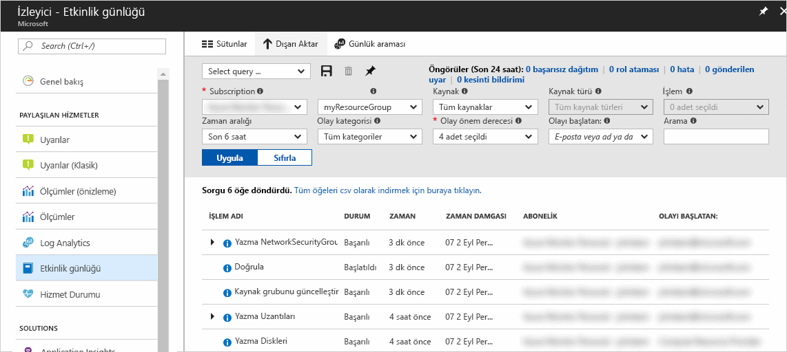
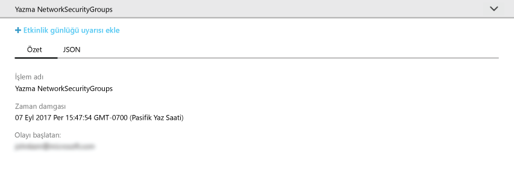
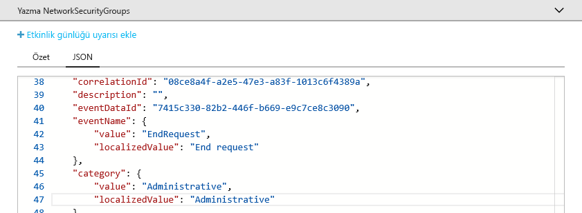
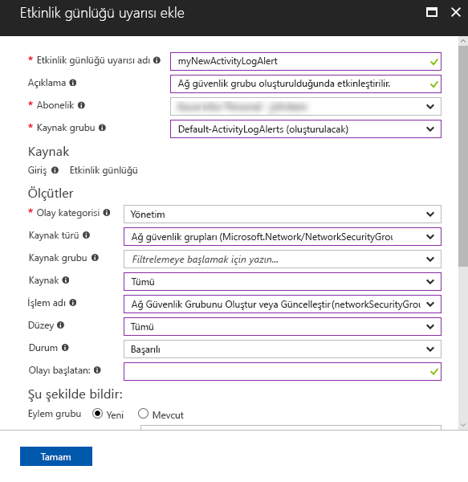

# Denetim ve Azure aboneliğinizde bildirimlerin önemli eylemler hakkında

**Azure etkinlik günlüğü** Azure abonelik düzeyinde olayları geçmişini sağlar. Hakkında bilgiler sunar *kimin* oluşturulan, güncellenen veya silinen *ne* kaynakları ve *zaman* yaptıkları işlemin. Oluşturabileceğiniz bir **etkinlik günlüğü uyarı** bir etkinlik oluştuğunda e-posta, SMS ya da Web kancası bildirimleri almak için uyarı koşullara uyan. Bir basit ağ güvenlik grubu oluşturma, oluştu olay anlamak için etkinlik günlüğü gözatma ve etkinlik günlüğü uyarısı giderek ileten bir ağ güvenlik grubu oluşturulduğunda bildirim hale yazma ile bu hızlı başlangıç adımları.

Azure aboneliğiniz yoksa başlamadan önce [ücretsiz](https://azure.microsoft.com/free/) bir hesap oluşturun.

## Azure portalında oturum açma

[Azure Portal](https://portal.azure.com/)’da oturum açın.

## Bir ağ güvenlik grubu oluşturun

1. Azure portalının sol üst köşesinde bulunan **Yeni** düğmesine tıklayın.

2. Seçin **ağ**seçin **ağ güvenlik grubu**.

3. "MyNetworkSG" olarak girin **adı** ve adlı yeni bir kaynak grubu oluştur **myResourceGroup**. **Oluştur** düğmesine tıklayın.

    

## Etkinlik günlüğü portalında Gözat

Bir olay, ağ güvenlik grubu oluşturulmasını açıklar etkinlik günlüğü şimdi eklendi. Bu olayı belirlemek için aşağıdaki yönergeleri kullanın.

1. Tıklatın **İzleyici** düğmesi sol taraftaki gezinti listesinde bulunamadı. Etkinlik günlüğü bölümüne açar. Bu bölümde bir geçmişini kullanıcıların aboneliğinizde, birkaç özelliklerine göre filtrelenebilir kaynaklardaki gibi gerçekleştirmiş tüm eylemleri içeren **kaynak grubu**, **Timespan**, ve  **Kategori**.

2. İçinde **etkinlik günlüğü** 'yi tıklatın **kaynak grubu** açılır ve seçin **myResourceGroup**. Değişiklik **Timespan** açılır **son 1 saat**. **Uygula**'ya tıklayın.

    

3. Tıklayın **yazma NetworkSecurityGroups** tabloda gösterilen olayların olay.

## Etkinlik günlüğünde olay Gözat

Görüntülenen bölüme, ad, zaman damgası ve kullanıcı ya da gerçekleştirilen uygulama da dahil olmak üzere gerçekleştirildi işlemi temel ayrıntılarını içerir.

Tıklayın **JSON** tam olay ayrıntılarını görüntülemek için. Bu, kullanıcı veya uygulama işlemi, olay kategorisi ve düzeyi ve işlemin durumunu gerçekleştirmek için nasıl yetkilendirildi ayrıntılarını içerir.

## Bir etkinlik günlüğü uyarı oluşturabilir.

1. Tıklayın **Özet** olay özeti döndürülecek sekmesi.

2. Görüntülenen Özet bölümünde tıklayın **etkinlik günlüğü uyarı Ekle**.

    

3. Görüntülenen bölümünde etkinlik günlüğü uyarı bir ad ve açıklama verin.

4. Altında **ölçütleri** emin **olay kategorisi** ayarlanır **Yönetim**, **kaynak türü** ayarlanır **ağ güvenlik grupları**, **işlem adı** ayarlanır **oluşturma veya güncelleştirme ağ güvenlik grubu**, **durum** ayarlanır  **Başarılı** ve diğer tüm ölçütü alanları boş veya ayarlı için **tüm**. Yeni bir olay etkinlik günlüğünde göründüğünde, uyarının etkin olup olmadığını belirlemek için kullanılan kuralları ölçütleri tanımlayın.

    

5. Altında **aracılığıyla uyarı** seçin **yeni** eylem grup ve sağlayan bir **adı** ve **kısa ad** eylem grubu için. Eylem grubu (yeni bir olay ölçütle eşleşen olduğunda) uyarı etkinleştirildiğinde gerçekleştirilen eylemlerin kümesini tanımlar.

6. Altında **Eylemler** sağlayarak 1 veya daha fazla eylem Ekle bir **adı** eylemi için **eylem türü** (örneğin, e-posta veya SMS) ve **ayrıntıları**bu özel eylem türü (Web kancası URL'si, e-posta adresi veya SMS numarası gibi).

    

7. Tıklatın **Tamam** etkinlik günlüğü uyarı kaydetmek için.

## Etkinlik günlüğü uyarı test

> [!NOTE]
> Bir etkinlik günlüğü uyarı tamamen etkin hale için yaklaşık 10 dakika sürer. Etkinlik günlüğü uyarı tam olarak etkinleştirilmedi önce oluşan yeni olayları bildirimleri oluşturmaz.
>
>

Uyarı sınamak için önceki bölümde yineleyin **bir ağ güvenlik grubu oluşturun**, ancak bu ağ güvenlik grubu farklı bir ad verin ve mevcut kaynak grubunu yeniden kullanabilirsiniz. Birkaç dakika içinde ağ güvenlik grubu oluşturulmuş bir bildirim alırsınız.

## Kaynakları temizleme

Artık gerekli olduğunda, kaynak grubu ve ağ güvenlik grubu silin. Bunu yapmak için portal üstündeki arama kutusuna oluşturduğunuz kaynak grubunun adını yazın ve kaynak grubu adına tıklayın. Görüntülenen bölümünde tıklayın **kaynak grubu Sil** düğmesi, kaynak grubunun adını yazın ve'ı tıklatın **silmek**.

## Sonraki adımlar

Bu Hızlı Başlangıç, bir etkinlik günlüğü olay oluşturmak için bir işlem ve bu işlem yeniden gelecekte meydana geldiğinde bildirim hale için bir etkinlik günlüğü uyarı oluşturuldu. Ardından, işlemi yeniden gerçekleştirerek uyarı test. Azure Son 90 gündeki kullanılabilir etkinlik günlüğü olaylarını yapar. Olayları 90 günden daha uzun korumak gerekiyorsa, diğer izleme verilerinizin yanında, etkinlik günlüğü verilerinizi arşivleme deneyin.

> [!div class="nextstepaction"]
> [İzleme verilerini arşivleme](./monitor-tutorial-archive-monitoring-data.md)
