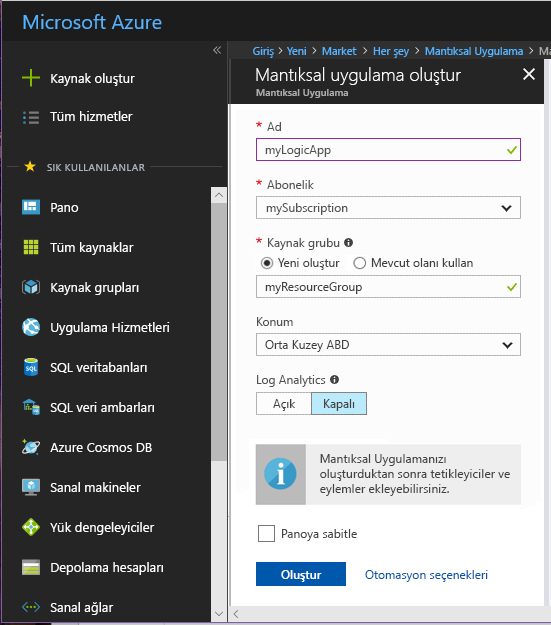
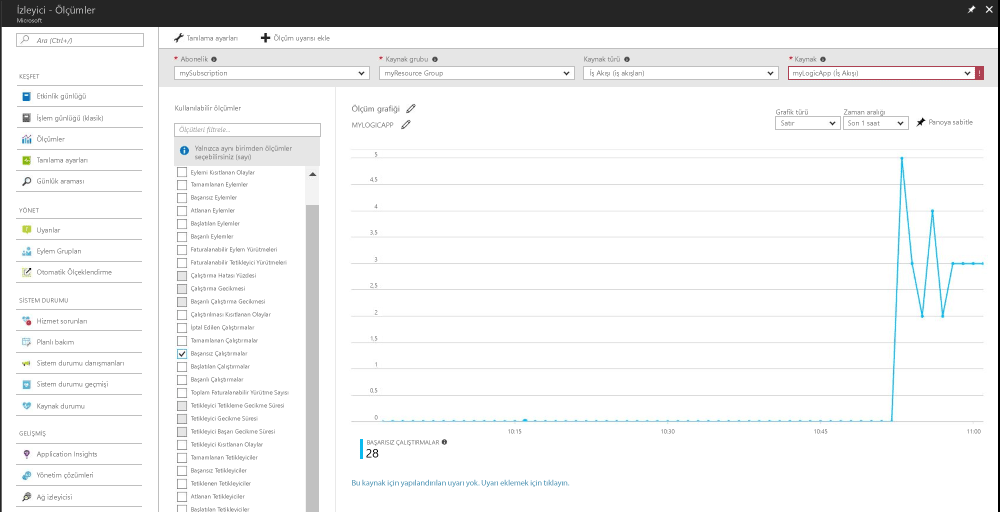
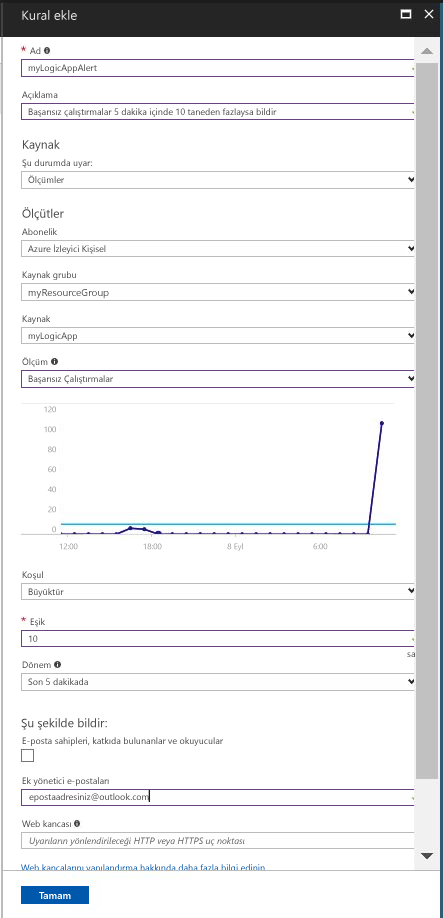

# Bir ölçü değeri bir koşulu karşılıyorsa bir bildirim alın

Azure İzleyici ölçümleri birçok Azure kaynakları için kullanılabilir hale getirir. Bu ölçümleri performans ve sistem durumu ile bu kaynakları taşır. Birçok durumda ölçümünde bir değere sahip bir kaynak yanlış olan değerleri işaret edebilir. İçin anormal davranışları izlemek ve bu durum oluşursa bildirilmesi için ölçüm uyarılar oluşturabilirsiniz. Bir mantıksal uygulama oluşturma, iş oluşturma ve mantıksal uygulama için ölçümler görselleştirme ile bu hızlı başlangıç adımları. Ardından, bir uyarı oluşturmak ve mantıksal uygulama kaynağı için bir ölçüm için bir bildirim alma üzerinden gider.

Ölçümleri ve ölçüm Uyarıları hakkında daha fazla bilgi için bkz: [Azure İzleyici ölçümleri genel bakış](./monitoring-overview-metrics.md) ve [Azure İzleyici uyarılar genel bakış](./monitoring-overview-alerts.md). 

Azure aboneliğiniz yoksa başlamadan önce [ücretsiz](https://azure.microsoft.com/free/) bir hesap oluşturun.

## Azure portalında oturum açın

[Azure Portal](https://portal.azure.com/) oturum açın.

## Mantıksal Uygulama oluşturun

1. Azure portalının sol üst köşesinde bulunan **Yeni** düğmesine tıklayın.

2. Aramak ve seçmek **mantıksal uygulama**. Adlı yeni bir kaynak grubu oluştur **myResourceGroup** varsayılan konumu kullanın. **Oluştur** düğmesine tıklayın.

3. Mantıksal uygulama bilgilerini girin ve denetleyin **panoya Sabitle** seçeneği. Tamamlandığında **Oluştur**’a tıklayın.

      

4. Mantıksal uygulama panonuza sabitlenir. Tıklayarak mantıksal uygulama gidin.

5. Mantıksal uygulama panelinde seçin **mantığı Uygulama Tasarımcısı**

       

6. Aşağıdaki diyagramda görüldüğü gibi değerleri ayarlayın.

    . 

7. Tasarımcıda seçin **yineleme** tetikleyici.

8. 20 aralığını ve mantıksal uygulamanızı 20 dakikada tetiklenir emin olmak için ikinci sıklığını ayarlayın.

9. Tıklatın **yeni adım** düğmesine tıklayın ve ardından **Eylem Ekle**.

10. Seçin **HTTP** seçeneğini ve **HTTP HTTP**.

11. Ayarlama **yöntemi** POST olarak ve **URI** tercih ettiğiniz bir web adresine.

12. **Kaydet** düğmesine tıklayın.

## Mantıksal uygulamanız için metrikleri görüntüleyin

1. Tıklatın **İzleyici** sol gezinti bölmesinde seçeneği.

2. Seçin **ölçümleri** sekmesinde, doldurmak **abonelik**, **kaynak grubu**, **kaynak türü** ve **kaynak** mantıksal uygulamanızı çalıştırın.

3. Ölçüler listesinden seçim **çalıştırır başlatılan**.

4. Değiştirme **zaman aralığı** son bir saat verileri görüntülemek için grafiğin.

5. Mantıksal uygulamanızı son bir saat içinde başlatıldı çalıştığı toplam sayısı Çizdirmek grafik görmelisiniz.

    

## Mantıksal uygulamanız için bir ölçüm uyarısı oluştur

1.  Ölçümleri bölmenin sağ üst kısmını tıklatın **ölçüm uyarı Ekle** düğmesi.

2. Ölçüm Uyarınız 'myLogicAppAlert' adlandırın ve uyarı için kısa bir açıklama sağlayın.

3. Ayarlama **koşulu** 'Değerinden', ayarlanmış olarak ölçüm uyarı **eşik** '10' ve kümesi olarak **süresi** olarak 'üzerinde son 5 dakika'.

4. Son olarak, altında **ek yönetici email(s)** e-posta adresinizi girin. Bu uyarı, olay mantıksal uygulamanızı 10'dan fazla başarısız çalıştırır 5 dakikalık bir süre içinde olan bir e-posta almanızı sağlar.

    

## Mantıksal uygulamanız için ölçüm uyarı bildirimleri alma
1. Birkaç dakika içinde 'Uyarıları uyarı 'etkinleştirildi' bildirmek için Microsoft Azure' den bir e-posta alacaksınız.

2. Mantıksal uygulamanızı geri gidin ve yinelenme tetikleyici 1 aralığı ve saat sıklığını değiştirin.

3. Birkaç dakika içinde 'Microsoft Azure uyarı 'Çözümlendi' bildiren uyarıları' ndan bir e-posta alacaksınız.

## Kaynakları temizleme

Bu koleksiyondaki diğer hızlı başlangıçlar Bu hızlı başlangıç oluşturun. Öğreticiler veya sonraki hızlı başlangıçlar ile çalışmaya devam etmek planlıyorsanız, temiz bu quickstart oluşturulan kaynakları yukarı değil. Devam etmeyi planlamıyorsanız Azure portalında bu hızlı başlangıç ile oluşturulan tüm kaynakları silmek için aşağıdaki adımları kullanın.

1. Azure portalında sol taraftaki menüden tıklayın **İzleyici**.

2. Seçin **uyarıları** sekmesinde, bu Hızlı Başlangıç Kılavuzu'nda oluşturulan uyarı bulun ve tıklayın.

3. Ölçüm uyarı panelinde tıklatın **silmek**.

4. Azure portalında sol taraftaki menüden arama **mantıksal uygulama** ve ardından **Logic apps**.

5. Panosunda, metin kutusuna bu hızlı başlangıç içinde oluşturduğunuz mantıksal uygulama'ı tıklatın ve ardından **silmek**.

## Sonraki adımlar

Bu hızlı başlangıç kaynaklarınız için ölçüm bir uyarı oluşturmak nasıl öğrendiniz. Uyarılar hakkında bizim genel bakış için aracılığıyla ölçüm uyarılar hakkında daha fazla bilgi için tıklatın.

> [!div class="nextstepaction"]
> [Azure aboneliği eylem uyarıları izleme](./monitor-quick-audit-notify-action-in-subscription.md )
