# Azure İzleyici’yi kullanmaya başlama
Azure İzleyici, Azure kaynaklarını izlemeye yönelik tek bir kaynak sağlayan platform hizmetidir. Azure izleme ile görselleştirme, sorgulama yapabilir, yol, arşiv ve aksi halde ölçümleri ve Azure kaynaklarında'ten gelen günlükleri eylemi gerçekleştirin. Bu verileri Azure portal kullanarak ile çalışabilirsiniz [İzleyici PowerShell cmdlet'leri](insights-powershell-samples.md), [platformlar arası CLI](insights-cli-samples.md), veya [Azure İzleyici REST API'lerini](https://msdn.microsoft.com/library/dn931943.aspx). Bu makalede portal gösterim amacıyla kullanılarak Azure İzleyici’nin temel bileşenlerinden birkaç tanesi gösterilecektir.

## Kılavuz
1. Portalı'nda gidin **tüm hizmetleri** ve Bul **İzleyici** seçeneği. Bu seçeneği sol gezinti çubuğundan kolayca erişilebilmesi için sık kullanılanlar listenize eklemek üzere yıldız simgesine tıklayın.

    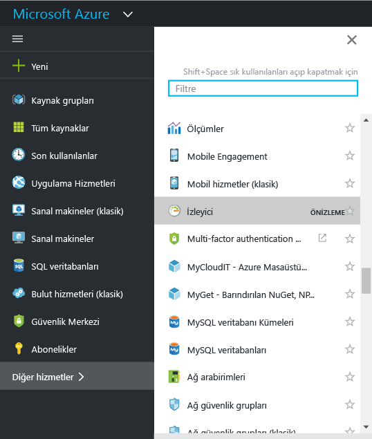
2. Tıklatın **İzleyici** seçeneği açık **İzleyici** sayfası. Bu sayfa, izleme ayarları ve verileri birlikte bir birleştirilmiş görünüme sağlar. İlk için açılır **genel bakış** bölümü. Genel Bakış tüm izleme uyarıları, hataları ve kaynakları ile ilgili hizmet sistem durumu danışma dökümünü gösterir.  

    

    Azure İzleyici, verileri üç temel kategoride izler: **etkinlik günlüğü**, **ölçümler** ve **tanılama günlükleri**.
3. Etkinlik günlüğü bölümünün gösterildiğinden emin olmak için **Etkinlik günlüğü**’ne tıklayın.

    [**Etkinlik günlüğü**](monitoring-overview-activity-logs.md), aboneliğinizdeki kaynaklar üzerinde gerçekleştirilen tüm işlemleri açıklar. Etkinlik Günlüğü’nü kullanarak aboneliğinizdeki kaynaklarla ilgili herhangi bir oluşturma, güncelleştirme veya silme işlemine ilişkin ‘ne, kim ve ne zaman’ sorularına yanıt bulabilirsiniz. Örneğin, Etkinlik Günlüğü bir web uygulamasının ne zaman ve kim tarafından durdurulduğunu söyler. Etkinlik Günlüğü olayları platforma depolanır ve 90 gün boyunca sorgulanabilir.

    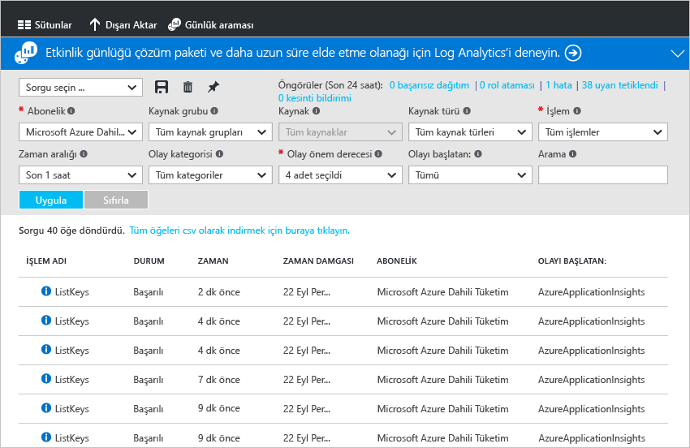

    Ortak filtrelere yönelik sorgular oluşturup kaydedebilir ve sonra ölçütlerinizi karşılayan olayların gerçekleşip gerçekleşmediğinden her zaman haberdar olmak için en önemli sorguları bir portal panosuna sabitleyebilirsiniz.
4. Görünümü son bir haftadaki belirli bir kaynak grubu ile filtreleyin, ardından **Kaydet** düğmesine tıklayın. Sorgunuz bir ad verin.

    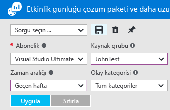
5. Şimdi **Sabitle** düğmesine tıklayın.

    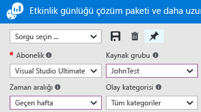

    Bu kılavuzdaki görünümlerin birçoğu panoya sabitlenebilir. Bunun yapılması, hizmetlerinize ilişkin çalışma verilerine ait tek bir bilgi kaynağı oluşturmanıza yardımcı olur.
6. Panonuza geri dönün. Şu anda sorgunun (ve sonuç sayısının) panonuzda gösterildiğini görebilirsiniz. Bu hızlı bir şekilde, aboneliğinizde son oluşan herhangi bir yüksek profilli eylem görmek istiyorsanız, örneğin yeni bir rolü atandı veya VM silindi yararlı olur.

    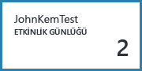
7. **İzleyici** kutucuğuna geri dönüp **Ölçümler** bölümüne tıklayın. İlk kaynak filtreleme ve sayfanın en üstünde açılan Seçenekleri'ni kullanarak seçerek seçmeniz gerekir.

    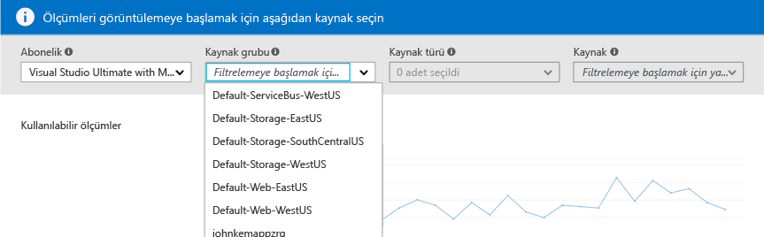

    Tüm Azure kaynakları [**ölçümler**](monitoring-overview-metrics.md) gösterir. Bu görünüm, kaynaklarınızın performansını kolayca anlayabilmeniz için tüm ölçümleri tek bir cam bölmede bir araya getirir. Ayrıca bizim marka denetleyin [deneyimi grafik yeni ölçümü](https://aka.ms/azuremonitor/new-metrics-charts) tıklayarak **ölçümleri (Önizleme)** sekmesi.
8. Bir kaynak seçtikten sonra tüm kullanılabilir ölçümler sayfanın sol tarafında görünür. Ölçümleri seçip grafik türü ile saat aralığını değiştirerek birden fazla ölçümün grafiğini tek seferde oluşturabilirsiniz. Ayrıca bu kaynak üzerinde oluşturulmuş tüm ölçüm uyarılarını görüntüleyebilirsiniz.

    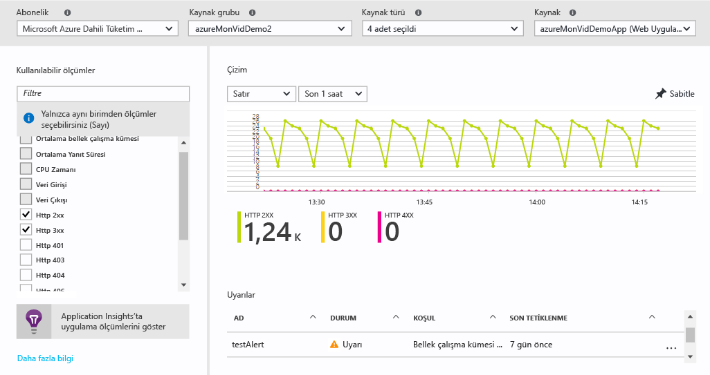

   > [!NOTE]
   > Bazı ölçümlerini etkinleştirerek kullanılabilirdir [Application Insights](../application-insights/app-insights-overview.md) ve/veya kaynağınız Windows veya Linux Azure tanılama uzantısını.
   >
   >

9. Grafiğiniz hazır olduğunda **Sabitle** düğmesini kullanarak grafiği panoya sabitleyebilirsiniz.
10. Geri dönüp **İzleyici** tıklatıp **tanılama günlükleri**.

    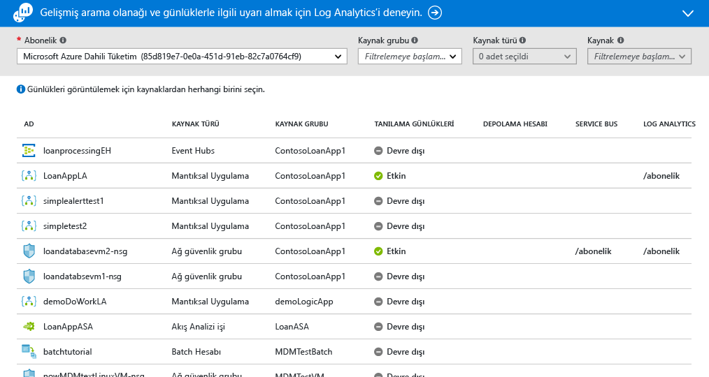

    [**Tanılama günlükleri**](monitoring-overview-of-diagnostic-logs.md), kendi çalışması hakkında veriler sağlayan belirli bir kaynak *tarafından* gösterilen günlüklerdir. Örneğin, Ağ Güvenliği Grup Kuralı Sayaçları ve Mantıksal Uygulama İş Akışı Günlükleri, tanılama günlüğü türleridir. Bu günlükler bir depolama hesabına depolanabilir, Event Hub’da yayınlanabilir ve/veya [Log Analytics](../log-analytics/log-analytics-overview.md)’e gönderilebilir. Log Analytics, Microsoft'un gelişmiş arama ve uyarı vermeye yönelik işletimsel bilgi ürünüdür.

    Portalda, aboneliğinizdeki tüm kaynakların listesini görüntüleyebilir ve tanılama günlüklerinin etkin olup olmadığını belirlemek üzere bu listeyi filtreleyebilirsiniz.
    > [!NOTE]
    > Çok boyutlu ölçümlerin tanılama ayarları aracılığıyla gönderilmesi şu anda desteklenmemektedir. Boyutlu ölçümler, boyut değerlerinin toplamı alınarak düzleştirilmiş tek yönlü ölçümler olarak dışarı aktarılır.
    >
    > *Örneğin*: Bir Olay Hub'ındaki 'Gelen İletiler' ölçümü, kuyruk düzeyi temelinde araştırılıp grafiği oluşturulabilir. Ancak, tanılama ayarları aracılığıyla dışarı aktarılan ölçüm, Olay Hub’ındaki tüm kuyruklarda tüm gelen iletiler halinde ifade edilir.
    >
    >

11. Tanılama günlükleri sayfasında bir kaynağa tıklayın. Tanılama günlükleriniz bir depolama hesabına kaydediliyorsa doğrudan indirebileceğiniz saatlik günlüklerin bir listesini görürsünüz.

    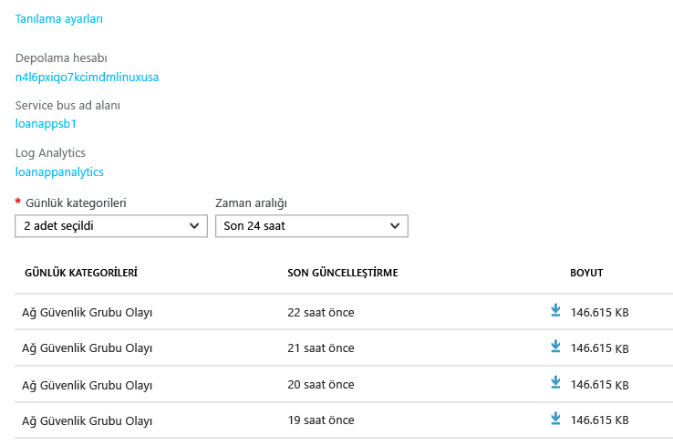

    Bir depolama hesabına arşivleme, Event Hubs’da yayınlama veya Log Analytics çalışma alanına gönderme amacıyla ayarlarınızı düzenlemek veya değiştirmek için **Tanılama Ayarları**’na da tıklayabilirsiniz.

    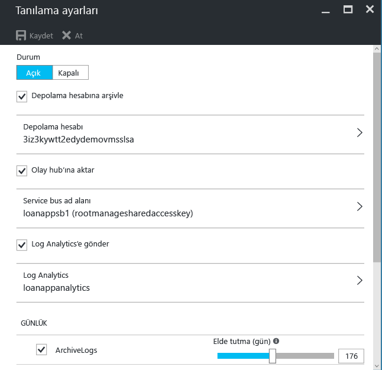

    Log Analytics için tanılama günlüklerini ayarladıysanız bu tanılama günlüklerini portalın **Günlük arama** bölümünde arayabilirsiniz.
12. Gidin **uyarıları (Klasik)** İzleyici sayfasının bölümünde.

    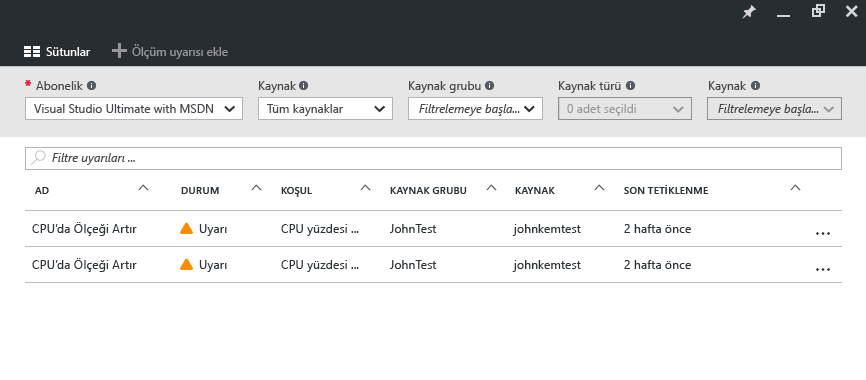

    Tüm yönetmek burada [ **Klasik uyarıları** ](monitoring-overview-alerts.md) Azure kaynaklarınızı üzerinde. Bu ölçümleri, etkinlik günlüğü olaylarını, Application Insights web testleri (konumlara) ve Application Insights öngörülü tanılama uyarılarını içerir. Uyarıları eylem gruplara bağlanın. [Eylem grupları](monitoring-action-groups.md) kişilere bildirmek veya bir uyarı oluşturulduğunda belirli eylemleri gerçekleştirmek için bir yol sağlar.

13. Uyarı oluşturmak için **Ölçüm uyarısı ekle**’ye tıklayın.

    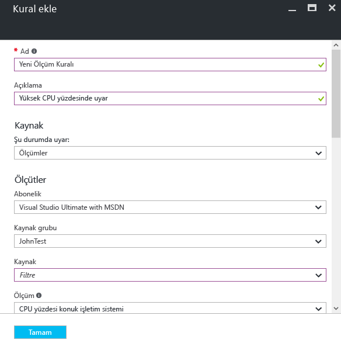

    Bundan sonra uyarının durumunu dilediğiniz zaman kolayca görmek için uyarıyı panonuza sabitleyebilirsiniz.

    Ayrıca Azure İzleyici artık sahiptir [ **yeni uyarılar** ](https://aka.ms/azuremonitor/near-real-time-alerts) sıklığı her dakika kadar düşük yapılamıyor.

14. İzleyici bölümünde [Application Insights](../application-insights/app-insights-overview.md) uygulamaları ve [Log Analytics](../log-analytics/log-analytics-overview.md) yönetim çözümleriyle ilgili bağlantılar da bulunur. Bu diğer Microsoft ürünleri, Azure İzleyici ile kapsamlı tümleştirmeye sahiptir.
15. Application Insights veya Log Analytics kullanmıyorsanız Azure İzleyici mevcut izleme, günlüğe kaydetme ve uyarı verme ürünleriyle bir ortaklığa sahip olabilir. Tam liste ve tümleştirme yönergeleri için [ortaklar sayfamıza](monitoring-partners.md) bakın.

Aşağıdaki adımları izleyerek ve tüm ilgili kutucukları panoya sabitleyerek uygulamanızın ve altyapınızın aşağıdaki gibi kapsamlı görünümlerini oluşturabilirsiniz:

## Sonraki adımlar
* Okuma [izleme araçları tüm Azure genel bakış](monitoring-overview.md) Azure İzleyici bunlarla nasıl çalıştığını anlamak için.
