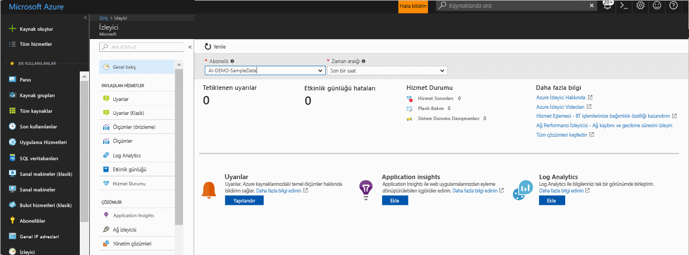
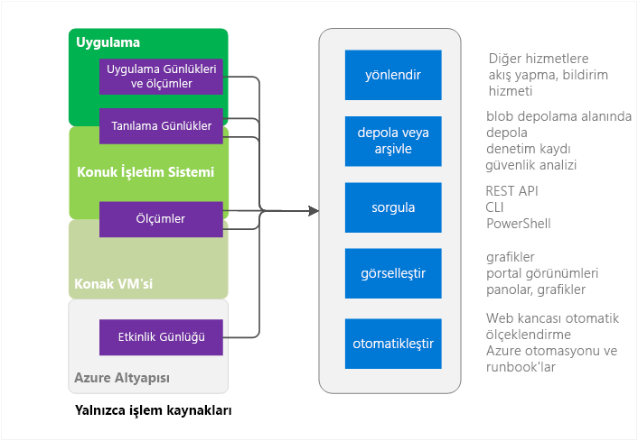
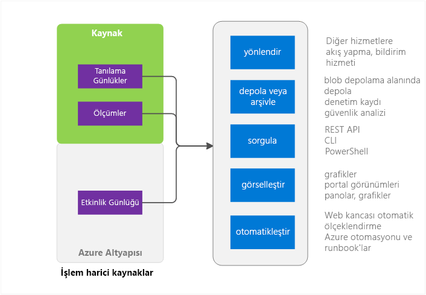

# Azure İzleyicisi'ne genel bakış
Bu makalede, Microsoft Azure Azure İzleyici hizmetinde genel bir bakış sağlar. Hangi Azure İzleyici yapar ve Azure İzleyicisi'ni kullanma hakkında ek bilgi işaretçiler sağlar açıklanır.  Bir tanıtım tercih ederseniz, bu makalenin sonundaki sonraki adımları bağlantılara bakın. 

## Azure İzleyicisi'ni ve Microsoft kullanıcının diğer izleme ürünleri
Azure İzleyicisi, çoğu Microsoft Azure hizmetlerini taban düzeyi altyapı ölçümleri ve günlükleri sağlar. Henüz verilerini Azure izleyicisine koymayın azure Hizmetleri bu var. gelecekte sokar.

Microsoft, geliştiriciler, DevOps veya şirket içi yüklemeleri de BT Ops için ek izleme olanakları sağlayan ek ürün ve hizmetlerin birlikte gönderilir. Bir genel bakış ve bu farklı ürün ve hizmetlerin birlikte nasıl çalıştığını anlamak için bkz: [Microsoft Azure'da izleme](monitoring-overview.md).

## Portal genel bakış sayfası

Azure İzleyici kullanıcıların yardımcı olan bir giriş sayfası vardır: 
- Azure tarafından sunulan izleme olanakları anlayın.
- Bulma, yapılandırmak ve yerleşik Azure'nın platform ve de izleme kapasiteleri premium.

Sayfa Gezinti devreye alma dahil olmak üzere için bir başlangıç noktasıdır. Farklı Hizmetleri'nden seçkin önem düzeyindeki sorunlar gösterir ve onlara bağlamda gidin olanak tanır.
 

Sayfasını açtığınızda, okuma erişimi olan abonelikleri arasından seçim yapabilirsiniz. Seçilen bir abonelik için görebilirsiniz:

- **Tetiklenen uyarıları ve uyarı kaynakları** - Bu tablo Özet sayılarını, uyarı kaynakları gösterir ve seçilen süre için tetiklenen uyarıları kaç kez. Eski ve yeni uyarılar için geçerlidir. Daha fazla bilgi edinin [yeni Azure uyarıları](monitoring-overview-unified-alerts.md). 
- **Etkinlik günlüğü hatalarını** -Azure kaynaklarınızı hiçbirini hata düzeyi önem derecesine sahip olayları oturum açarsanız, bir üst düzey sayısı görüntülemek ve aracılığıyla her olay araştırmak için etkinlik günlüğü sayfasında'ı tıklatın.
- **Azure hizmet durumu** -hizmet sistem durumu hizmeti sorunları, planlı bakım etkinliği ve sistem durumu danışma sayısını görebilirsiniz. Azure hizmet durumu hizmetlerinizi Azure altyapı sorunlarını etkisi kişiselleştirilmiş bilgileri sağlar.  Bkz: [Azure hizmet durumu](../service-health/service-health-overview.md) daha fazla bilgi için.  
- **Application Insights** -her Appınsights'dan kaynağın geçerli abonelikte KPI'ler bakın. KPI'ları, ASP.NET web uygulamaları, Java, düğüm ve genel uygulama türleri izleme sunucu tarafı uygulama için en iyi duruma getirilir. KPI'ları istek hızı, yanıt süresi, hata oranı ve kullanılabilirlik % ölçümlerini içerir. 

Günlük analizi veya Application Insights dahil edilmiş değil veya geçerli abonelikte herhangi bir Azure uyarı yapılandırmadıysanız, sayfa devreye alma işlemini başlatmak için bağlantılar sağlar.

## Azure İzleyici kaynakları - işlem alt

Burada işlem hizmetleri içerir 
- Cloud Services 
- Virtual Machines 
- Sanal makine ölçekleme kümeleri 
- Service Fabric

### Uygulama - tanılama günlükleri, uygulama günlüklerini ve ölçümleri
Uygulamaları, işlem modelinde konuk işletim sistemi üzerinde çalıştırılabilir. Bunlar, kullanıcıların kendi günlüklerini ve ölçümleri kümesini yayma. Azure İzleyici çoğu uygulama düzeyindeki ölçümlerini ve günlükleri toplamak için Azure tanılama uzantısını (Windows veya Linux) kullanır. Türler

* Performans sayaçları
* Uygulama günlükleri
* Windows olay günlükleri
* .NET olay kaynağı
* IIS günlükleri
* Temel ETW bildirimi
* Kilitlenme bilgi dökümleri
* Müşteri hata günlükleri

Tanılama uzantısını yalnızca birkaç ölçümleri CPU kullanımı gibi kullanılabilir. 

### Ana bilgisayar ve Konuk VM ölçümleri
Daha önce listelenen işlem kaynaklarını ayrılmış bir ana bilgisayar VM ve konuk işletim sistemi ile etkileşim vardır. Konuk işletim sistemi ve ana bilgisayar VM kök VM ve Konuk VM Hyper-V hiper yönetici modelinde eşdeğerdir. Ölçümleri hem de toplayabilir. Ayrıca, konuk işletim sistemi tanılama günlüklerini toplayabilir.   

### Etkinlik Günlüğü
Azure altyapısı tarafından görülen, kaynak hakkında bilgi için (daha önce işlemsel veya denetim günlüklerini denir) etkinlik günlüğü arayın. Günlük kez kaynakları zaman oluşturulan veya yok gibi bilgileri içerir.  Daha fazla bilgi için bkz: [etkinlik günlüğü'ne genel bakış](monitoring-overview-activity-logs.md). 

## -Şey Azure İzleyici kaynakları

### Kaynak - ölçümleri ve tanılama günlükleri
Toplanabilir ölçümleri ve tanılama günlüklerini kaynak türüne bağlı olarak değişir. Örneğin, Web uygulamaları Yüzde CPU ve Disk g/ç üzerinde istatistikler sağlar. Bu ölçümleri yerine kuyruk boyutu ve ileti işleme gibi ölçümleri sağlar Service Bus kuyruğuna için mevcut değil. Her kaynak için toplanabilir ölçümleri listesi kullanılabilir [ölçümleri desteklenen](monitoring-supported-metrics.md). 

### Ana bilgisayar ve Konuk VM ölçümleri
Olmadığından değil mutlaka kaynağınız ve belirli ana bilgisayar veya konuk VM 1:1 eşlemesini ölçümleri kullanılabilir değil.

### Etkinlik Günlüğü
Etkinlik günlüğü işlem kaynakları ile aynıdır.  

## Veri izleme kullanır
Veri toplama sonra onunla aşağıdaki Azure İzleyicisi'nde yapabilirsiniz.

### Yol
İzleme verilerini başka konumlara akışını sağlayabilirsiniz. 

Örneklere şunlar dahildir:

- Daha zengin Görselleştirme ve çözümleme araçları kullanabilmeniz için Application Insights'a gönderme.
- Üçüncü taraf araçları yönlendirmek için Event Hubs'a gönderin. 

### Depolama ve Arşiv
Bazı izleme verilerini bir kümesi süre boyunca depolanan ve Azure İzleyicisi'nde kullanılabilir zaten var. 
- Ölçümleri 30 gün süreyle depolanır. 
- Etkinlik günlüğü girişleri 90 gün süreyle depolanır. 
- Tanılama günlüklerini hiç depolanmaz. 

Yukarıda listelenen süreleri daha uzun veri depolamak istiyorsanız, Azure depolamayı kullanabilirsiniz. İzleme verilerini ayarladığınız bir bekletme ilkesi temel alınarak depolama hesabınızdaki tutulur. Verileri Azure depolama alanında kapladığı alanı için ödeme yapmak zorunda. 

Bu verileri kullanmak için birkaç yolu:

- Yazıldıktan sonra onu okuyun ve işleme diğer araçları içinde veya Azure dışında olabilir.
- Uzun süre için verileri tutmak için bulutta, bekletme ilkesi değiştirmek veya verileri yerel olarak yerel bir arşiv indirilir.  
- Arşiv amacıyla süresiz olarak Azure storage'da veri bırakın. 

### Sorgu
Sistem ya da Azure depolama verilere erişmek için çapraz platform komut satırı arabirimi (CLI) komutları, PowerShell cmdlet'lerini veya .NET SDK'sı Azure İzleyici REST API'sini kullanabilirsiniz

Örneklere şunlar dahildir:

* Yazdığınız özel bir izleme uygulama için veri alma
* Özel sorgular oluşturma ve bir üçüncü taraf uygulama için bu verileri gönderme.

### Görselleştirme
Grafikleri izleme verilerinizi görselleştirme eğilimleri verilerine bakan hızlıdır bulmanıza yardımcı olur.  

Birkaç görselleştirme yöntemler şunlardır:

* Azure portalı kullanma
* Azure Application Insights için rota verileri
* Microsoft PowerBI rota verileri
* Bir üçüncü taraf görselleştirme aracı ya da canlı akış kullanarak veya bir arşiv Azure depolama alanında okuma aracı sahip verileri yönlendirmek

### Otomatikleştirme
> [!NOTE]
> Uyarıları Microsoft Azure üzerinde devam eden evrimi bir parçası olarak, uyarı verme birleşik bir deneyim kullanıma sunulmuştur. Daha fazla ayrıntı [yeni Azure uyarıları](monitoring-overview-unified-alerts.md)

Azure uyarıları izleme verilerini tetikleyici uyarıları veya hatta tüm işlemler için kullanabilirsiniz. Örneklere şunlar dahildir:

* Otomatik ölçeklendirme işlem örnekleri için verileri, uygulama yüküne göre yukarı veya aşağı kullanın.
* Ölçüm ya da günlük koşullara göre e-postalar gönderin. 
* Azure dışında bir sistemde bir eylemi çalıştırmak için bir web URL'si (Web kancası) çağırın
* Tüm çeşitli görevleri gerçekleştirmek için Azure Otomasyonu'nda bir runbook başlatın

## Azure İzleyicisi'ne erişim yöntemleri
Genel olarak, veri izleme, Yönlendirme ve aşağıdaki yöntemlerden birini kullanarak alma yönetebilirsiniz. Tüm yöntemler, tüm eylemler veya veri türleri için kullanılabilir.

* [Azure Portal](https://portal.azure.com)
* [PowerShell](insights-powershell-samples.md)  
* [Platformlar arası komut satırı arabirimi (CLI)](insights-cli-samples.md)
* [REST API](https://docs.microsoft.com/rest/api/monitor/)
* [.NET SDK](http://www.nuget.org/packages/Microsoft.Azure.Management.Monitor)

## Sonraki adımlar
Şu konular hakkında daha fazla bilgi edinin:
- Videosu yalnızca Azure İzleyicisi'ni şu adresten edinilebilir  
[Azure İzleyicisi ile çalışmaya başlama](https://channel9.msdn.com/Blogs/Azure-Monitoring/Get-Started-with-Azure-Monitor). 
- Burada kullanabileceğiniz Azure monitör bir senaryoda açıklayan bir video için bkz. [Microsoft Azure keşfedin izleme ve tanılama](https://channel9.msdn.com/events/Ignite/2016/BRK2234) ve [Ignite 2016'den video Azure izleyicisinde](https://myignite.microsoft.com/videos/4977).
- Azure İzleyicisi arabirimi aracılığıyla çalıştırmak [Azure İzleyicisi ile çalışmaya başlama](monitoring-get-started.md)
- Ayarlanan [Azure tanılama uzantıları](../azure-diagnostics.md) çalışıyorsanız, bulut hizmeti, sanal makine sorunlarını tanılamak sanal makine ölçekleme kümeleri veya Service Fabric uygulaması.
- [Application Insights](https://azure.microsoft.com/documentation/services/application-insights/) App Service Web uygulamanızda tanılama sorunları çalışıyorsanız.
- [Azure Storage sorunlarını giderme](../storage/common/storage-e2e-troubleshooting.md) depolama BLOB'ları, tabloların veya kuyrukların kullanırken
- [Log Analytics](https://azure.microsoft.com/documentation/services/log-analytics/)
