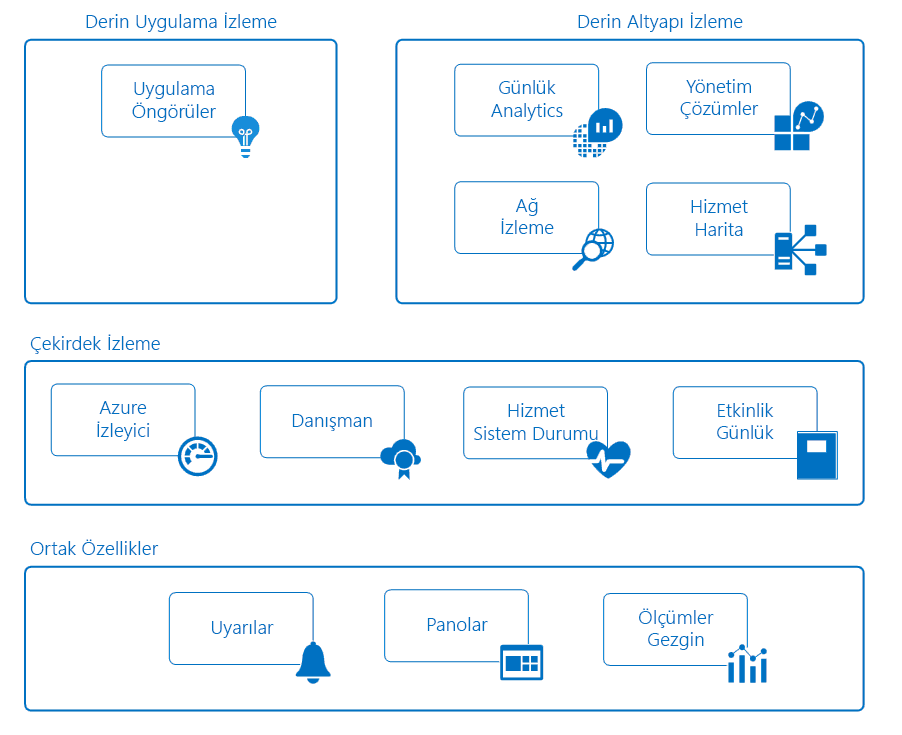

# Azure uygulamaları ve kaynakları izleme

İzleme, toplama ve performans, sistem durumu ve iş uygulamanız ve bağımlı kaynakları kullanılabilirliğini belirlemek için verileri analiz etme işlemidir. Etkili izleme stratejisi, uygulamanızın bileşenlerinin ayrıntılı işlem anlamanıza yardımcı olur. Ayrıca sorun haline gelmeden önce bunları çözümleyebilirsiniz böylece önceden, kritik sorunlar bildirerek, çalışma süresini artırmanıza yardımcı olur.

Azure ayrı ayrı bir spesifik rol ya da görev İzleme alanı gerçekleştirmek birden çok hizmetleri içerir. Birlikte, bu hizmetleri toplama, çözümleme ve uygulamanız ve bunları destekleyen Azure kaynaklarını telemetrisinden işlevi gören için kapsamlı bir çözüm sunar. Karma bir ortamı izleme sağlamak için kritik şirket içi kaynakları izlemek için de çalışabilir. Araçlar ve kullanılabilir verileri anlamak, uygulamanız için tam bir izleme stratejisi geliştirme ilk adımdır.

Aşağıdaki diyagramda, Azure kaynaklarının izleme sunmak için birlikte çalışan tüm bileşenleri kavramsal bir görünüm gösterir. Aşağıdaki bölümlerde bu bileşenlerini açıklar ve ayrıntılı teknik bilgi için bağlantılar sağlar.

## Paylaşılan Özellikleri
Çekirdek ve ayrıntılı izleme hizmeti aşağıdaki özellikleri sağlayan işlevselliği paylaşır.

### Uyarılar
[Azure uyarıları](../monitoring-and-diagnostics/monitoring-overview-alerts.md) proaktif olarak kritik koşulları size bildirir ve potansiyel olarak düzeltme eylemlerini gerçekleştirin. Uyarı kuralları ölçümleri ve günlükleri de dahil olmak üzere birden çok kaynaktan veri kullanabilirsiniz. Kullandıkları [Eylem grupları](../monitoring-and-diagnostics/monitoring-action-groups.md), alıcıları ve yanıt olarak bir uyarı eylemleri benzersiz kümesini içerir. Gereksinimlerinize bağlı olarak, Web kancalarını kullanarak dış eylemleri başlatmak ve ITSM araçlarıyla tümleştirmenize uyarıları olabilir.

### Panolar
Kullanabileceğiniz [Azure panolar](../azure-portal/azure-portal-dashboards.md) farklı veri türleri tek bir bölme halinde birleştirmek için [Azure portal](https://portal.azure.com). Bu gibi durumlarda, Pano sonra Azure kullanıcılarıyla paylaşabilirsiniz.

Örneğin, bir araya getiren bir Pano oluşturabilirsiniz:
- Bir grafik ölçümleri Göster döşeme
- Etkinlik günlükleri tablosu
- Application Insights kullanım grafikten
- Günlük analizi günlük aramada çıktısı

Günlük analizi veri dışa aktarabilirsiniz [Power BI](https://docs.microsoft.com/power-bi/). Burada, ek görselleştirmeleri yararlanabilir. Diğerleri için kullanılabilir içinde ve kuruluşunuzun dışındaki verileri de yapabilirsiniz.

### Ölçüm Gezgini
[Ölçümleri](../monitoring-and-diagnostics/monitoring-overview-metrics.md) sayısal işlemi ve kaynak performansını anlamanıza yardımcı olması için bir Azure kaynağı tarafından üretilen değerler. Ölçümleri Gezgini'ni kullanarak, ölçümler için günlük analizi veri çözümleme için diğer kaynaklardan gönderebilirsiniz.

## Çekirdek izleme
Çekirdek izleme temel, gerekli Azure kaynaklarını izleme sağlar. Bu hizmetler minimal yapılandırma gerektirir ve premium izleme hizmetlerini kullanan çekirdek telemetri toplar.    

### Azure İzleyici
[Azure İzleyici](../monitoring-and-diagnostics/monitoring-overview-azure-monitor.md) koleksiyonunu sağlayarak Azure Hizmetleri için çekirdek izleme sağlayan [ölçümleri](../monitoring-and-diagnostics/monitoring-overview-metrics.md), [etkinlik günlükleri](../monitoring-and-diagnostics/monitoring-overview-activity-logs.md), ve [tanılama günlükleri](../monitoring-and-diagnostics/monitoring-overview-of-diagnostic-logs.md). Örneğin, etkinlik günlüğü, yeni kaynaklar olduğunda oluşturulan veya değiştirilen bildirir.

Ölçümleri kullanılabilir farklı kaynaklar ve hatta bir sanal makine içinde işletim sistemi performans istatistiklerini sağlayan. Azure portalında gezginler biri ile bu verileri görüntüleme ve bu ölçümleri temel uyarılar oluşturabilir. Azure İzleyicisi süresi kritik uyarılar ve bildirimler için kullanmalısınız şekilde hızlı ölçümleri (1 dakika kadar 5 dakika), potansiyel satış sağlar.

Bu ölçümleri ve günlükleri oluşturan eğilim ve ayrıntılı çözümleme için Azure günlük Analizi'ne göndermek veya proaktif olarak size, analiz sonucunda kritik sorunları bildirmek için ek uyarı kuralları oluşturun.  

> [!NOTE]
> Çok boyutlu ölçümleri günlük analizi için tanılama ayarları gönderme şu anda desteklenmiyor. Boyutlu ölçümler, boyut değerlerinin toplamı alınarak düzleştirilmiş tek yönlü ölçümler olarak dışarı aktarılır.
>
> *Örneğin*: Bir Olay Hub'ındaki 'Gelen İletiler' ölçümü, kuyruk düzeyi temelinde araştırılıp grafiği oluşturulabilir. Ancak, günlük analizi ölçüm gelen tüm iletilerin tüm temsil edilir dışarı aktardığınızda olay hub'ı sıralar.
>
>

### Azure Advisor
[Azure Danışmanı](../advisor/advisor-overview.md) kaynak yapılandırma ve kullanım telemetrisi sürekli olarak izler. Ardından, en iyi uygulamalarına göre kişiselleştirilmiş önerileri sağlar. Bu öneriler aşağıdaki performans, güvenlik ve uygulamalarınızı destekleyen kaynaklar kullanılabilirliğini geliştirmenize yardımcı olur.

### Hizmet Durumu
Sistem, uygulamanızın bağımlı Azure hizmetlerini kullanır. [Azure hizmet durumu](../service-health/service-health-overview.md) uygulamanızı etkileyebilecek Azure hizmetleriyle ilgili sorunları tanımlar. Hizmet durumu zamanlanmış bakım işlemleri için planlama da yardımcı olur.

### Etkinlik Günlüğü
[Etkinlik günlüğü](../monitoring-and-diagnostics/monitoring-overview-activity-logs.md) bir Azure kaynağı ilgili verileri sağlar. Bu bilgiler içerir:
- Yapılandırma kaynağı değiştirir.
- Hizmet sistem durumu olayları.
- Kaynak yararlanarak daha iyi öneriler.
- Otomatik ölçeklendirme işlemleriyle ilgili bilgileri.

Kendi sayfasında Azure Portalı'ndaki belirli bir kaynak için günlükleri görüntüleyebilirsiniz. Veya birden çok kaynak günlüklerinden etkinlik günlüğü Gezgini'nde görüntüleyebilirsiniz.

Etkinlik günlüğü girişleri için günlük analizi de gönderebilirsiniz. Burada, yönetim çözümleri, sanal makinelerde aracıları ve diğer kaynakları tarafından toplanan verileri kullanarak günlüklerini analiz edebilirsiniz.

## Ayrıntılı izleme Hizmetleri
Aşağıdaki Azure hizmetlerini toplama ve daha ayrıntılı bir düzeyde izleme verilerini çözümleme için zengin özellikleri sağlar. Bu hizmetler çekirdek izleme oluşturmak ve Azure'da ortak işlevsellikten yararlanmak. Uygulamalarını ve altyapısını benzersiz fikir vermek için toplanan verilerle güçlü analytics sağlarlar. Bunlar veri hedeflenen senaryoları bağlamında farklı izleyicilere sunar.

## Ayrıntılı uygulama izleme
### Application Insights
Kullanabileceğiniz [Azure Application Insights](http://azure.microsoft.com/documentation/services/application-insights) kullanılabilirliği, performansı ve kullanımı, uygulamanızın Bulut veya şirket içi barındırılan olup olmadığını izlemek için.

Application Insights ile çalışmak için uygulamanızın işaretlenerek ayrıntılı Öngörüler elde etmek ve DevOps senaryoları uygulayın. Hızla tanımlayın ve bunları raporlamak bir kullanıcı için beklemeden hatalarını tanılayın. Topladığınız bilgileri kullanarak, uygulamanızın Bakım ve geliştirmeler hakkında bilgi sahibi seçimler yapabilirsiniz.

Application Insights topladığı veri ile etkileşim için kapsamlı araçlar vardır. Application Insights, ortak bir depo verilerini depolar. Bu uyarılar, panolar ve derin çözümleme günlük analizi sorgu dili gibi paylaşılan işlevlerin yararlanabilir.

## Derin altyapısını izleme
### Log Analytics
[Günlük analizi](http://azure.microsoft.com/documentation/services/log-analytics) Azure veri kaynakları (Microsoft dışı araçlar dahil) çeşitli arasından tek bir depoya toplayarak izleme merkezi bir rol oynar. Burada, güçlü sorgu dili kullanarak verileri analiz edebilirsiniz.

Application Insights ve Azure Güvenlik Merkezi günlük verileri depolamak ve analiz altyapısını kullanma analizi verilerini depolar. Verileri de Azure İzleyici, yönetim çözümleri ve bulutta veya şirket içi sanal makinelerde yüklü aracıları toplanır. Paylaşılan bu işlevsellik, ortamınızı eksiksiz bir görünümünü form yardımcı olur.

### Yönetim çözümleri
[Yönetim çözümleri](../log-analytics/log-analytics-add-solutions.md) belirli bir uygulama veya hizmet için bilgiler sunan paketlenmiş mantığı kümeleridir. Bunlar, depolamak ve bunlar toplamak izleme verilerini analiz etmek için günlük analizi üzerinde kullanır.

Yönetim çözümleri, Microsoft ve ortaklarından çeşitli Azure ve üçüncü taraf hizmetleri için izlemeyi sağlamak için kullanılabilir. Çözümlerini izleme örnekleri şunlardır:
* [Kapsayıcı izleme](../log-analytics/log-analytics-containers.md), yardımcı olan görüntülemenize ve yönetmenize kapsayıcı konaklarınızın.
* [Azure SQL analizi](../log-analytics/log-analytics-azure-sql.md), toplar ve Azure SQL veritabanları için performans ölçümleri visualizes.

Azure portalında altında tüm kullanılabilir yönetim çözümleri görüntüleyebilirsiniz *İzleyici* ekran.

### Ağ izleme
Azure veya şirket içi ağınızda, çeşitli yönlerini izlemek için birlikte çalışan çeşitli araçlar vardır.  

[Ağ İzleyicisi](../network-watcher/network-watcher-monitoring-overview.md) Azure senaryolarda farklı bir ağ için senaryo tabanlı izleme ve tanılama sağlar. Azure ölçümleri ve daha fazla çözümleme için tanılama veri depolar. Ağınız çeşitli yönlerini izlemek için aşağıdaki çözümleri ile çalışır.

[Ağ Performans İzleyicisi'ni (NPM)](https://blogs.msdn.microsoft.com/azuregov/2017/09/05/network-performance-monitor-general-availability/) izleme genel Bulutlar, veri merkezleri ve şirket içi ortamları bağlantısını izler çözümü bulut tabanlı bir ağda.

[ExpressRoute İzleyici](https://azure.microsoft.com/en-in/blog/monitoring-of-azure-expressroute-in-preview/) Azure ExpressRoute bağlantı hatları uçtan uca bağlantısını ve performans izleyen bir NPM bir özelliktir.

[DNS Analytics](../log-analytics/log-analytics-dns.md) güvenlik, performans ve DNS sunucularını temel alarak, işlemleri ile ilgili Öngörüler sağlayan bir çözümdür.

[Hizmet uç noktası İzleyicisi](../networking/network-monitoring-overview.md) uygulamaları ulaşılabilirlik sınar ve şirket içi, taşıyıcı ağlar ve bulut/özel veri merkezleri üzerinden performans sorunları algılar.

### Hizmet Eşlemesi
[Hizmet eşlemesi](../operations-management-suite/operations-management-suite-service-map.md) kendi farklı işlemler ve diğer bilgisayarlardaki ve dış işlemlere bağımlılıkları olan sanal makineleri çözümleyerek Iaas ortamınız hakkında bilgi sağlar. Olaylar, performans verileri ve günlük analizi yönetim çözümlerine tümleştirir. Bu veriler, her bilgisayar ve, ortamın geri kalanının ilişkisi bağlamında sonra görüntüleyebilirsiniz.

Hizmet eşlemesi benzer [Application Insights uygulama eşlemesinde](../application-insights/app-insights-app-map.md). Uygulamalarınızı destekleyen altyapı bileşenlerine odaklanır.

## Örnek senaryolar
Nasıl farklı izleme araçları Azure'da farklı senaryolar için kullanabileceğiniz gösteren yüksek düzey örnekler verilmiştir.

### Bir web uygulaması izleme
Azure App Service, Azure Storage ve SQL veritabanı ile azure'da dağıtılan bir web uygulaması göz önünde bulundurun. Erişerek Başlat [ölçümleri](../monitoring-and-diagnostics/monitoring-overview-metrics.md) ve [etkinlik günlükleri](../monitoring-and-diagnostics/monitoring-overview-activity-logs.md) bu kaynakların Azure portalında kendi sayfalarında. Ortalama yanıt süresi ve uygulama için istek sayısı gibi kritik bilgileri arayın. Ayrıca, herhangi bir yapılandırma değişikliği de tanımlar.

Ardından ölçümleri ve farklı kaynaklar için günlükleri birlikte görüntülemek için izleme Portalı'nda gidin. Ölçümleri standart parametrelerini belirlemek, [uyarı kuralları oluşturmak](../monitoring-and-diagnostics/monitoring-overview-unified-alerts.md). Örneğin, ortalama yanıt süresi eşiği artırır, bu kurallar proaktif olarak size bildirir. Uygulamanızın günlük performansını hızlı bir görünümünü almak için kritik KPI'ları temsil ölçümleri grafikleri göstermeyi Azure bir pano oluşturun.

Uygulamanızın veya daha ayrıntılı izleme gerçekleştirmek için [için Application Insights yapılandırma](../application-insights/quick-monitor-portal.md). Artık daha fazla işlemi ve uygulamanızın performansını sağlar ek verileri toplayabilir. Application Insights, uygulamanızın bileşenleri arasındaki temel ilişkileri algılar. Görsel sağlar [uygulama eşlemesi](../application-insights/app-insights-app-map.md) ile birlikte [uçtan uca izleme](../application-insights/app-insights-transaction-diagnostics.md) tam bileşeni, bağımlılık veya özel durum bir sorun oluştuğu tanılamak için.

Oluşturduğunuz [kullanılabilirlik testleri](../application-insights/app-insights-monitor-web-app-availability.md) proaktif olarak farklı bölgelerdeki uygulamanızı test etmek için. Geliştiricilere yardımcı olmak için [profil oluşturucu etkinleştirmek](../application-insights/enable-profiler-compute.md) böylece istekleri ve belirli satırlık bir kod için özel durumlar izleyebilirsiniz. Daha fazla uygulamanızda kullanılan hizmetler görünürlük elde etmek için eklemeniz [SQL analiz çözümü](../log-analytics/log-analytics-azure-sql.md) günlük analizi ek veriler toplamak için.

Bir süre sonra ne zaman sitesinde performans eşiğin altına düştü nokta kök nedeni araştırın karar verin. Günlük analizi kullanarak bir sorgu yazın. Yapılandırmayla Application Insights tarafından toplanan kullanım ve performans verilerini ve performans verilerini uygulamanızı desteklemek Azure kaynakları arasında ilişkilendirmenize yardımcı olur.

### Sanal makineleri izleme
Windows ve Linux Azure üzerinde çalışan sanal makineler karışımına sahip. Azure İzleyici görüntülemek için kullandığınız [etkinlik günlükleri](../monitoring-and-diagnostics/monitoring-overview-activity-logs.md) ve [ana bilgisayar düzeyinde ölçümleri](../monitoring-and-diagnostics/monitoring-overview-metrics.md). Eklediğiniz [Azure tanılama uzantısını](../virtual-machines/linux/tutorial-monitoring.md#install-diagnostics-extension) konuk işletim sisteminden ölçümleri toplamak için sanal makineler için. Ardından oluşturduğunuz [uyarı kuralları](../monitoring-and-diagnostics/monitoring-overview-unified-alerts.md) işlemci kullanımı ve bellek gibi temel ölçümleri eşikleri geçtiğinde önceden size bildirilmesini.

Bir iş uygulaması çalıştıran sanal makineler hakkında daha fazla bilgi toplamak için [günlük analizi çalışma alanı oluşturma ve VM uzantısı etkinleştirme](../log-analytics/log-analytics-quick-collect-azurevm.md) her makinede. Yapılandırdığınız [farklı veri kaynakları koleksiyonunu](../log-analytics/log-analytics-data-sources.md) uygulamanız için ve [görünümleri oluşturma](../log-analytics/log-analytics-view-designer.md) kendi günlük işlemi ve performans bildirmek için. Daha sonra [uyarı kuralları oluşturmak](../monitoring-and-diagnostics/monitoring-overview-unified-alerts.md) belirli hata olayları alındığında sizi bilgilendirmek üzere.

Sürekli olarak yüklü aracı durumunu izlemek için eklediğiniz [Aracısı sistem yönetimi çözümü](../operations-management-suite/oms-solution-agenthealth.md). Daha fazla uygulama kavramanıza için [bağımlılık aracısı ekleme](../operations-management-suite/operations-management-suite-service-map-configure.md) bunlara eklemek için sanal makinelere [hizmet Haritası](../operations-management-suite/operations-management-suite-service-map.md). Hizmet eşlemesi önemli işlemlerin bulur ve diğer hizmetlerle makineler arasındaki bağlantıları tanımlar.

Bildirilen bir kesinti sonra adli sorun yaşayan belirli makineler tanımlayacak gerçekleştirmek için hizmet Haritası kullanın. Ardından oluşturduğunuz bir [günlük analizi veri sorgusu](../log-analytics/log-analytics-log-search-new.md) sorunun gelecekte tanımlamak için. Ve koşulu algıladığında sizi önceden bilgilendirmek üzere bir uyarı kuralı oluşturun.

## Sonraki adımlar
Daha fazla bilgi edinin:

* [Azure İzleyici](https://azure.microsoft.com/services/monitor/) çekirdek ölçümleri ve Uyarıları izleme ile çalışmaya başlamak için.
* [Application Insights](https://azure.microsoft.com/documentation/services/application-insights/) App Service web uygulamanızda sorunlara tanı koymak çalışıyorsanız.
* [Günlük analizi](https://azure.microsoft.com/documentation/services/log-analytics/) toplanan izleme verileri ve günlüklerini çözümlemek için.
