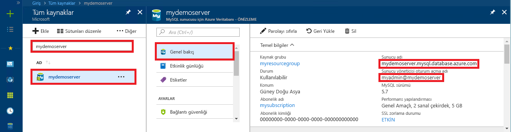

# <a name="azure-database-for-mysql-use-connectorc-to-connect-and-query-data"></a>MySQL için Azure Veritabanı: Connector/C++ bağlanmak ve veri sorgulamak için kullanın
Bu hızlı başlangıçta C++ uygulaması kullanarak MySQL için Azure Veritabanı'na nasıl bağlanacağınız gösterilmiştir. Hızlı başlangıçta, veritabanında verileri sorgulamak, eklemek, güncelleştirmek ve silmek için SQL deyimlerinin nasıl kullanılacağı da gösterilmiştir. Bu konuda, C++ kullanarak geliştirmeyle ilgili bilgi sahibi olduğunuz ve MySQL için Azure Veritabanı ile çalışmaya yeni başladığınız varsayılır.

## <a name="prerequisites"></a>Önkoşullar
Bu hızlı başlangıçta, başlangıç noktası olarak aşağıdaki kılavuzlardan birinde oluşturulan kaynaklar kullanılmaktadır:
- [Azure portalını kullanarak MySQL için Azure Veritabanı sunucusu oluşturma](./quickstart-create-mysql-server-database-using-azure-portal.md)
- [Azure CLI kullanarak MySQL için Azure Veritabanı sunucusu oluşturma](./quickstart-create-mysql-server-database-using-azure-cli.md)

Şunları da yapmanız gerekir:
- [.Net Framework](https://www.microsoft.com/net/download)'ü yükleme
- [Visual Studio](https://www.visualstudio.com/downloads/)'yu yükleme
- [MySQL Connector/C++](https://dev.mysql.com/downloads/connector/cpp/) yükleyin 
- [Boost](https://www.boost.org/)’u yükleyin

## <a name="install-visual-studio-and-net"></a>Visual Studio'yu ve .NET'i yükleme
Bu bölümdeki adımlarda .NET kullanarak geliştirmeyle ilgili bilgi sahibi olduğunuz varsayılır.

### <a name="windows"></a>**Windows**
- Android, iOS ve Windows’un yanı sıra web ve veritabanı uygulamaları ile bulut hizmetleri için modern uygulamalar oluşturmaya yönelik tam özellikli, genişletilebilir, ücretsiz bir IDE olan Visual Studio 2017 Community’yi yükleyin. Tam .NET Framework’ü veya yalnızca .NET Core’u yükleyebilirsiniz: hızlı başlangıçtaki kod parçacıkları her ikisiyle de çalışır. Bilgisayarınızda Visual Studio zaten yüklüyse, sonraki iki adımı atlayın.
   1. [Visual Studio 2017 yükleyicisi](https://www.visualstudio.com/thank-you-downloading-visual-studio/?sku=Community&rel=15)ni indirin. 
   2. Yükleyiciyi çalıştırın ve yükleme istemlerini izleyerek yüklemeyi tamamlayın.

### <a name="configure-visual-studio"></a>**Visual Studio'yu yapılandırma**
1. Visual Studio'dan Proje -> Özellikler -> bağlayıcı -> Genel > ek kitaplık Dizinleri'ne "\lib\opt" dizinini ekleyin (örn: C:\Program dosyaları (x86) \MySQL\MySQL Connector C++ 1.1.9\lib\opt) C++ bağlayıcısının.
2. Visual Studio'dan Proje -> Özellikler -> C/C++ -> Genel -> Ek Ekleme Dizinleri:
   - C ++ bağlayıcısının "\include" dizinini ekleyin (örn: C:\Program dosyaları (x86) \MySQL\MySQL Connector C++ 1.1.9\include\).
   - Boost kitaplığının kök dizinini ekleyin (örn: C:\boost_1_64_0\).
3. Visual Studio'dan Proje -> Özellikler -> Bağlayıcı -> Giriş > Ek Bağımlılıklar’a gidip metin alanına **mysqlcppconn.lib** değerini ekleyin.
4. Adım 3'teki C++ bağlayıcı kitaplık klasöründen **mysqlcppconn.dll** dosyasını uygulama yürütülebilir dosyasıyla aynı dizine kopyalayın ya da uygulamanızın dosyayı bulması için ortam değişkenine ekleyin.

## <a name="get-connection-information"></a>Bağlantı bilgilerini alma
MySQL için Azure Veritabanı'na bağlanmak üzere gereken bağlantı bilgilerini alın. Tam sunucu adına ve oturum açma kimlik bilgilerine ihtiyacınız vardır.

1. [Azure Portal](https://portal.azure.com/)’da oturum açın.
2. Azure portalında sol taraftaki menüden **Tüm kaynaklar**'a tıklayın ve oluşturduğunuz sunucuyu (örneğin, **mydemoserver**) arayın.
3. Sunucunun adına tıklayın.
4. Sunucunun **Genel Bakış** panelinden **Sunucu adı** ile **Sunucu yöneticisi oturum açma adı**’nı not alın. Parolanızı unutursanız, bu panelden parolayı da sıfırlayabilirsiniz.
 

## <a name="connect-create-table-and-insert-data"></a>Bağlanma, tablo oluşturma ve veri ekleme
Bağlanıp **CREATE TABLE** ve **INSERT INTO** SQL deyimlerini kullanarak verileri yüklemek için aşağıdaki kodu kullanın. Kod MySQL ile bağlantı kurmak için connect() yöntemiyle sql::Driver sınıfını kullanır. Ardından kod veritabanı komutlarını çalıştırmak için createStatement() ve execute() yöntemlerini kullanır. 

Host, DBName, User ve Password parametrelerini, sunucuyu ve veritabanını oluştururken belirttiğiniz değerlerle değiştirin. 

```c++
#include <stdlib.h>
#include <iostream>
#include "stdafx.h"

#include "mysql_connection.h"
#include <cppconn/driver.h>
#include <cppconn/exception.h>
#include <cppconn/prepared_statement.h>
using namespace std;

//for demonstration only. never save your password in the code!
const string server = "tcp://yourservername.mysql.database.azure.com:3306";
const string username = "username@servername";
const string password = "yourpassword";

int main()
{
    sql::Driver *driver;
    sql::Connection *con;
    sql::Statement *stmt;
    sql::PreparedStatement *pstmt;

    try
    {
        driver = get_driver_instance();
        con = driver->connect(server, username, password);
    }
    catch (sql::SQLException e)
    {
        cout << "Could not connect to server. Error message: " << e.what() << endl;
        system("pause");
        exit(1);
    }

    //please create database "quickstartdb" ahead of time
    con->setSchema("quickstartdb");

    stmt = con->createStatement();
    stmt->execute("DROP TABLE IF EXISTS inventory");
    cout << "Finished dropping table (if existed)" << endl;
    stmt->execute("CREATE TABLE inventory (id serial PRIMARY KEY, name VARCHAR(50), quantity INTEGER);");
    cout << "Finished creating table" << endl;
    delete stmt;

    pstmt = con->prepareStatement("INSERT INTO inventory(name, quantity) VALUES(?,?)");
    pstmt->setString(1, "banana");
    pstmt->setInt(2, 150);
    pstmt->execute();
    cout << "One row inserted." << endl;

    pstmt->setString(1, "orange");
    pstmt->setInt(2, 154);
    pstmt->execute();
    cout << "One row inserted." << endl;

    pstmt->setString(1, "apple");
    pstmt->setInt(2, 100);
    pstmt->execute();
    cout << "One row inserted." << endl;

    delete pstmt;
    delete con;
    system("pause");
    return 0;
}
```

## <a name="read-data"></a>Verileri okuma

Bağlanmak ve **SELECT** SQL deyimi kullanarak verileri okumak için aşağıdaki kodu kullanın. Kod MySQL ile bağlantı kurmak için connect() yöntemiyle sql::Driver sınıfını kullanır. Ardından kod, seçme komutlarını çalıştırmak için prepareStatement() ve executeQuery() yöntemlerini kullanır. Daha sonra, kod next() yöntemini kullanarak sonuçlardaki kayıtlara gider. Son olarak, kod getInt() ve getString() yöntemini kullanarak kayıttaki değerleri ayrıştırır.

Host, DBName, User ve Password parametrelerini, sunucuyu ve veritabanını oluştururken belirttiğiniz değerlerle değiştirin. 

```c++
#include <stdlib.h>
#include <iostream>
#include "stdafx.h"

#include "mysql_connection.h"
#include <cppconn/driver.h>
#include <cppconn/exception.h>
#include <cppconn/resultset.h>
#include <cppconn/prepared_statement.h>
using namespace std;

//for demonstration only. never save your password in the code!
const string server = "tcp://yourservername.mysql.database.azure.com:3306";
const string username = "username@servername";
const string password = "yourpassword";

int main()
{
    sql::Driver *driver;
    sql::Connection *con;
    sql::PreparedStatement *pstmt;
    sql::ResultSet *result;

    try
    {
        driver = get_driver_instance();
        //for demonstration only. never save password in the code!
        con = driver->connect(server, username, password);
    }
    catch (sql::SQLException e)
    {
        cout << "Could not connect to server. Error message: " << e.what() << endl;
        system("pause");
        exit(1);
    }

    con->setSchema("quickstartdb");

    //select  
    pstmt = con->prepareStatement("SELECT * FROM inventory;");
    result = pstmt->executeQuery();

    while (result->next())
        printf("Reading from table=(%d, %s, %d)\n", result->getInt(1), result->getString(2).c_str(), result->getInt(3));

    delete result;
    delete pstmt;
    delete con;
    system("pause");
    return 0;
}
```

## <a name="update-data"></a>Verileri güncelleştirme
Bağlanmak ve **UPDATE** SQL deyimi kullanarak verileri okumak için aşağıdaki kodu kullanın. Kod MySQL ile bağlantı kurmak için connect() yöntemiyle sql::Driver sınıfını kullanır. Ardından kod, güncelleme komutlarını çalıştırmak için prepareStatement() ve executeQuery() yöntemlerini kullanır. 

Host, DBName, User ve Password parametrelerini, sunucuyu ve veritabanını oluştururken belirttiğiniz değerlerle değiştirin. 

```c++
#include <stdlib.h>
#include <iostream>
#include "stdafx.h"

#include "mysql_connection.h"
#include <cppconn/driver.h>
#include <cppconn/exception.h>
#include <cppconn/resultset.h>
#include <cppconn/prepared_statement.h>
using namespace std;

//for demonstration only. never save your password in the code!
const string server = "tcp://yourservername.mysql.database.azure.com:3306";
const string username = "username@servername";
const string password = "yourpassword";

int main()
{
    sql::Driver *driver;
    sql::Connection *con;
    sql::PreparedStatement *pstmt;

    try
    {
        driver = get_driver_instance();
        //for demonstration only. never save password in the code!
        con = driver->connect(server, username, password);
    }
    catch (sql::SQLException e)
    {
        cout << "Could not connect to server. Error message: " << e.what() << endl;
        system("pause");
        exit(1);
    }
    
    con->setSchema("quickstartdb");

    //update
    pstmt = con->prepareStatement("UPDATE inventory SET quantity = ? WHERE name = ?");
    pstmt->setInt(1, 200);
    pstmt->setString(2, "banana");
    pstmt->executeQuery();
    printf("Row updated\n");

    delete con;
    delete pstmt;
    system("pause");
    return 0;
}
```


## <a name="delete-data"></a>Verileri silme
Bağlanmak ve **DELETE** SQL deyimi kullanarak verileri okumak için aşağıdaki kodu kullanın. Kod MySQL ile bağlantı kurmak için connect() yöntemiyle sql::Driver sınıfını kullanır. Ardından kod, silme komutlarını çalıştırmak için prepareStatement() ve executeQuery() yöntemlerini kullanır.

Host, DBName, User ve Password parametrelerini, sunucuyu ve veritabanını oluştururken belirttiğiniz değerlerle değiştirin. 

```c++
#include <stdlib.h>
#include <iostream>
#include "stdafx.h"

#include "mysql_connection.h"
#include <cppconn/driver.h>
#include <cppconn/exception.h>
#include <cppconn/resultset.h>
#include <cppconn/prepared_statement.h>
using namespace std;

//for demonstration only. never save your password in the code!
const string server = "tcp://yourservername.mysql.database.azure.com:3306";
const string username = "username@servername";
const string password = "yourpassword";

int main()
{
    sql::Driver *driver;
    sql::Connection *con;
    sql::PreparedStatement *pstmt;
    sql::ResultSet *result;

    try
    {
        driver = get_driver_instance();
        //for demonstration only. never save password in the code!
        con = driver->connect(server, username, password);
    }
    catch (sql::SQLException e)
    {
        cout << "Could not connect to server. Error message: " << e.what() << endl;
        system("pause");
        exit(1);
    }
    
    con->setSchema("quickstartdb");
        
    //delete
    pstmt = con->prepareStatement("DELETE FROM inventory WHERE name = ?");
    pstmt->setString(1, "orange");
    result = pstmt->executeQuery();
    printf("Row deleted\n");    
    
    delete pstmt;
    delete con;
    delete result;
    system("pause");
    return 0;
}
```

## <a name="next-steps"></a>Sonraki adımlar
> [!div class="nextstepaction"]
> [Döküm alma ve geri yükleme işlemlerini kullanarak MySQL veritabanınızı MySQL için Azure Veritabanı'na geçirme](concepts-migrate-dump-restore.md)
