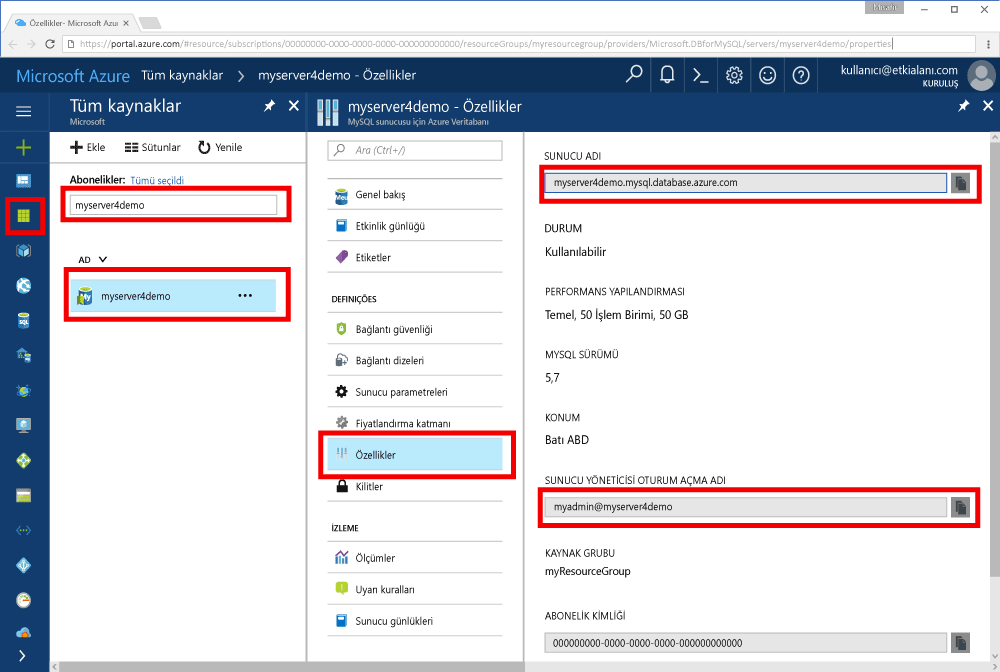

# <a name="azure-database-for-mysql-use-go-language-to-connect-and-query-data"></a>MySQL için Azure Veritabanı: Bağlanmak ve veri sorgulamak için Go dilini kullanma
Bu Hızlı Başlangıç, Windows, Ubuntu Linux ve Apple macOS platformlarından MySQL için yazılan kod kullanarak bir Azure veritabanına bağlanmak gösterilmiştir [Git](https://golang.org/) dili. Ayrıca veritabanında veri sorgulamak, eklemek, güncelleştirmek ve silmek için SQL deyimlerini nasıl kullanacağınız da gösterilmiştir. Bu konu, Git kullanarak geliştirme ile tanıdık ve MySQL için Azure veritabanı ile çalışmaya yeni olduğunu varsayar.

## <a name="prerequisites"></a>Ön koşullar
Bu hızlı başlangıçta, başlangıç noktası olarak şu kılavuzlardan birinde oluşturulan kaynaklar kullanılmaktadır:
- [Azure portalını kullanarak MySQL için Azure Veritabanı sunucusu oluşturma](./quickstart-create-mysql-server-database-using-azure-portal.md)
- [Azure CLI kullanarak MySQL için Azure Veritabanı sunucusu oluşturma](./quickstart-create-mysql-server-database-using-azure-cli.md)

## <a name="install-go-and-mysql-connector"></a>Go ve MySQL bağlayıcısını yükleme
Yükleme [Git](https://golang.org/doc/install) ve [MySQL için Git-sql-sürücü](https://github.com/go-sql-driver/mysql#installation) kendi bilgisayarınızda. Platformunuz bağlı olarak ilgili bölümdeki adımları izleyin:

### <a name="windows"></a>Windows
1. [Yükleme yönergelerine](https://golang.org/doc/install) uygun olarak Microsoft Windows için Go’yu [indirin](https://golang.org/dl/) ve yükleyin.
2. Başlat menüsünden komut istemini başlatın.
3. Projeniz için şöyle bir klasör oluşturun. `mkdir  %USERPROFILE%\go\src\mysqlgo`.
4. Dizini değiştirerek proje klasörünüze geçin; örneğin, `cd %USERPROFILE%\go\src\mysqlgo`.
5. GOPATH için ortam değişkenini kaynak kod dizinine işaret edecek şekilde ayarlayın. `set GOPATH=%USERPROFILE%\go`.
6. `go get github.com/go-sql-driver/mysql` komutunu çalıştırarak [go-sql-driver for mysql](https://github.com/go-sql-driver/mysql#installation)'i yükleyin.

   Özetle, Go’yu yükleyin ve ardından komut isteminde şu komutları çalıştırın:
   ```cmd
   mkdir  %USERPROFILE%\go\src\mysqlgo
   cd %USERPROFILE%\go\src\mysqlgo
   set GOPATH=%USERPROFILE%\go
   go get github.com/go-sql-driver/mysql
   ```

### <a name="linux-ubuntu"></a>Linux (Ubuntu)
1. Bash kabuğunu başlatın. 
2. `sudo apt-get install golang-go` komutunu çalıştırarak Go'yu yükleyin.
3. Giriş dizininizde projeniz için `mkdir -p ~/go/src/mysqlgo/` gibi bir klasör oluşturun.
4. Dizini değiştirerek klasöre geçin; örneğin, `cd ~/go/src/mysqlgo/`.
5. GOPATH ortam değişkenini geçerli bir kaynak dizine, örneğin geçerli giriş dizininizin go klasörüne işaret edecek şekilde ayarlayın. Bash kabuğunda çalıştırmak `export GOPATH=~/go` gidin dizini geçerli kabuk oturumu için GOPATH eklemek için.
6. `go get github.com/go-sql-driver/mysql` komutunu çalıştırarak [go-sql-driver for mysql](https://github.com/go-sql-driver/mysql#installation)'i yükleyin.

   Özetle, şu bash komutlarını çalıştırın:
   ```bash
   sudo apt-get install golang-go
   mkdir -p ~/go/src/mysqlgo/
   cd ~/go/src/mysqlgo/
   export GOPATH=~/go/
   go get github.com/go-sql-driver/mysql
   ```

### <a name="apple-macos"></a>Apple macOS
1. Git göre yükleyip [yükleme yönergeleri](https://golang.org/doc/install) platformunuz eşleşen. 
2. Bash kabuğunu başlatın.
3. Giriş dizininizde projeniz için `mkdir -p ~/go/src/mysqlgo/` gibi bir klasör oluşturun.
4. Dizini değiştirerek klasöre geçin; örneğin, `cd ~/go/src/mysqlgo/`.
5. GOPATH ortam değişkenini geçerli bir kaynak dizine, örneğin geçerli giriş dizininizin go klasörüne işaret edecek şekilde ayarlayın. Bash kabuğunda çalıştırmak `export GOPATH=~/go` gidin dizini geçerli kabuk oturumu için GOPATH eklemek için.
6. `go get github.com/go-sql-driver/mysql` komutunu çalıştırarak [go-sql-driver for mysql](https://github.com/go-sql-driver/mysql#installation)'i yükleyin.

   Özetle, Go’yu yükleyin ve ardından şu bash komutlarını çalıştırın:
   ```bash
   mkdir -p ~/go/src/mysqlgo/
   cd ~/go/src/mysqlgo/
   export GOPATH=~/go/
   go get github.com/go-sql-driver/mysql
   ```

## <a name="get-connection-information"></a>Bağlantı bilgilerini alma
MySQL için Azure Veritabanı'na bağlanmak üzere gereken bağlantı bilgilerini alın. Tam sunucu adına ve oturum açma kimlik bilgilerine ihtiyacınız vardır.

1. [Azure Portal](https://portal.azure.com/)’da oturum açın.
2. Azure portalında sol taraftaki menüden **tüm kaynakları** ve creased sunucusu için arama yapın (gibi **myserver4demo**).
3. **myserver4demo** sunucu adına tıklayın.
4. Sunucunun seçin **özellikleri** sayfasında ve sonra Not **sunucu adı** ve **sunucu yönetici oturum açma adı**.
 
5. Sunucu oturum açma bilgilerinizi unutursanız gidin **genel bakış** sunucu yönetici oturum açma adı görüntülemek için sayfa ve gerekirse, parola sıfırlama.
   

## <a name="build-and-run-go-code"></a>Go kodunu derleme ve çalıştırma 
1. Golang kodlarını yazmak için Microsoft Windows’da Not Defteri , Ubuntu’da [VI](http://manpages.ubuntu.com/manpages/xenial/man1/nvi.1.html#contenttoc5) veya [Nano](https://www.nano-editor.org/), macOS’da TextEdit gibi basit metin düzenleyicilerini kullanabilirsiniz. Bir daha zengin etkileşimli geliştirme ortamı'nı (IDE) tercih ederseniz, deneyin [Gogland](https://www.jetbrains.com/go/) Jetbrains tarafından [Visual Studio Code](https://code.visualstudio.com/) Microsoft tarafından veya [Atom](https://atom.io/).
2. Aşağıdaki bölümlerde Git koddan metin dosyasına yapıştırın ve sonra proje klasörünüze dosya uzantısıyla kaydedin \*.go (Windows yolu gibi `%USERPROFILE%\go\src\mysqlgo\createtable.go` ya da Linux yolu `~/go/src/mysqlgo/createtable.go`).
3. Bulun `HOST`, `DATABASE`, `USER`, ve `PASSWORD` sabitleri kodu ve örnek değerleri kendi değerlerinizle sonra değiştirin. 
4. Komut istemi veya Bash Kabuğu'nu başlatın. Dizini değiştirerek proje klasörünüze geçin. Örneğin; Windows’da `cd %USERPROFILE%\go\src\mysqlgo\`. Linux'ta `cd ~/go/src/mysqlgo/`.  Belirtilen IDE düzenleyicilerinden bazıları kabuk komutları gerektirmeden hata ayıklama ve çalışma zamanı özellikleri sunar.
5. Uygulamayı derlemek ve çalıştırmak için `go run createtable.go` komutunu yazarak kodu çalıştırın. 
6. Alternatif olarak, kodu yerel bir uygulamada derlemek için `go build createtable.go` komutunu kullanın, ardından uygulamayı çalıştırmak için `createtable.exe`’yi başlatın.

## <a name="connect-create-table-and-insert-data"></a>Bağlanma, tablo oluşturma ve veri ekleme
Sunucuya bağlanmak için bir tablo oluşturup kullanarak verileri yüklemek için aşağıdaki kodu kullanın bir **Ekle** SQL deyimi. 

Kod üç paketi içeri aktarır: [sql paketi](https://golang.org/pkg/database/sql/), MySQL için Azure Veritabanı'yla iletişim kuran sürücü olarak [go sql driver for mysql](https://github.com/go-sql-driver/mysql#installation) ve komut satırında yazdırılan girdi ve çıktı için [fmt paketi](https://golang.org/pkg/fmt/).

Kod yöntemi çağırır [sql. Open()](http://go-database-sql.org/accessing.html) MySQL ve bunu Azure veritabanına bağlanmak için bağlantı yöntemi kullanarak denetler [db. Ping()](https://golang.org/pkg/database/sql/#DB.Ping). İşlem boyunca, veritabanı sunucusu için bağlantı havuzunu tutan bir [veritabanı tanıtıcı](https://golang.org/pkg/database/sql/#DB) kullanılır. Kod, birkaç DDL komutunu çalıştırmak için birkaç kez [Exec()](https://golang.org/pkg/database/sql/#DB.Exec) yöntemini çağırır. Kod ayrıca kullanır [Prepare()](http://go-database-sql.org/prepared.html) ve Exec() hazırlanmış deyimleri üç satır eklemek için farklı parametrelerle çalıştırın. Her zaman özel checkError() yöntemi, bir hata oluştu, denetleyin ve çıkmak için Panik için kullanılır.

`host`, `database`, `user` ve `password` sabitlerini kendi değerlerinizle değiştirin. 

```Go
package main

import (
    "database/sql"
    "fmt"

    _ "github.com/go-sql-driver/mysql"
)

const (
    host     = "myserver4demo.mysql.database.azure.com"
    database = "quickstartdb"
    user     = "myadmin@myserver4demo"
    password = "yourpassword"
)

func checkError(err error) {
    if err != nil {
        panic(err)
    }
}

func main() {

    // Initialize connection string.
    var connectionString = fmt.Sprintf("%s:%s@tcp(%s:3306)/%s?allowNativePasswords=true", user, password, host, database)

    // Initialize connection object.
    db, err := sql.Open("mysql", connectionString)
    checkError(err)
    defer db.Close()

    err = db.Ping()
    checkError(err)
    fmt.Println("Successfully created connection to database.")

    // Drop previous table of same name if one exists.
    _, err = db.Exec("DROP TABLE IF EXISTS inventory;")
    checkError(err)
    fmt.Println("Finished dropping table (if existed).")

    // Create table.
    _, err = db.Exec("CREATE TABLE inventory (id serial PRIMARY KEY, name VARCHAR(50), quantity INTEGER);")
    checkError(err)
    fmt.Println("Finished creating table.")

    // Insert some data into table.
    sqlStatement, err := db.Prepare("INSERT INTO inventory (name, quantity) VALUES (?, ?);")
    res, err := sqlStatement.Exec("banana", 150)
    checkError(err)
    rowCount, err := res.RowsAffected()
    fmt.Printf("Inserted %d row(s) of data.\n", rowCount)

    res, err = sqlStatement.Exec("orange", 154)
    checkError(err)
    rowCount, err = res.RowsAffected()
    fmt.Printf("Inserted %d row(s) of data.\n", rowCount)

    res, err = sqlStatement.Exec("apple", 100)
    checkError(err)
    rowCount, err = res.RowsAffected()
    fmt.Printf("Inserted %d row(s) of data.\n", rowCount)
    fmt.Println("Done.")
}

```

## <a name="read-data"></a>Verileri okuma
Aşağıdaki kodu kullanın ve kullanarak verileri okuyun bir **seçin** SQL deyimi. 

Kod üç paketi içeri aktarır: [sql paketi](https://golang.org/pkg/database/sql/), MySQL için Azure Veritabanı'yla iletişim kuran sürücü olarak [go sql driver for mysql](https://github.com/go-sql-driver/mysql#installation) ve komut satırında yazdırılan girdi ve çıktı için [fmt paketi](https://golang.org/pkg/fmt/).

Kod, [sql.Open()](http://go-database-sql.org/accessing.html) yöntemini çağırarak MySQL için Azure Veritabanı’na bağlanır ve [db.Ping()](https://golang.org/pkg/database/sql/#DB.Ping) yöntemini kullanarak bağlantıyı kontrol eder. İşlem boyunca, veritabanı sunucusu için bağlantı havuzunu tutan bir [veritabanı tanıtıcı](https://golang.org/pkg/database/sql/#DB) kullanılır. Kod, seçme komutunu çalıştırmak için [Query()](https://golang.org/pkg/database/sql/#DB.Query) yöntemini çağırır. Ardından, sonuç kümesi üzerinden yineleme yapmak için [Next()](https://golang.org/pkg/database/sql/#Rows.Next) ve sütun değerlerini ayrıştırıp değeri değişkenlere kaydetmek için [Scan()](https://golang.org/pkg/database/sql/#Rows.Scan) çalıştırır. Her seferinde hata oluşup olmadığını denetlemek ve acil çıkış yapmak için özel bir checkError() yöntemi kullanılır.

`host`, `database`, `user` ve `password` sabitlerini kendi değerlerinizle değiştirin. 

```Go
package main

import (
    "database/sql"
    "fmt"

    _ "github.com/go-sql-driver/mysql"
)

const (
    host     = "myserver4demo.mysql.database.azure.com"
    database = "quickstartdb"
    user     = "myadmin@myserver4demo"
    password = "yourpassword"
)

func checkError(err error) {
    if err != nil {
        panic(err)
    }
}

func main() {

    // Initialize connection string.
    var connectionString = fmt.Sprintf("%s:%s@tcp(%s:3306)/%s?allowNativePasswords=true", user, password, host, database)

    // Initialize connection object.
    db, err := sql.Open("mysql", connectionString)
    checkError(err)
    defer db.Close()

    err = db.Ping()
    checkError(err)
    fmt.Println("Successfully created connection to database.")

    // Variables for printing column data when scanned.
    var (
        id       int
        name     string
        quantity int
    )

    // Read some data from the table.
    rows, err := db.Query("SELECT id, name, quantity from inventory;")
    checkError(err)
    defer rows.Close()
    fmt.Println("Reading data:")
    for rows.Next() {
        err := rows.Scan(&id, &name, &quantity)
        checkError(err)
        fmt.Printf("Data row = (%d, %s, %d)\n", id, name, quantity)
    }
    err = rows.Err()
    checkError(err)
    fmt.Println("Done.")
}
```

## <a name="update-data"></a>Verileri güncelleştirme
Bağlanmak ve **UPDATE** SQL deyimi kullanarak verileri güncelleştirmek için aşağıdaki kodu kullanın. 

Kod üç paketi içeri aktarır: [sql paketi](https://golang.org/pkg/database/sql/), MySQL için Azure Veritabanı'yla iletişim kuran sürücü olarak [go sql driver for mysql](https://github.com/go-sql-driver/mysql#installation) ve komut satırında yazdırılan girdi ve çıktı için [fmt paketi](https://golang.org/pkg/fmt/).

Kod, [sql.Open()](http://go-database-sql.org/accessing.html) yöntemini çağırarak MySQL için Azure Veritabanı’na bağlanır ve [db.Ping()](https://golang.org/pkg/database/sql/#DB.Ping) yöntemini kullanarak bağlantıyı kontrol eder. İşlem boyunca, veritabanı sunucusu için bağlantı havuzunu tutan bir [veritabanı tanıtıcı](https://golang.org/pkg/database/sql/#DB) kullanılır. Kod, güncelleştirme komutunu çalıştırmak için [Exec()](https://golang.org/pkg/database/sql/#DB.Exec) yöntemini çağırır. Her seferinde hata oluşup olmadığını denetlemek ve acil çıkış yapmak için özel bir checkError() yöntemi kullanılır.

`host`, `database`, `user` ve `password` sabitlerini kendi değerlerinizle değiştirin. 

```Go
package main

import (
    "database/sql"
    "fmt"

    _ "github.com/go-sql-driver/mysql"
)

const (
    host     = "myserver4demo.mysql.database.azure.com"
    database = "quickstartdb"
    user     = "myadmin@myserver4demo"
    password = "yourpassword"
)

func checkError(err error) {
    if err != nil {
        panic(err)
    }
}

func main() {

    // Initialize connection string.
    var connectionString = fmt.Sprintf("%s:%s@tcp(%s:3306)/%s?allowNativePasswords=true", user, password, host, database)

    // Initialize connection object.
    db, err := sql.Open("mysql", connectionString)
    checkError(err)
    defer db.Close()

    err = db.Ping()
    checkError(err)
    fmt.Println("Successfully created connection to database.")

    // Modify some data in table.
    rows, err := db.Exec("UPDATE inventory SET quantity = ? WHERE name = ?", 200, "banana")
    checkError(err)
    rowCount, err := rows.RowsAffected()
    fmt.Printf("Deleted %d row(s) of data.\n", rowCount)
    fmt.Println("Done.")
}
```

## <a name="delete-data"></a>Verileri silme
Bağlanmak ve **DELETE** SQL deyimini kullanarak verileri kaldırmak için aşağıdaki kodu kullanın. 

Kod üç paketi içeri aktarır: [sql paketi](https://golang.org/pkg/database/sql/), MySQL için Azure Veritabanı'yla iletişim kuran sürücü olarak [go sql driver for mysql](https://github.com/go-sql-driver/mysql#installation) ve komut satırında yazdırılan girdi ve çıktı için [fmt paketi](https://golang.org/pkg/fmt/).

Kod, [sql.Open()](http://go-database-sql.org/accessing.html) yöntemini çağırarak MySQL için Azure Veritabanı’na bağlanır ve [db.Ping()](https://golang.org/pkg/database/sql/#DB.Ping) yöntemini kullanarak bağlantıyı kontrol eder. İşlem boyunca, veritabanı sunucusu için bağlantı havuzunu tutan bir [veritabanı tanıtıcı](https://golang.org/pkg/database/sql/#DB) kullanılır. Kod, silme komutunu çalıştırmak için [Exec()](https://golang.org/pkg/database/sql/#DB.Exec) yöntemini çağırır. Her seferinde hata oluşup olmadığını denetlemek ve acil çıkış yapmak için özel bir checkError() yöntemi kullanılır.

`host`, `database`, `user` ve `password` sabitlerini kendi değerlerinizle değiştirin. 

```Go
package main

import (
    "database/sql"
    "fmt"
    _ "github.com/go-sql-driver/mysql"
)

const (
    host     = "myserver4demo.mysql.database.azure.com"
    database = "quickstartdb"
    user     = "myadmin@myserver4demo"
    password = "yourpassword"
)

func checkError(err error) {
    if err != nil {
        panic(err)
    }
}

func main() {

    // Initialize connection string.
    var connectionString = fmt.Sprintf("%s:%s@tcp(%s:3306)/%s?allowNativePasswords=true", user, password, host, database)

    // Initialize connection object.
    db, err := sql.Open("mysql", connectionString)
    checkError(err)
    defer db.Close()

    err = db.Ping()
    checkError(err)
    fmt.Println("Successfully created connection to database.")

    // Modify some data in table.
    rows, err := db.Exec("DELETE FROM inventory WHERE name = ?", "orange")
    checkError(err)
    rowCount, err := rows.RowsAffected()
    fmt.Printf("Deleted %d row(s) of data.\n", rowCount)
    fmt.Println("Done.")
}
```

## <a name="next-steps"></a>Sonraki adımlar
> [!div class="nextstepaction"]
> [Dışarı Aktarma ve İçeri Aktarma seçeneğini kullanarak veritabanınızı geçirme](./concepts-migrate-import-export.md)
