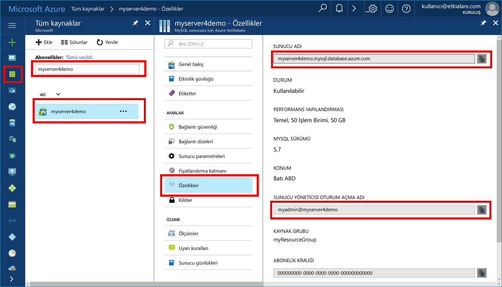

# <a name="azure-database-for-mysql-use-nodejs-to-connect-and-query-data"></a>MySQL için Azure Veritabanı: Bağlanmak ve veri sorgulamak için Node.js’yi kullanma
Bu hızlı başlangıçta, Windows, Ubuntu Linux ve Mac platformlarından [Node.js](https://nodejs.org/) kullanılarak MySQL için Azure Veritabanı’na nasıl bağlanılacağı gösterilmiştir. Ayrıca veritabanında veri sorgulamak, eklemek, güncelleştirmek ve silmek için SQL deyimlerini nasıl kullanacağınız da gösterilmiştir. Bu konuda, Node.js kullanarak geliştirmeyle ilgili bilgi sahibi olduğunuz ve MySQL için Azure Veritabanı ile çalışmaya yeni başladığınız varsayılır.

## <a name="prerequisites"></a>Ön koşullar
Bu hızlı başlangıçta, başlangıç noktası olarak şu kılavuzlardan birinde oluşturulan kaynaklar kullanılmaktadır:
- [Azure portalını kullanarak MySQL için Azure Veritabanı sunucusu oluşturma](./quickstart-create-mysql-server-database-using-azure-portal.md)
- [Azure CLI kullanarak MySQL için Azure Veritabanı sunucusu oluşturma](./quickstart-create-mysql-server-database-using-azure-cli.md)

Şunları da yapmanız gerekir:
- [Node.js](https://nodejs.org) çalışma zamanını yükleyin.
- Node.js uygulamasından MySQL’e bağlanmak için [mysql2](https://www.npmjs.com/package/mysql2) paketini yükleyin. 

## <a name="install-nodejs-and-the-mysql-connector"></a>Node.js’yi ve MySQL bağlayıcısını yükleme
Node.js'yi yüklemek için platformunuza uygun bölümdeki yönergeleri izleyin. Proje klasörünüze mysql2 paketini ve bağımlılıklarını yüklemek için npm kullanın.

### <a name="windows"></a>**Windows**
1. [Node.js indirme sayfasını](https://nodejs.org/en/download/) ziyaret edin ve istediğiniz Windows yükleyici seçeneğini belirleyin.
2. `nodejsmysql` gibi yerel bir proje klasörü oluşturun. 
3. Komut istemini başlatın ve dizini değiştirerek proje klasörüne geçin; örneğin, `cd c:\nodejsmysql\`
4. Proje klasörüne mysql2 kitaplığını yüklemek için NPM aracını çalıştırın.

   ```cmd
   cd c:\nodejsmysql\
   "C:\Program Files\nodejs\npm" install mysql2
   "C:\Program Files\nodejs\npm" list
   ```

5. `mysql2@1.3.5` için `npm list` çıkış metnini denetleyerek yüklemeyi doğrulayın.

### <a name="linux-ubuntu"></a>**Linux (Ubuntu)**
1. **Node.js**’yi ve Node.js’nin paket yöneticisi olan **npm**’yi yüklemek için aşağıdaki komutları çalıştırın.

   ```bash
   sudo apt-get install -y nodejs npm
   ```

2. `mysqlnodejs` proje klasörünü oluşturmak ve o klasöre mysql2 paketini yüklemek için aşağıdaki komutları çalıştırın.

   ```bash
   mkdir nodejsmysql
   cd nodejsmysql
   npm install --save mysql2
   npm list
   ```
3. `mysql2@1.3.5` için npm listesi çıkış metnini denetleyerek yüklemeyi doğrulayın.

### <a name="mac-os"></a>**Mac OS**
1. Mac OS X ve **Node.js**’ye yönelik kullanımı kolay bir paket yöneticisi olan **brew** programını yüklemek için aşağıdaki komutları girin.

   ```bash
   ruby -e "$(curl -fsSL https://raw.githubusercontent.com/Homebrew/install/master/install)"
   brew install node
   ```
2. `mysqlnodejs` proje klasörünü oluşturmak ve o klasöre mysql2 paketini yüklemek için aşağıdaki komutları çalıştırın.

   ```bash
   mkdir nodejsmysql
   cd nodejsmysql
   npm install --save mysql2
   npm list
   ```

3. `mysql2@1.3.6` için `npm list` çıkış metnini denetleyerek yüklemeyi doğrulayın. Yeni yamalar yayımlandıkça sürüm numarası değişebilir.

## <a name="get-connection-information"></a>Bağlantı bilgilerini alma
MySQL için Azure Veritabanı'na bağlanmak üzere gereken bağlantı bilgilerini alın. Tam sunucu adına ve oturum açma kimlik bilgilerine ihtiyacınız vardır.

1. [Azure Portal](https://portal.azure.com/)’da oturum açın.
2. Sol bölmede **Tüm kaynaklar**’a tıklayın ve ardından oluşturduğunuz sunucuyu arayın (örneğin, **myserver4demo**).
3. **myserver4demo** sunucu adına tıklayın.
4. Sunucunun **Özellikler** sayfasını seçin ve **Sunucu adı** ile **Sunucu yöneticisi oturum açma adı**’nı not alın.
 
5. Sunucunuzun oturum açma bilgilerini unuttuysanız **Genel Bakış** sayfasına giderek Sunucu yöneticisi oturum açma adını görüntüleyin ve gerekirse parolayı sıfırlayın.

## <a name="running-the-javascript-code-in-nodejs"></a>Node.js’de JavaScript kodunu çalıştırma
1. JavaScript kodunu metin dosyalarına yapıştırın ve dosyaları .js uzantısıyla bir proje klasörüne kaydedin (örneğin, C:\nodejsmysql\createtable.js veya /home/username/nodejsmysql/createtable.js).
2. Komut istemi veya Bash kabuğunu çalıştırın ve dizini değiştirerek `cd nodejsmysql` proje klasörünüze geçin.
3. Uygulamayı çalıştırmak için node komutunu ve ardından `node createtable.js` örneğindeki gibi dosya adını yazın.
4. Windows’da düğüm uygulamanız ortam değişkeni yolunuzda değilse düğüm uygulamasını başlatmak için tam yolu kullanmanız gerekebilir; örneğin, `"C:\Program Files\nodejs\node.exe" createtable.js`

## <a name="connect-create-table-and-insert-data"></a>Bağlanma, tablo oluşturma ve veri ekleme
Bağlanıp **CREATE TABLE** ve **INSERT INTO** SQL deyimlerini kullanarak verileri yüklemek için aşağıdaki kodu kullanın.

MySQL sunucusuyla arabirim oluşturmak için [mysql.createConnection()](https://github.com/mysqljs/mysql#establishing-connections) yöntemi, kullanılır. Sunucuyla bağlantı kurmak için [connect()](https://github.com/mysqljs/mysql#establishing-connections) işlevi kullanılır. MySQL veritabanına karşı SQL sorgusunu yürütmek için [query()](https://github.com/mysqljs/mysql#performing-queries) işlevi kullanılır. 

`host`, `user`, `password` ve `database` parametrelerini, sunucu ve veritabanını oluştururken belirttiğiniz değerlerle değiştirin.

```javascript
const mysql = require('mysql2');

var config =
{
    host: 'myserver4demo.mysql.database.azure.com',
    user: 'myadmin@myserver4demo',
    password: 'your_password',
    database: 'quickstartdb',
    port: 3306,
    ssl: true
};

const conn = new mysql.createConnection(config);

conn.connect(
    function (err) { 
    if (err) { 
        console.log("!!! Cannot connect !!! Error:");
        throw err;
    }
    else
    {
       console.log("Connection established.");
           queryDatabase();
    }   
});

function queryDatabase(){
       conn.query('DROP TABLE IF EXISTS inventory;', function (err, results, fields) { 
            if (err) throw err; 
            console.log('Dropped inventory table if existed.');
        })
       conn.query('CREATE TABLE inventory (id serial PRIMARY KEY, name VARCHAR(50), quantity INTEGER);', 
            function (err, results, fields) {
                if (err) throw err;
            console.log('Created inventory table.');
        })
       conn.query('INSERT INTO inventory (name, quantity) VALUES (?, ?);', ['banana', 150], 
            function (err, results, fields) {
                if (err) throw err;
            else console.log('Inserted ' + results.affectedRows + ' row(s).');
        })
       conn.query('INSERT INTO inventory (name, quantity) VALUES (?, ?);', ['orange', 154], 
            function (err, results, fields) {
                if (err) throw err;
            console.log('Inserted ' + results.affectedRows + ' row(s).');
        })
       conn.query('INSERT INTO inventory (name, quantity) VALUES (?, ?);', ['apple', 100], 
        function (err, results, fields) {
                if (err) throw err;
            console.log('Inserted ' + results.affectedRows + ' row(s).');
        })
       conn.end(function (err) { 
        if (err) throw err;
        else  console.log('Done.') 
        });
};
```

## <a name="read-data"></a>Verileri okuma
Bağlanmak ve **SELECT** SQL deyimi kullanarak verileri okumak için aşağıdaki kodu kullanın. 

MySQL sunucusuyla arabirim oluşturmak için [mysql.createConnection()](https://github.com/mysqljs/mysql#establishing-connections) yöntemi, kullanılır. Sunucuyla bağlantı kurmak için [connect()](https://github.com/mysqljs/mysql#establishing-connections) yöntemi kullanılır. MySQL veritabanına karşı SQL sorgusunu yürütmek için [query()](https://github.com/mysqljs/mysql#performing-queries) yöntemi kullanılır. Sorgunun sonuçlarını tutmak için sonuç dizisi kullanılır.

`host`, `user`, `password` ve `database` parametrelerini, sunucu ve veritabanını oluştururken belirttiğiniz değerlerle değiştirin.

```javascript
const mysql = require('mysql2');

var config =
{
    host: 'myserver4demo.mysql.database.azure.com',
    user: 'myadmin@myserver4demo',
    password: 'your_password',
    database: 'quickstartdb',
    port: 3306,
    ssl: true
};

const conn = new mysql.createConnection(config);

conn.connect(
    function (err) { 
        if (err) { 
            console.log("!!! Cannot connect !!! Error:");
            throw err;
        }
        else {
            console.log("Connection established.");
            readData();
        }   
    });

function readData(){
        conn.query('SELECT * FROM inventory', 
            function (err, results, fields) {
                if (err) throw err;
                else console.log('Selected ' + results.length + ' row(s).');
                for (i = 0; i < results.length; i++) {
                    console.log('Row: ' + JSON.stringify(results[i]));
                }
                console.log('Done.');
            })
       conn.end(
           function (err) { 
                if (err) throw err;
                else  console.log('Closing connection.') 
        });
};
```

## <a name="update-data"></a>Verileri güncelleştirme
Bağlanmak ve **UPDATE** SQL deyimi kullanarak verileri okumak için aşağıdaki kodu kullanın. 

MySQL sunucusuyla arabirim oluşturmak için [mysql.createConnection()](https://github.com/mysqljs/mysql#establishing-connections) yöntemi, kullanılır. Sunucuyla bağlantı kurmak için [connect()](https://github.com/mysqljs/mysql#establishing-connections) yöntemi kullanılır. MySQL veritabanına karşı SQL sorgusunu yürütmek için [query()](https://github.com/mysqljs/mysql#performing-queries) yöntemi kullanılır. 

`host`, `user`, `password` ve `database` parametrelerini, sunucu ve veritabanını oluştururken belirttiğiniz değerlerle değiştirin.

```javascript
const mysql = require('mysql2');

var config =
{
    host: 'myserver4demo.mysql.database.azure.com',
    user: 'myadmin@myserver4demo',
    password: 'your_password',
    database: 'quickstartdb',
    port: 3306,
    ssl: true
};

const conn = new mysql.createConnection(config);

conn.connect(
    function (err) { 
        if (err) { 
            console.log("!!! Cannot connect !!! Error:");
            throw err;
        }
        else {
            console.log("Connection established.");
            updateData();
        }   
    });

function updateData(){
       conn.query('UPDATE inventory SET quantity = ? WHERE name = ?', [200, 'banana'], 
            function (err, results, fields) {
                if (err) throw err;
                else console.log('Updated ' + results.affectedRows + ' row(s).');
        })
       conn.end(
           function (err) { 
                if (err) throw err;
                else  console.log('Done.') 
        });
};
```

## <a name="delete-data"></a>Verileri silme
Bağlanmak ve **DELETE** SQL deyimi kullanarak verileri okumak için aşağıdaki kodu kullanın. 

MySQL sunucusuyla arabirim oluşturmak için [mysql.createConnection()](https://github.com/mysqljs/mysql#establishing-connections) yöntemi, kullanılır. Sunucuyla bağlantı kurmak için [connect()](https://github.com/mysqljs/mysql#establishing-connections) yöntemi kullanılır. MySQL veritabanına karşı SQL sorgusunu yürütmek için [query()](https://github.com/mysqljs/mysql#performing-queries) yöntemi kullanılır. 

`host`, `user`, `password` ve `database` parametrelerini, sunucu ve veritabanını oluştururken belirttiğiniz değerlerle değiştirin.

```javascript
const mysql = require('mysql2');

var config =
{
    host: 'myserver4demo.mysql.database.azure.com',
    user: 'myadmin@myserver4demo',
    password: 'your_password',
    database: 'quickstartdb',
    port: 3306,
    ssl: true
};

const conn = new mysql.createConnection(config);

conn.connect(
    function (err) { 
        if (err) { 
            console.log("!!! Cannot connect !!! Error:");
            throw err;
        }
        else {
            console.log("Connection established.");
            deleteData();
        }   
    });

function deleteData(){
       conn.query('DELETE FROM inventory WHERE name = ?', ['orange'], 
            function (err, results, fields) {
                if (err) throw err;
                else console.log('Deleted ' + results.affectedRows + ' row(s).');
        })
       conn.end(
           function (err) { 
                if (err) throw err;
                else  console.log('Done.') 
        });
};
```

## <a name="next-steps"></a>Sonraki adımlar
> [!div class="nextstepaction"]
> [Dışarı Aktarma ve İçeri Aktarma seçeneğini kullanarak veritabanınızı geçirme](./concepts-migrate-import-export.md)
