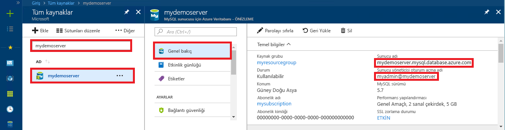

# <a name="azure-database-for-mysql-use-python-to-connect-and-query-data"></a>MySQL için Azure Veritabanı: Bağlanmak ve veri sorgulamak için Python kullanma
Bu hızlı başlangıçta [Python](https://python.org) kullanarak MySQL için Azure Veritabanı'na nasıl bağlanacağınız gösterilmiştir. Mac OS, Ubuntu Linux ve Windows platformlarındaki veritabanında yer alan verileri sorgulamak, eklemek, güncelleştirmek ve silmek için SQL deyimlerini kullanır. Bu konuda, Python kullanarak geliştirmeyle ilgili bilgi sahibi olduğunuz ve MySQL için Azure Veritabanı ile çalışmaya yeni başladığınız varsayılır.

## <a name="prerequisites"></a>Önkoşullar
Bu hızlı başlangıçta, başlangıç noktası olarak şu kılavuzlardan birinde oluşturulan kaynaklar kullanılmaktadır:
- [Azure portalını kullanarak MySQL için Azure Veritabanı sunucusu oluşturma](./quickstart-create-mysql-server-database-using-azure-portal.md)
- [Azure CLI kullanarak MySQL için Azure Veritabanı sunucusu oluşturma](./quickstart-create-mysql-server-database-using-azure-cli.md)

## <a name="install-python-and-the-mysql-connector"></a>Python’u ve MySQL bağlayıcısını yükleme
[Python](https://www.python.org/downloads/)’u ve [Python için MySQL bağlayıcısı](https://dev.mysql.com/downloads/connector/python/)’nı kendi makinenize yükleyin. Platformunuza bağlı olarak, aşağıda uygun bölümdeki adımları izleyin. 

> [!NOTE]
> Bu hızlı başlangıçta sorguları çalıştırmak üzere MySQL’e bağlamak için ham bir SQL sorgusu yaklaşımı kullanılır. Web çerçevesi kullanıyorsanız, o çerçeveler için önerilen bağlayıcıları kullanın. Örneğin, [mysqlclient](https://pypi.org/project/mysqlclient/)’ın Django ile kullanılması önerilir.
>

### <a name="windows"></a>Windows
1. Python 2.7’yi [python.org](https://www.python.org/downloads/windows/) adresinden indirin ve yükleyin. 
2. Komut istemini başlatarak Python yüklemesini denetleyin. Sürüm numarasını görmek için büyük harf V anahtarını kullanarak `C:\python27\python.exe -V` komutunu çalıştırın.
3. Python sürümünüze karşılık gelen MySQL için Python bağlayıcısını [mysql.com](https://dev.mysql.com/downloads/connector/python/) adresinden yükleyin.

### <a name="linux-ubuntu"></a>Linux (Ubuntu)
1. Linux’ta (Ubuntu), Python normalde varsayılan yükleme kapsamında yüklenir.
2. Bash kabuğunu başlatarak Python yüklemesini denetleyin. Sürüm numarasını görmek için büyük harf V anahtarını kullanarak `python -V` komutunu çalıştırın.
3. Sürüm numarasını görmek için `pip show pip -V` komutunu çalıştırarak PIP yüklemesini denetleyin. 
4. PIP, Python’un bazı sürümlerine eklenmiş olabilir. PIP yüklü değilse, `sudo apt-get install python-pip` komutunu çalıştırarak [PIP](https://pip.pypa.io/en/stable/installing/) paketini yükleyebilirsiniz.
5. `pip install -U pip` komutunu çalıştırarak PIP’yi en son sürüme güncelleştirin.
6. Şu PIP komutunu kullanarak Python için MySQL bağlayıcısını ve onun bağımlılıklarını yükleyin:

   ```bash
   sudo pip install mysql-connector-python-rf
   ```
 
### <a name="macos"></a>macOS
1. Mac OS’ta, Python normalde varsayılan işletim sistemi yüklemesi kapsamında yüklenir.
2. Bash kabuğunu başlatarak Python yüklemesini denetleyin. Sürüm numarasını görmek için büyük harf V anahtarını kullanarak `python -V` komutunu çalıştırın.
3. Sürüm numarasını görmek için `pip show pip -V` komutunu çalıştırarak PIP yüklemesini denetleyin.
4. PIP, Python’un bazı sürümlerine eklenmiş olabilir. PIP yüklü değilse, [PIP](https://pip.pypa.io/en/stable/installing/) paketini yükleyebilirsiniz.
5. `pip install -U pip` komutunu çalıştırarak PIP’yi en son sürüme güncelleştirin.
6. Şu PIP komutunu kullanarak Python için MySQL bağlayıcısını ve onun bağımlılıklarını yükleyin:

   ```bash
   pip install mysql-connector-python-rf
   ``` 

## <a name="get-connection-information"></a>Bağlantı bilgilerini alma
MySQL için Azure Veritabanı'na bağlanmak üzere gereken bağlantı bilgilerini alın. Tam sunucu adına ve oturum açma kimlik bilgilerine ihtiyacınız vardır.

1. [Azure Portal](https://portal.azure.com/)’da oturum açın.
2. Azure portalında sol taraftaki menüden **Tüm kaynaklar**'a tıklayın ve oluşturduğunuz sunucuyu (örneğin, **mydemoserver**) arayın.
3. Sunucunun adına tıklayın.
4. Sunucunun **Genel Bakış** panelinden **Sunucu adı** ile **Sunucu yöneticisi oturum açma adı**’nı not alın. Parolanızı unutursanız, bu panelden parolayı da sıfırlayabilirsiniz.
 

## <a name="run-python-code"></a>Python kodunu çalıştırma
- Kodu bir metin dosyasına yapıştırın ve dosyayı .py uzantısıyla bir proje klasörüne kaydedin (örneğin, C:\pythonmysql\createtable.py veya /home/username/pythonmysql/createtable.py).
- Kodu çalıştırmak için komut istemi veya Bash kabuğu başlatın. Dizini, proje klasörünüzle değiştirin (`cd pythonmysql`). Sonra uygulamayı çalıştırmak için python komutunu ve ardından `python createtable.py` dosya adını yazın. Windows işletim sisteminde, python.exe bulunamazsa yürütülebilir dosyanın tam yolunu sağlamanız veya yol ortam değişkenine Python yolunu eklemeniz gerekebilir. `C:\python27\python.exe createtable.py`

## <a name="connect-create-table-and-insert-data"></a>Bağlanma, tablo oluşturma ve veri ekleme
Sunucuya bağlanmak, tablo oluşturmak ve **INSERT** SQL deyimini kullanarak verileri yüklemek için aşağıdaki kodu kullanın. 

Kodda, mysql.connector kitaplığı içeri aktarılır. Yapılandırma koleksiyonundaki [bağlantı bağımsız değişkenleri](https://dev.mysql.com/doc/connector-python/en/connector-python-connectargs.html) kullanılarak MySQL için Azure Veritabanı’na bağlanmak üzere, [connect()](https://dev.mysql.com/doc/connector-python/en/connector-python-api-mysql-connector-connect.html) işlevi kullanılır. Kod bağlantıda bir imleç kullanır ve [cursor.execute()](https://dev.mysql.com/doc/connector-python/en/connector-python-api-mysqlcursor-execute.html) yöntemi MySQL veritabanında SQL sorgusunu yürütür. 

`host`, `user`, `password` ve `database` parametrelerini, sunucu ve veritabanını oluştururken belirttiğiniz değerlerle değiştirin.

```Python
import mysql.connector
from mysql.connector import errorcode

# Obtain connection string information from the portal
config = {
  'host':'mydemoserver.mysql.database.azure.com',
  'user':'myadmin@mydemoserver',
  'password':'yourpassword',
  'database':'quickstartdb'
}

# Construct connection string
try:
   conn = mysql.connector.connect(**config)
   print("Connection established")
except mysql.connector.Error as err:
  if err.errno == errorcode.ER_ACCESS_DENIED_ERROR:
    print("Something is wrong with the user name or password")
  elif err.errno == errorcode.ER_BAD_DB_ERROR:
    print("Database does not exist")
  else:
    print(err)
else:
  cursor = conn.cursor()

  # Drop previous table of same name if one exists
  cursor.execute("DROP TABLE IF EXISTS inventory;")
  print("Finished dropping table (if existed).")

  # Create table
  cursor.execute("CREATE TABLE inventory (id serial PRIMARY KEY, name VARCHAR(50), quantity INTEGER);")
  print("Finished creating table.")

  # Insert some data into table
  cursor.execute("INSERT INTO inventory (name, quantity) VALUES (%s, %s);", ("banana", 150))
  print("Inserted",cursor.rowcount,"row(s) of data.")
  cursor.execute("INSERT INTO inventory (name, quantity) VALUES (%s, %s);", ("orange", 154))
  print("Inserted",cursor.rowcount,"row(s) of data.")
  cursor.execute("INSERT INTO inventory (name, quantity) VALUES (%s, %s);", ("apple", 100))
  print("Inserted",cursor.rowcount,"row(s) of data.")

  # Cleanup
  conn.commit()
  cursor.close()
  conn.close()
  print("Done.")
```

## <a name="read-data"></a>Verileri okuma
Bağlanmak ve **SELECT** SQL deyimi kullanarak verileri okumak için aşağıdaki kodu kullanın. 

Kodda, mysql.connector kitaplığı içeri aktarılır. Yapılandırma koleksiyonundaki [bağlantı bağımsız değişkenleri](https://dev.mysql.com/doc/connector-python/en/connector-python-connectargs.html) kullanılarak MySQL için Azure Veritabanı’na bağlanmak üzere, [connect()](https://dev.mysql.com/doc/connector-python/en/connector-python-api-mysql-connector-connect.html) işlevi kullanılır. Kod bağlantıda bir imleç kullanır ve [cursor.execute()](https://dev.mysql.com/doc/connector-python/en/connector-python-api-mysqlcursor-execute.html) yöntemi MySQL veritabanında SQL deyimini yürütür. Veri satırları, [fetchall()](https://dev.mysql.com/doc/connector-python/en/connector-python-api-mysqlcursor-fetchall.html) yöntemi kullanılarak okunur. Sonuç kümesi koleksiyon satırında tutulur ve satırlarda döngü yapmak için bir yineleyici kullanılır.

`host`, `user`, `password` ve `database` parametrelerini, sunucu ve veritabanını oluştururken belirttiğiniz değerlerle değiştirin.

```Python
import mysql.connector
from mysql.connector import errorcode

# Obtain connection string information from the portal
config = {
  'host':'mydemoserver.mysql.database.azure.com',
  'user':'myadmin@mydemoserver',
  'password':'yourpassword',
  'database':'quickstartdb'
}

# Construct connection string
try:
   conn = mysql.connector.connect(**config)
   print("Connection established")
except mysql.connector.Error as err:
  if err.errno == errorcode.ER_ACCESS_DENIED_ERROR:
    print("Something is wrong with the user name or password")
  elif err.errno == errorcode.ER_BAD_DB_ERROR:
    print("Database does not exist")
  else:
    print(err)
else:
  cursor = conn.cursor()

  # Read data
  cursor.execute("SELECT * FROM inventory;")
  rows = cursor.fetchall()
  print("Read",cursor.rowcount,"row(s) of data.")

  # Print all rows
  for row in rows:
    print("Data row = (%s, %s, %s)" %(str(row[0]), str(row[1]), str(row[2])))

  # Cleanup
  conn.commit()
  cursor.close()
  conn.close()
  print("Done.")
```

## <a name="update-data"></a>Verileri güncelleştirme
Bağlanmak ve bir **UPDATE** SQL deyimi kullanarak verileri güncelleştirmek için aşağıdaki kodu kullanın. 

Kodda, mysql.connector kitaplığı içeri aktarılır.  Yapılandırma koleksiyonundaki [bağlantı bağımsız değişkenleri](https://dev.mysql.com/doc/connector-python/en/connector-python-connectargs.html) kullanılarak MySQL için Azure Veritabanı’na bağlanmak üzere, [connect()](https://dev.mysql.com/doc/connector-python/en/connector-python-api-mysql-connector-connect.html) işlevi kullanılır. Kod bağlantıda bir imleç kullanır ve [cursor.execute()](https://dev.mysql.com/doc/connector-python/en/connector-python-api-mysqlcursor-execute.html) yöntemi MySQL veritabanında SQL deyimini yürütür. 

`host`, `user`, `password` ve `database` parametrelerini, sunucu ve veritabanını oluştururken belirttiğiniz değerlerle değiştirin.

```Python
import mysql.connector
from mysql.connector import errorcode

# Obtain connection string information from the portal
config = {
  'host':'mydemoserver.mysql.database.azure.com',
  'user':'myadmin@mydemoserver',
  'password':'yourpassword',
  'database':'quickstartdb'
}

# Construct connection string
try:
   conn = mysql.connector.connect(**config)
   print("Connection established")
except mysql.connector.Error as err:
  if err.errno == errorcode.ER_ACCESS_DENIED_ERROR:
    print("Something is wrong with the user name or password")
  elif err.errno == errorcode.ER_BAD_DB_ERROR:
    print("Database does not exist")
  else:
    print(err)
else:
  cursor = conn.cursor()

  # Update a data row in the table
  cursor.execute("UPDATE inventory SET quantity = %s WHERE name = %s;", (200, "banana"))
  print("Updated",cursor.rowcount,"row(s) of data.")

  # Cleanup
  conn.commit()
  cursor.close()
  conn.close()
  print("Done.")
```

## <a name="delete-data"></a>Verileri silme
Bağlanmak ve **DELETE** SQL deyimini kullanarak verileri kaldırmak için aşağıdaki kodu kullanın. 

Kodda, mysql.connector kitaplığı içeri aktarılır.  Yapılandırma koleksiyonundaki [bağlantı bağımsız değişkenleri](https://dev.mysql.com/doc/connector-python/en/connector-python-connectargs.html) kullanılarak MySQL için Azure Veritabanı’na bağlanmak üzere, [connect()](https://dev.mysql.com/doc/connector-python/en/connector-python-api-mysql-connector-connect.html) işlevi kullanılır. Kod bağlantıda bir imleç kullanır ve [cursor.execute()](https://dev.mysql.com/doc/connector-python/en/connector-python-api-mysqlcursor-execute.html) yöntemi MySQL veritabanında SQL sorgusunu yürütür. 

`host`, `user`, `password` ve `database` parametrelerini, sunucu ve veritabanını oluştururken belirttiğiniz değerlerle değiştirin.

```Python
import mysql.connector
from mysql.connector import errorcode

# Obtain connection string information from the portal
config = {
  'host':'mydemoserver.mysql.database.azure.com',
  'user':'myadmin@mydemoserver',
  'password':'yourpassword',
  'database':'quickstartdb'
}

# Construct connection string
try:
   conn = mysql.connector.connect(**config)
   print("Connection established.")
except mysql.connector.Error as err:
  if err.errno == errorcode.ER_ACCESS_DENIED_ERROR:
    print("Something is wrong with the user name or password.")
  elif err.errno == errorcode.ER_BAD_DB_ERROR:
    print("Database does not exist.")
  else:
    print(err)
else:
  cursor = conn.cursor()

  # Delete a data row in the table
  cursor.execute("DELETE FROM inventory WHERE name=%(param1)s;", {'param1':"orange"})
  print("Deleted",cursor.rowcount,"row(s) of data.")

  # Cleanup
  conn.commit()
  cursor.close()
  conn.close()
  print("Done.")
```

## <a name="next-steps"></a>Sonraki adımlar
> [!div class="nextstepaction"]
> [Dışarı Aktarma ve İçeri Aktarma seçeneğini kullanarak veritabanınızı geçirme](./concepts-migrate-import-export.md)
