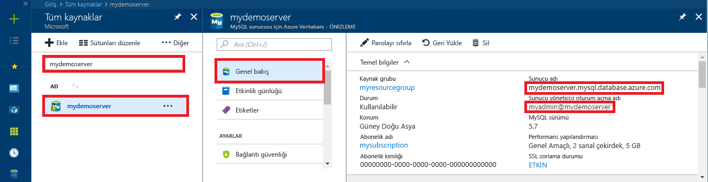

# <a name="azure-database-for-mysql-use-mysql-workbench-to-connect-and-query-data"></a>MySQL için Azure Veritabanı: Bağlanmak ve veri sorgulamak için MySQL Workbench kullanma
Bu hızlı başlangıçta MySQL Workbench uygulamasını kullanarak MySQL için Azure Veritabanı'na nasıl bağlanacağınız gösterilmiştir. 

## <a name="prerequisites"></a>Önkoşullar
Bu hızlı başlangıçta, başlangıç noktası olarak şu kılavuzlardan birinde oluşturulan kaynaklar kullanılmaktadır:
- [Azure portalını kullanarak MySQL için Azure Veritabanı sunucusu oluşturma](./quickstart-create-mysql-server-database-using-azure-portal.md)
- [Azure CLI kullanarak MySQL için Azure Veritabanı sunucusu oluşturma](./quickstart-create-mysql-server-database-using-azure-cli.md)

## <a name="install-mysql-workbench"></a>MySQL Workbench’i yükleme
[MySQL web sitesinden](https://dev.mysql.com/downloads/workbench/) MySQL Workbench’i indirip bilgisayarınıza yükleyin.

## <a name="get-connection-information"></a>Bağlantı bilgilerini alma
MySQL için Azure Veritabanı'na bağlanmak üzere gereken bağlantı bilgilerini alın. Tam sunucu adına ve oturum açma kimlik bilgilerine ihtiyacınız vardır.

1. [Azure Portal](https://portal.azure.com/)’da oturum açın.

2. Azure portalında sol taraftaki menüden **Tüm kaynaklar**'a tıklayın ve oluşturduğunuz sunucuyu (örneğin, **mydemoserver**) arayın.

3. Sunucunun adına tıklayın.

4. Sunucunun **Genel Bakış** panelinden **Sunucu adı** ile **Sunucu yöneticisi oturum açma adı**’nı not alın. Parolanızı unutursanız, bu panelden parolayı da sıfırlayabilirsiniz.
 

## <a name="connect-to-the-server-by-using-mysql-workbench"></a>MySQL Workbench kullanarak sunucuya bağlanma 
MySQL Workbench GUI aracını kullanarak Azure MySQL Sunucusuna bağlanmak için:

1.  Bilgisayarınızda MySQL Workbench uygulamasını başlatın. 

2.  **Yeni Bağlantı Oluştur** iletişim kutusundaki **Parametreler** sekmesine aşağıdaki bilgileri girin:

    

    | **Ayar** | **Önerilen değer** | **Alan açıklaması** |
    |---|---|---|
    |   Bağlantı Adı | Tanıtım Bağlantısı | Bu bağlantı için bir etiket belirtin. |
    | Bağlantı Yöntemi | Standart (TCP/IP) | Standart (TCP/IP) yeterlidir. |
    | Ana Bilgisayar Adı | *sunucu adı* | MySQL için Azure Veritabanını oluştururken kullandığınız sunucu adı değerini belirtin. Gösterilen örnek sunucumuz: mydemoserver.mysql.database.azure.com. Örnekte gösterildiği gibi tam etki alanı adını (\*.mysql.database.azure.com) kullanın. Sunucu adınızı anımsamıyorsanız bağlantı bilgilerini almak için bir önceki bölümdeki adımları izleyin.  |
    | Bağlantı noktası | 3306 | MySQL Azure veritabanına bağlanırken her zaman bağlantı noktası olarak 3306 kullanın. |
    | Kullanıcı adı |  *sunucu yöneticisi oturum açma adı* | MySQL için Azure Veritabanını oluştururken girdiğiniz sunucu yöneticisi oturum açma kullanıcı adını yazın. Bizim örnek kullanıcı adımız myadmin@mydemoserver. Kullanıcı adını anımsamıyorsanız bağlantı bilgilerini almak için bir önceki bölümdeki adımları izleyin. Biçim *kullanıcıadı\@servername*.
    | Parola | parolanız | Parolayı kaydetmek için **Kasada Depola...** düğmesine tıklayın. |

3.   Tüm parametrelerin doğru yapılandırılıp yapılandırılmadığını test etmek için **Bağlantıyı Sına**’ya tıklayın. 

4.   Bağlantıyı kaydetmek için **Tamam**’a tıklayın. 

5.   **MySQL Bağlantıları** listesinde sunucunuza karşılık gelen kutucuğa tıklayıp bağlantının kurulmasını bekleyin.

        Sorgularınızı yazabileceğiniz boş bir düzenleyici içeren yeni bir SQL sekmesi açılır.
    
        > [!NOTE]
        > Varsayılan olarak SSL bağlantısının güvenli olması gerekir ve MySQL için Azure Veritabanı sunucunuzda zorunlu tutulur. Normalde MySQL Workbench'in sunucunuza bağlanması için SSL sertifikalı ek yapılandırma gerekmez ancak SSL CA sertifikasını MySQL Workbench sunucunuza bağlamanızı öneririz. Sertifikayı indirme ve bağlama hakkında daha ayrıntılı bilgi için bkz. [MySQL için Azure Veritabanı'na güvenli bir şekilde bağlanmak üzere uygulamanızda SSL bağlantısını yapılandırma](./howto-configure-ssl.md).  SSL’yi devre dışı bırakmanız gerekiyorsa, Azure portalına gidin ve Bağlantı güvenliği sayfasına tıklayarak SSL bağlantısını zorunlu kıl iki durumlu düğmesini devre dışı bırakın.

## <a name="create-a-table-insert-data-read-data-update-data-delete-data"></a>Tablo oluşturma, veri ekleme, verileri okuma, verileri güncelleştirme, verileri silme
1. Bazı örnek verileri görmek için örnek SQL kodunu kopyalayıp boş bir SQL sekmesine tıklayın.

    Bu kod quickstartdb adlı boş bir veritabanı oluşturur ve sonra stok adlı bir örnek tablo oluşturur. Birkaç satır ekler ve sonra bu satırları okur. Verileri bir güncelleştirme deyimiyle değiştirir ve satırları yeniden okur. Son olarak bir satırı siler ve satırları yeniden okur.
    
    ```sql
    -- Create a database
    -- DROP DATABASE IF EXISTS quickstartdb;
    CREATE DATABASE quickstartdb;
    USE quickstartdb;
    
    -- Create a table and insert rows
    DROP TABLE IF EXISTS inventory;
    CREATE TABLE inventory (id serial PRIMARY KEY, name VARCHAR(50), quantity INTEGER);
    INSERT INTO inventory (name, quantity) VALUES ('banana', 150);
    INSERT INTO inventory (name, quantity) VALUES ('orange', 154);
    INSERT INTO inventory (name, quantity) VALUES ('apple', 100);
    
    -- Read
    SELECT * FROM inventory;
    
    -- Update
    UPDATE inventory SET quantity = 200 WHERE id = 1;
    SELECT * FROM inventory;
    
    -- Delete
    DELETE FROM inventory WHERE id = 2;
    SELECT * FROM inventory;
    ```

    Ekran görüntüsünde, SQL Workbench’te örnek bir SQL kodu ve kod çalıştırıldıktan sonra oluşan çıktı gösterilmektedir.
    
    

2. Örnek SQL Kodunu çalıştırmak için **SQL Dosyası** sekmesindeki araç çubuğunda bulunan şimşek simgesine tıklayın.
3. Sayfanın ortasındaki **Sonuç Izgarası** bölümünde üç sekme halinde sonuçların yer aldığına dikkat edin. 
4. Sayfanın en altındaki **Çıktı** listesine dikkat edin. Her komutun durumu gösterilir. 

MySQL Workbench kullanarak MySQL için Azure Veritabanı’na bağlandınız ve SQL dilini kullanarak verileri sorguladınız.

## <a name="next-steps"></a>Sonraki adımlar
> [!div class="nextstepaction"]
> [Dışarı Aktarma ve İçeri Aktarma seçeneğini kullanarak veritabanınızı geçirme](./concepts-migrate-import-export.md)
