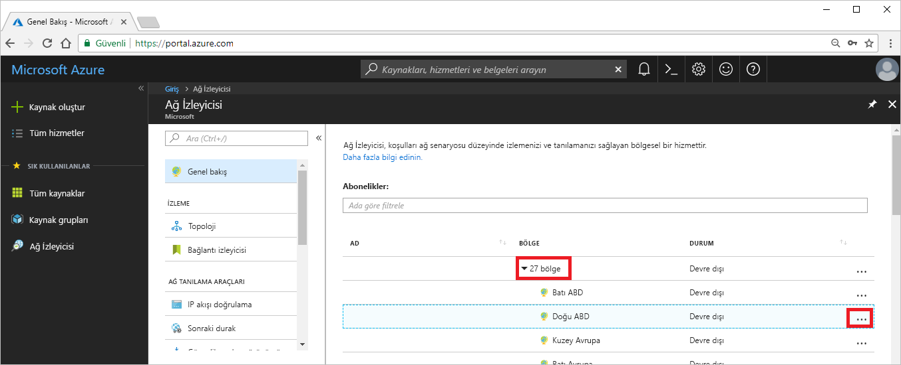
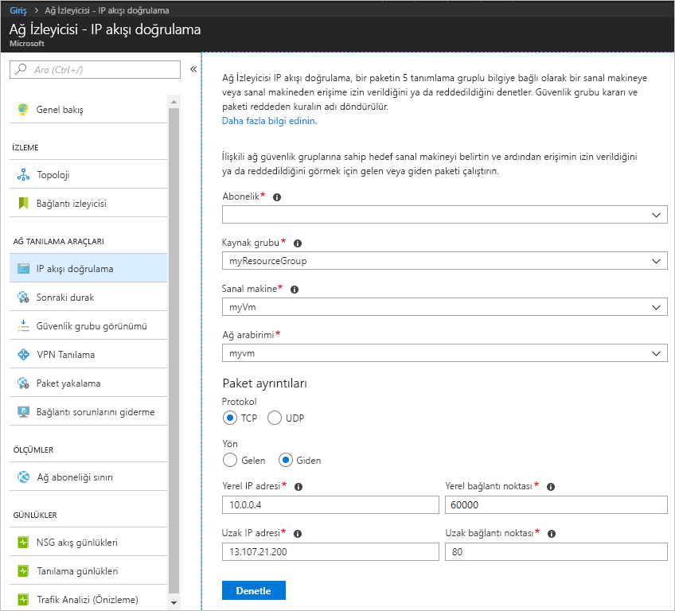
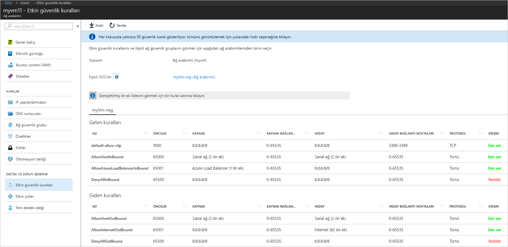
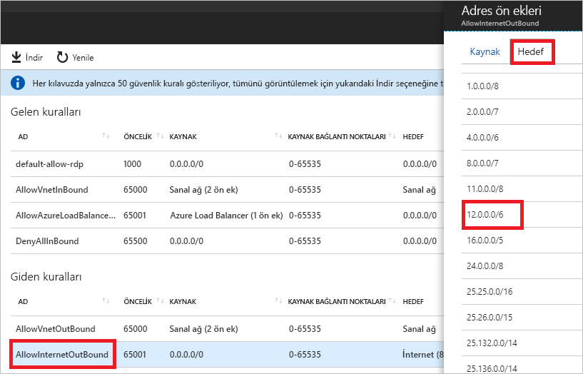

# Hızlı Başlangıç: Azure portalını kullanarak bir sanal makine ağ trafik filtresi sorununu tanılama

Bu hızlı başlangıçta bir sanal makine (VM) dağıtır ve sonra bir IP adresi ve URL ile iletişimleri ve bir IP adresinden gelen iletişimleri denetlersiniz. Bir iletişim hatasının nedenini ve bu hatayı nasıl çözeceğinizi belirlersiniz.

Azure aboneliğiniz yoksa başlamadan önce [ücretsiz bir hesap](https://azure.microsoft.com/free/?WT.mc_id=A261C142F) oluşturun.

## Azure'da oturum açma

[https://portal.azure.com](https://portal.azure.com) adresinden Azure portalında oturum açın.

## VM oluşturma

1. Azure portalının sol üst köşesinde bulunan **+ Kaynak oluştur** seçeneğini belirleyin.
2. Seçin **işlem**ve ardından **Windows Server 2016 Datacenter** veya sürümünün **Ubuntu Server**.
3. Aşağıdaki bilgileri girin veya seçin, kalan ayarlar için varsayılan değerleri kabul edin ve sonra **Tamam**’ı seçin:

    |Ayar|Değer|
    |---|---|
    |Ad|myVm|
    |Kullanıcı adı| Seçtiğiniz bir kullanıcı adını girin.|
    |Parola| Seçtiğiniz bir parolayı girin. Parola en az 12 karakter uzunluğunda olmalı ve [tanımlanmış karmaşıklık gereksinimlerini](../virtual-machines/windows/faq.md?toc=%2fazure%2fnetwork-watcher%2ftoc.json#what-are-the-password-requirements-when-creating-a-vm) karşılamalıdır.|
    |Abonelik| Aboneliğinizi seçin.|
    |Kaynak grubu| **Yeni oluştur**’u seçin ve **myResourceGroup** değerini girin.|
    |Konum| **Doğu ABD**’yi seçin|

4. Sanal makine için bir boyut seçin ve **Seç** seçeneğini belirleyin.
5. **Ayarlar** bölümünde tüm varsayılanları kabul edin ve **Tamam**’ı seçin.
6. **Özet**’in **Oluştur** bölümünde **Oluştur**’u seçerek sanal makine dağıtımını başlatın. Sanal makinenin dağıtılması birkaç dakika sürer. Kalan adımlara devam etmeden önce sanal makinenin dağıtımı tamamlamasını bekleyin.

## Ağ iletişimini test etme

Ağ İzleyicisi ile ağ iletişimini test etmek için önce en az bir Azure bölgesinde bir ağ izleyicisini etkinleştirin ve Ağ İzleyicisinin IP akışı doğrulama özelliğini kullanın.

### Ağ izleyicisini etkinleştirme

En az bir bölgede etkinleştirilmiş bir ağ izleyiciniz zaten varsa [IP akış doğrulamayı kullanma](#use-ip-flow-verify) bölümüne geçin.

1. Portalda **Tüm hizmetler**’i seçin. **Filtre kutusu**’na *Ağ İzleyicisi* yazın. **Ağ İzleyicisi**, sonuçlarda görüntülendiğinde onu seçin.
2. VM’nin önceki adımda dağıtıldığı bölge Doğu ABD bölgesi olduğu için bu bölgede bir ağ izleyicisi etkinleştirin. **Bölgeler**’i seçip genişletin ve sonra aşağıdaki resimde gösterildiği gibi **Doğu ABD**’nin sağındaki **...** öğesini seçin:

    

3. **Ağ İzleyicisini etkinleştirme**’yi seçin.

### IP akışı doğrulamayı kullanma

Bir sanal makine oluşturduğunuzda Azure varsayılan olarak sanal makineye/sanal makineden ağ trafiğine izin verir veya ağ trafiğini reddeder. Daha sonra Azure’ın varsayılanlarını geçersiz kılarak ek trafik türlerine izin verebilir veya ek trafik türlerini reddedebilirsiniz.

1. Portalda **Tüm hizmetler**’i seçin. **Tüm hizmetler** *Filtre* kutusuna *Ağ İzleyicisi* yazın. **Ağ İzleyicisi**, sonuçlarda görüntülendiğinde onu seçin.
2. **AĞ TANILAMA ARAÇLARI** altında **IP akışı doğrulama**’yı seçin.
3. Aboneliğinizi seçin, aşağıdaki değerleri girin veya seçin ve sonra aşağıdaki resimde gösterildiği gibi **Denetle**’yi seçin:

    |Ayar            |Değer                                                                                              |
    |---------          |---------                                                                                          |
    | Kaynak grubu    | myResourceGroup öğesini seçin                                                                            |
    | Sanal makine   | MyVm öğesini seçin                                                                                       |
    | Ağ arabirimi | myvm - VM’yi oluşturduğunuzda portalın oluşturduğu ağ arabiriminin adı farklıdır. |
    | Protokol          | TCP                                                                                               |
    | Direction         | Giden                                                                                          |
    | Yerel IP adresi  | 10.0.0.4                                                                                          |
    | Yerel bağlantı noktası      | 60000                                                                                                |
    | Uzak IP adresi | 13.107.21.200 - için adreslerinden biri < www.bing.com>.                                             |
    | Uzak bağlantı noktası       | 80                                                                                                |

    

    Birkaç saniye sonra döndürülen sonuç, **AllowInternetOutbound** adlı bir güvenlik kuralı tarafından erişime izin verildiğini size bildirir. Denetimi çalıştırmadan önce Doğu ABD bölgesinden başka bir bölgede mevcut bir ağ izleyiciniz varsa, denetimi çalıştırdığınızda Ağ İzleyicisi Doğu ABD bölgesinde otomatik olarak bir ağ izleyicisi oluşturmuştur.
4. **Uzak IP adresi**’ni **172.31.0.100** olarak değiştirip 3. adımı tekrar tamamlayın. Döndürülen sonuç, **DefaultOutboundDenyAll** adlı bir güvenlik kuralı tarafından erişimin reddedildiğini size bildirir.
5. **Yön**’ü **Gelen**, **Yerel bağlantı noktasını** **80** ve **Uzak bağlantı noktasını** **60000** olarak değiştirip 3. adımı tekrar tamamlayın. Döndürülen sonuç, **DefaultInboundDenyAll** adlı bir güvenlik kuralı tarafından erişimin reddedildiğini size bildirir.

Hangi güvenlik kurallarının bir sanal makineye/sanal makineden trafiğe izin verdiğini veya trafiği reddettiğini öğrendiğinize göre sorunların nasıl çözümleneceğini belirleyebilirsiniz.

## Bir güvenlik kuralının ayrıntılarını görüntüleme

1. [IP akışı doğrulamayı kullanma](#use-ip-flow-verify) bölümündeki 3-5. adımlarda yer alan kuralların iletişime neden izin verdiğini ya da reddettiğini belirlemek için, VM’deki ağ arabirimine yönelik etkili güvenlik kurallarını gözden geçirin. Portalın üst kısmındaki arama kutusuna *myvm* yazın. **myvm** (veya ağ arabiriminizin adı her neyse) ağ arabirimi arama sonuçlarında göründüğünde seçin.
2. Aşağıdaki resimde gösterildiği gibi **DESTEK VE SORUN GİDERME** altında **Etkili güvenlik kuralları**’nı seçin:

    

    [IP akışı doğrulamayı kullan](#use-ip-flow-verify) bölümündeki 3. adımda, **AllowInternetOutbound** kuralı nedeniyle iletişime izin verildiğini öğrendiniz. Yukarıdaki resimde kural için **HEDEF** değerinin **İnternet** olduğunu görebilirsiniz. [IP akışı doğrulamayı kullanma](#use-ip-flow-verify) bölümündeki 3. adımda test ettiğiniz 13.107.21.200 adresinin **İnternet** ile nasıl ilişkilendirildiği açık değildir.
3. Aşağıdaki resimde gösterildiği gibi **AllowInternetOutBound** kuralını ve sonra **Hedef**’i seçin:

    

    Listedeki öneklerden biri **12.0.0.0/6** olup bu, IP adreslerinin 12.0.0.1-15.255.255.254 aralığını kapsar. 13.107.21.200 bu adres aralığı içinde yer aldığından **AllowInternetOutBound** kuralı, giden trafiğe izin verir. Ayrıca, 2. adımdaki resimde bu kuralı geçersiz kılan daha yüksek öncelikli (daha küçük numaralı) bir kural da gösterilmemektedir. **Adres ön ekleri** kutusunu kapatın. 13.107.21.200 adresine giden iletişimi reddetmek için, IP adresine giden 80 numaralı bağlantı noktasını reddeden, daha yüksek önceliğe sahip bir güvenlik kuralı ekleyebilirsiniz.
4. [IP akışı doğrulama](#use-ip-flow-verify) bölümündeki 4. adımda 172.131.0.100 için giden denetimi çalıştırdığınızda iletişimi **DefaultOutboundDenyAll** kuralının reddettiğini öğrendiniz. Bu kural, 2. adımdaki resimde gösterilen ve **HEDEF** olarak **0.0.0.0/0** adresini gösteren **DenyAllOutBound** kuralına eşittir. Adres, resimde gösterilen diğer **Giden kurallardan** herhangi birinin **HEDEF** aralığında olmadığından, bu kural 172.131.0.100 ile iletişimi reddeder. Giden iletişime izin vermek için, 80 numaralı bağlantı noktasına giden trafiğe izin veren, 172.131.0.100 adresine yönelik daha yüksek öncelikli bir güvenlik kuralı ekleyebilirsiniz.
5. [IP akışı doğrulama](#use-ip-flow-verify) bölümündeki 5. adımda 172.131.0.100 adresinden gelen denetimi çalıştırdığınızda iletişimi **DefaultInboundDenyAll** kuralının reddettiğini öğrendiniz. Bu kural, 2. adımdaki resimde gösterilen **DenyAllInBound** kuralına eşittir. **DenyAllInBound** kuralı, 172.31.0.100 adresinden 80 numaralı bağlantı noktasının VM’ye gitmesine izin veren başka bir yüksek öncelikli kural bulunmadığı için uygulanır. Gelen iletişime izin vermek için, 172.31.0.100 adresinden gelen 80 numaralı bağlantı noktasına izin veren daha yüksek öncelikli bir güvenlik kuralı ekleyebilirsiniz.

Bu hızlı başlangıçtaki denetimlerinde Azure yapılandırması test edilmiştir. Denetimler beklenen sonuçları döndürdüğü halde ağ sorunları yaşamaya devam ediyorsanız, sanal makineniz ve iletişim kurduğunuz uç nokta arasında bir güvenlik duvarı olmadığından ve sanal makinenizdeki işletim sisteminin, iletişime izin veren veya iletişimi reddeden bir güvenlik duvarının olmadığından emin olun.

## Kaynakları temizleme

Artık gerekli olmadığında kaynak grubunu ve içerdiği tüm kaynakları silin:

1. Portalın üst kısmındaki **Ara** kutusuna *myResourceGroup* değerini girin. Arama sonuçlarında **myResourceGroup** seçeneğini gördüğünüzde bunu seçin.
2. **Kaynak grubunu sil**'i seçin.
3. **KAYNAK GRUBU ADINI YAZIN:** için *myResourceGroup* girin ve **Sil**’i seçin.

## Sonraki adımlar

Bu hızlı başlangıçta bir sanal makine oluşturdunuz ve gelen ve giden ağ trafiği filtrelerini tanıladınız. Ağ güvenlik grubu kurallarının bir sanal makineye gelen ve sanal makineden giden trafiğe izin verdiğini veya bu trafikleri reddettiğini öğrendiniz. [Güvenlik kuralları](../virtual-network/security-overview.md?toc=%2fazure%2fnetwork-watcher%2ftoc.json) ve [güvenlik kuralları oluşturma](../virtual-network/manage-network-security-group.md?toc=%2fazure%2fnetwork-watcher%2ftoc.json#create-a-security-rule) hakkında daha fazla bilgi edinin.

Uygun ağ trafiği filtreleri mevcut olduğunda bile, yönlendirme yapılandırması nedeniyle bir sanal makineyle iletişim başarısız olabilir. Tek bir araçla sanal makine ağ yönlendirme sorunlarını tanılama hakkında bilgi edinmek için [Sanal makine yönlendirme sorunlarını tanılama](diagnose-vm-network-routing-problem.md) bölümüne veya giden yönlendirme, gecikme ve trafik filtreleme sorunlarını tanılama hakkında bilgi edinmek için [Bağlantı sorunlarını giderme](network-watcher-connectivity-portal.md) bölümüne bakın.
