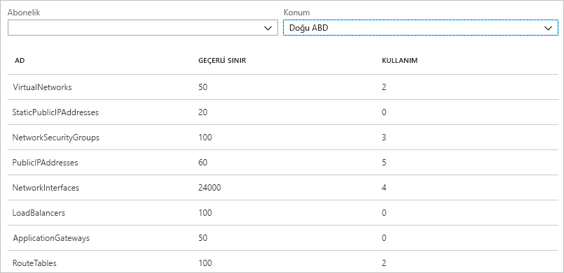

# Azure Ağ İzleyicisi nedir?

Azure Ağ İzleyicisi, Azure sanal ağındaki kaynaklarda izleme, tanılama, ölçümleri görüntüleme ve günlükleri etkinleştirme veya devre dışı bırakma işlemleri için araçlar sağlar.

## İzleme

### Sanal makine ile uç nokta arasındaki iletişimi izleme

Uç noktalar başka bir sanal makine (VM), tam etki alanı adı (FQDN), tekdüzen kaynak tanımlayıcısı (URI) veya IPv4 adresi olabilir. *Bağlantı izleyicisi* özelliği, iletişimi düzenli aralıklarla izler ve size sanal makineyle uç nokta arasındaki ulaşılabilirlik, gecikme ve ağ topolojisi değişikliklerini bildirir. Örneğin, veritabanı sunucusu sanal makinesiyle iletişim kuran bir web sunucusu sanal makineniz olabilir. Kuruluşunuzda sizin tanımadığınız biri web sunucusu ya da veritabanı sunucusu sanal makinesine veya alt ağına özel bir yol veya ağ güvenliği kuralı uygulamıştır.

Uç nokta ulaşılamaz duruma gelirse, bağlantı sorun giderme işlemi size bunun nedenini bildirir. Olası nedenler DNS ağ çözümleme sorunu, sanal makine işletim sisteminin içindeki CPU, bellek veya güvenlik duvarı ya da giden bağlantının sanal makinesi veya alt ağı için özel yolun veya güvenlik kuralının atlama türüdür. Azure'daki [güvenlik kuralları](../virtual-network/security-overview.md?toc=%2fazure%2fnetwork-watcher%2ftoc.json#security-rules) ve [yol atlama türleri](../virtual-network/virtual-networks-udr-overview.md?toc=%2fazure%2fnetwork-watcher%2ftoc.json) hakkında daha fazla bilgi edinin.

Bağlantı izleyicisi zaman içinde gözlemlenen en düşük, ortalama ve en yüksek gecikme sürelerini de sağlar. Bağlantının gecikme süresini öğrendikten sonra, Azure kaynaklarınızı farklı Azure bölgelerine taşıyarak gecikme süresini kısaltabileceğinizi anlayabilirsiniz. [Azure bölgeleriyle İnternet servis sağlayıcıları arasındaki göreli gecikme sürelerini](#determine-relative-latencies-between-azure-regions-and-internet-service-providers) saptama ve [bağlantı izleyicisi](connection-monitor.md) ile sanal makine ve uç nokta arasındaki iletişimi izleme hakkında daha fazla bilgi edinin. Bağlantı izleyicisiyle yaptığınız gibi zamana yayılmış olarak bağlantıyı izlemek yerine zamanın belirli bir anındaki bağlantıyı test etmeyi tercih ediyorsanız, [bağlantı sorun giderme](#connection-troubleshoot) özelliğini kullanın.

Ağ performansı izleme, ağınızın altyapısındaki çeşitli noktalar arasındaki ağ performansını izlemenize yardımcı olan bulut tabanlı bir karma ağ izleme çözümüdür. Ayrıca hizmet ve uygulama uç noktalarına yapılan ağ bağlantısını izlemenize ve Azure ExpressRoute’un performansını izlemenize yardımcı olur. Ağ Performans İzleyicisi, trafiği tutma ve yönlendirme sorunlarının yanı sıra geleneksel ağ izleme yöntemlerinin algılayamadığı sorunları algılar. Bir ağ bağlantısı için bir eşik ihlal edildiğinde, çözüm uyarılar oluşturur ve size bildirir. Ayrıca ağ performans sorunlarının zamanında tespit edilmesini sağlar ve sorunun kaynağını belirli bir ağ kesimine veya cihazına yerelleştirir. [Ağ performansı izleyicisi](../azure-monitor/insights/network-performance-monitor.md?toc=%2fazure%2fnetwork-watcher%2ftoc.json) hakkında daha fazla bilgi edinin.

### Sanal ağdaki kaynakları ve bunların ilişkilerini görüntüleme

Sana ağa kaynaklar eklendikçe, bir sanal ağda hangi kaynakların bulunduğunu ve bunların birbirleriyle ilişkisini anlamak zorlaşabilir. *Topoloji* özelliği, sanal ağdaki kaynakların ve kaynaklar arasındaki ilişkilerin görsel bir diyagramını oluşturmanıza olanak tanır. Aşağıdaki resimde üç alt ağı, iki sanal makinesi, ağ arabirimleri, genel IP adresleri, ağ güvenlik grupları, yol tabloları ve kaynaklar arasında ilişkileri olan bir sanal ağın örnek topoloji diyagramı gösterilir:

Resmin svg biçiminde düzenlenebilir bir sürümünü indirebilirsiniz. [Topoloji görünümü](view-network-topology.md) hakkında daha fazla bilgi edinin.

## Tanılama

### Sanal makinede gelen veya giden ağ trafiği filtreleme sorunlarını tanılama

Bir sanal makine dağıttığınızda, Azure sanal makineye gelen veya giden trafiğe izin veren veya bu trafiği reddeden çeşitli varsayılan güvenlik kuralları uygular. Azure'un varsayılan kurallarını geçersiz kılabilir veya ek kurallar oluşturabilirsiniz. Belirli bir noktada, güvenlik kuralı nedeniyle sanal makine diğer kaynaklarla iletişim kuramaz duruma gelebilir. *IP akışı doğrulama* özelliği, kaynak ve hedef IPv4 adresini, bağlantı noktasını, protokolünü (TCP veya UDP) ve trafik yönünü (gelen veya giden) belirtmenize olanak tanır. Ardından IP akışı doğrulama özelliği iletişimi test eder ve bağlantının başarılı olup olmadığını size bildirir. Bağlantı başarısız olursa, IP akışı doğrulama hangi güvenlik kuralının iletişime izin verdiğini veya iletişimi reddettiğini size bildirir ve siz de sorunu çözebilirsiniz. [Bir sanal makine ağ trafiği filtresi sorununu tanılama](diagnose-vm-network-traffic-filtering-problem.md) öğreticisini tamamlayarak IP akışı doğrulaması hakkında daha fazla bilgi edinin.

### Sanal makineden gelen ağ yönlendirme sorunlarını tanılama

Sanal makine oluşturduğunuzda, Azure varsayılan olarak ağ trafiği için çeşitli giden yollar oluşturur. Sanal makineler gibi sanal ağ üzerine dağıtılmış tüm kaynaklardan giden trafik, Azure'un varsayılan yolları temelinde yönlendirilir. Azure'un varsayılan yollarını geçersiz kılabilir veya ek yollar oluşturabilirsiniz. Sanal makinenin belirli bir yol nedeniyle diğer kaynaklarla artık iletişim kuramadığını fark edebilirsiniz. *Sonraki atlama* özelliği kaynak ve hedef IPv4 adresi belirtmenize olanak tanır. Ardından sonraki atlama özelliği iletişimi test eder ve trafiği yönlendirmek için kullanılan sonraki atlama türü hakkında sizi bilgilendirir. Siz de yönlendirme sorununu çözmek için yolu kaldırabilir, değiştirebilir veya yol ekleyebilirsiniz. [Sonraki atlama](diagnose-vm-network-routing-problem.md) özelliği hakkında daha fazla bilgi edinin.

### Sanal makineden giden bağlantı sorunlarını tanılama

*Bağlantı sorunlarını giderme* özelliği, sanal makine ile başka bir sanal makine, bir FQDN, URI veya IPv4 adresi arasındaki bağlantıyı test etmenize olanak tanır. Test, [bağlantı izleyicisi](#connection-monitor) özelliği kullanılırken döndürülenlere benzer bilgiler döndürür ama bağlantı izleyicisinin yaptığı gibi zamana yayılmış bir izleme yerine zamanın belirli bir noktasında bağlantıyı test eder. [Bağlantı sorunlarını giderme](network-watcher-connectivity-overview.md) özelliğini kullanarak bağlantılarda sorun giderme hakkında daha fazla bilgi edinin.

### Sanal makineden gelen ve giden paketleri yakalama

Zaman ve boyut sınırlamaları ayarlama gibi gelişmiş filtreleme seçenekleriyle ince ayarlı denetimler çok yönlülük getirir. Yakalanan Azure Depolama'da, sana makine diskinde veya her ikisinde birden depolanabilir. Ardından çeşitli standart ağ yakalama analizi araçlarını kullanarak yakalama dosyasını analiz edebilirsiniz. [Paket yakalama](network-watcher-packet-capture-overview.md) hakkında daha fazla bilgi edinin.

### Azure Sanal ağ geçidi ve bağlantılarındaki sorunları giderme

Sanal ağ geçitleri şirket içi kaynaklarla Azure sanal ağları arasında bağlantı sağlar. Ağ geçitlerinin ve bağlantılarının izlenmesi, iletişimin kesilmemesini güvence altına alma açısından kritik önem taşır. *VPN tanılama* özelliği ağ geçitlerinde ve bağlantılarda tanılama olanağı sağlar. VPN tanılama özelliği ağ geçidinin veya ağ geçidi bağlantısının durumunu tanılar ve ağ geçidi ile ağ geçidi bağlantılarının kullanılabilir olup olmadığını size bildirir. Ağ geçidi veya bağlantı kullanılamıyorsa, VPN tanılama özelliği bunun nedenini belirtir ve siz de sorunu çözebilirsiniz. [Ağlar arasındaki bir iletişim sorununu tanılama](diagnose-communication-problem-between-networks.md) öğreticisini tamamlayarak VPN tanılama hakkında daha fazla bilgi edinin.

### Azure bölgeleriyle İnternet servis sağlayıcıları arasındaki göreli gecikme sürelerini saptama

Azure bölgeleriyle İnternet servis sağlayıcıları arasındaki gecikme bilgileri için Ağ İzleyicisi'ni sorgulayabilirsiniz. Azure bölgeleriyle İnternet servis sağlayıcıları arasındaki gecikme sürelerini bildiğinizde, Azure kaynaklarını ağ yanıt sürelerini iyileştirecek şekilde dağıtabilirsiniz. [Göreli gecikme süreleri](view-relative-latencies.md) hakkında daha fazla bilgi edinin.

### Ağ arabirimi için güvenlik kurallarını görüntüleme

Ağ arabirimi için etkili olan güvenlik kuralları, ağ arabirimine ve ağ arabiriminin içinde yer aldığı alt ağa uygulanan tüm güvenlik kurallarının bileşimidir.  *Güvenlik grubu görünümü* özelliği ağ arabirimine, ağ arabiriminin içinde yer aldığı alt ağa uygulanan tüm güvenlik kurallarını ve bunların toplamını gösterir. Ağ arabirimine hangi kuralların uygulandığını anladığınızda, izin verilen veya reddedilen trafikte yapmak istediğiniz değişikliğe göre kuralları ekleyebilir, kaldırabilir veya değiştirebilirsiniz. [Güvenlik grubu görünümü](network-watcher-security-group-view-overview.md) hakkında daha fazla bilgi edinin.

## Ölçümler

Bir Azure aboneliği ve bölgesi içinde oluşturabileceğiniz ağ kaynaklarının sayısına ilişkin [sınırlar](../azure-subscription-service-limits.md?toc=%2fazure%2fnetwork-watcher%2ftoc.json#azure-resource-manager-virtual-networking-limits) vardır. Sınırlara ulaşırsanız, abonelik veya bölge içinde başka kaynak oluşturamazsınız. *Ağ aboneliği sınırı* özelliği, abonelik ve bölgede her ağ kaynağından kaç tane dağıttığınızı ve kaynağın sınırını özetler. Aşağıdaki resimde, örnek bir abonelik için Doğu ABD bölgesinde dağıtılan ağ kaynakları için kısmi bir çıkış gösterilir:

Bu bilgiler geleceğe yönelik kaynak dağıtımlarını planlarken yararlı olur.

## Günlükler

### Ağ güvenlik grubunda giden veya gelen trafiğin analizi

Ağ güvenlik grupları (NSG) sanal makinedeki ağ arabirimine gelen veya buradan giden trafiğe izin verebilir veya bu trafiği reddedebilir. *NSG akış günlüğü* özelliği, kaynak ve hedef IP adresini, bağlantı noktasını, protokolü ve NSG tarafından trafiğe izin verildiğini veya trafiğin reddedildiğini günlüğe kaydetmenize olanak tanır. PowerBI ve *trafik analizi* özelliği gibi çeşitli araçlar kullanarak günlükleri analiz edebilirsiniz. Trafik analizi, NSG akış günlüklerine yazılan veriler için zengin görselleştirmeler sağlar. Aşağıdaki resimde, trafik analizini NSG akış günlüğü verilerinden görüntülediği bilgi ve görselleştirmelerden bazıları gösterilir:

[Bir sanal makineye giden ve sanal makineden gelen ağ trafiğini günlüğe kaydetme](network-watcher-nsg-flow-logging-portal.md) öğreticisini ve [trafik analizini](traffic-analytics.md) uygulamayı tamamlayarak NSG akış günlükleri hakkında daha fazla bilgi edinin.

### Ağ kaynakları için tanılamak günlüklerini görüntüleme

Ağ güvenlik grupları, genel IP adresleri, yük dengeleyiciler, sanal ağ geçitleri ve uygulama ağ geçitleri gibi Azure ağ kaynakları için tanılama günlüğünü etkinleştirebilirsiniz. *Tanılama günlükleri* özelliği, tanılama günlüğü oluşturan tüm mevcut ağ kaynaklarında ağ kaynağı tanılama günlüklerini tek bir arabirimden etkinleştirmenize ve devre dışı bırakmanıza olanak tanır. Microsoft Power BI ve Azure İzleyici günlükleri gibi araçları kullanarak tanılama günlüklerini görüntüleyebilirsiniz. Azure Ağ Tanılama günlüklerini analiz etme hakkında daha fazla bilgi için bkz: [Azure ağ çözümlerini Azure İzleyici günlüklerine](../azure-monitor/insights/azure-networking-analytics.md?toc=%2fazure%2fnetwork-watcher%2ftoc.json).

## Ağ İzleyicisi otomatik etkinleştirme
Oluşturun veya aboneliğinizdeki sanal ağ güncelleştirmesi, sanal ağınızın bölgede Ağ İzleyicisi otomatik olarak etkinleştirilecektir. Ağ İzleyicisi’nin otomatik olarak etkinleştirilmesi sırasında kaynaklarınız veya bu hizmete ilişkin ücretler etkilenmez. Daha fazla bilgi için [Ağ İzleyicisi oluşturma](network-watcher-create.md).

## Sonraki adımlar

Artık Azure Ağ İzleyicisi'ne genel bakış bilgilerine sahipsiniz. Ağ İzleyicisi'ni kullanmaya başlamak için, IP akış doğrulama kullanarak sanal makineye giden veya gelen iletişimle ilgili yaygın bir sorunu tanılayın. Nasıl yapıldığını öğrenmek için, [Sanal makine ağ trafiği filtreleme sorununu tanılama](diagnose-vm-network-traffic-filtering-problem.md) hızlı başlangıcına bakın.
