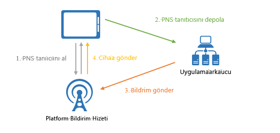
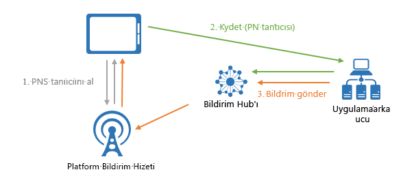

# Azure Notification Hubs nedir?

Azure Notification Hubs, herhangi bir arka uçtan (bulut ya da şirket içi) herhangi bir platforma (iOS, Android, Windows, Kindle, Baidu vb.) bildirim göndermenize olanak tanıyan, kullanımı kolay ve ölçeği artırılmış bir gönderme altyapısı sağlar. Notification Hubs hem kuruluş hem de tüketici senaryoları için sorunsuzca çalışır. Birkaç senaryo örneği aşağıda verilmiştir:

- Düşük gecikme ile milyonlarca kişiye son dakika haber bildirimleri gönderme.
- İlgili kullanıcı segmentlerine konum temelli kuponlar gönderme.
- Medya/spor/finans/oyun uygulamaları için kullanıcılara veya gruplara etkinliklerle ilgili bildirimler gönderme.
- Müşterilerle etkileşimde bulunmak ve pazarlama yapmak için uygulamalara promosyon içeriği gönderme.
- Yeni iletiler ve iş öğeleri gibi kurumsal olaylar hakkında kullanıcılara bildirim gönderme.
- Çok faktörlü kimlik doğrulaması için kod gönderme.

## Anında iletme bildirimleri nedir?

Anında iletme bildirimleri, mobil uygulama kullanıcılarının istenen belirli bilgiler hakkında genellikle bir açılır pencere ya da iletişim kutusu içinde bildirim aldığı, uygulamadan kullanıcıya iletişim biçimidir. Kullanıcılar genellikle iletiyi görüntülemeyi veya kapatmayı seçebilir. İletiyi görüntülemeyi seçtiklerinde, bildirimi ileten mobil uygulama açılır.

Anında iletme bildirimleri, tüketici uygulamalarında uygulama etkileşiminin ve kullanımının artırılması, kurumsal uygulamalarda ise güncel iş bilgilerinin iletilmesi açısından çok önemlidir. Mobil cihazlar için enerji verimliliği, bildirimi gönderenler için esneklik ve ilgili uygulamalar etkin olmadığında kullanılabilirlik sağladığından, en iyi uygulamadan kullanıcıya iletişim yöntemidir.

Birkaç popüler platformda anında iletme bildirimleri hakkında daha fazla bilgi için aşağıdaki konulara bakın:

- [Android](https://developer.android.com/guide/topics/ui/notifiers/notifications.html)
- [iOS](https://developer.apple.com/notifications/)
- [Windows](https://msdn.microsoft.com/library/windows/apps/hh779725.aspx)

## Anında iletme bildirimleri nasıl çalışır?

Anında iletme bildirimleri, *Platform Bildirim Sistemleri* (PNS) adlı platforma özgü altyapılar aracılığıyla teslim edilir. Bunlar, sağlanan tanıtıcıyla bir cihaza ileti teslim etmek için temel gönderme işlevleri sunarlar ve ortak bir arabirimleri yoktur. Android, iOS ve Windows uygulama sürümleri arasında tüm müşteriler için bir bildirim göndermek için geliştiricinin Apple anında iletilen bildirim Service(APNS), Firebase Cloud Messaging(FCM) ve Windows bildirim Service(WNS) çalışmanız gerekir.

Yüksek bir düzeyde gönderme işlemi şu şekilde çalışır:

1. İstemci uygulaması, bildirimi almak isteyip istemediğine karar verir. Bu nedenle, benzersiz ve geçici gönderme tanıtıcısını almak üzere ilgili PNS ile iletişim kurar. Tanıtıcı türü, sisteme bağlıdır (örneğin, WNS’de URI’ler, APNS’de ise belirteçler bulunur).
2. İstemci uygulaması bu tanıtıcıyı uygulama arka ucunda veya sağlayıcısında depolar.
3. Anında iletilen bildirim göndermek için, uygulama arka ucu belirli bir istemci uygulamasını hedeflemek amacıyla tanıtıcıyı kullanarak PNS'ye bağlanır.
4. PNS, tanıtıcı tarafından belirtilen cihaza bildirimi iletir.

## Anında iletme bildirimlerinin zorlukları

PNS’ler güçlüdür. Bununla birlikte, segmentlere ayrılmış kullanıcılara anında iletme bildirimleri yayımlamak gibi genel anında iletme bildirimi senaryolarını uygulamak için bile uygulama geliştiricisine çok iş bırakır.

Anında iletme bildirimlerinin gönderilmesi için, uygulamanın ana iş mantığıyla ilgili olmayan karmaşık bir altyapı gerekir. Altyapıyla ilgili zorluklardan bazıları şunlardır:

- **Platform bağımlılığı**
  - PNS’ler birleşik olmadığından, arka ucun çeşitli platformlardaki cihazlara bildirim göndermesi için karmaşık ve bakımı zor, platforma bağımlı bir mantığa sahip olması gerekir.
- **Ölçeklendirme**
  - PNS yönergelerine göre, uygulama her başlatıldığında cihaz belirteçlerinin yenilenmesi gerekir. Arka uç, yalnızca belirteçleri güncel tutmak için büyük miktarda trafik ve veritabanı erişimi ile uğraşır. Cihazların sayısı yüzlerce ve binlerce milyona ulaştığında, bu altyapıyı oluşturma ve koruma maliyeti çok büyük olur.
  - Çoğu PNS, birden fazla cihaza yayın yapmayı desteklemez. Bir milyon cihaza basit bir yayın yapılması, PNS’lere yönelik bir milyon çağrı ile sonuçlanır. Bu miktarda trafiğin en düşük gecikme ile ölçeklendirilmesi sıradan bir işlem değildir.
- **Yönlendirme**
  - PNS’ler cihazlara iletileri göndermek için bir yol sağlasa da, çoğu uygulama bildirimi kullanıcılara veya ilgi alanı gruplarına yöneliktir. Cihazları ilgi alanı grupları, kullanıcılar, özellikler vb. ile ilişkilendirmek için arka ucun bir kayıt defteri tutması gerekir. Bu ek yük, bir uygulamanın pazara sunum süresine ve bakım maliyetlerine eklenir.

## Azure Notification Hubs neden kullanılır?

Notification Hubs, uygulama arka ucunuzdan kendi başınıza bildirim göndermeyle ilişkili tüm karmaşıklığı ortadan kaldırır. Çok platformlu, ölçeği genişletilmiş anında iletme bildirimi altyapısı, gönderme ile ilgili kodlama işlemlerini azaltır ve arka ucunuzu basitleştirir. Notification Hubs sayesinde cihazlar yalnızca PNS tanıtıcılarını bir hub’a kaydetmekten sorumludur. Arka uç ise aşağıdaki şekilde gösterildiği gibi kullanıcılara veya ilgili alanı gruplarına iletiler gönderir:

Bildirim hub'ları, aşağıdaki avantajlara sahip olan kullanıma hazır gönderme altyapınızdır:

- **Platformlar arası**
  - iOS, Android, Windows ve Kindle ile Baidu dahil olmak üzere başlıca tüm gönderme platformlarını destekler.
  - Platforma özel bir iş olmaksızın platforma özgü ya da platforma bağımlı biçimlerle tüm platformlara gönderebilen bir ortak arabirimdir.
  - Cihaz tanıtıcısı yönetimi tek yerden yürütülür.
- **Arka uçlar arası**
  - Bulut veya şirket içi
  - .NET, Node.js, Java vb.
- **Zengin teslim düzeni kümesi**
  - Bir veya birden çok platform için yayın: Tek bir API çağrısı ile platformlar arasında milyonlarca cihaza anında yayınlayabilirsiniz.
  - Cihaza gönderin: Bildirimleri tek cihazlara hedefleyebilirsiniz.
  - Kullanıcıya gönderin: Etiketler ve şablonlar özellikleri, bir kullanıcının tüm platformlar arası cihazlarda ulaşmanıza yardımcı olur.
  - Segment dinamik etiketlerle şuraya gönder: Bir segmenti ya da bir ifade Segment (örneğin, etkin ve canlı yeni kullanıcı Seattle değil), gönderdiğiniz olup olmadığını etiketler özelliği kesimi cihazları ve bunlara anında iletme gereksinimlerinize bağlı olarak, yardımcı olur. Pub-sub ile kısıtlanmadan cihaz etiketlerini dilediğiniz yerde ve dilediğiniz zaman güncelleştirebilirsiniz.
  - Yerelleştirilmiş anında iletme: Şablonlar özelliği yerelleştirme arka uç kodunu etkilemeden elde etmenize yardımcı olur.
  - Sessiz anında iletme: Anında iletme çekme deseni sessiz bildirimleri cihazlara gönderme ve belirli çeken veya Eylemler tamamlama tetikleme etkinleştirebilirsiniz.
  - Zamanlanan anında iletme: Dilediğiniz zaman bildirimleri göndermek için zamanlayabilirsiniz.
  - Doğrudan anında iletme: Bildirim hub'ları hizmeti ile kayıt cihazları atlamak ve doğrudan anında iletme cihaz tanıtıcılarını listesine toplu.
  - Kişiselleştirilmiş anında iletme: Cihaz anında iletme değişkenleri cihaza özgü gönderdiğiniz yardımcı kişiselleştirilmiş anında iletme bildirimleri ile özelleştirilmiş anahtar-değer çiftleri.
- **Zengin telemetri**
  - Azure portalında ve program aracılığıyla genel gönderme, cihaz, hata ve işlem telemetrileri kullanılabilir.
  - İleti Başına Telemetri, yaptığınız ilk istek çağrısından Notification Hubs hizmetine kadar her bir gönderme işlemini takip eder ve gönderme işlemleri başarıyla toplu hale getirir.
  - Platform Bildirim Sistemi Geri Bildirimi, hata ayıklamaya yardımcı olmak üzere Platform Bildirim Sistemi’nden alınan tüm geri bildirimleri iletir.
- **Ölçeklenebilirlik**
  - Yeniden tasarlama veya cihaz parçalaması yapmadan milyonlarca cihaza hızlı iletiler gönderin.
- **Güvenlik**
  - Paylaşılan Erişim Gizli Dizisi (SAS) veya şirket dışı kimlik doğrulaması.

## App Service Mobile Apps ile Tümleştirme

Azure hizmetleri genelinde kesintisiz ve birleştirici bir deneyimi kolaylaştırmak amacıyla [App Service Mobile Apps](../app-service-mobile/app-service-mobile-value-prop.md)'in Notification Hubs'ı kullanan anında iletme bildirimleri için yerleşik desteği mevcuttur. [App Service Mobile Apps](../app-service-mobile/app-service-mobile-value-prop.md), Kurumsal Geliştiriciler ve Sistem Tümleştiricileri için mobil geliştiricilere zengin bir özellik kümesi sağlayan, yüksek düzeyde ölçeklenebilir, global olarak kullanılabilir bir mobil uygulama geliştirme platformu sunar.

Mobile Apps geliştiricileri Notification Hubs'ı aşağıdaki iş akışı ile kullanabilir:

1. Cihaz PNS tanıtıcısını alma
2. Uygun Mobile Apps İstemci SDK'sı kayıt API'si yoluyla Notification Hubs'a cihazı kaydetme

    > [!NOTE]
    > Mobile Apps'in güvenlik amacıyla kayıtlardaki tüm etiketleri kaldırdığını unutmayın. Etiketleri cihazlarla ilişkilendirmek için doğrudan arka ucunuzdan Notification Hubs ile çalışın.
3. Uygulama arka ucunuzdan Notification Hubs ile bildirimler gönderme

Bu tümleştirme ile geliştiricilere sağlanan bazı kolaylıklar şunlardır:

- **Mobile Apps istemci SDK'ları**: Bu çoklu platform SDK'ları kayıt için basit API'ler sağlar ve mobil uygulama ile bağlantılı bildirim hub'ı ile otomatik olarak konuşur. Geliştiricilerin Notification Hubs kimlik bilgilerini sorgulaması ve ek bir hizmet ile çalışması gerekmez.
  - *Kullanıcıya anında iletme*: SDK'lar, kullanıcı senaryosuna gönderimi sağlamak için, belirli bir cihazı otomatik olarak Mobile Apps kimliği doğrulanmış Kullanıcı Kimliği ile etiketler.
  - *Cihaza anında iletme*: SDK'lar, Notification Hubs'a kaydetmek için Mobile Apps Yükleme Kimliği'ni otomatik olarak GUID gibi kullanır. Böylece, geliştiricileri birden çok hizmet GUID'i saklama zahmetinden kurtarır.
- **Yükleme modeli**: Mobile Apps, Anında İletme Bildirimi Hizmetleri ile hizalanan ve kullanımı kolay olan bir JSON Yüklemesi'nde, bir cihaz ile ilişkili tüm gönderim özelliklerini temsil etmek için Notification Hubs'ın en son gönderim modeli ile çalışır.
- **Esneklik**: Geliştiriciler, yerinde tümleştirme söz konusu olduğunda bile her zaman için Notification Hubs ile doğrudan çalışmayı tercih edebilir.
- **Tümleşik deneyim [Azure portalında](https://portal.azure.com)**: Mobile Apps'te gönderim özelliği görsel olarak temsil edilir ve geliştiriciler Mobile Apps aracılığıyla ilişkili bildirim hub'ı ile kolayca çalışabilir.

## Sonraki adımlar

Oluşturma ve bir bildirim hub'ı izleyerek kullanarak başlama [Öğreticisi: Mobil uygulamalar için anında iletme bildirimleri](notification-hubs-android-push-notification-google-fcm-get-started.md).

[0]: ./media/notification-hubs-overview/registration-diagram.png
[1]: ./media/notification-hubs-overview/notification-hub-diagram.png

[How customers are using Notification Hubs]: https://azure.microsoft.com/services/notification-hubs
[Notification Hubs tutorials and guides]: https://azure.microsoft.com/documentation/services/notification-hubs
[iOS]: https://azure.microsoft.com/documentation/articles/notification-hubs-ios-get-started
[Android]: https://azure.microsoft.com/documentation/articles/notification-hubs-android-get-started
[Windows Universal]: https://azure.microsoft.com/documentation/articles/notification-hubs-windows-store-dotnet-get-started
[Windows Phone]: https://azure.microsoft.com/documentation/articles/notification-hubs-windows-phone-get-started
[Kindle]: https://azure.microsoft.com/documentation/articles/notification-hubs-kindle-get-started
[Xamarin.iOS]: https://azure.microsoft.com/documentation/articles/partner-xamarin-notification-hubs-ios-get-started
[Xamarin.Android]: https://azure.microsoft.com/documentation/articles/partner-xamarin-notification-hubs-android-get-started
[Microsoft.WindowsAzure.Messaging.NotificationHub]: https://msdn.microsoft.com/library/microsoft.windowsazure.messaging.notificationhub.aspx
[Microsoft.ServiceBus.Notifications]: https://msdn.microsoft.com/library/microsoft.servicebus.notifications.aspx
[App Service Mobile Apps]: https://azure.microsoft.com/documentation/articles/app-service-mobile-value-prop/
[templates]: notification-hubs-templates-cross-platform-push-messages.md
[Azure portal]: https://portal.azure.com
[tags]: (https://msdn.microsoft.com/library/azure/dn530749.aspx)
